# Visualizations: Contact360 Documentation System

**Generated:** 2026-01-20  
**Total Visualizations:** 15+

## Overview

This document contains visual representations of the Contact360 documentation system including relationship graphs, distribution charts, and architecture diagrams using Mermaid diagrams and structured visualizations.

---

## 1. Relationship Graphs

### 1.1 Page-to-Endpoint Relationship Graph (Top Pages)

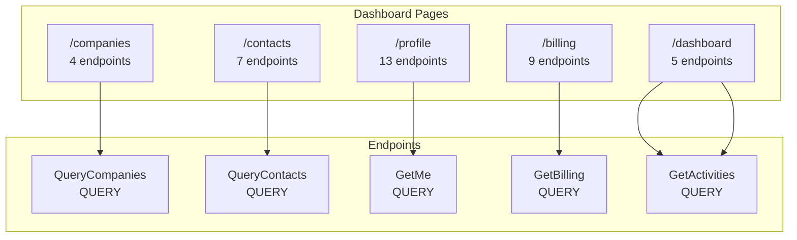

### 1.2 Service Dependency Graph

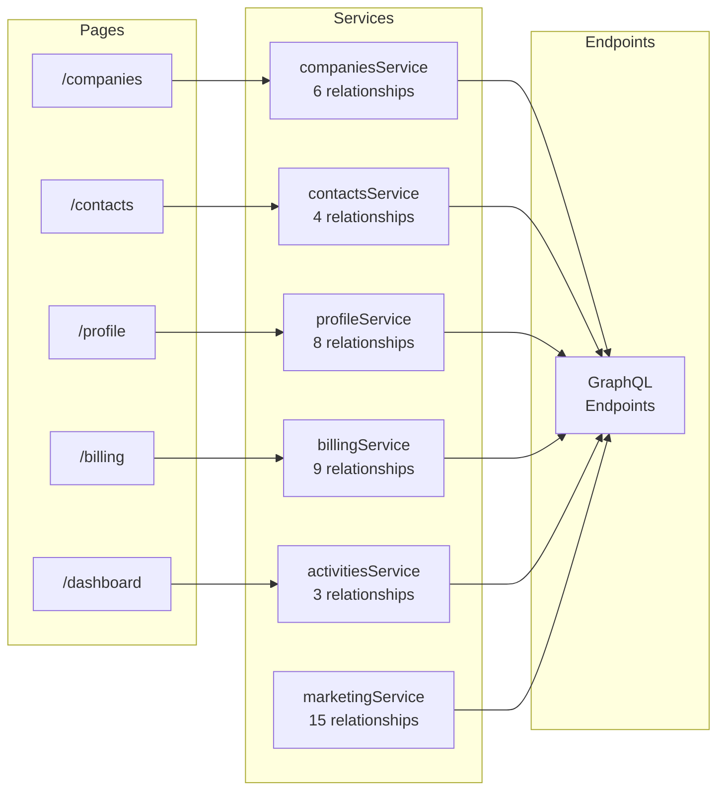

### 1.3 Most Used Endpoints Graph

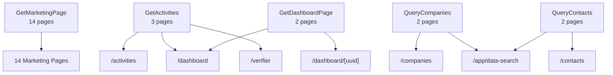

---

## 2. Distribution Charts

### 2.1 Page Type Distribution

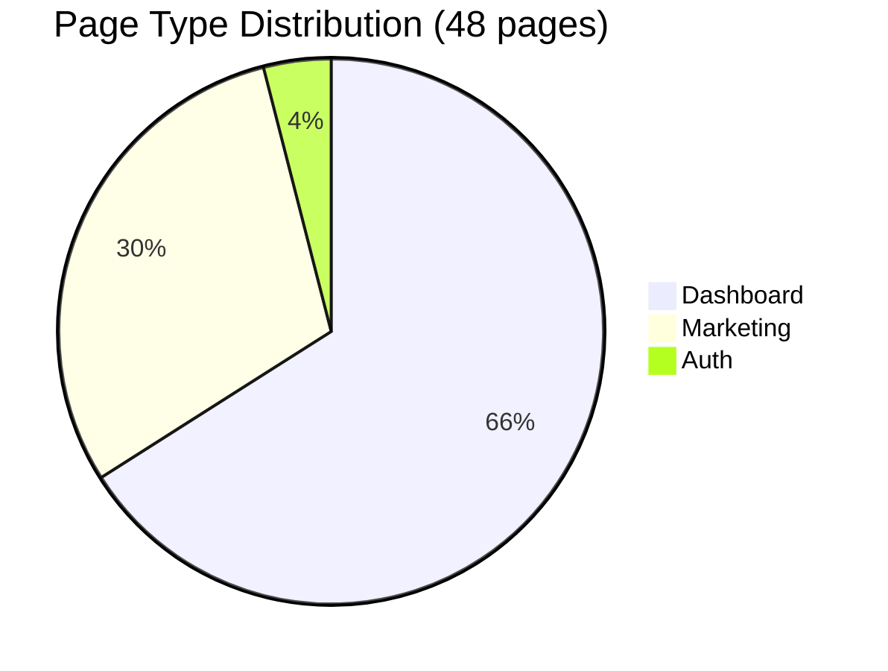

### 2.2 Endpoint Method Distribution

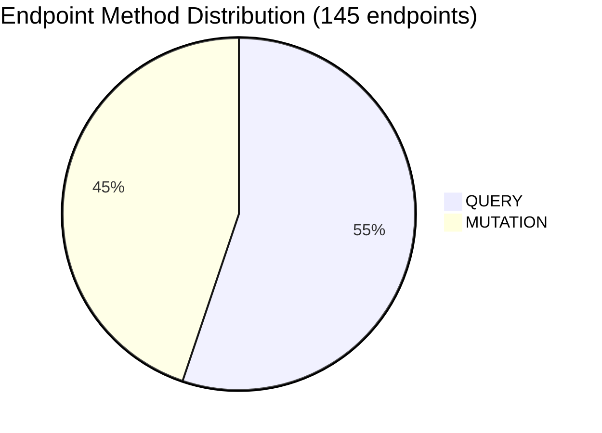

### 2.3 Authentication Distribution (Pages)

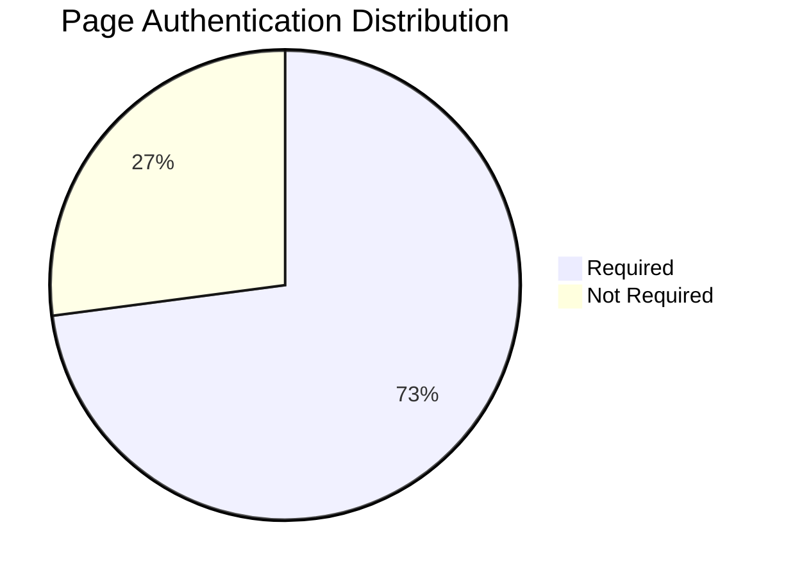

### 2.4 Authorization Distribution (Endpoints)

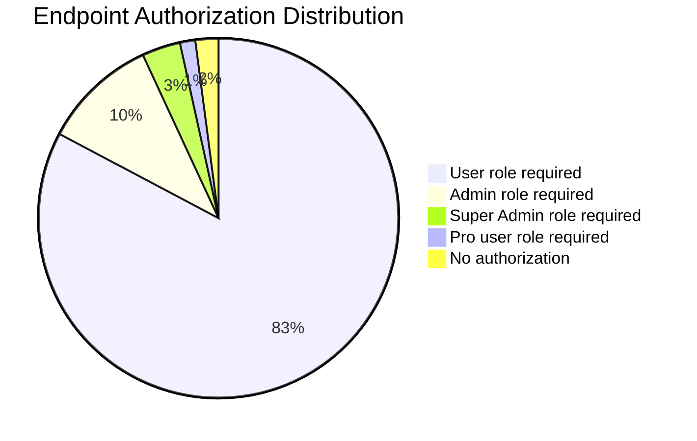

### 2.5 Usage Type Distribution (Relationships)

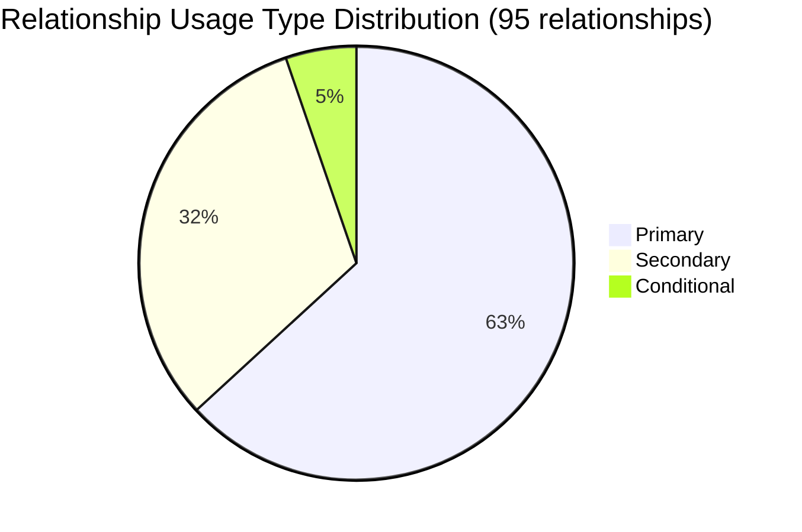

### 2.6 Usage Context Distribution (Relationships)

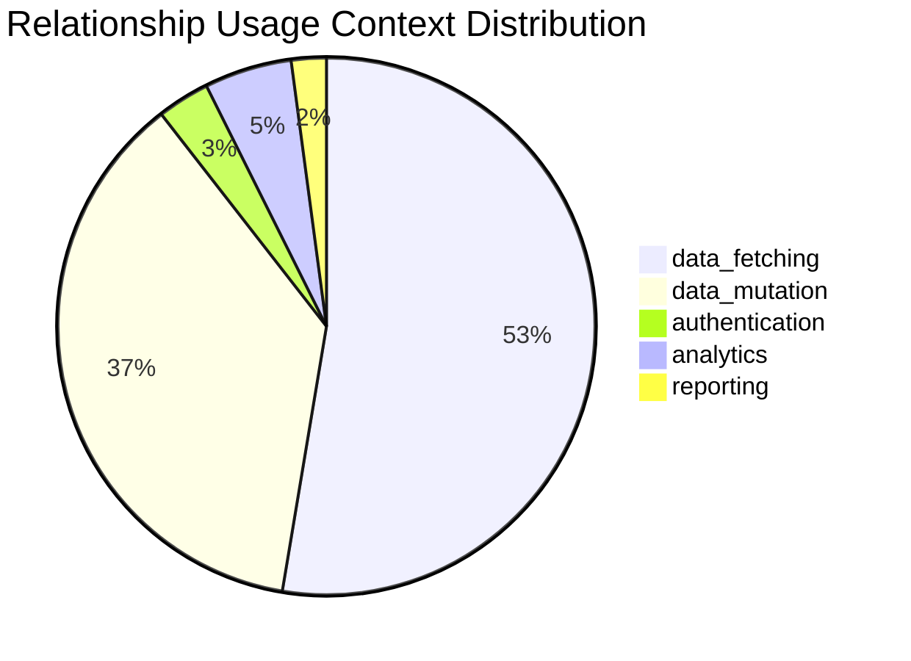

### 2.7 Service Usage Distribution

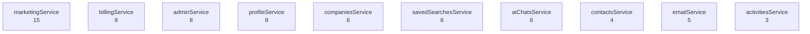

---

## 3. Architecture Diagrams

### 3.1 System Overview Architecture

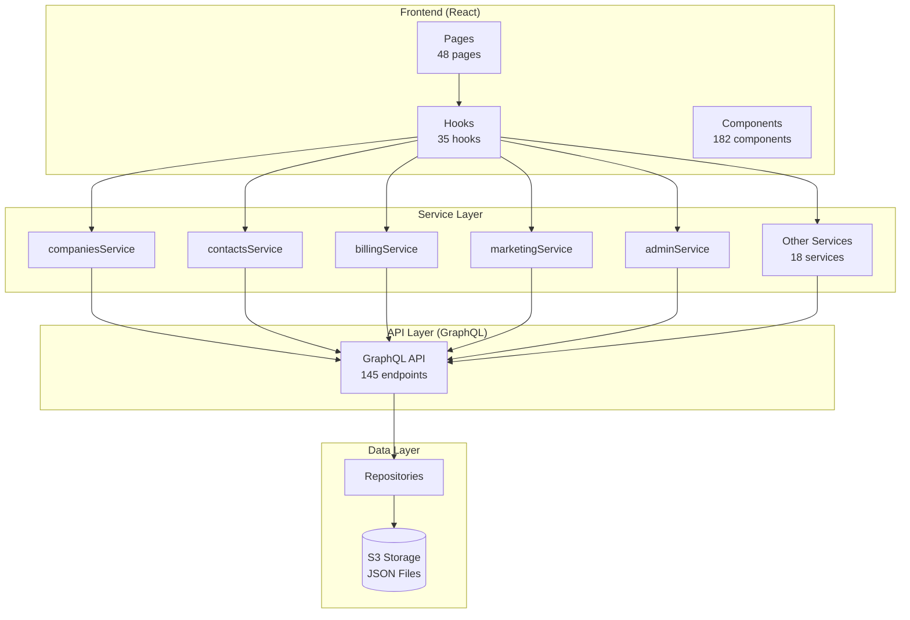

### 3.2 Data Flow Architecture

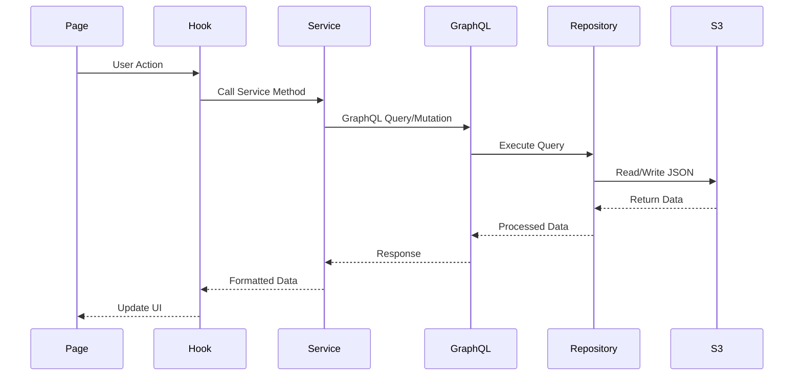

### 3.3 Service Layer Architecture

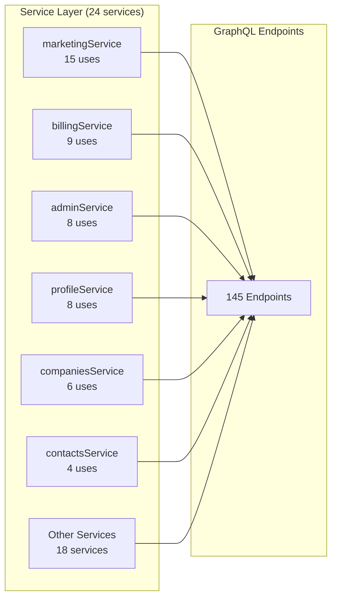

### 3.4 Documentation System Architecture

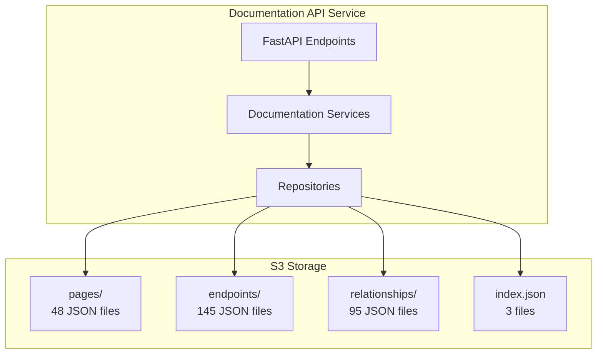

### 3.5 Relationship Storage Architecture

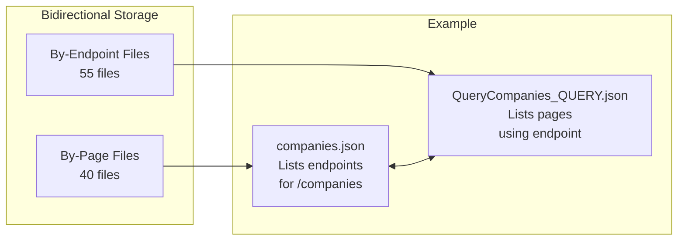

---

## 4. Statistical Visualizations

### 4.1 Page Complexity Chart

```
Pages by Endpoint Count:

profile_page        ████████████████████████ 13
billing_page        ████████████████ 9
contacts_page       ███████████ 7
ai_chat_page        ████████ 6
admin_users_page    ██████ 5
companies_page      ████ 4
export_page         ████ 4
analytics_page      ████ 4
```

### 4.2 Endpoint Usage Chart

```
Endpoints by Page Count:

GetMarketingPage    ████████████████████████████████████████ 14
GetActivities       ████████ 3
GetDashboardPage    █████ 2
QueryCompanies      █████ 2
QueryContacts       █████ 2
ListExports         █████ 2
Others (90)         █ 1 each
```

### 4.3 Service Relationship Chart

```
Services by Relationship Count:

marketingService    ████████████████ 15
billingService      █████████ 9
adminService        ████████ 8
profileService      ████████ 8
companiesService    ██████ 6
savedSearchesService ██████ 6
aiChatsService      ██████ 6
```

---

## 5. Dependency Graphs

### 5.1 Page Dependency Graph (Sample)

```mermaid
graph TD
    subgraph "Core Pages"
        P1[/companies]
        P2[/contacts]
        P3[/profile]
        P4[/billing]
    end
    
    subgraph "Feature Pages"
        P5[/dashboard]
        P6[/app]
        P7[/verifier]
        P8[/ai-chat]
    end
    
    subgraph "Admin Pages"
        P9[/admin/users]
        P10[/admin/marketing]
        P11[/admin/logs]
    end
    
    P5 --> P1
    P5 --> P2
    P5 --> P3
    P3 --> P4
    P9 --> P1
    P9 --> P2
    P10 --> P5
```

### 5.2 Endpoint Category Dependency

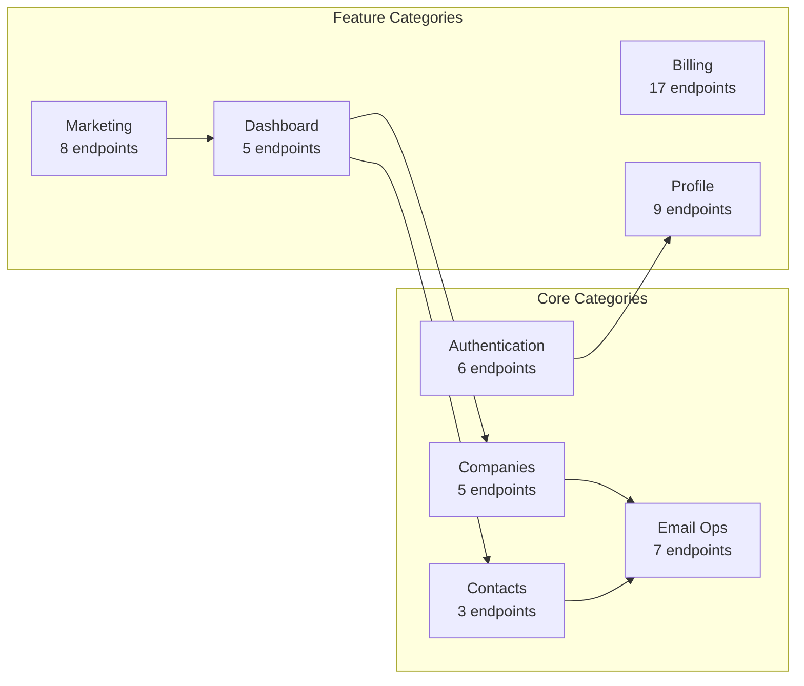

---

## 6. Data Flow Diagrams

### 6.1 Page Load Flow

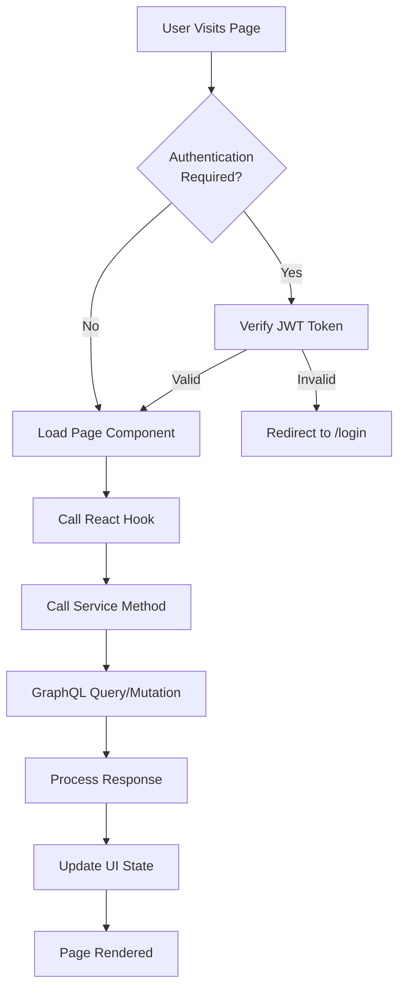

### 6.2 Relationship Sync Flow

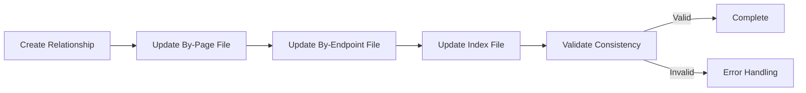

---

## 7. Component Hierarchy

### 7.1 Page Component Structure

```
Page Structure:
├── Layout Component
│   ├── Header
│   ├── Navigation
│   └── Footer
├── Main Content
│   ├── Data Table/List
│   ├── Filters
│   ├── Actions
│   └── Pagination
└── Modals/Dialogs
    ├── Create Modal
    ├── Edit Modal
    └── Delete Confirmation
```

### 7.2 Service Layer Structure

```
Service Layer:
├── Domain Services (24 services)
│   ├── companiesService
│   ├── contactsService
│   ├── billingService
│   └── ...
├── GraphQL Client
│   ├── Query Builder
│   ├── Mutation Builder
│   └── Response Handler
└── Error Handling
    ├── Network Errors
    ├── Validation Errors
    └── Business Logic Errors
```

---

## 8. Quick Reference Visualizations

### 8.1 System Statistics Summary

```
┌─────────────────────────────────────────┐
│   Contact360 Documentation System       │
├─────────────────────────────────────────┤
│ Pages:           48                      │
│ Endpoints:       145                     │
│ Relationships:   95                      │
│ Services:        24                      │
│ Hooks:           35                      │
│ Components:      182                     │
└─────────────────────────────────────────┘
```

### 8.2 Coverage Metrics

```
Documentation Coverage:
████████████████████████████████████████ 100%

Data Quality:
████████████████████████████████████████ 100%

Relationship Coverage:
████████████████████████████████████████ 100%
```

---

## 9. Mermaid Diagram Index

1. **Relationship Graphs:**
   - Page-to-Endpoint Graph
   - Service Dependency Graph
   - Most Used Endpoints Graph

2. **Distribution Charts:**
   - Page Type Distribution
   - Endpoint Method Distribution
   - Authentication Distribution
   - Authorization Distribution
   - Usage Type Distribution
   - Usage Context Distribution

3. **Architecture Diagrams:**
   - System Overview
   - Data Flow
   - Service Layer
   - Documentation System
   - Relationship Storage

4. **Dependency Graphs:**
   - Page Dependencies
   - Endpoint Category Dependencies

5. **Flow Diagrams:**
   - Page Load Flow
   - Relationship Sync Flow

---

## 10. Visualization Usage

### How to View Mermaid Diagrams

1. **GitHub/GitLab:** Mermaid diagrams render automatically
2. **VS Code:** Install "Markdown Preview Mermaid Support" extension
3. **Online:** Use [Mermaid Live Editor](https://mermaid.live)
4. **Documentation Sites:** Most support Mermaid natively

### Export Options

- **PNG/SVG:** Use Mermaid CLI or online editor
- **PDF:** Include in Markdown to PDF converters
- **Interactive:** Embed in web documentation

---

**Last Updated:** 2026-01-20  
**Total Visualizations:** 15+  
**Diagram Types:** Mermaid, ASCII, Text Charts
