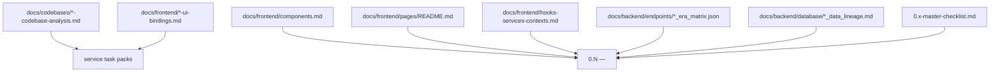

# 0.x Foundation Documentation Overhaul Plan

## What changes and why

All 24 target files currently have good structural scaffolding but are missing three key layers:

- **Patch ladders** have codename + focus but no per-patch evidence gate content (the micro-gate template exists in `0.x-master-checklist.md` but is never filled in per patch)
- **UI Elements Checklists** and **Frontend UX Surface Scope** sections name no specific components, hooks, services, or routes from `docs/frontend/components.md`, `docs/frontend/hooks-services-contexts.md`, or `docs/frontend/pages/README.md`
- **Service task packs** have no patch assignment (which `0.N.P` targets which task) and no Surface track items derived from `docs/frontend/*-ui-bindings.md` or `docs/codebases/*-codebase-analysis.md`

## Source-of-truth reference map

## File group breakdown

### Group A — `0.x-master-checklist.md` (1 file)

**Add to "Patch micro-gate template" table** a 6th row: `Frontend` — "Which foundation-era components/routes must render or be scaffolded? List by name or mark N/A."

**Add a new section "Frontend surface band targets"** mapping each minor to its baseline UI requirement:

| Minor  | Minimum frontend evidence                                                                                                               |
| ------ | --------------------------------------------------------------------------------------------------------------------------------------- |
| `0.1`  | `MainLayout`, `Sidebar`, `DashboardAccessGate`, `AuthContext`, `ThemeContext`, `lib/graphqlClient.ts`, `lib/tokenManager.ts` scaffolded |
| `0.2`  | N/A (data-layer only)                                                                                                                   |
| `0.3`  | `lib/toast.ts`, `lib/apiErrorHandler.ts`, error `Alert` pattern present                                                                 |
| `0.4`  | `RoleContext`, logout button, session-expiry redirect, 403 page, rate-limit toast                                                       |
| `0.5`  | `FilesUploadModal` stub, `useCsvUpload` stub, upload progress bar smoke                                                                 |
| `0.6`  | `JobsCard` stub, `JobsPipelineStats` stub, `useJobs` stub with status badges                                                            |
| `0.7`  | `ContactsFilters` / `VQLQueryBuilder` stubs, search loading skeleton                                                                    |
| `0.8`  | `MainLayout` full, `Sidebar` full, `ThemeContext` full, admin constants synced                                                          |
| `0.9`  | Extension popup HTML stub, `graphqlSession.js` present, `lambdaClient.js` present                                                       |
| `0.10` | Production build passes, `NEXT_PUBLIC_`* env documented, app/root/admin compile green                                                   |

**Add cross-references** to `docs/frontend/pages/README.md` and `docs/frontend/components.md`.

---

### Group B — 11 version files (`0.0 — Pre-repo baseline.md` through `0.10 — Ship & ops hardening.md`)

Each file gets the same three section expansions plus expanded patch ladder. Specific changes per minor:

#### `0.0 — Pre-repo baseline.md` (Pre-repo baseline)

- **UI Elements Checklist**: Replace single N/A line with explicit list of UI decisions deferred (all components, no runtime shipped)
- **Frontend UX Surface Scope**: Confirm `0.0` intro of `contact360.io/app/`, `root/`, `admin/` folder presence only — no rendered UI
- **Patch ladder**: Add 3rd column "Evidence gate" for `.0`–`.9` (all N/A for this minor with explicit waiver note)

#### `0.1 — Monorepo bootstrap.md` (Monorepo bootstrap / Forge)

- **UI Elements Checklist**: Add by name: `MainLayout`, `Sidebar`, `DashboardAccessGate`, `AuthErrorBanner`, `Modal`, `Alert`, `ConfirmModal`, `DataToolbar`, `TablePagination`, `FloatingActionBar`, `Pagination` — all from `docs/frontend/components.md` era `0.x` section. Mark each `[ ]` scaffolded or `[ ]` smoke pass.
- **Frontend UX Surface Scope**: Add routes `app/(auth)/login/page.tsx`, `app/(auth)/register/page.tsx` (stub), `app/(dashboard)/layout.tsx`; files `context/AuthContext.tsx`, `context/ThemeContext.tsx`, `lib/graphqlClient.ts`, `lib/tokenManager.ts`, `lib/config.ts`; hooks `useSidebar`, `useModal`, `useDebouncedValue`, `useResizablePanels`
- **Patch ladder** expanded 3rd column for `.0`–`.9`:
  - `.0` Assembly: `contact360.io/app/` Next.js boots, `app/layout.tsx` present
  - `.1` Scaffold: `lib/graphqlClient.ts`, `lib/config.ts` stubs committed
  - `.2` Forge: `context/AuthContext.tsx`, `context/ThemeContext.tsx` present
  - `.3` Ignite: `DashboardAccessGate` redirect smoke; `useSessionGuard` stub
  - `.4` Link: app → `/graphql` introspection smoke from browser
  - `.5` Key: `.env.local.example` for `NEXT_PUBLIC_API_URL`, `NEXT_PUBLIC_GRAPHQL_URL`
  - `.6` Bridge: `MainLayout`, `Sidebar` render without crash
  - `.7` Pulse: `lib/toast.ts` and `lib/animationsConfig.ts` present
  - `.8` Sync: `docs/frontend/pages/README.md` era-`0.x` surface table verified
  - `.9` Seal: storybook/smoke for `Alert`, `Modal`, `DataToolbar` primitives (or screenshot evidence)
- **Backend API and Endpoint Scope**: Cross-reference `docs/backend/endpoints/appointment360_endpoint_era_matrix.json` era `0.x` entry (`auth`, `health` modules only)
- **Database and Data Lineage Scope**: Cross-reference `docs/backend/database/appointment360_data_lineage.md` era `0.x` tables (`users`, `token_blacklist`)

#### `0.2 — Schema & migration bedrock.md` (Schema bedrock / Geology)

- **UI Elements Checklist**: N/A default confirmed; optional admin migration-status view noted
- **Frontend UX Surface Scope**: No new routes; document that `admin/` Django shell compile passes
- **Patch ladder** expanded (all N/A on surface column except `.6` Bedrock = migration CI green)
- **Backend API/DB** cross-references to endpoint matrices for jobs, mailvetter, email campaign
- Add DB lineage cross-refs: `jobs_data_lineage.md`, `mailvetter_data_lineage.md`, `emailcampaign_data_lineage.md`, `connectra_data_lineage.md`

#### `0.3 — Service mesh contracts.md` (Service mesh contracts / Textile)

- **UI Elements Checklist**: `[ ] lib/toast.ts` wired to all API calls; `[ ] lib/apiErrorHandler.ts` maps error codes; `[ ] Alert` error state smoke for one mesh-backed resolver; `[ ] Retry CTA pattern documented`
- **Frontend UX Surface Scope**: Add `lib/apiErrorTypes.ts`, `lib/apiErrorHandler.ts`, `lib/authErrorHandler.ts`; hook pattern for `useModal` error variant; `context/RoleContext.tsx` stub (needed for credit-gate surfaces in 0.4)
- **Patch ladder** 3rd column: `.0` Lattice = client inventory doc; `.4` Knot = error toast smoke from one real API call; `.6` Twine = error envelope renders correctly in UI
- Add endpoint matrix cross-refs for all 6 Lambda services (emailapis, s3storage, logs.api, contact.ai, mailvetter, salesnavigator)

#### `0.4 — Identity & RBAC freeze.md` (Identity & RBAC / Locksmith)

- **UI Elements Checklist**: Expand to: `[ ] Logout button in Sidebar user menu`, `[ ] Session expiry redirect to /login (useSessionGuard)`, `[ ] 403 page renders for denied routes`, `[ ] RoleContext.isAdmin gates admin sidebar item`, `[ ] CreditBudgetAlerts stub scaffold (displays but no live data)`, `[ ] useLoginForm` / `useRegisterForm` validation passes
- **Frontend UX Surface Scope**: Add routes: `/login`, `/register`, `/dashboard` (guarded); files: `context/RoleContext.tsx`, `hooks/useSessionGuard.ts`, `hooks/useLoginForm.ts`, `hooks/useRegisterForm.ts`, `lib/authValidation.ts`, `lib/featureAccess.ts`
- **Patch ladder** 3rd column: `.1` Cipher = JWT decode in `lib/tokenManager.ts` smoke; `.3` Guard = role-gated sidebar item renders null for non-admin; `.7` Sentinel = app route parity smoke (2 roles); `.8` Lock = admin Django login works
- Add cross-ref to `docs/backend/endpoints/appointment360_endpoint_era_matrix.json` (auth module mutations)

#### `0.5 — Object storage plane.md` (Object storage plane / Maritime)

- **UI Elements Checklist**: Expand to: `[ ] FilesUploadModal stub present (drag-drop zone renders)`, `[ ] FilesUploadPanel renders`, `[ ] useCsvUpload hook scaffolded`, `[ ] s3Service.GetPresignedUploadUrl stub`, `[ ] Upload progress bar animates during upload`, `[ ] Error: TTL expired → re-initiate message shown`
- **Frontend UX Surface Scope**: Add: `components/files/FilesUploadModal.tsx`, `components/files/FilesUploadPanel.tsx`, `hooks/useCsvUpload.ts`, `hooks/useFiles.ts`, `services/graphql/s3Service.ts`, `lib/s3/s3TreeUtils.ts`; route: `/files` page stub
- **Patch ladder** 3rd column: `.1` Upload = `FilesUploadModal` renders; `.2` Stream = multipart progress bar renders; `.4` Shelf = `DatasetInfoPanel` stub; `.8` Purge = auth-guarded upload smoke
- Add cross-ref: `docs/backend/endpoints/s3storage_endpoint_era_matrix.json`, `docs/backend/database/s3storage_data_lineage.md`, `docs/frontend/s3storage-ui-bindings.md`

#### `0.6 — Async job spine.md` (Async job spine / Industrial)

- **UI Elements Checklist**: Expand to: `[ ] JobsCard stub renders with status badge`, `[ ] JobsPipelineStats renders processed/failed/pending segments`, `[ ] Status badge mapping smoke (open/in_queue/processing/completed/failed)`, `[ ] Retry button present in JobsCard`, `[ ] useJobs hook polls every 15s`, `[ ] Empty state card renders when no jobs`
- **Frontend UX Surface Scope**: Add: `components/jobs/JobsCard.tsx`, `components/jobs/JobsPipelineStats.tsx`, `components/jobs/JobsRetryModal.tsx`, `hooks/useJobs.ts`, `services/graphql/jobsService.ts`, `lib/jobs/jobsUtils.ts`, `lib/jobs/jobsConstants.ts`; route: `/jobs` page stub
- **Patch ladder** 3rd column: `.0` Queue = `/jobs` page stub renders; `.1` Worker = `JobsCard` renders without crash; `.3` Retry = `JobsRetryModal` opens; `.6` Heartbeat = progress bar moves on mock data; `.8` Trace = timeline API response renders
- Add cross-refs: `docs/backend/endpoints/jobs_endpoint_era_matrix.json`, `docs/backend/database/jobs_data_lineage.md`, `docs/frontend/jobs-ui-bindings.md`

#### `0.7 — Search & dual-write substrate.md` (Search & dual-write / Data layers)

- **UI Elements Checklist**: Expand to: `[ ] Search text input renders in DataToolbar`, `[ ] Filter chips render for active VQL conditions`, `[ ] Loading skeleton for ES round-trip (ContactsTable)`, `[ ] Empty state: no contacts found`, `[ ] VQLQueryBuilder condition rows render (field/operator/value)`
- **Frontend UX Surface Scope**: Add: `components/contacts/ContactsFilters.tsx` stub, `components/contacts/VQLQueryBuilder.tsx` stub, `components/shared/FilterSection.tsx`, `hooks/contacts/useContactsFilters.ts` stub, `services/graphql/contactsService.ts` stub; route: `/contacts` page stub
- **Patch ladder** 3rd column: `.0` Shard = contacts route stub renders; `.1` Query = VQL text sends to gateway; `.4` Facet = filter chips from API render; `.6` Delta = drift report link in admin
- Add cross-refs: `docs/backend/endpoints/connectra_endpoint_era_matrix.json`, `docs/backend/database/connectra_data_lineage.md`

#### `0.8 — UX shell & docs mirror.md` (UX shell & docs mirror / Glass)

- **UI Elements Checklist**: Expand to: `[ ] MainLayout full — sidebar + topbar + content renders`, `[ ] Sidebar nav links gated by RoleContext`, `[ ] Global error boundary catches page crashes`, `[ ] toast.success/error system wired`, `[ ] Loading states for GraphQL queries (skeleton shimmer)`, `[ ] admin constants.py mirrors docs/architecture.md and docs/roadmap.md`, `[ ] root/ marketing layout builds without error`, `[ ] useForceLightTheme applied on marketing routes`
- **Frontend UX Surface Scope**: Add complete routes: `/dashboard`, `/profile`, `/billing`, `/settings`; components: full `MainLayout`, `Sidebar`, `CreditBudgetAlerts`; context: `RoleContext` fully populated; hooks: `useDashboardPage`, `useSidebar`; admin: `templates/base.html` + `SIDEBAR_MENU` constants
- **Patch ladder** 3rd column: `.0` Shell = `MainLayout` full render; `.2` Portal = auth flow end-to-end; `.4` Mirror = DocsAI sync evidence attached; `.7` Toast = error→toast smoke; `.8` Route = 403/404 pages render
- Add cross-ref: `docs/docsai-sync.md` sync requirements

#### `0.9 — Extension channel scaffold.md` (Extension scaffold / Broadcast)

- **UI Elements Checklist**: Expand to: `[ ] extension/contact360/ folder present under canonical path`, `[ ] auth/graphqlSession.js present with decodeJWT export`, `[ ] utils/lambdaClient.js present`, `[ ] utils/profileMerger.js present`, `[ ] Extension popup HTML stub renders`, `[ ] Token status indicator in popup (isTokenExpired)`, `[ ] Error toast when gateway unreachable (lambdaClient error path)`
- **Frontend UX Surface Scope**: Add files: `extension/contact360/auth/graphqlSession.js`, `extension/contact360/utils/lambdaClient.js`, `extension/contact360/utils/profileMerger.js`; popup HTML stub; cross-ref to `docs/frontend/components.md` extension section
- **Patch ladder** 3rd column: `.0` Manifest = MV3 manifest.json valid; `.1` Content = `getStoredTokens()` smoke; `.2` Popup = popup HTML renders without error; `.3` Session = `getValidAccessToken()` returns mock token; `.6` Send = `saveProfiles([])` returns `{saved:0, errors:[]}` against health endpoint; `.8` Pilot = E2E dev smoke screenshot
- Add cross-refs: `docs/frontend/salesnavigator-ui-bindings.md`, `docs/backend/endpoints/salesnavigator_endpoint_era_matrix.json`, `docs/backend/database/salesnavigator_data_lineage.md`

#### `0.10 — Ship & ops hardening.md` (Ship & ops hardening)

- **UI Elements Checklist**: Replace "N/A" with: `[ ] app production build passes (next build green)`, `[ ] root production build passes`, `[ ] admin static files collected (collectstatic)`, `[ ] NEXT_PUBLIC_* env var list documented and confirmed non-empty`
- **Patch ladder**: Add codename row (all under "Ship" theme) and 3rd evidence column for `.0`–`.9`
- Add cross-ref to all service codebase analyses for gaps resolved in this minor

---

### Group C — 10 service task packs

Each task pack gets two additions:

**1. Patch assignment column** — a new column or sub-section mapping each existing task to the patch `0.N.P` band where it belongs:

- P0 tasks: target `.0`–`.2` of the minor
- P1 tasks: target `.3`–`.6` of the minor
- "Release gate evidence" items: target `.7`–`.9` of the minor

**2. Surface track expansion** — add or expand the Surface track section using the UI binding matrices:

- `appointment360-foundation-task-pack.md`: Surface tasks = scaffold `AuthContext`, `ThemeContext`, `graphqlClient`, `config`, health module smoke from browser; cross-ref `docs/frontend/components.md` era `0.x` layout section
- `connectra-foundation-task-pack.md`: Surface tasks = contacts/companies page stub routes (`/contacts`, `/companies`), `VQLQueryBuilder` stub, `ContactsFilters` stub; cross-ref `docs/frontend/salesnavigator-ui-bindings.md` era `0.x` row ("No user-facing UI; service stubs only")
- `contact-ai-foundation-task-pack.md`: Surface tasks = confirm no dashboard routes reference AI chat (`/ai-chat` does not exist in `0.x`); `LAMBDA_AI_API_URL` in env config stub (unused); cross-ref `docs/frontend/contact-ai-ui-bindings.md` era `0.x` row
- `emailapis-foundation-task-pack.md`: Surface tasks = confirm email finder/verifier route stubs don't exist yet; `emailService.ts` stub with health call only; cross-ref `docs/frontend/emailapis-ui-bindings.md` era `0.x` row
- `emailcampaign-foundation-task-pack.md`: Surface tasks = campaign service base URL in env config (unused); no UI in era; cross-ref `docs/frontend/README.md` era `0.x` surface table
- `jobs-foundation-task-pack.md`: Surface tasks = `/jobs` page stub renders, `JobsCard` stub present, `useJobs` stub returns empty array, status badge design tokens follow `docs/frontend/design-system.md` status badge colors; cross-ref `docs/frontend/jobs-ui-bindings.md` era `0.x` row
- `logsapi-foundation-task-pack.md`: Surface tasks = confirm no log query UI in `0.x`; health service call from `lib/healthService.ts` stub only; cross-ref `docs/frontend/logsapi-ui-bindings.md` era `0.x` row
- `mailvetter-foundation-task-pack.md`: Surface tasks = mark `static/index.html` as "legacy operator UI, not product"; no dashboard routes in `0.x`; cross-ref `docs/frontend/components.md` — no mailvetter component in era `0.x`
- `s3storage-foundation-task-pack.md`: Surface tasks = `FilesUploadModal` stub renders (drag-drop zone visible), upload progress bar design token follows `docs/frontend/design-system.md`, `s3Service.ts` stub present; cross-ref `docs/frontend/s3storage-ui-bindings.md`
- `salesnavigator-foundation-task-pack.md`: Surface tasks = confirm no user-facing UI; extension hook interface stub documented; cross-ref `docs/frontend/salesnavigator-ui-bindings.md` era `0.x` row ("No user-facing UI in this era; extension hook stub: define interface contract that extension will use in 4.x")

---

### Group D — `README.md` (1 file)

Add a **"What each `0.N — <Title>.md` now contains"** clarification note explaining the three new subsections (expanded UI Elements Checklist, Frontend UX Surface Scope with file names, per-patch evidence gate column).

---

## Execution order

```mermaid
flowchart LR
    A["Group A: 0.x-master-checklist.md"] --> B1
    subgraph B1 [Group B1: 0.0–0.3 minors]
        v00["0.0 — Pre-repo baseline.md"]
        v01["0.1 — Monorepo bootstrap.md"]
        v02["0.2 — Schema & migration bedrock.md"]
        v03["0.3 — Service mesh contracts.md"]
    end
    subgraph B2 [Group B2: 0.4–0.7 minors]
        v04["0.4 — Identity & RBAC freeze.md"]
        v05["0.5 — Object storage plane.md"]
        v06["0.6 — Async job spine.md"]
        v07["0.7 — Search & dual-write substrate.md"]
    end
    subgraph B3 [Group B3: 0.8–0.10 minors]
        v08["0.8 — UX shell & docs mirror.md"]
        v09["0.9 — Extension channel scaffold.md"]
        v010["0.10 — Ship & ops hardening.md"]
    end
    B1 --> B2 --> B3 --> C["Group C: 10 task packs"] --> D["Group D: README.md"]
```

## Codebase analysis reference map for task packs

| Task pack file                           | Codebase analysis to read for surface gaps                                                      |
| ---------------------------------------- | ----------------------------------------------------------------------------------------------- |
| `appointment360-foundation-task-pack.md` | `docs/codebases/appointment360-codebase-analysis.md`, `docs/codebases/app-codebase-analysis.md` |
| `connectra-foundation-task-pack.md`      | `docs/codebases/connectra-codebase-analysis.md`                                                 |
| `contact-ai-foundation-task-pack.md`     | `docs/codebases/contact-ai-codebase-analysis.md`                                                |
| `emailapis-foundation-task-pack.md`      | `docs/codebases/emailapis-codebase-analysis.md`                                                 |
| `emailcampaign-foundation-task-pack.md`  | `docs/codebases/emailcampaign-codebase-analysis.md`                                             |
| `jobs-foundation-task-pack.md`           | `docs/codebases/jobs-codebase-analysis.md`                                                      |
| `logsapi-foundation-task-pack.md`        | `docs/codebases/logsapi-codebase-analysis.md`                                                   |
| `mailvetter-foundation-task-pack.md`     | `docs/codebases/mailvetter-codebase-analysis.md`                                                |
| `s3storage-foundation-task-pack.md`      | `docs/codebases/s3storage-codebase-analysis.md`                                                 |
| `salesnavigator-foundation-task-pack.md` | `docs/codebases/salesnavigator-codebase-analysis.md`                                            |

## Files changed summary

| File                                     | Change type                                                           |
| ---------------------------------------- | --------------------------------------------------------------------- |
| `0.x-master-checklist.md`                | Add frontend band targets section + 6th micro-gate row                |
| `0.0 — Pre-repo baseline.md`           | Expand UI checklist + add patch evidence column (all N/A)             |
| `0.1 — Monorepo bootstrap.md`         | Expand UI checklist + frontend surface scope + patch column           |
| `0.2 — Schema & migration bedrock.md` | Expand DB/endpoint cross-refs + patch column                          |
| `0.3 — Service mesh contracts.md`    | Add error-pattern UI checklist + patch column                         |
| `0.4 — Identity & RBAC freeze.md`   | Expand auth/RBAC UI checklist + frontend surface scope + patch column |
| `0.5 — Object storage plane.md`      | Expand storage UI checklist + frontend surface scope + patch column   |
| `0.6 — Async job spine.md`          | Expand jobs UI checklist + frontend surface scope + patch column      |
| `0.7 — Search & dual-write substrate.md` | Expand search UI checklist + frontend surface scope + patch column    |
| `0.8 — UX shell & docs mirror.md`    | Expand full shell UI checklist + DocsAI sync + patch column           |
| `0.9 — Extension channel scaffold.md` | Expand extension UI checklist + frontend surface scope + patch column |
| `0.10 — Ship & ops hardening.md`       | Expand ops UI checklist + add codename patch column                   |
| `appointment360-foundation-task-pack.md` | Add patch assignments + surface track expansion                       |
| `connectra-foundation-task-pack.md`      | Add patch assignments + surface track expansion                       |
| `contact-ai-foundation-task-pack.md`     | Add patch assignments + surface track expansion                       |
| `emailapis-foundation-task-pack.md`      | Add patch assignments + surface track expansion                       |
| `emailcampaign-foundation-task-pack.md`  | Add patch assignments + surface track expansion                       |
| `jobs-foundation-task-pack.md`           | Add patch assignments + surface track expansion                       |
| `logsapi-foundation-task-pack.md`        | Add patch assignments + surface track expansion                       |
| `mailvetter-foundation-task-pack.md`     | Add patch assignments + surface track expansion                       |
| `s3storage-foundation-task-pack.md`      | Add patch assignments + surface track expansion                       |
| `salesnavigator-foundation-task-pack.md` | Add patch assignments + surface track expansion                       |
| `README.md`                              | Add note on expanded section structure                                |

