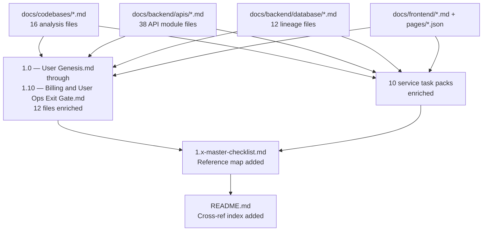

# 1.x Documentation Deep Enrichment Plan

## What is being enriched and why

All files currently exist but are **thin at the patch level**. For example every `version_1.N.md` has a patch ladder that is only a 3-column table (`Patch | Codename | Focus`). Several service task packs (`s3storage`, `jobs`, `logsapi`, `connectra`, etc.) have sparse tracks. The goal is to inject concrete technical specifics from the codebase analyses, API module docs, and database lineage docs so that every patch and task-pack entry becomes an actionable micro-gate.

## Key source → target mapping

- `[docs/codebases/appointment360-codebase-analysis.md](docs/codebases/appointment360-codebase-analysis.md)` → all version files + appointment360 task pack (middleware stack, module catalog, `deduct_credit`, JWT, context)
- `[docs/codebases/app-codebase-analysis.md](docs/codebases/app-codebase-analysis.md)` → all version files + Surface items (hooks `useLoginForm`, `useBilling`, services `authService`, `billingService`, contexts `AuthContext`, `RoleContext`)
- `[docs/codebases/jobs-codebase-analysis.md](docs/codebases/jobs-codebase-analysis.md)` → `1.1 — Billing Maturity.md`, `1.8 — Credit Pack Maturity.md`, jobs task pack (`job_node`, `job_events`, `TkdjobClient`, DAG lifecycle)
- `[docs/codebases/s3storage-codebase-analysis.md](docs/codebases/s3storage-codebase-analysis.md)` → `1.1 — Billing Maturity.md`, `1.3 — Payment Gateway.md`, s3storage task pack (bucket namespaces, `uploads` group, metadata worker)
- `[docs/codebases/logsapi-codebase-analysis.md](docs/codebases/logsapi-codebase-analysis.md)` → `1.3 — Payment Gateway.md`, `1.6 — Admin Control Plane.md`, logsapi task pack (S3 CSV store, `POST /logs/batch`, event schema)
- `[docs/codebases/emailapis-codebase-analysis.md](docs/codebases/emailapis-codebase-analysis.md)` → `1.0 — User Genesis.md`, emailapis task pack (`POST /email/finder/bulk`, provider fanout, `email_finder_cache`)
- `[docs/codebases/admin-codebase-analysis.md](docs/codebases/admin-codebase-analysis.md)` → `1.3 — Payment Gateway.md`, `1.6 — Admin Control Plane.md`, appointment360 task pack (Django views, `require_super_admin`, D3/Cytoscape graph, `SIDEBAR_MENU`)
- `[docs/codebases/connectra-codebase-analysis.md](docs/codebases/connectra-codebase-analysis.md)` → `1.0 — User Genesis.md`, connectra task pack (VQL, `ConnectraClient`, rate limiter)
- `[docs/codebases/root-codebase-analysis.md](docs/codebases/root-codebase-analysis.md)` → `1.0 — User Genesis.md`, `1.9 — Identity and Session Hardening.md` (3D UI components, marketing CTAs, `AuthContext`)
- `[docs/backend/apis/01_AUTH_MODULE.md](docs/backend/apis/01_AUTH_MODULE.md)` + `[14_BILLING_MODULE.md](docs/backend/apis/14_BILLING_MODULE.md)` → all version files + appointment360 task pack
- `[docs/backend/database/appointment360_data_lineage.md](docs/backend/database/appointment360_data_lineage.md)` → all version files Data sections (`users`, `token_blacklist`, `credits`, `plans`, `subscriptions`, `payment_submissions`, `activities`)

## Change taxonomy per file type

### A. `version_1.N.md` files — 12 files

**What changes:**

1. **Expand `## Patch ladder` table** into per-patch sections. Each patch gets a `### 1.N.P — Codename` block with:
  - `**Contract`**: specific GraphQL/REST operation names from `docs/backend/apis/`
  - `**Service`**: specific function/class paths from `docs/codebases/*.md`
  - `**Surface`**: specific hook/component/page from `docs/codebases/app-codebase-analysis.md` and `docs/frontend/`
  - `**Data**`: specific table/column names from `docs/backend/database/`
  - `**Ops**`: specific smoke test / rollback note
  - `**Codebases**`: `[appointment360][app][jobs][s3storage]` tags
2. **Enrich `## References`** with codebase analysis file links that were missing
3. **Enrich `## Release Gate and Evidence`** checkboxes with specific artifact names

**Files:**

- `[docs/1. Contact360 user and billing and credit system/1.0 — User Genesis.md](docs/1.%20Contact360%20user%20and%20billing%20and%20credit%20system/1.0 — User Genesis.md)`
- `1.1 — Billing Maturity.md` through `1.10 — Billing and User Ops Exit Gate.md` (same folder)

### B. Service task packs — 10 files

**What changes:**

1. Add `## Codebase reference` section with primary file paths from `docs/codebases/`
2. Enrich **Contract** tables with specific GraphQL/REST operation names
3. Enrich **Service** tables with specific function/module paths
4. Enrich **Surface** tables with specific hook/component/service names and file paths
5. Enrich **Data** tables with specific table/column names and migration notes
6. Enrich **Ops** tables with specific runbook pointers

**Files:**

- `[appointment360-user-billing-task-pack.md](./README.md)` — add codebase paths, middleware names, module paths
- `[jobs-user-billing-task-pack.md](./README.md)` — enrich with `job_node` fields, `TkdjobClient`, processor registry
- `[s3storage-user-billing-task-pack.md](./README.md)` — enrich with bucket paths, `S3Backend`, metadata worker, upload endpoints
- `[logsapi-user-billing-credit-task-pack.md](./README.md)` — enrich with `POST /logs/batch`, S3 CSV path, event schema fields
- `[emailapis-user-billing-credit-task-pack.md](./README.md)` — enrich with provider orchestration, cache table, `LambdaEmailClient`
- `[connectra-user-billing-task-pack.md](./README.md)` — enrich with VQL, rate limiter middleware, `ConnectraClient`
- `[mailvetter-user-billing-task-pack.md](./README.md)` — enrich with plan-tier limit contract
- `[contact-ai-user-billing-task-pack.md](./README.md)` — enrich with `LambdaAIClient`, `user_id` FK note
- `[emailcampaign-user-billing-task-pack.md](./README.md)` — stub enrichment, credit-gate placeholder
- `[salesnavigator-user-billing-task-pack.md](./README.md)` — enrich with token expiry contract, billing event stub

### C. `1.x-master-checklist.md` — 1 file

**What changes:**

- Add `## Codebase file reference map` table: minor → primary codebases → analysis doc links
- Add `## Per-patch micro-gate expanded notes` section with a brief but concrete "what the codebase actually ships" note for `.0` charter patches of each minor

### D. `README.md` — 1 file

**What changes:**

- Add `## Codebase analysis cross-references` section linking each service to its `docs/codebases/*.md` file

## Execution order

Modifications are grouped so that cross-referencing content is written before the files that reference it:

1. `1.x-master-checklist.md` (defines the canonical codename and micro-gate vocabulary)
2. `README.md` (adds cross-reference index)
3. `1.0 — User Genesis.md` → `1.10 — Billing and User Ops Exit Gate.md` (twelve version files, each independently enriched)
4. `appointment360-user-billing-task-pack.md` (primary gateway — needed by all others)
5. Remaining 9 task packs in dependency order: `jobs` → `s3storage` → `logsapi` → `emailapis` → `connectra` → `mailvetter` → `contact-ai` → `emailcampaign` → `salesnavigator`

## Diagram: enrichment data flow

