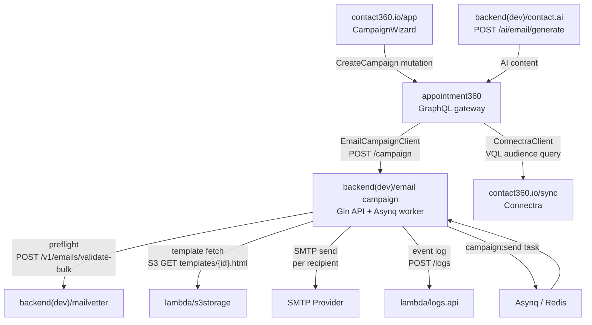

# 10.x Campaign Documentation Overhaul Plan

## Scope: 28 files across 4 file groups

### Unique Version Codenames (canonical for all files)

| Minor | Codename              |
| ----- | --------------------- |
| 10.0  | Campaign Bedrock      |
| 10.1  | Contract Spine        |
| 10.2  | Audience Graph        |
| 10.3  | Template Forge        |
| 10.4  | Sequence Pulse        |
| 10.5  | Deliverability Shield |
| 10.6  | Reliability Mesh      |
| 10.7  | Compliance Vault      |
| 10.8  | Performance Lens      |
| 10.9  | Governance Lock       |

### Patch checklist model (10.A.0 – 10.A.9) applied in every version file

- `.0` Contract freeze — GraphQL modules, REST routes, status vocab, schema DDL
- `.1` Service implementation — Go/Python runtime, Asynq worker, SMTP auth
- `.2` Data + lineage — schema drift fixes, S3 artifacts, suppression table, migrations
- `.3` UI/UX binding — pages, hooks, services, wizard steps, badges, progress bars
- `.4` Flow/graph orchestration — state machine, Asynq task graph, Mermaid diagrams updated
- `.5` Deliverability + suppression — Mailvetter preflight, bounce, CAN-SPAM footer, GDPR unsub
- `.6` Reliability — idempotency, DLQ, retry budget, campaign pause/resume
- `.7` Compliance/audit — immutable audit log, logsapi events, PII retention, RBAC guards
- `.8` Performance/cost — SMTP concurrency tuning, Connectra query perf, S3 cache hit rate
- `.9` Release gate — evidence bundle, Postman suites, docs sync, rollback proof

---

## Group 1: 10.0 — Campaign Bedrock.md – 10.9 — Governance Lock.md (10 files — full rewrite)

**Files:**

- `[docs/10. Contact360 email campaign/10.0 — Campaign Bedrock.md](docs/10.%20Contact360%20email%20campaign/10.0 — Campaign Bedrock.md)`
- `[docs/10. Contact360 email campaign/10.1 — Contract Spine.md](docs/10.%20Contact360%20email%20campaign/10.1 — Contract Spine.md)`
- `[docs/10. Contact360 email campaign/10.2 — Audience Graph.md](docs/10.%20Contact360%20email%20campaign/10.2 — Audience Graph.md)`
- `[docs/10. Contact360 email campaign/10.3 — Template Forge.md](docs/10.%20Contact360%20email%20campaign/10.3 — Template Forge.md)`
- `[docs/10. Contact360 email campaign/10.4 — Sequence Pulse.md](docs/10.%20Contact360%20email%20campaign/10.4 — Sequence Pulse.md)`
- `[docs/10. Contact360 email campaign/10.5 — Deliverability Shield.md](docs/10.%20Contact360%20email%20campaign/10.5 — Deliverability Shield.md)`
- `[docs/10. Contact360 email campaign/10.6 — Reliability Mesh.md](docs/10.%20Contact360%20email%20campaign/10.6 — Reliability Mesh.md)`
- `[docs/10. Contact360 email campaign/10.7 — Compliance Vault.md](docs/10.%20Contact360%20email%20campaign/10.7 — Compliance Vault.md)`
- `[docs/10. Contact360 email campaign/10.8 — Performance Lens.md](docs/10.%20Contact360%20email%20campaign/10.8 — Performance Lens.md)`
- `[docs/10. Contact360 email campaign/10.9 — Governance Lock.md](docs/10.%20Contact360%20email%20campaign/10.9 — Governance Lock.md)`

**What changes:** Full rewrite. Each file gets:

- Unique codename in header (e.g. `10.0 — Campaign Bedrock`)
- Scope specific to that minor's campaign theme (not generic)
- Correct service list: `emailcampaign`, `appointment360`, `app`, `admin`, `connectra`, `jobs`, `logsapi`, `mailvetter`, `s3storage`, `emailapis`, `contact-ai`, `salesnavigator`
- 10 patch sub-sections (`10.A.0` – `10.A.9`) each with: Contract / Service / Data / Surface / Flow / Deliverability / Reliability / Compliance / Perf / Release tasks
- Mermaid runtime flowchart specific to that minor's data/send flow
- Master Task Checklist with campaign-specific API endpoints, DB tables, UI components, hooks, and services drawn from `docs/backend/apis/22_CAMPAIGNS_MODULE.md`, `24_SEQUENCES_MODULE.md`, `25_CAMPAIGN_TEMPLATES_MODULE.md`, page JSONs, and codebase analyses
- Cross-reference links to backend endpoint JSONs, codebase analyses, frontend page JSONs

**Key codebase sources used per file:**

- `docs/codebases/emailcampaign-codebase-analysis.md` — Go route surface, Asynq tasks, schema gaps, SMTP auth gaps
- `docs/codebases/appointment360-codebase-analysis.md` — missing `campaigns/sequences/templates` GraphQL modules
- `docs/codebases/app-codebase-analysis.md` — `CampaignsPage`, `CampaignWizard`, hooks, services
- `docs/frontend/pages/campaigns_page.json`, `campaign_builder_page.json`, `sequences_page.json`, `campaign_templates_page.json`
- `docs/backend/endpoints/emailcampaign_endpoint_era_matrix.json`

**Minor-specific scope summary:**

| File            | Codename              | Primary scope                                                                                                     |
| --------------- | --------------------- | ----------------------------------------------------------------------------------------------------------------- |
| 10.0 — Campaign Bedrock.md | Campaign Bedrock      | `db/schema.sql` fixes, SMTP auth, route auth guards, Asynq baseline, `campaigns_page` stub                        |
| 10.1 — Contract Spine.md | Contract Spine        | GraphQL `campaigns/sequences/templates` modules in appointment360 schema.py, `campaignService.ts`                 |
| 10.2 — Audience Graph.md | Audience Graph        | Connectra VQL audience query, segment→recipient pipeline, suppression merge, `CampaignAudienceStep` UI            |
| 10.3 — Template Forge.md | Template Forge        | `TemplateEditor` UI, S3 template artifact lifecycle, merge-field validation, preview endpoint                     |
| 10.4 — Sequence Pulse.md | Sequence Pulse        | `sequences`, `sequence_steps` tables, `SequenceBuilder` UI, delay/exit-on-reply logic, `useSequences` hook        |
| 10.5 — Deliverability Shield.md | Deliverability Shield | Mailvetter preflight integration, bounce handling, CAN-SPAM footer auto-inject, DKIM/SPF checks                   |
| 10.6 — Reliability Mesh.md | Reliability Mesh      | Asynq DLQ, campaign pause/resume, idempotency keys, `completed_with_errors` status, retry budget                  |
| 10.7 — Compliance Vault.md | Compliance Vault      | Immutable logsapi campaign events, PII retention policy, RBAC on `/campaign` routes, GDPR audit trail             |
| 10.8 — Performance Lens.md | Performance Lens      | SMTP concurrency tuning (5→N goroutines), S3 template cache hit rate, Connectra query perf, analytics aggregation |
| 10.9 — Governance Lock.md | Governance Lock       | Contract freeze evidence, Postman collection completion, docs sync to `versions.md`/`roadmap.md`, rollback proof  |

---

## Group 2: Service Task-Pack files (10 files — enrich with codebase specifics)

**Files:**

- `[docs/10. Contact360 email campaign/emailcampaign-email-campaign-task-pack.md](./README.md)`
- `[docs/10. Contact360 email campaign/appointment360-email-campaign-task-pack.md](./README.md)`
- `[docs/10. Contact360 email campaign/connectra-email-campaign-task-pack.md](./README.md)`
- `[docs/10. Contact360 email campaign/contact-ai-email-campaign-task-pack.md](./README.md)`
- `[docs/10. Contact360 email campaign/emailapis-email-campaign-task-pack.md](./README.md)`
- `[docs/10. Contact360 email campaign/jobs-email-campaign-task-pack.md](./README.md)`
- `[docs/10. Contact360 email campaign/logsapi-email-campaign-task-pack.md](./README.md)`
- `[docs/10. Contact360 email campaign/mailvetter-email-campaign-task-pack.md](./README.md)`
- `[docs/10. Contact360 email campaign/s3storage-email-campaign-task-pack.md](./README.md)`
- `[docs/10. Contact360 email campaign/salesnavigator-email-campaign-task-pack.md](./README.md)`

**What changes:** Enrichment (not full rewrite). Each file gains:

- Codebase path, runtime, known gaps, and immediate execution queue from the matching codebase analysis
- Specific file paths for code to create/modify (e.g. `app/graphql/modules/campaigns/mutations.py`)
- Specific DB tables, column names, and DDL gaps to fix
- Specific UI components, hooks, services from `docs/frontend/` binding docs and page JSONs
- Era-specific `10.x` patch mapping column added to task tables (which patch the task ships in)
- Mermaid flow diagram for service's role in campaign send path

**Per-file enrichment sources:**

| Task-pack file                               | Primary codebase source               | Key additions                                                                                                                                                                                   |
| -------------------------------------------- | ------------------------------------- | ----------------------------------------------------------------------------------------------------------------------------------------------------------------------------------------------- |
| `emailcampaign-email-campaign-task-pack.md`  | `emailcampaign-codebase-analysis.md`  | Fix `db/schema.sql` (add `templates` table + `recipients.unsub_token`); fix `GetUnsubToken` `DB.Exec→DB.Get`; SMTP auth env; 5-worker goroutine pool details; Asynq `campaign:send` task config |
| `appointment360-email-campaign-task-pack.md` | `appointment360-codebase-analysis.md` | Add `campaigns`, `sequences`, `campaignTemplates` modules to `app/graphql/schema.py`; add `EmailCampaignClient` to `app/clients/`; remove debug file writes in `email/queries.py`               |
| `connectra-email-campaign-task-pack.md`      | `connectra-codebase-analysis.md`      | VQL audience query stability; suppression filter as VQL field; `POST /contacts/` for segment resolution; export controls                                                                        |
| `contact-ai-email-campaign-task-pack.md`     | `contact-ai-codebase-analysis.md`     | Add `POST /api/v1/ai/email/generate` endpoint; `campaign_ai_log` table; `CampaignAIAssistant` component; `LambdaAIClient` path alignment                                                        |
| `emailapis-email-campaign-task-pack.md`      | `emailapis-codebase-analysis.md`      | Campaign pre-send verification contract; immutable evidence per recipient; status vocab alignment (`valid/invalid/catchall`)                                                                    |
| `jobs-email-campaign-task-pack.md`           | `jobs-codebase-analysis.md`           | Add `campaign_send`, `campaign_track`, `campaign_verify` processor types; `job_events` audit timeline; compliance bundle from `job_events`                                                      |
| `logsapi-email-campaign-task-pack.md`        | `logsapi-codebase-analysis.md`        | Campaign send/bounce/unsubscribe/complaint event schema; `campaign_id`, `batch_id`, `X-Trace-Id` fields; S3 CSV lifecycle for campaign logs                                                     |
| `mailvetter-email-campaign-task-pack.md`     | `mailvetter-codebase-analysis.md`     | `POST /v1/emails/validate-bulk` as campaign preflight; `results` table snapshot per campaign; webhook callback on job completion; freeze legacy `v1`→deprecate `/upload` route                  |
| `s3storage-email-campaign-task-pack.md`      | `s3storage-codebase-analysis.md`      | Campaign artifact paths (`{bucket}/campaign/{id}/template.html`, `/audience.csv`, `/evidence/`); immutable write mode for compliance artifacts; metadata worker for artifact lineage            |
| `salesnavigator-email-campaign-task-pack.md` | `salesnavigator-codebase-analysis.md` | SN-sourced segment filter in audience builder; `lead_id`/`search_id` campaign provenance; suppression propagation from SN contacts                                                              |

---

## Group 3: Operational docs (5 files — enrich and expand)

**Files:**

- `[docs/10. Contact360 email campaign/campaign-foundation.md](docs/10.%20Contact360%20email%20campaign/campaign-foundation.md)`
- `[docs/10. Contact360 email campaign/campaign-execution-engine.md](docs/10.%20Contact360%20email%20campaign/campaign-execution-engine.md)`
- `[docs/10. Contact360 email campaign/campaign-deliverability.md](docs/10.%20Contact360%20email%20campaign/campaign-deliverability.md)`
- `[docs/10. Contact360 email campaign/campaign-observability-release.md](docs/10.%20Contact360%20email%20campaign/campaign-observability-release.md)`
- `[docs/10. Contact360 email campaign/campaign-commercial-compliance.md](docs/10.%20Contact360%20email%20campaign/campaign-commercial-compliance.md)`

**What changes:** Each gets:

- Full entity/field tables with exact column names from `emailcampaign-codebase-analysis.md`
- Mermaid state machine or flow diagram
- Specific code paths (file names, function names, package paths)
- Known gaps/risks section from codebase analysis
- Patch-version delivery schedule (which `10.A.x` each feature ships in)

**campaign-foundation.md** — Add: full `campaigns`, `recipients`, `suppression_list`, `templates` table schemas; campaign status vocabulary; `POST /campaign` payload with all fields; audience source types (`csv|segment|vql|sn_batch`); policy gate checklist; Mermaid entity diagram.

**campaign-execution-engine.md** — Add: Asynq `campaign:send` task config (MaxRetry, Timeout, Queue); 5-goroutine worker fan-out code reference (`cmd/worker/main.go`); state machine diagram; pause/resume checkpoint logic; `sync.WaitGroup` join pattern; idempotency key strategy.

**campaign-deliverability.md** — Add: Mailvetter `POST /v1/emails/validate-bulk` integration call; bounce classification (`hard/soft/complaint`); CAN-SPAM footer auto-inject (`{{.UnsubscribeURL}}`); DKIM/SPF DNS check via Mailvetter pipeline; domain warmup schedule; SMTP auth configuration reference.

**campaign-observability-release.md** — Add: logsapi event schema for campaign events (`campaign_id`, `batch_id`, `X-Trace-Id`); Prometheus metrics from `emailcampaign` service; feature flag schema for canary rollout; support bundle format; Asynq queue health monitoring.

**campaign-commercial-compliance.md** — Add: send metering strategy (credits-per-send linkage to `1.x` billing); PII retention policy (recipients table TTL); immutable opt-out audit log via logsapi; contract freeze mechanism for reproducibility; GDPR unsubscribe 10-business-day SLA.

---

## Group 4: Core service reference + README (3 files — targeted enrichment)

**Files:**

- `[docs/10. Contact360 email campaign/emailcampaign-service.md](docs/10.%20Contact360%20email%20campaign/emailcampaign-service.md)`
- `[docs/10. Contact360 email campaign/10.10 — Placeholder Policy.md](docs/10.%20Contact360%20email%20campaign/10.10 — Placeholder Policy.md)`
- `[docs/10. Contact360 email campaign/README.md](docs/10.%20Contact360%20email%20campaign/README.md)`

**emailcampaign-service.md** — Add all known gaps from `emailcampaign-codebase-analysis.md`: schema drift remediations (exact DDL for `templates` table and `recipients.unsub_token` column), `GetUnsubToken` DB fix, SMTP auth env vars (`SMTP_HOST`, `SMTP_PORT`, `SMTP_USER`, `SMTP_PASSWORD`), JWT middleware addition, dual-queue risk (Asynq vs raw Redis), Connectra integration plan, event logging to `logsapi`.

**10.10 — Placeholder Policy.md** — Rewrite as the sub-minor placeholder policy file with proper instructions for how patch `10.10.x` slots are approved and populated.

**README.md** — Rewrite as the era index: codename table, file-to-purpose mapping, version-to-codename quick reference, entry/exit criteria summary, cross-reference links to `docs/backend/apis/22_CAMPAIGNS_MODULE.md`, `docs/backend/database/emailcampaign_data_lineage.md`, `docs/codebases/emailcampaign-codebase-analysis.md`, `docs/frontend/pages/campaigns_page.json`.

---

## Execution order

Group 4 (README, emailcampaign-service.md) → Group 3 (operational docs) → Group 2 (task-packs) → Group 1 (version files)

Version files are written last because they cross-reference the enriched task-packs and operational docs.

## Architecture of campaign send flow (reference for all files)

