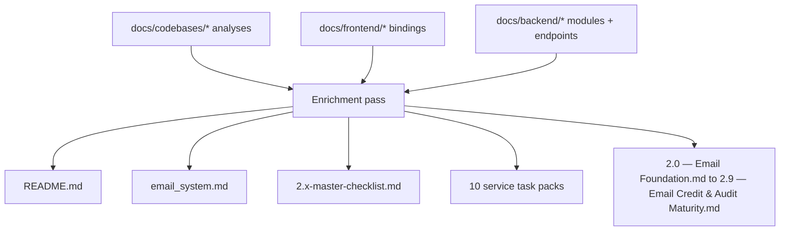

# 2.x Email System Docs Enrichment Plan

## What Changes and Why

The existing docs have good structure but are abstract. The codebase analyses (`docs/codebases/`) surface exact file paths, real gaps, and immediate execution queues. The frontend docs (`docs/frontend/`) surface exact components, hooks, and page JSON. The backend docs (`docs/backend/`) surface GraphQL modules, endpoint JSONs, and DB lineage. Every file below will be upgraded to reference these concrete artifacts.

## Architecture of Changes

## File Groups and What Gets Added

### Group 1 — `email_system.md` (unified map)

- Replace prose "layer" bullets with a Mermaid data-flow diagram showing exact codebases and files
- Add "Critical file map" table: service → entry points → key files (from codebase analyses)
- Add "Cross-system risks" table with severity, codebase source, and affected file
- Add "End-to-end trace ID propagation" contract

Key references:

- `[docs/codebases/appointment360-codebase-analysis.md](docs/codebases/appointment360-codebase-analysis.md)` — middleware stack, `app/clients/`, debug write risks
- `[docs/codebases/emailapis-codebase-analysis.md](docs/codebases/emailapis-codebase-analysis.md)` — provider drift, Python/Go split
- `[docs/codebases/mailvetter-codebase-analysis.md](docs/codebases/mailvetter-codebase-analysis.md)` — dual surface, in-memory limiter
- `[docs/codebases/jobs-codebase-analysis.md](docs/codebases/jobs-codebase-analysis.md)` — DAG lifecycle, processor registry
- `[docs/codebases/s3storage-codebase-analysis.md](docs/codebases/s3storage-codebase-analysis.md)` — in-memory multipart session risk

---

### Group 2 — `README.md`

- Add "Codebase analyses" section with one-line summary per service
- Add "Frontend surfaces" section linking to `docs/frontend/emailapis-ui-bindings.md`, `jobs-ui-bindings.md`, `s3storage-ui-bindings.md`, `contact-ai-ui-bindings.md`
- Add "Backend API refs" linking `docs/backend/apis/15_EMAIL_MODULE.md`, `16_JOBS_MODULE.md`

---

### Group 3 — `2.x-master-checklist.md`

- Add "Codebase file pointer" column to the cross-service risk matrix (exact files, not just services)
- Add "Immediate execution queue" section derived from each codebase analysis
- Add "Frontend gate" row per minor: which components/hooks/pages must be verified
- Expand "Data lineage discipline" with exact S3 prefix conventions, table names, and metadata.json schema reference

---

### Group 4 — 10 Service Task Packs

Each task pack gets the following additions:

`**appointment360-email-system-task-pack.md**`

- "Codebase file map" from `[appointment360-codebase-analysis.md](docs/codebases/appointment360-codebase-analysis.md)`: `app/graphql/modules/email/`, `app/graphql/modules/jobs/`, `app/clients/lambda_email_client.py`, `app/clients/tkdjob_client.py`, `app/core/middleware.py`
- "Immediate execution queue": remove debug file writes, enable rate limiting, Redis abuse guard
- "2.x GraphQL surface" table linking to `docs/backend/apis/15_EMAIL_MODULE.md` and `16_JOBS_MODULE.md`
- "Frontend hook bindings" referencing `useEmailFinderSingle`, `useEmailVerifierSingle`, `useEmailVerifierBulk`, `useJobs`

`**emailapis-email-system-task-pack.md**`

- "Runtime split file map": `lambda/emailapis/app/`, `lambda/emailapigo/main.go`, `internal/services/email_finder_service.go`
- "Provider drift risk" with exact file location (`emailapigo` prioritizes mailvetter; Python docs say truelist)
- "Endpoint contract table" from `docs/backend/endpoints/emailapis_endpoint_era_matrix.json`
- Concrete per-track tasks with file references

`**mailvetter-email-system-task-pack.md**`

- "File map" from `[mailvetter-codebase-analysis.md](docs/codebases/mailvetter-codebase-analysis.md)`: `cmd/api/main.go`, `internal/handlers/validate.go`, `internal/validator/logic.go`, `internal/store/db.go`, `internal/queue/client.go`, `internal/webhook/dispatcher.go`
- "Immediate execution queue" items 1–7 as checkboxes with file targets
- Webhook secret separation: exact env var `WEBHOOK_SECRET_KEY` vs `API_SECRET_KEY`

`**jobs-email-system-task-pack.md**`

- "Processor file map": `contact360.io/jobs/app/processors/email_finder_export_stream.py`, `email_verify_export_stream.py`, `email_pattern_import_stream.py`
- "DAG schema reference": `job_node`, `edges`, `job_events` table columns
- "API contract table" from jobs codebase: `POST /api/v1/jobs/email-export`, `/email-verify`, `/email-pattern-import`
- "UI bindings" from `docs/frontend/jobs-ui-bindings.md`

`**s3storage-email-system-task-pack.md**`

- "File map": `lambda/s3storage/app/main.py`, `app/services/storage_service.py`, `app/utils/worker.py`, `app/utils/metadata_job.py`, `template.yaml`
- Risk: in-memory `_MULTIPART_SESSIONS` dict (exact location identified)
- Risk: hardcoded `FunctionName="s3storage-metadata-worker"` (exact location)
- "UI bindings" from `docs/frontend/s3storage-ui-bindings.md`

`**logsapi-email-system-task-pack.md**`

- "File map": `lambda/logs.api/app/main.py`, `app/services/log_service.py`, `app/models/log_repository.py`, `app/clients/s3.py`
- Docs-vs-implementation drift risk: docs reference MongoDB but implementation is S3 CSV
- "Event schema table" already present — add `retention_days` and `query_window_days` fields
- Endpoint ref from `docs/frontend/logsapi-ui-bindings.md`

`**connectra-email-system-task-pack.md**`

- Add "File map" from `[connectra-codebase-analysis.md](docs/codebases/connectra-codebase-analysis.md)`
- 2.x role: CSV contract stability, column mapping, stream import/export
- email field lineage: `email`, `email_status` into contacts index

`**contact-ai-email-system-task-pack.md**`

- Add "File map" from `[contact-ai-codebase-analysis.md](docs/codebases/contact-ai-codebase-analysis.md)`: `app/api/v1/endpoints/ai.py`, `app/services/hf_service.py`
- `analyzeEmailRisk` endpoint: `POST /api/v1/ai/email/analyze`
- `ModelSelection` enum mismatch risk (GraphQL vs HF model IDs)
- Frontend binding: `EmailRiskBadge` component, `contact-ai-ui-bindings.md`

`**salesnavigator-email-system-task-pack.md**`

- Add "File map" from `[salesnavigator-codebase-analysis.md](docs/codebases/salesnavigator-codebase-analysis.md)`
- 2.x role: `email` + `email_status` field quality from SN ingest → enrichment handoff
- `email_status` preservation risk from `backend(dev)/salesnavigator/app/services/mappers.py`

`**emailcampaign-email-system-task-pack.md**`

- Add "File map" from `[emailcampaign-codebase-analysis.md](docs/codebases/emailcampaign-codebase-analysis.md)`: `cmd/main.go`, `cmd/worker/main.go`, `db/schema.sql`
- Critical gaps: SMTP `nil` auth, missing `templates` table in schema, `GetUnsubToken` bug
- 2.x role: SMTP hardening, bulk CSV import/export alignment

---

### Group 5 — Version Files (`2.0 — Email Foundation.md` through `2.9 — Email Credit & Audit Maturity.md`)

Each version file gets these new sections appended/expanded:

- **"Codebase file targets for this minor"** — table of service → files to touch → what changes
- **"Frontend components and hooks"** — specific components from `docs/frontend/components.md` and page JSONs (`email_page.json`, `files_page.json`, `jobs_page.json`)
- **"Backend API and endpoint refs"** — links to `docs/backend/apis/*.md` and `docs/backend/endpoints/*.json`
- **"Database tables in scope"** — exact table names and columns from data lineage docs
- **"Per-patch task table"** — expand current 10-row patch ladder into a full 5-column table (Contract, Service, Surface, Data, Ops) with file-level tasks per patch

Minor-specific additions:

- `2.0 — Email Foundation.md` — add debug-write removal task to patch `2.0.3`, add provider drift risk
- `2.1 — Finder Engine.md` — add `internal/services/email_finder_service.go` file target, `email_finder_cache` write path
- `2.2 — Verifier Engine.md` — add Mailvetter `internal/validator/logic.go` + scoring file targets, O365 correction gap
- `2.3 — Results Engine.md` — add logs.api event schema for results, activity table
- `2.4 — Bulk Processing.md` — add s3storage `_MULTIPART_SESSIONS` in-memory risk, processor file paths
- `2.5 — Mailbox Core.md` — add `contact360.io/email` IMAP credential security task (P0 risk flagged in codebase analysis)
- `2.6 — Provider Harmonization.md` — add Python/Go parity test plan with golden fixture locations
- `2.7 — Mailvetter Hardening.md` — add Redis limiter implementation target (`internal/api/router.go`), migration pipeline tasks
- `2.8 — Bulk Observability.md` — add logs.api MongoDB-vs-S3 drift note, event category table
- `2.9 — Email Credit & Audit Maturity.md` — add credit reconciliation flow from `app/services/` billing service

---

## Execution Order

Each group is self-contained and can be written in order:

1. `email_system.md` — unified codebase map (foundation for all other files)
2. `README.md` — top-level index update
3. `2.x-master-checklist.md` — add file pointers and execution queue rows
4. Service task packs (10 files) — in dependency order: appointment360 → emailapis → mailvetter → jobs → s3storage → logsapi → connectra → contact-ai → salesnavigator → emailcampaign
5. Version files (10 files) — 2.0 through 2.9 in order

