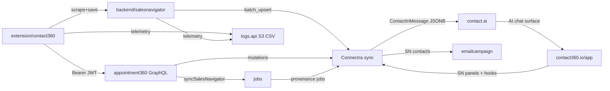

# 4.x Era Documentation Enrichment & Repair

## What's Wrong Right Now

- `4.4 — Extension Telemetry.md` ends with corrupted AI-generation artifact text (`</think>`, `<｜tool▁calls▁begin｜>...`) on lines 146-150 — must be stripped
- `4.x-master-checklist.md` codename table has placeholder text for 4.3–4.7 and 4.9; patch ladders only exist for 4.0, 4.2, 4.8, 4.10 (7 minors have no ladder); task-pack index is missing 5 files
- `extension-telemetry.md` is only 19 lines — no event schema, no CloudWatch mapping, no dashboard UX
- `sales-navigator-ingestion.md` is only 21 lines — no endpoint contract, no extraction pipeline, no error taxonomy
- Several `version_4.N.md` files are missing the `## UI Elements Checklist` and `## Audit and Compliance Notes` sections that 4.1, 4.3, 4.5–4.9 have established
- Task-pack files use inconsistent formats: some use prose, some tables, some checkbox lists; none reference all relevant frontend bindings and backend endpoint matrices

## Target File Inventory

### Group 1 — Critical Fixes

- `[docs/4. Contact360 Extension and Sales Navigator maturity/4.4 — Extension Telemetry.md](docs/4. Contact360 Extension and Sales Navigator maturity/4.4 — Extension Telemetry.md)`: strip corrupted tail (lines 146-150), add `## UI Elements Checklist` and `## Audit and Compliance Notes`
- `[docs/4. Contact360 Extension and Sales Navigator maturity/4.x-master-checklist.md](docs/4. Contact360 Extension and Sales Navigator maturity/4.x-master-checklist.md)`: complete codename table, add 7 missing patch ladders, complete task-pack index, add cross-service risk matrix

### Group 2 — Thin Doc Expansion

- `[docs/4. Contact360 Extension and Sales Navigator maturity/extension-telemetry.md](docs/4. Contact360 Extension and Sales Navigator maturity/extension-telemetry.md)`: expand to full event schema table, CloudWatch correlation, dashboard UX surface map, implementation gates
- `[docs/4. Contact360 Extension and Sales Navigator maturity/sales-navigator-ingestion.md](docs/4. Contact360 Extension and Sales Navigator maturity/sales-navigator-ingestion.md)`: expand with endpoint contract, extraction pipeline diagram, error taxonomy, chunk/dedup mechanics, extension client alignment

### Group 3 — Version File Standardization (version_4.0 through version_4.10)

Each file gets reviewed against the canonical section template from `README.md` and enriched with:

- Correct codename cross-linked to master checklist
- `## UI Elements Checklist` where missing (4.0, 4.2, 4.6, 4.7, 4.10 are missing it)
- `## Audit and Compliance Notes` where missing
- Cross-references to relevant codebase analyses (`docs/codebases/`)
- Cross-references to relevant frontend bindings (`docs/frontend/salesnavigator-ui-bindings.md`, `contact-ai-ui-bindings.md`, etc.)
- Cross-references to relevant backend endpoint matrices and API docs

Specific per-file deltas:

- `4.0 — Harbor.md`: add UI/Audit sections; link `salesnavigator-ui-bindings.md`
- `4.1 — Auth & Session.md`: already has both sections; add `extension-auth.md` flow details link
- `4.2 — Harvest.md`: add UI/Audit sections; add Postman collection refs, `21_LINKEDIN_MODULE.md` + `23_SALES_NAVIGATOR_MODULE.md` links
- `4.3 — Sync Integrity.md`: already has both sections; enrich data lineage cross-ref
- `4.4 — Extension Telemetry.md`: fix + add missing sections (Group 1)
- `4.5 — Popup UX.md`: already has both sections; already detailed
- `4.6 — Dashboard Integration.md`: add UI/Audit sections; add `app-codebase-analysis.md` and `hooks-services-contexts.md` refs
- `4.7 — Campaign Audience.md`: add UI/Audit sections; add `emailcampaign-codebase-analysis.md`, `emailcampaign_data_lineage.md` refs
- `4.8 — Lens.md`: already has both sections; already detailed
- `4.9 — Extension Reliability.md`: already has both sections; already detailed
- `4.10 — Exit Gate.md`: add UI/Audit sections; full era cross-reference link list

### Group 4 — Task Pack Standardization (10 files)

Each task pack gets: consistent header block, explicit era cross-ref links, checkbox format alignment, and references to frontend bindings + backend endpoint matrices where missing.

- `appointment360-extension-sn-task-pack.md`: add refs to `21_LINKEDIN_MODULE.md`, `23_SALES_NAVIGATOR_MODULE.md`, `salesnavigator_endpoint_era_matrix.json`, `salesnavigator-ui-bindings.md`
- `connectra-extension-sn-task-pack.md`: add refs to `connectra_endpoint_era_matrix.json`, `connectra_data_lineage.md`
- `contact-ai-extension-sn-task-pack.md`: add refs to `contact_ai_data_lineage.md`, `contact-ai-ui-bindings.md`, `17_AI_CHATS_MODULE.md`
- `emailapis-extension-salesnav-task-pack.md`: convert prose to checkbox lists; add refs to `emailapis_data_lineage.md`, `emailapis-ui-bindings.md`
- `emailcampaign-extension-sn-task-pack.md`: add refs to `emailcampaign_data_lineage.md`, `emailcampaign-codebase-analysis.md`
- `extension-auth.md`: add MV3 constraint table, link `appointment360-codebase-analysis.md` § middleware
- `extension-sync-integrity.md`: add replay decision tree, link `enrichment-dedup.md`
- `jobs-extension-sn-task-pack.md`: convert prose to checkbox lists; add refs to `jobs_endpoint_era_matrix.json`, `jobs-codebase-analysis.md`
- `logsapi-extension-salesnav-task-pack.md`: convert prose to checkbox lists; add refs to `logsapi_endpoint_era_matrix.json`, `logsapi_data_lineage.md`, `logsapi-ui-bindings.md`
- `mailvetter-extension-sn-task-pack.md`: add refs to `mailvetter-codebase-analysis.md`
- `s3storage-extension-sn-task-pack.md`: add refs to `s3storage-ui-bindings.md`, `s3storage_data_lineage.md` (if exists)
- `salesnavigator-extension-sn-task-pack.md`: add refs to `salesnavigator_data_lineage.md`, `salesnavigator-ui-bindings.md`, `salesnavigator_endpoint_era_matrix.json`

### Group 5 — README Update

- `README.md`: add all 10 task-pack files (currently missing salesnavigator, emailapis, emailcampaign, jobs, mailvetter), add admin/root/email codebase analysis refs, add version_4.4–4.10 to per-minor plans note

## Data Flow Reference (for context in version docs)

## Execution Order

1. Fix corrupted `4.4 — Extension Telemetry.md` first (unblocks reading)
2. Enrich `4.x-master-checklist.md` (the index other files point to)
3. Expand `extension-telemetry.md` and `sales-navigator-ingestion.md`
4. Standardize version files 4.0, 4.2, 4.6, 4.7, 4.10 (add missing sections)
5. Standardize all task pack files (refs + format)
6. Update `README.md`

