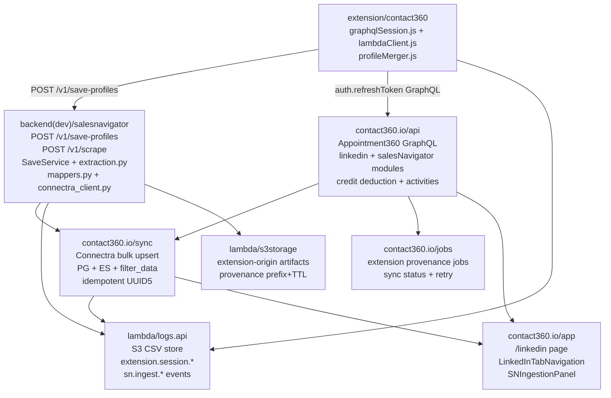

# 4.x Era Docs Fix Plan

## What is broken and why

From reading all files, three categories of problems exist:

### Category 1 — Four version files have wrong-era content (AI placeholder text)

- `[docs/4. .../4.0 — Harbor.md](docs/4.%20Contact360%20Extension%20and%20Sales%20Navigator%20maturity/4.0%20—%20Harbor.md)` — Header and summary describe `contact.ai` AI workflows. Must become **Harbor** (era charter: repo parity, service register, docs scaffold).
- `[docs/4. .../4.2 — Harvest.md](docs/4.%20Contact360%20Extension%20and%20Sales%20Navigator%20maturity/4.2%20—%20Harvest.md)` — Header says "AI workflows". Must become **Harvest** (roadmap Stage 4.2: SN scrape/save, extraction, mappers, Connectra bulk upsert).
- `[docs/4. .../4.8 — Lens.md](docs/4.%20Contact360%20Extension%20and%20Sales%20Navigator%20maturity/4.8%20—%20Lens.md)` — Header says "AI workflows". Must become **Lens** (SN JSONB compat with `messages.contacts[]`, optional extension AI panel, CSP).
- `[docs/4. .../4.10 — Exit Gate.md](docs/4.%20Contact360%20Extension%20and%20Sales%20Navigator%20maturity/4.10%20—%20Exit%20Gate.md)` — Header says "AI workflows". Must become **Exit Gate** (4.x docs sign-off, cross-analysis review, cross-reference to `4.10` before 5.x).

### Category 2 — Six factual errors in supporting docs

- `[extension-telemetry.md](docs/4.%20Contact360%20Extension%20and%20Sales%20Navigator%20maturity/extension-telemetry.md)` line 5: says logs.api uses **MongoDB** → must say **S3 CSV** (authoritative: `docs/architecture.md`, `docs/codebases/logsapi-codebase-analysis.md`).
- `[appointment360-extension-sn-task-pack.md](./README.md)` lines 12–13: cites `20_LINKEDIN_MODULE.md` and `21_SALES_NAVIGATOR_MODULE.md` → must be `21_LINKEDIN_MODULE.md` and `23_SALES_NAVIGATOR_MODULE.md` (authoritative: `docs/backend/endpoints/appointment360_endpoint_era_matrix.json`).
- `[extension-auth.md](docs/4.%20Contact360%20Extension%20and%20Sales%20Navigator%20maturity/extension-auth.md)` line 1: heading says "roadmap stage **3.1**" → must say "roadmap stage **4.1**".
- `[extension-sync-integrity.md](docs/4.%20Contact360%20Extension%20and%20Sales%20Navigator%20maturity/extension-sync-integrity.md)` line 1: heading says "roadmap stage **3.3**" → must say "roadmap stage **4.3**".
- `[sales-navigator-ingestion.md](docs/4.%20Contact360%20Extension%20and%20Sales%20Navigator%20maturity/sales-navigator-ingestion.md)` line 1: heading says "roadmap stage **3.2**" → must say "roadmap stage **4.2**"; line 16 endorses `extention/contact360/` (old typo path) as active → must note it as legacy and point to canonical `extension/contact360/`.
- `[README.md](docs/4.%20Contact360%20Extension%20and%20Sales%20Navigator%20maturity/README.md)` line 8: broken link `(4.x-master-checklistmd)` (missing dot) → must be `(4.x-master-checklist.md)`.

### Category 3 — Four under-specified task packs need enriching

- `[connectra-extension-sn-task-pack.md](./README.md)` — only 14 lines; needs five-track expansion matching other packs, grounded in `docs/codebases/connectra-codebase-analysis.md` §4.x.
- `[s3storage-extension-sn-task-pack.md](./README.md)` — thin; needs small-task bullets from `docs/codebases/s3storage-codebase-analysis.md` §4.x.x.
- `[extension-sync-integrity.md](docs/4.%20Contact360%20Extension%20and%20Sales%20Navigator%20maturity/extension-sync-integrity.md)` — 3 sentences; needs idempotency token, conflict resolution flow, reconciliation evidence per `salesnavigator-codebase-analysis.md` + `connectra-codebase-analysis.md`.
- `[extension-auth.md](docs/4.%20Contact360%20Extension%20and%20Sales%20Navigator%20maturity/extension-auth.md)` — missing full function table from `extension-codebase-analysis.md` (`decodeJWT`, `isTokenExpired`, `getStoredTokens`, `storeTokens`, `refreshAccessToken`, `getValidAccessToken`).

---

## Runtime data-flow reference (used to write correct version files)

---

## File-by-file change plan

### Task 1 — Rewrite `4.0 — Harbor.md` (Harbor — era charter)

Replace entire content. Key sections:

- Status/codename/era header: **Harbor**, era charter, roadmap pre-stage, owner Platform Engineering.
- Summary: Scaffold Extension+SN service register, analysis docs in sync with `governance.md`, CI parity.
- Flowchart: five-track, labeled `4.0.0 — Extension/SN era charter`.
- Runtime focus diagram: unique to this minor — extension folder structure + service inventory linkage.
- Task tracks: per-service (extension, salesnavigator, appointment360, connectra, jobs, logs.api, s3storage) scoped to setup/inventory work.
- Patch ladder `4.0.0`–`4.0.9`: Charter → Inventory → Drift-scan → Codebase-link → Governance → CI → Docs → Postman → Release-evidence → Seal.
- Backend/DB/UX/Flow/Gate sections using template from `4.1 — Auth & Session.md`.

### Task 2 — Rewrite `4.2 — Harvest.md` (Harvest — SN ingestion)

Replace entire content aligned to **roadmap Stage 4.2** (SN ingestion optimization). Key sections:

- Status/codename/era header: **Harvest**, roadmap Stage 4.2, owner SN Engineering.
- Summary: scrape/save accuracy, extraction variants, SaveService dedup/chunk, Connectra bulk upsert.
- Runtime focus: unique diagram: HTML DOM → extraction.py → mappers.py → ConnectraClient → PG+ES.
- Task tracks grounded in `salesnavigator-codebase-analysis.md` P0 items: doc drift fix, X-Request-ID, URL normalization, extraction fallback.
- Patch ladder `4.2.0`–`4.2.9`: Contract → Scrape → Extract → Dedup → Map → Chunk → Connectra → Drift-fix → Load-test → Seal (matches "Harvest" theme).
- Backend API scope: `POST /v1/scrape`, `POST /v1/save-profiles`, downstream Connectra calls.
- DB lineage: SN provenance fields (`lead_id`, `search_id`, `data_quality_score`, `connection_degree`, `source`).

### Task 3 — Rewrite `4.8 — Lens.md` (Lens — AI context + SN JSONB)

Replace entire content aligned to **Lens** codename from `contact-ai-codebase-analysis.md` §4.x. Key sections:

- Status/codename/era header: **Lens**, extension depth minor, owner Contact AI + Extension Engineering.
- Summary: `messages.contacts[]` JSONB SN compatibility, optional extension AI panel, CSP review.
- Runtime focus: unique diagram: SN contact → extension popup → AI context panel (optional) → `POST /message/stream`.
- Task tracks from `contact-ai-extension-sn-task-pack.md` expanded with implementation detail.
- Patch ladder `4.8.0`–`4.8.9`: JSONB → Gateway → CSP → Optional-panel → UX → Privacy → Lineage → Ops → Load → Seal.

### Task 4 — Rewrite `4.10 — Exit Gate.md` (Exit Gate — 4.x sign-off)

Replace entire content. Key sections:

- Status/codename/era header: **Exit Gate**, extension depth (planning minor), owner Product + Platform.
- Summary: cross-analysis doc review, codebase analysis sign-off, release governance, 4.x→5.x handoff.
- Scope: retrospective tasks — doc drift resolution across all 4.x minors, release evidence collection.
- Runtime focus: meta diagram showing each 4.x minor and sign-off status gate.
- Task tracks: documentation parity checks, cross-service integration tests, roadmap/versions sync.
- Patch ladder `4.10.0`–`4.10.9`: Review → Evidence → Drift-fix → Postman → Docs-sync → Security → Perf → Compliance → RC → Sign-off.

### Task 5 — Fix factual errors (six targeted edits)

- `extension-telemetry.md` line 5: `MongoDB` → `S3 CSV (object storage)`; add note on `logsapi_data_lineage.md`.
- `appointment360-extension-sn-task-pack.md` lines 12–13: `20_LINKEDIN_MODULE.md` → `21_LINKEDIN_MODULE.md`; `21_SALES_NAVIGATOR_MODULE.md` → `23_SALES_NAVIGATOR_MODULE.md`.
- `extension-auth.md` heading: "roadmap stage 3.1" → "roadmap stage 4.1".
- `extension-sync-integrity.md` heading: "roadmap stage 3.3" → "roadmap stage 4.3".
- `sales-navigator-ingestion.md` heading: "roadmap stage 3.2" → "roadmap stage 4.2"; line 16 `extention/contact360/` → note as legacy, canonical is `extension/contact360/`.
- `README.md`: `(4.x-master-checklistmd)` → `(4.x-master-checklist.md)`.

### Task 6 — Enrich `extension-auth.md`

Add function table from `extension-codebase-analysis.md` §`auth/graphqlSession.js`:

| Function                                | Behaviour                                                       |
| --------------------------------------- | --------------------------------------------------------------- |
| `decodeJWT(token)`                      | Base64url-decode JWT payload, no library                        |
| `isTokenExpired(token, bufferSeconds?)` | Returns `true` if `exp` within buffer (default 300s)            |
| `getStoredTokens()`                     | Reads `{accessToken, refreshToken}` from `chrome.storage.local` |
| `storeTokens(tokens)`                   | Persists both tokens to `chrome.storage.local`                  |
| `refreshAccessToken(refreshToken)`      | Calls `auth.refreshToken` mutation; stores result               |
| `getValidAccessToken()`                 | Checks expiry, refreshes proactively, returns valid token       |

Also add: MV3 storage adapter note, test coverage pointers (`hybridFlow.test.js`).

### Task 7 — Enrich `extension-sync-integrity.md`

Expand from 3 sentences to a full section with:

- Idempotency token definition and flow (client-generated stable token per batch).
- Conflict resolution sequence: `SaveService.deduplicate_profiles` → merge by completeness score → `ConnectraClient.batch_upsert` (UUID5 deterministic key).
- Reconciliation evidence: expected count vs `saved_count` in response, `sn.sync.conflict_resolved` log event.
- Replay semantics: re-sending same batch → same UUIDs → DB upsert safe.
- Cross-references: `extension-codebase-analysis.md`, `salesnavigator-codebase-analysis.md`, `connectra-codebase-analysis.md`.

### Task 8 — Enrich `connectra-extension-sn-task-pack.md`

Expand from 14 lines to full five-track format matching other packs, grounded in `connectra-codebase-analysis.md` §4.x:

- Contract: SN payload contract, provenance fields, conflict error codes.
- Service: idempotent batch-upsert for SN sources, `AllowAllOrigins` CORS note.
- Surface: operator visibility into conflict resolution.
- Data: PG+ES parity for SN-sourced rows, drift detection hooks.
- Ops: KPI (sync conflict auto-resolution success rate per roadmap 4.3), runbook for ES-PG drift.

### Task 9 — Enrich `s3storage-extension-sn-task-pack.md`

Expand from 21 lines to fuller form grounded in `s3storage-codebase-analysis.md` §4.x.x:

- Contract: URL TTL policy, extension-origin prefix schema, access constraint matrix.
- Service: auth context checks for extension-origin ops, download URL policy by object class.
- Data: `source=extension|salesnavigator` provenance tags; provenance tag validation procedure.
- Ops: channel-level telemetry (extension vs dashboard traffic split); reliability metrics.
- Add cross-references: `s3storage-codebase-analysis.md`, governance doc storage controls.

---

## Sequence of execution

1. Fix six factual errors (Tasks 5) — smallest and safest.
2. Enrich `extension-auth.md` (Task 6) — additive only, no rewrites.
3. Enrich `extension-sync-integrity.md` (Task 7) — additive expansion.
4. Enrich task packs (Tasks 8–9) — additive expansion.
5. Rewrite `4.2 — Harvest.md` (Task 2) — new content, narrowest scope.
6. Rewrite `4.8 — Lens.md` (Task 3) — new content, narrowest scope.
7. Rewrite `4.0 — Harbor.md` (Task 1) — new content, era-wide.
8. Rewrite `4.10 — Exit Gate.md` (Task 4) — new content, exit gate.

No changes to `docs/architecture.md`, `docs/roadmap.md`, `docs/versions.md`, or DocsAI constants in this pass — only the `docs/4. .../` folder files and their immediate task-pack content are touched.