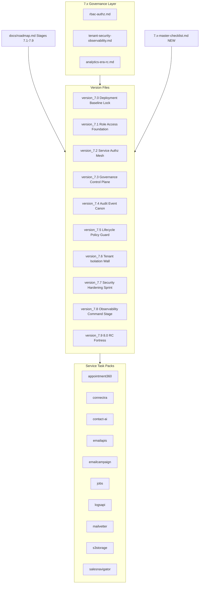

# 7.x Deployment Era Documentation Repair

## Problem summary

Every `version_7.*.md` file carries the wrong era theme — **analytics** (metric taxonomy pipeline, quality scorecards, drift detection jobs, attribution consistency, analytics freshness SLO). The canonical theme from `[docs/roadmap.md](docs/roadmap.md)` (Stages 7.1–7.9) and `[docs/versions.md](docs/versions.md)` is **deployment/governance**: RBAC, service authz, admin governance, audit model, data lifecycle, tenant isolation, security hardening, observability.

Additional problems found in the task packs and governance docs:

- `emailapis-deployment-task-pack.md`: `$(System.Collections.Hashtable.era)` appears 4x (PowerShell object leak)
- `rbac-authz.md` title: "Era 7 — Stages **6**.1–6.2"
- `tenant-security-observability.md` title: "Era 7 — Stages **6**.6–6.8"
- `analytics-era-rc.md` header: "Era **7** — Stage **6.9**"
- `appointment360-deployment-task-pack.md`: no RBAC, audit, or tenant tasks
- `mailvetter-deployment-task-pack.md`: no audit/governance content
- `salesnavigator-deployment-task-pack.md`: uses `read_only`/`admin`/`user` role names; conflicts with `rbac-authz.md` (`FreeUser`/`ProUser`/`Admin`/`SuperAdmin`)
- `emailcampaign-deployment-task-pack.md`: uses `admin`/`campaign-manager`; not cross-referenced to global role constants
- `connectra-deployment-task-pack.md` and `s3storage-deployment-task-pack.md`: non-standard five-track structure
- `logsapi-deployment-task-pack.md` Surface section: generic placeholder
- `7.8 — Observability Command Stage.md` is missing entirely (Stage 7.8 = Deployment Observability ships `7.8.0`)

---

## Unique codenames (`7.0`–`7.9`)

Derived from canonical `docs/versions.md` summaries + `docs/roadmap.md` stage definitions:

| Minor | Codename                        | Canonical summary                                                 |
| ----- | ------------------------------- | ----------------------------------------------------------------- |
| `7.0` | **Deployment Baseline Lock**    | Deployment era opening gate — secure, auditable, governable       |
| `7.1` | **Role Access Foundation**      | RBAC model and access control foundation                          |
| `7.2` | **Service Authz Mesh**          | Service-level authorization enforcement                           |
| `7.3` | **Governance Control Plane**    | Admin governance controls — approval flows and audited actions    |
| `7.4` | **Audit Event Canon**           | Audit and compliance event model — immutable schema and reporting |
| `7.5` | **Lifecycle Policy Guard**      | Data governance and lifecycle controls — retention/deletion       |
| `7.6` | **Tenant Isolation Wall**       | Tenant and policy isolation — cross-tenant boundary validation    |
| `7.7` | **Security Hardening Sprint**   | Security posture and secrets hardening                            |
| `7.8` | **Observability Command Stage** | Deployment observability and enterprise reporting                 |
| `7.9` | **8.0 RC Fortress**             | Release candidate hardening before APIs era                       |

---

## Patch ladder schema (apply to every `7.n.x`)

Modelled on `[docs/3. Contact360 contact and company data system/3.x-master-checklist.md](docs/3.%20Contact360%20contact%20and%20company%20data%20system/3.x-master-checklist.md)`:

| Patch | Codename      | Focus                                                    |
| ----- | ------------- | -------------------------------------------------------- |
| `.0`  | Charter       | Contract freeze — role matrix, audit schema, policy docs |
| `.1`  | Gateway       | Appointment360 RBAC guards, middleware, auth context     |
| `.2`  | Services      | Backend service permission checks and audit emission     |
| `.3`  | Admin Surface | admin/DocsAI governance UX, role management screens      |
| `.4`  | Data/Audit    | Retention policy, audit event writes, erasure paths      |
| `.5`  | Tenant        | Tenant isolation tests, policy boundary validation       |
| `.6`  | Observability | Structured logging, trace IDs, SLO evidence              |
| `.7`  | Hardening     | Secrets rotation, CORS tightening, security edge cases   |
| `.8`  | Evidence      | Postman/compliance artifacts, smoke logs, release docs   |
| `.9`  | Gate          | Docs sync, release sign-off, handoff to next minor       |

---

## Architecture: 7.x deployment flow

---

## Workstream A — Rewrite `7.0 — Deployment era baseline lock.md` through `7.9 — 80 RC Fortress.md` (10 files)

**Template source:** `[docs/3. Contact360 contact and company data system/3.0 — Twin Ledger.md](docs/3.%20Contact360%20contact%20and%20company%20data%20system/3.0%20—%20Twin%20Ledger.md)`

**For each file, perform these exact changes:**

1. Replace header block: `Summary` + `Scope` + `Codename` lines — use canonical values from `docs/versions.md`
2. Replace all flowcharts: remove analytics nodes (`metric taxonomy pipeline`, `drift detection jobs`, `analytics freshness SLO`, `quality scorecards`, `attribution consistency`). Add deployment-governance nodes matching the minor's stage theme
3. Replace all five-track task items: anchor to RBAC/authz/audit/tenant/security/observability language, citing codebase paths from `docs/codebases/*-codebase-analysis.md`
4. Add `## Patch ladder (7.n.0–7.n.9)` table using the 10-slot schema above
5. Keep `## Master Task Checklist` skeleton (it is already structurally correct); populate each sub-section with this minor's evidence items
6. Reference `docs/7. Contact360 deployment/7.x-master-checklist.md` (new file)

**Per-minor task content** (source: `docs/roadmap.md` + `docs/versions.md` + `docs/codebases/*`):

- `7.0` — Deployment Baseline Lock: contract freeze for RBAC role matrix; baseline deploy security for all services; reference `docs/7. Contact360 deployment/analytics-era-rc.md` as precondition
- `7.1` — Role Access Foundation: enforce `require_auth`/`require_admin`/`require_profile_roles` in `contact360.io/api`; `RoleContext` gate in `contact360.io/app`; role gating in `contact360.io/admin`; RBAC alignment with `rbac-authz.md`
- `7.2` — Service Authz Mesh: service-to-service API key enforcement for `connectra`, `jobs`, `logsapi`, `s3storage`, `contact-ai`, `salesnavigator`, `mailvetter`, `emailapis`, `emailcampaign`; remove implicit trust; authz failure observability
- `7.3` — Governance Control Plane: admin approval flows in `contact360.io/admin`; destructive-action guards in `app`; governance event schema
- `7.4` — Audit Event Canon: immutable audit events to `logs.api` for all write-path services; retention guarantees; compliance reporting
- `7.5` — Lifecycle Policy Guard: 90-day retention policy evidence in `logs.api`/`s3storage`; GDPR erasure cascades in `connectra`→`contact.ai`→`salesnavigator`; deletion policy surface
- `7.6` — Tenant Isolation Wall: JWT-bound tenant ownership checks; no cross-tenant reads; `org_id`/`tenant_id` scoping in `connectra` and `salesnavigator`
- `7.7` — Security Hardening Sprint: CORS tightening; secret rotation; `ENVIRONMENT=production` enforced; debug/introspection disabled; privileged path hardening
- `7.8` — Observability Command Stage: release/region/service-version labels in logs; governance dashboard evidence; SLO/SLI reports; deployment metrics; `deploymentService` planned UI at `/admin/deployments`
- `7.9` — 8.0 RC Fortress: cross-service RC dry run; rollback simulation; final evidence bundle; gate sign-off

---

## Workstream B — Create `7.8 — Observability Command Stage.md` (missing file)

`7.8 — Observability Command Stage.md` does not exist. Create it matching the same structure as other version files with:

- Codename: **Observability Command Stage**
- Stage mapping: `7.8` (Deployment observability and enterprise reporting)
- Content from `docs/roadmap.md` Stage 7.8 definition and `docs/codebases/logsapi-codebase-analysis.md` `7.x` row

---

## Workstream C — Fix `7.10 — Deployment overflow patch buffer inside era 7.md`

Currently placeholder text says "Data and analytics platform". Fix:

- Era label: "7.x (Contact360 deployment)"
- Add scope: "Deployment era overflow patch buffer — minor-specific scope defined at sprint time"
- Remove all analytics-themed flowchart nodes

---

## Workstream D — Fix governance reference docs (3 files)

`**[docs/7. Contact360 deployment/rbac-authz.md](docs/7.%20Contact360%20deployment/rbac-authz.md)`**

- Line 1: Change title era tag "Era 7 — Stages 6.1–6.2" → "Era 7 — Stages 7.1–7.2 (RBAC foundation and service authz)"

`**[docs/7. Contact360 deployment/tenant-security-observability.md](docs/7.%20Contact360%20deployment/tenant-security-observability.md)**`

- Title: Change "Era 7 — Stages 6.6–6.8" → "Era 7 — Stages 7.6–7.8 (tenant isolation, security hardening, observability)"

`**[docs/7. Contact360 deployment/analytics-era-rc.md](docs/7.%20Contact360%20deployment/analytics-era-rc.md)**`

- Title: Change "Era 7 — Stage 6.9" → "Era 7 — Stage 6.9 (Pre-deployment RC gate; entry condition for 7.0.0)"
- Intro note: Clarify this documents the 6.9→7.0 transition gate, not an analytics deliverable

---

## Workstream E — Repair service task packs (10 files)

`**[emailapis-deployment-task-pack.md](./README.md)**`

- Replace all 4 occurrences of `$(System.Collections.Hashtable.era)` with `7.x`
- Add explicit RBAC task (gateway role checks for email finder/verifier operations)
- Add audit task (emit trace event to `logs.api` on bulk verify)

`**[appointment360-deployment-task-pack.md](./README.md)**`

- Add Contract task: RBAC constants import from `app/utils/access_control.py`; no string-literal role checks
- Add Service task: `require_profile_roles` applied to all `admin`/`superAdmin` mutations; audit log emission via `logs.api` client
- Add Data task: record auditable admin events with actor `user_id`, action, timestamp
- Reference `docs/codebases/appointment360-codebase-analysis.md` `7.x` row

`**[mailvetter-deployment-task-pack.md](./README.md)**`

- Add Contract task: document whether mailvetter emits audit events for verification requests
- Add Data task: evidence that verdict data retention aligns with 90-day policy
- Add Ops task: runbook for secret rotation (Redis password, SMTP credentials, API key)

`**[salesnavigator-deployment-task-pack.md](./README.md)**`

- Replace role vocabulary `read_only`/`admin`/`user` with mapping note: "Gateway role = `Admin`/`SuperAdmin`; service-level key is per-environment, not per-role. See `rbac-authz.md`."
- Add cross-reference to `rbac-authz.md` role constants

`**[emailcampaign-deployment-task-pack.md](./README.md)**`

- Add note: "`admin`/`campaign-manager` roles map to `Admin`/`ProUser` in the global role model — see `rbac-authz.md`"
- Add cross-reference to `rbac-authz.md`

`**[connectra-deployment-task-pack.md](./README.md)**`

- Reformat `## Small tasks` into five explicit subsections: Contract / Service / Surface / Data / Ops (matching other packs)
- Add missing Ops section: health probe, deployment gate, rollback evidence

`**[s3storage-deployment-task-pack.md](./README.md)**`

- Add Surface section: admin UI and governance overlays for storage (per `docs/frontend/s3storage-ui-bindings.md` `7.x` row)
- Rename internal track labels to Contract/Service/Surface/Data/Ops for consistency

`**[logsapi-deployment-task-pack.md](./README.md)**`

- Replace generic placeholder Surface section with: "Admin audit views: log table with date-range filter, level checkbox filter, export button. See `docs/frontend/logsapi-ui-bindings.md` `7.x` row."

`**[contact-ai-deployment-task-pack.md](./README.md)**`

- Deduplicate GDPR items split across Service and Data tracks into Data track only
- Add explicit reference to `tenant-security-observability.md` JWT/ownership model for tenant isolation

`**[jobs-deployment-task-pack.md](./README.md)**`

- Add RBAC tie-in: "Role-aware API key path maps to `Admin`/`SuperAdmin` in `app/middleware/auth.py`; see `rbac-authz.md`"
- Add file path reference: `contact360.io/jobs/app/middleware/auth.py`

---

## Workstream F — Update `README.md`

`**[docs/7. Contact360 deployment/README.md](docs/7.%20Contact360%20deployment/README.md)**`

Add:

- Table of contents with one-line description per task pack (what service, what 7.x governance focus)
- Note clarifying `analytics-era-rc.md` = pre-deployment RC gate from 6.9→7.0, not an analytics deliverable
- Governance expectations summary: all packs must cover RBAC, audit events, and tenant-safe API keys
- Cross-reference to new `7.x-master-checklist.md`

---

## Workstream G — Create `7.x-master-checklist.md` (new file)

**Path:** `[docs/7. Contact360 deployment/7.x-master-checklist.md](docs/7.%20Contact360%20deployment/7.x-master-checklist.md)`

Modelled on `[docs/3. Contact360 contact and company data system/3.x-master-checklist.md](docs/3.%20Contact360%20contact%20and%20company%20data%20system/3.x-master-checklist.md)`.

Contains:

- Purpose: shared release discipline for every `7.n.x` patch
- Patch ladder table (10 rows: Charter through Gate) with columns Contract/Service/Surface/Data/Ops
- Each row: deployment/governance-specific gate criteria (RBAC, authz, audit schema, tenant, secrets, evidence)
- Cross-cutting release gate checklist: no undocumented role bypass; audit event coverage; trace ID propagation; PII not in logs without hashing; tenant isolation test pass

---

## File change summary

| File                                     | Action            | Primary change                                                    |
| ---------------------------------------- | ----------------- | ----------------------------------------------------------------- |
| `7.0 — Deployment era baseline lock.md`                         | Rewrite           | Analytics → Deployment Baseline Lock                              |
| `7.1 — Role Access Foundation.md`                         | Rewrite           | Analytics → Role Access Foundation                                |
| `7.2 — Service Authz Mesh.md`                         | Rewrite           | Analytics → Service Authz Mesh                                    |
| `7.3 — Governance Control Plane.md`                         | Rewrite           | Analytics → Governance Control Plane                              |
| `7.4 — Audit Event Canon.md`                         | Rewrite           | Analytics → Audit Event Canon                                     |
| `7.5 — Lifecycle Policy Guard.md`                         | Rewrite           | Analytics → Lifecycle Policy Guard                                |
| `7.6 — Tenant Isolation Wall.md`                         | Rewrite           | Analytics → Tenant Isolation Wall                                 |
| `7.7 — Security Hardening Sprint.md`                         | Rewrite           | Analytics → Security Hardening Sprint                             |
| `7.8 — Observability Command Stage.md`                         | **Create**        | New file — Observability Command Stage                            |
| `7.9 — 80 RC Fortress.md`                         | Rewrite           | Analytics → 8.0 RC Fortress                                       |
| `7.10 — Deployment overflow patch buffer inside era 7.md`                        | Fix               | Remove analytics era label and nodes                              |
| `rbac-authz.md`                          | Fix era tag       | "Stages 6.1–6.2" → "Stages 7.1–7.2"                               |
| `tenant-security-observability.md`       | Fix era tag       | "Stages 6.6–6.8" → "Stages 7.6–7.8"                               |
| `analytics-era-rc.md`                    | Fix title         | Clarify 6.9→7.0 transition gate context                           |
| `emailapis-deployment-task-pack.md`      | Bug fix + content | Replace 4x PowerShell placeholder; add RBAC/audit tasks           |
| `appointment360-deployment-task-pack.md` | Enrich            | Add RBAC, audit emission, admin action audit tasks                |
| `mailvetter-deployment-task-pack.md`     | Enrich            | Add audit/governance, retention, secret rotation tasks            |
| `salesnavigator-deployment-task-pack.md` | Fix roles         | Align role vocabulary with `rbac-authz.md`                        |
| `emailcampaign-deployment-task-pack.md`  | Fix roles         | Add role mapping note to `rbac-authz.md`                          |
| `connectra-deployment-task-pack.md`      | Reformat          | Add five-track structure + Ops section                            |
| `s3storage-deployment-task-pack.md`      | Reformat + enrich | Add Surface track; standard track naming                          |
| `logsapi-deployment-task-pack.md`        | Enrich Surface    | Replace generic placeholder with specific admin audit UI          |
| `contact-ai-deployment-task-pack.md`     | Cleanup           | Dedup GDPR, add tenant-security-observability.md ref              |
| `jobs-deployment-task-pack.md`           | Enrich            | Add RBAC tie-in + file path                                       |
| `README.md`                              | Enhance           | Add pack summaries, governance expectations, master checklist ref |
| `7.x-master-checklist.md`                | **Create**        | New 10-slot patch ladder for deployment era                       |

