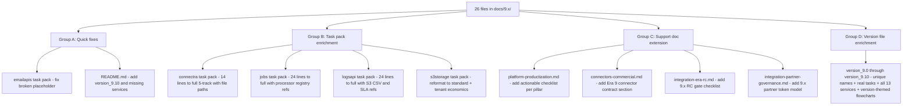

# 9.x Documentation Enrichment Plan

## Root diagnosis

After reading all 26 files, three classes of problem exist:

- **Broken boilerplate**: `emailapis-ecosystem-productization-task-pack.md` contains literal `$(System.Collections.Hashtable.era)` in every task item — must be replaced.
- **Severely under-specified task packs**: `connectra`, `jobs`, `logsapi` are 14–24 lines each; `s3storage` uses a non-standard schema; none reference real file paths or codebase-analysis data.
- **Generic version files**: `9.0 — Ecosystem Foundation.md`…`9.10 — Productization Buffer.md` are all 318-line clones differing only in version numbers and a few rotating theme phrases. They cover only 8 services (api, app, jobs, sync, admin, mailvetter, emailapis, emailapigo) and omit `contact.ai`, `salesnavigator`, `s3storage`, `logsapi`, `emailcampaign`, and `extension`. Every version flowchart is identical.

## Source documents used as reference

- `[docs/codebases/appointment360-codebase-analysis.md](../docs/codebases/appointment360-codebase-analysis.md)` — 28 GraphQL modules, 8-layer middleware, client registry
- `[docs/codebases/connectra-codebase-analysis.md](../docs/codebases/connectra-codebase-analysis.md)` — VQL, parallel write, UUID5 dedup
- `[docs/codebases/jobs-codebase-analysis.md](../docs/codebases/jobs-codebase-analysis.md)` — DAG lifecycle, processor registry, checkpoint model
- `[docs/codebases/contact-ai-codebase-analysis.md](../docs/codebases/contact-ai-codebase-analysis.md)` — HFService, ai_chats, webhook async result
- `[docs/codebases/salesnavigator-codebase-analysis.md](../docs/codebases/salesnavigator-codebase-analysis.md)` — SaveService, adapter, UUID5 strategy
- `[docs/codebases/mailvetter-codebase-analysis.md](../docs/codebases/mailvetter-codebase-analysis.md)` — Gin API, Redis queue, webhook dispatcher
- `[docs/codebases/s3storage-codebase-analysis.md](../docs/codebases/s3storage-codebase-analysis.md)` — StorageService, multipart, metadata worker
- `[docs/codebases/logsapi-codebase-analysis.md](../docs/codebases/logsapi-codebase-analysis.md)` — S3 CSV, SLA evidence, per-tenant retention
- `[docs/codebases/emailcampaign-codebase-analysis.md](../docs/codebases/emailcampaign-codebase-analysis.md)` — Asynq dispatch, suppression, tenant entitlement
- `[docs/codebases/app-codebase-analysis.md](../docs/codebases/app-codebase-analysis.md)` — Next.js 16, GraphQL contexts, integrations UX
- `[docs/codebases/admin-codebase-analysis.md](../docs/codebases/admin-codebase-analysis.md)` — Django DocsAI, D3/Cytoscape graph, RBAC decorators
- `[docs/codebases/extension-codebase-analysis.md](../docs/codebases/extension-codebase-analysis.md)` — Chrome MV3, lambdaClient, profileMerger

## Version name assignments

| Version | Name                     | Core theme                                                        |
| ------- | ------------------------ | ----------------------------------------------------------------- |
| `9.0`   | Ecosystem Foundation     | Partner + connector taxonomy baseline across all 13 services      |
| `9.1`   | Partner Identity         | `client_id` / scopes / partner token lifecycle                    |
| `9.2`   | Connector Contracts      | Adapter layer, compatibility tests, connector health              |
| `9.3`   | Entitlement Fabric       | Plan→quota mapping, `require_plan_feature()` at gateway + workers |
| `9.4`   | Tenant Boundary          | Row-level isolation, leak tests, dataloader safety                |
| `9.5`   | Self-Serve Control Plane | Tenant admin, policy overlays, guided setup flows                 |
| `9.6`   | Webhook Reliability      | Event catalog, DLQ, replay API, delivery logs                     |
| `9.7`   | Operational Transparency | SLA/SLO dashboards, trace correlation, cost indicators            |
| `9.8`   | Commercial Guardrails    | Rate caps, partner tiers, billing unit reconciliation             |
| `9.9`   | Productization RC        | Full end-to-end RC matrix, no contract drift, go/no-go            |
| `9.10`  | Productization Buffer    | Overflow tasks, compliance tidy-up, 10.x readiness                |

## Architecture of changes

## Services added to version files (currently missing)

Every `version_9.x.md` currently covers only 8 services. The following will be added in each version file's task tracks and per-service execution slices:

- `backend(dev)/contact.ai` — connector spec, webhook async AI result (`app/services/ai_chat_service.py`)
- `backend(dev)/salesnavigator` — adapter layer, webhook delivery (`app/services/save_service.py`)
- `lambda/s3storage` — plan entitlement + tenant economics (`app/services/storage_service.py`)
- `lambda/logs.api` — tenant audit trail, SLA evidence (`app/services/log_service.py`)
- `backend(dev)/email campaign` — tenant quotas, suppression CRM import
- `extension/contact360` — ecosystem ingestion channel role (`utils/lambdaClient.js`)

## Group A: Quick fixes (2 files)

`**emailapis-ecosystem-productization-task-pack.md**` — remove all `$(System.Collections.Hashtable.era)` placeholders; replace with concrete `9.x` tasks referencing `lambda/emailapis/app/api/v1/router.py`, `lambda/emailapigo/internal/api/router.go`, provider orchestration contracts, entitlement-aware finder/verifier paths.

`**README.md**` — add `9.10 — Productization Buffer.md` to version notes; add contact.ai, salesnavigator, s3storage, logsapi, emailcampaign to the service list.

## Group B: Task pack enrichment (4 files)

Each thin pack will be expanded to the same standard as `salesnavigator-ecosystem-productization-task-pack.md` (5 tracks, `- [ ]` checkboxes, file paths, references section):

`**connectra-ecosystem-productization-task-pack.md**` — add tasks referencing `app/api/routes/*.go`, VQL tenant filter policy, `POST /contacts/batch-upsert` tenant isolation, UUID5 dedup audit trail, quota throttle middleware, SLA evidence table.

`**jobs-ecosystem-productization-task-pack.md**` — add tasks referencing `app/workers/scheduler.py`, `job_node` tenant_id column, processor registry tenant-quota checks, `GET /api/v1/jobs/{uuid}/timeline` tenant-scoped visibility, DAG fairness controls.

`**logsapi-ecosystem-productization-task-pack.md**` — add tasks referencing `app/services/log_service.py`, S3 CSV tenant-prefixed object paths, per-tenant retention policy, SLA evidence query windows, audit bundle export endpoint.

`**s3storage-ecosystem-productization-task-pack.md**` — reformat from `Scope/Small tasks` shape to `## Contract/Service/Surface/Data/Ops track` with `- [ ]`; add tasks referencing `app/services/storage_service.py`, plan entitlement matrix, `StorageService` quota guard, tenant cost attribution metadata, `metadata.json` per-tenant lineage.

## Group C: Support doc extension (4 files)

`**platform-productization.md**` — append a `## 9.x actionable checklist` section with `- [ ]` items grouped under each pillar (Tenant model, Self-serve admin, Entitlements engine, SLA/SLO, Support/residency, Cost/lifecycle).

`**connectors-commercial.md**` — append `## Era 9 connector extensions` section covering partner token validation, per-connector SLO targets, entitlement-aware metering contract, and DLQ/replay requirements.

`**integration-era-rc.md**` — add `## Era 9 RC gate` section (mirrors Era 8 RC table structure) covering: connector adapter conformance tests, tenant leak scan, webhook replay smoke, entitlement parity checks, cross-service golden-path trace.

`**integration-partner-governance.md**` — add `## Era 9 partner token model` section documenting: `partner_tokens` table schema, scope allowlist enforcement in `app/graphql/context.py`, tenant-safe resolver guard pattern, rotating secret lifecycle.

## Group D: Version file enrichment (11 files)

All 11 version files follow the same structural upgrade pattern. Key changes per file:

- **Title** updated to include the unique name (e.g. `# Version 9.0 — Ecosystem Foundation`)
- **Summary** updated to reflect the version's specific theme
- **Flowchart** updated with version-specific node labels and runtime flow relevant to that minor's theme
- **Task tracks** expanded from 8 services to 13+ services; each task item contains a concrete action, real file path, and specific outcome (not generic "deliver v9.x service outcomes")
- **Per-service execution slices** include specific function/endpoint names derived from codebase analysis
- **Immediate next execution queue** items are version-specific and actionable
- **Cross-service ownership table** lists all 13 services with version-specific focus areas

Version-specific focus per file:

- `9.0 — Ecosystem Foundation.md` — Freeze partner/connector taxonomy; add `notifications`/`events`/`feature_flags`/`workspaces` tables; baseline 13-service task coverage
- `9.1 — Partner Identity.md` — `partner_tokens` table; scope enforcement in 8-layer middleware; partner admin key UI in `contact360.io/admin`
- `9.2 — Connector Contracts.md` — Connector adapter conformance; `GET /v1/connector/{id}/status`; salesnavigator `SaveProfilesRequest` normalization; connector health cards in app
- `9.3 — Entitlement Fabric.md` — `require_plan_feature(info, feature)` guard; `entitlements` table; jobs processor quota check; emailcampaign 429 + limit error
- `9.4 — Tenant Boundary.md` — DataLoader tenant isolation in `app/graphql/dataloaders.py`; connectra VQL tenant filter; jobs `tenant_id` in `job_node`; s3storage bucket namespace isolation
- `9.5 — Self-Serve Control Plane.md` — `/settings/integrations` page; tenant admin panel; policy-change history; guided connector setup; `contact360.io/admin` RBAC decorator expansion
- `9.6 — Webhook Reliability.md` — Webhook event catalog; `webhook_delivery_log` table; mailvetter DLQ; `internal/webhook/dispatcher.go` retry schedule; contact.ai async webhook
- `9.7 — Operational Transparency.md` — `GET /health/slo` dashboards; logsapi SLA evidence tables; trace correlation `X-Trace-Id`; admin D3/Cytoscape operational graph
- `9.8 — Commercial Guardrails.md` — Rate-cap enforcement per connector tier; `sender_domains` + `integration_suppression_sync` tables; plan upgrade modal trigger; billable usage reconciliation
- `9.9 — Productization RC.md` — Full RC: connector adapter conformance + tenant leak tests + webhook replay smoke + entitlement parity across all 13 services; go/no-go evidence bundle
- `9.10 — Productization Buffer.md` — Buffer: compliance tidy-up, remaining SLA evidence gaps, 10.x campaign-audience ingestion readiness from extension/SN sources

