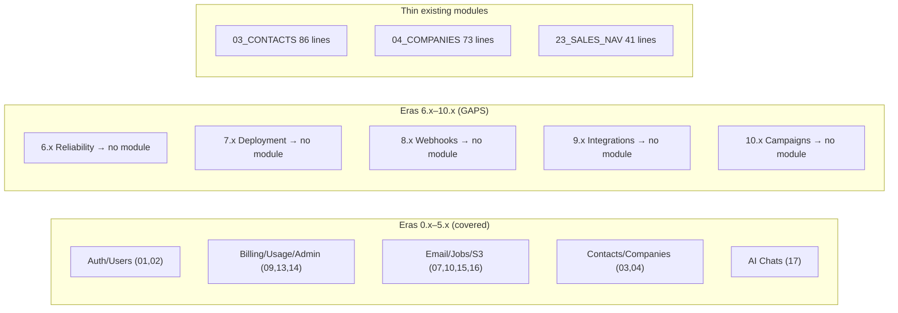
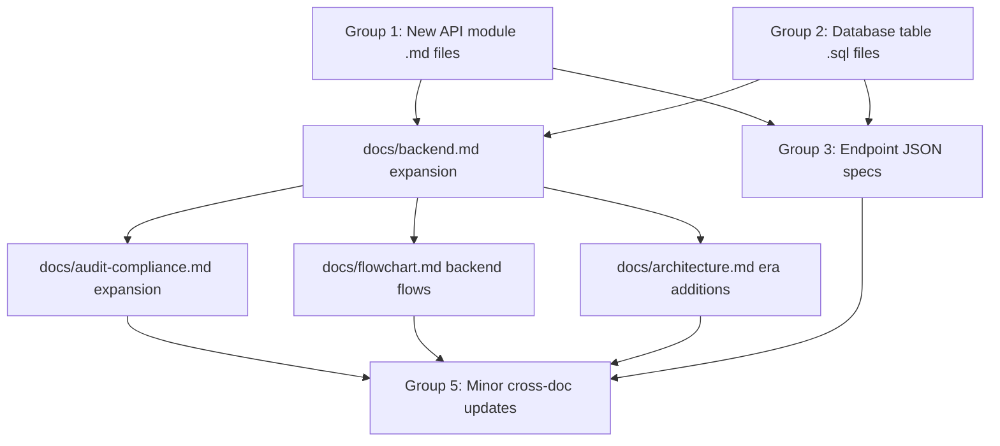

# Backend Documentation Expansion (0.x–10.x)

## Current state vs gaps

**Key files and sizes:**

- `[docs/backend.md](docs/backend.md)` — only 88 lines; needs major expansion
- `[docs/audit-compliance.md](docs/audit-compliance.md)` — only 32 lines; Era 7.x stub only
- `[docs/backend/apis/README.md](docs/backend/apis/README.md)` — 340 lines; needs new modules registered
- `[docs/backend/database/tables/README.md](docs/backend/database/tables/README.md)` — 111 lines; needs new era tables
- `[docs/backend/endpoints/endpoints_index.json](docs/backend/endpoints/endpoints_index.json)` — 5293 lines, 156 endpoints; needs campaign/webhook/integration entries
- `[docs/flowchart.md](docs/flowchart.md)` — 476 lines; only frontend flows, no backend API sequence diagrams

---

## Group 1 — New API module docs (`docs/backend/apis/`)

Numbered gaps in the existing sequence: **06, 12, 20, 22, 24, 25**.

- **Task 1a** — Create `06_WEBHOOKS_MODULE.md` (Era 8.x): signed event delivery, retry, DLQ, `subscribe`, `listWebhooks`, `deleteWebhook`; operations map to `docs/webhooks-replay.md`
- **Task 1b** — Create `20_INTEGRATIONS_MODULE.md` (Era 9.x): CRM connector pattern, OAuth app registration, `listIntegrations`, `connectIntegration`, `syncContacts`; maps to `docs/connectors-commercial.md`
- **Task 1c** — Create `22_CAMPAIGNS_MODULE.md` (Era 10.x): campaign CRUD (`createCampaign`, `updateCampaign`, `scheduleCampaign`, `pauseCampaign`, `listCampaigns`); maps to `docs/campaign-foundation.md` + `docs/campaign-execution-engine.md`
- **Task 1d** — Create `24_SEQUENCES_MODULE.md` (Era 10.x): drip sequences (`createSequence`, `enrollContacts`, `listSequences`, `upsertSequenceStep`)
- **Task 1e** — Create `25_CAMPAIGN_TEMPLATES_MODULE.md` (Era 10.x): template CRUD (`saveTemplate`, `listTemplates`, `renderPreview`, `duplicateTemplate`)
- **Task 1f** — Expand `03_CONTACTS_MODULE.md` (86 → ~400 lines): full VQL input schema, filter fields, sort options, pagination, bulk-upsert, export operations, Connectra service contract
- **Task 1g** — Expand `04_COMPANIES_MODULE.md` (73 → ~300 lines): same treatment as contacts
- **Task 1h** — Expand `23_SALES_NAVIGATOR_MODULE.md` (41 → ~200 lines): `saveProfiles`, `getSyncStatus`, `listSyncJobs`, rate limits, Era 4.x service contract
- **Task 1i** — Update `apis/README.md`: add new modules to Module file list, Module Index, and era tagging

---

## Group 2 — New database table specs (`docs/backend/database/tables/`)

- **Task 2a** — Create `campaigns.sql` (Era 10.x): `id`, `user_id → users.uuid`, `name`, `status` enum, `template_id`, `audience_filter` JSONB, `scheduled_at`, `sent_at`, `stats` JSONB
- **Task 2b** — Create `campaign_sequences.sql` (Era 10.x): `id`, `campaign_id`, `step_order`, `delay_days`, `template_id`, `exit_on_reply` bool
- **Task 2c** — Create `campaign_templates.sql` (Era 10.x): `id`, `user_id`, `name`, `subject`, `body_html`, `variables` JSONB, `track_opens`, `track_clicks`
- **Task 2d** — Create `webhooks.sql` (Era 8.x): `id`, `user_id`, `url`, `events` text[], `secret_hash`, `active`, `last_triggered_at`
- **Task 2e** — Create `integrations.sql` (Era 9.x): `id`, `user_id`, `provider` enum (salesforce, hubspot, zapier…), `access_token_enc`, `refresh_token_enc`, `expires_at`, `config` JSONB, `status`
- **Task 2f** — Update `enums.sql`: add `campaign_status` (draft/scheduled/sending/sent/paused/failed), `webhook_event_type`, `integration_provider`
- **Task 2g** — Update `tables/README.md`: register all new tables, link to API module docs

---

## Group 3 — New endpoint JSON specs (`docs/backend/endpoints/`)

Create per-operation JSON files following the existing pattern (same schema as `count_contacts_graphql.json`):

- **Task 3a** — Campaign endpoints: `mutation_create_campaign.json`, `mutation_schedule_campaign.json`, `mutation_pause_campaign.json`, `query_list_campaigns.json`, `query_get_campaign.json`
- **Task 3b** — Sequence endpoints: `mutation_create_sequence.json`, `mutation_enroll_contacts_sequence.json`, `query_list_sequences.json`
- **Task 3c** — Template endpoints: `mutation_save_campaign_template.json`, `query_list_campaign_templates.json`, `query_render_template_preview.json`
- **Task 3d** — Webhook endpoints: `mutation_create_webhook.json`, `query_list_webhooks.json`, `mutation_delete_webhook.json`
- **Task 3e** — Integration endpoints: `mutation_connect_integration.json`, `query_list_integrations.json`, `mutation_sync_integration.json`
- **Task 3f** — Update `endpoints_index.json`: append new entries, bump `total`, update `version`/`last_updated`

---

## Group 4 — Top-level backend docs (major expansions)

### `docs/backend.md` (88 → ~400 lines)

Add era-by-era backend surface table covering:

- GraphQL modules per era
- Database tables per era
- Lambda/service entrypoints per era
- Backend data flows per era (short Mermaid per major era)

### `docs/audit-compliance.md` (32 → ~200 lines)

Expand with:

- Full Era 7.x RBAC matrix table (roles → permissions)
- Audit event table schema
- Data lifecycle runbook per data class
- 2FA enforcement flows
- Tenant isolation model (Era 9.x)
- Planned: append-only audit log stream

### `docs/flowchart.md` (476 → ~700 lines)

Add new section **"Backend API sequence diagrams (by era)"** with Mermaid `sequenceDiagram` blocks:

- **1.x** — Login + credit deduction flow
- **2.x** — Email finder → pattern gen → Go path → credit deduct → activity log
- **3.x** — VQL query → Connectra → ES → PG hydrate
- **5.x** — AI chat → HF inference → SSE stream → activity log
- **10.x** — Campaign: create → schedule → worker → Mailvetter → delivery → stats

### `docs/architecture.md` (224 → ~350 lines)

Add to **"Execution architecture by era"** section:

- `6.x`–`10.x` backend architecture bullets (SLO gates, RBAC model, API versioning, connector framework, campaign engine)
- Update service register table with campaign/webhook/integration services

---

## Group 5 — Minor cross-doc updates

- **Task 5a** — `docs/governance.md`: add era code maps for 8.x (webhooks), 9.x (integrations), 10.x (campaigns) — follow the `Stage 1.4` pattern already used
- **Task 5b** — `docs/codebase.md`: add code pointers in `### 8.x`, `### 9.x`, `### 10.x` subsections for new service files
- **Task 5c** — `docs/docsai-sync.md` "Extended docs sync scope": register new module docs for sync
- **Task 5d** — `docs/frontent.md` "GraphQL services catalog": add `campaignService`, `sequenceService`, `templateService`, `webhookService`, `integrationService`
- **Task 5e** — `docs/versions.md`: ensure 10.x campaign release entries exist (currently planned) with proper roadmap mapping fields
- **Task 5f** — `docs/roadmap.md`: add service-level code pointers under Stage 10.1–10.5 bullets (pattern mirrors `Stage 2.1–2.3` code map in governance)
- **Task 5g** — `docs/backend/postman/README.md`: add rows for new Postman collections (campaigns, webhooks, integrations)

---

## Execution order

Groups 1 and 2 are independent and can be executed in parallel. Group 3 depends on Groups 1 and 2 (uses their operation names). Group 4 depends on Groups 1–3 for accurate references. Group 5 is last (references everything).