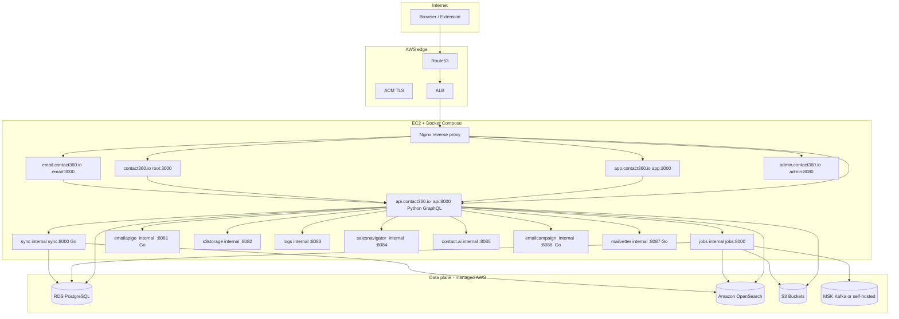

# Contact360 Full Consolidation Plan

## Target Architecture




---

## Phase 0 — Security and hygiene (P0, do first)

**Problem:** Multiple `.env` files with real credentials committed. Real API keys, DB passwords, AWS creds in `samconfig.toml`, `.env`, `.example.env`.

- Add `**/.env`, `**/samconfig.toml`, `**/*.exe`, `**/db.sqlite3` to root `.gitignore`
- Rotate all leaked credentials: AWS keys (`AKIAQWV3TPUB`*), DB passwords, JWT secrets, API keys in `backend(dev)/contact.ai/samconfig.toml`, `contact360.io/admin/.env`, `contact360.io/api/.env`, `backend(dev)/email campaign/.env`, `backend(dev)/salesnavigator/.example.env`
- Create `.env.example` files for every service that lacks them (`contact360.io/email`, `lambda/emailapigo`, `backend(dev)/salesnavigator`, `backend(dev)/contact.ai`, `contact360.io/api` full version)
- Remove committed `connectra.exe` binary and `db.sqlite3` from `contact360.io/admin`
- Fix Go module names: `vivek-ray` in `contact360.io/sync/go.mod` → `contact360.io/sync`; `github.com/RajRoy75/email-campaign` → `contact360.io/emailcampaign`

---

## Phase 1 — Redis out, PostgreSQL in

**Services affected:** `contact360.io/api`, `contact360.io/api/docker-compose.yml` (still has Redis service), `backend(dev)/email campaign` (Asynq hardcoded `localhost:6379`), `contact360.io/admin` (optional Redis).

### 1.1 GraphQL API idempotency + upload sessions

- `[contact360.io/api/app/core/middleware.py](contact360.io/api/app/core/middleware.py)` — `GraphQLIdempotencyMiddleware._cache` uses in-memory dict; when `REDIS_URL` is set, falls back to Redis. Replace Redis branch with async PostgreSQL table (`idempotency_replays` with `operation_name`, `idempotency_key`, `response_blob`, `expires_at`, unique constraint).
- `[contact360.io/api/app/services/upload_session_manager.py](contact360.io/api/app/services/upload_session_manager.py)` — `RedisUploadSessionManager` class; add `PostgresUploadSessionManager` mirroring the same interface, backed by `upload_sessions` table.
- New Alembic migrations for both tables with index on `expires_at` and a TTL purge job.
- Remove `REDIS_URL`, `ENABLE_REDIS_CACHE`, `UPLOAD_SESSION_USE_REDIS` from config once replaced.

### 1.2 docker-compose cleanup

- `[contact360.io/api/docker-compose.yml](contact360.io/api/docker-compose.yml)` — remove `redis` and `mongodb` services; they were not used in production paths.
- Remove `MONGODB_URL` default from environment block in same file.
- `[contact360.io/admin/docker-compose.yml](contact360.io/admin/docker-compose.yml)` — commented-out Redis is fine; confirm `USE_REDIS_CACHE=False` is default and document.

### 1.3 Email campaign queue (Asynq → PostgreSQL or env-configurable)

- `[backend(dev)/email campaign/cmd/main.go](backend(dev)`/email campaign/cmd/main.go) and `[cmd/worker/main.go](backend(dev)`/email campaign/cmd/worker/main.go) — `asynq.RedisClientOpt{Addr: "localhost:6379"}` hardcoded in both files.
- Read `REDIS_ADDR` from env at minimum; longer-term migrate queue to `pgmq` or Kafka if Redis is fully removed from the deployment.

---

## Phase 2 — Python backends → Go Gin (long-term, phased)

This is a multi-quarter program. Plan only the **immediate phase** here.

### 2.1 Module / naming cleanup (immediate)

- Rename Go module in `[contact360.io/sync/go.mod](contact360.io/sync/go.mod)`: `vivek-ray` → `contact360.io/sync`
- Rename Go module in `backend(dev)/email campaign/go.mod`: `github.com/RajRoy75/email-campaign` → `contact360.io/emailcampaign`
- Remove dead `[contact360.io/sync/clients/mongo.go](contact360.io/sync/clients/mongo.go)` and `go.mongodb.org/mongo-driver` dep from `go.mod`

### 2.2 Connectra (already Go — harden only)

- `[contact360.io/sync/cmd/server.go](contact360.io/sync/cmd/server.go)` line 65 TODO: implement real `/health` that pings PostgreSQL + OpenSearch
- `[contact360.io/sync/middleware/rateMiddleware.go](contact360.io/sync/middleware/rateMiddleware.go)` — replace global token bucket with per-API-key PostgreSQL-backed counter or pass-through until 6.x
- Add `X-Request-ID` middleware (TODO on line 70 of server.go)
- Add `X-RateLimit-`* response headers on 429

### 2.3 Lambdas → Go (per-service, each is independent)

- `lambda/emailapigo` — already Go Gin; add missing `samconfig` → Docker
- `lambda/logs.api` — Python FastAPI + MongoDB; port to Go Gin + migrate logs to PostgreSQL or keep MongoDB but containerize properly
- `lambda/s3storage` — Python FastAPI; port to Go Gin for S3 presigned URLs and multipart (simple surface)
- `backend(dev)/salesnavigator` — Python Mangum scraper; port scraping logic to Go with `colly`/`chromedp`
- `backend(dev)/contact.ai` — keep Python for HF inference; expose via stable HTTP from Go proxy if needed
- `backend(dev)/email campaign` — already Go; just needs module rename + env cleanup
- `backend(dev)/mailvetter` — Go process + PostgreSQL; the `mailvetter-bak` is the reference implementation; promote to active

### 2.4 Python services stay for now

- `contact360.io/api` (Python FastAPI + Strawberry) — stays as GraphQL hub; Go migration is a future major
- `contact360.io/jobs` (Python FastAPI + Kafka) — stays; Go port is 3.x era work
- `contact360.io/admin` (Django) — stays; Next.js admin rewrite is a future major

---

## Phase 3 — Frontend standardization on Next.js

### 3.1 Already Next.js — env + codegen alignment

- All four apps (`app`, `root`, `email`, `frontend(dev)/resume`) set `NEXT_PUBLIC_GRAPHQL_URL=https://api.contact360.io/graphql`
- Fix `[contact360.io/app/.env.example](contact360.io/app/.env.example)` line 10 — raw private IP → DNS placeholder
- Fix `[contact360.io/email/src/lib/utils.ts](contact360.io/email/src/lib/utils.ts)` — `BACKEND_URL` non-null asserted; move email app calls through GraphQL mutations (auth: `login`, `signup`, `logout`) or document REST as an intentional IMAP exception with a proper `.env.example`

### 3.2 Vite → Next.js (frontend(dev)/joblevel)

- Inventory routes in `frontend(dev)/joblevel/src` (react-router-dom)
- Create `frontend(dev)/joblevel-next/` as App Router project
- Re-implement pages as Next.js routes; replace `axios` direct calls with `graphqlQuery`/`graphqlMutation` from shared client
- Delete old Vite project once parity confirmed

### 3.3 Extension — auth unification

- `[extension/contact360/auth/graphqlSession.js](extension/contact360/auth/graphqlSession.js)` — already calls `api.contact360.io/graphql` for token refresh; keep this path
- `[extension/contact360/utils/lambdaClient.js](extension/contact360/utils/lambdaClient.js)` — 558-line direct HTTP client; progressively move operations to GraphQL mutations returning signed URLs or job IDs; lambdaClient becomes a legacy wrapper only for presigned S3 operations
- Fix `manifest.json` overly broad `host_permissions`; remove hardcoded IP in `CONNECTRA_API_URL`

---

## Phase 4 — SAM → Docker (de-Lambdify)

### 4.1 Services already partially Dockerized

- `contact360.io/api` — Dockerfile exists; multi-stage Python ✓
- `contact360.io/jobs` — Dockerfile exists; single-stage Python (upgrade to multi-stage)
- `contact360.io/sync` — Dockerfile exists; Go binary multi-stage ✓
- `contact360.io/admin` — Dockerfile exists
- `backend(dev)/contact.ai` — Dockerfile exists

### 4.2 Add missing Dockerfiles

- `contact360.io/root` — Next.js multi-stage (`node:20-alpine` builder + `node:20-alpine` runner with `standalone` output)
- `contact360.io/app` — same pattern
- `contact360.io/email` — same pattern
- `lambda/emailapigo` — Go binary multi-stage
- `lambda/s3storage` — Python FastAPI (or Go port, see Phase 2.3)
- `backend(dev)/salesnavigator` — Python FastAPI
- `backend(dev)/email campaign` — Go binary multi-stage
- `backend(dev)/mailvetter` — Go binary multi-stage

### 4.3 Unified docker-compose.prod.yml

Create `docker-compose.prod.yml` at repo root with all services on one Docker bridge network. Key service names and internal ports:


| Container              | Internal host    | Port   | Notes             |
| ---------------------- | ---------------- | ------ | ----------------- |
| `root`                 | `root`           | 3000   | Next.js SSR/SSG   |
| `app`                  | `app`            | 3000   | Next.js dashboard |
| `email`                | `email`          | 3000   | Next.js Mailhub   |
| `api`                  | `api`            | 8000   | Python GraphQL    |
| `jobs`                 | `jobs`           | 8000   | Python job API    |
| `scheduler-first-time` | —                | —      | worker process    |
| `scheduler-retry`      | —                | —      | worker process    |
| `consumer`             | —                | —      | Kafka consumer    |
| `sync`                 | `sync`           | 8000   | Go Connectra      |
| `emailapigo`           | `emailapigo`     | 8081   | Go email API      |
| `s3storage`            | `s3storage`      | 8082   | S3 service        |
| `logs`                 | `logs`           | 8083   | logs API          |
| `salesnavigator`       | `salesnavigator` | 8084   | SN scraper        |
| `contact_ai`           | `contact_ai`     | 8085   | AI assistant      |
| `emailcampaign`        | `emailcampaign`  | 8086   | campaign engine   |
| `mailvetter`           | `mailvetter`     | 8087   | email verifier    |
| `admin`                | `admin`          | 8080   | Django admin      |
| `nginx`                | —                | 80/443 | reverse proxy     |


### 4.4 Repoint Python config from Lambda/SAM URLs to internal Docker names

- `[contact360.io/api/app/core/config.py](contact360.io/api/app/core/config.py)` — replace EC2 IP defaults:
  - `CONNECTRA_BASE_URL` → `http://sync:8000`
  - `TKDJOB_API_URL` → `http://jobs:8000`
  - `LAMBDA_EMAIL_API_URL` → `http://emailapigo:8081`
  - `LAMBDA_S3STORAGE_API_URL` → `http://s3storage:8082`
  - `LAMBDA_LOGS_API_URL` → `http://logs:8083`
  - `LAMBDA_SALES_NAVIGATOR_API_URL` → `http://salesnavigator:8084`
  - `LAMBDA_AI_API_URL` → `http://contact_ai:8085`
- Decommission SAM stacks after cutover (remove `samconfig.toml` files)

### 4.5 Nginx reverse proxy configuration

Create `nginx/nginx.prod.conf`:

```
server { server_name contact360.io; proxy_pass http://root:3000; }
server { server_name app.contact360.io; proxy_pass http://app:3000; }
server { server_name api.contact360.io; proxy_pass http://api:8000; }
server { server_name email.contact360.io; proxy_pass http://email:3000; }
server { server_name admin.contact360.io; proxy_pass http://admin:8080; }
```

TLS via ACM on ALB (preferred) or certbot/Let's Encrypt on EC2.

---

## Phase 5 — Data plane (AWS managed services)

### 5.1 PostgreSQL (RDS)

- Single RDS PostgreSQL 16 instance in private subnet; same VPC as EC2
- Two logical databases: `contact360` (main) and `tkdjob` (jobs scheduler)
- Security group: allow 5432 from EC2 security group only
- Automated backups, 7-day retention
- `contact360.io/api` uses `DATABASE_URL`; `contact360.io/jobs` uses `DATABASE_URL` + `CONTACT360_DATABASE_URL`

### 5.2 OpenSearch

- Amazon OpenSearch Service domain in VPC (same subnet group as RDS)
- Indices: contacts, companies, job exports
- Security group: allow 443 from EC2 SG only
- Fine-grained access; master user via Secrets Manager
- `contact360.io/jobs` docker-compose already maps `OPENSEARCH_*` and `CONTACT360_OPENSEARCH_*` env vars

### 5.3 S3

- Bucket: `contact360-uploads` (multipart, user files, CSV exports)
- Bucket: `contact360-static` (Next.js assets if using S3 static hosting via CloudFront)
- Bucket: `contact360-logs` (structured log exports from logs service)
- IAM instance profile on EC2 with scoped S3 permissions; no hardcoded AWS keys in containers
- Remove `S3_ACCESS_KEY` / `S3_SECRET_KEY` from compose if instance profile is used

### 5.4 Kafka

- Amazon MSK (or self-hosted in docker-compose for dev)
- Topics: `jobs`, `email-events`, `contact-events`
- Consumed by `jobs/consumer`, `emailcampaign`

---

## Phase 6 — Ops, CI/CD, and docs

### 6.1 GitHub Actions

- `.github/workflows/ci.yml` already exists with PostgreSQL service; extend to run `go test ./...` for Go services and `vitest` for Next.js
- Add `docker build` validation step per service
- Add `docker push` to ECR on merge to main

### 6.2 Health checks

- All services: `GET /health` must return `{"status":"ok"}` plus dependency pings
- `[contact360.io/sync/cmd/server.go](contact360.io/sync/cmd/server.go)` line 65 — deepen to PG + OpenSearch ping
- `contact360.io/jobs/docker-compose.yml` schedulers healthcheck is `sys.exit(0)` (always passes) — fix to check process state
- `contact360.io/jobs/docker-compose.yml` API healthcheck uses `/docs` — change to `/health/ready`

### 6.3 Secrets management

- Store all secrets in **AWS Secrets Manager** or **SSM Parameter Store**
- `docker-compose.prod.yml` reads from `${VAR}` — populate from SSM at deploy time via `aws ssm get-parameters` in startup script or use ECS secrets injection if using ECS

### 6.4 Docs update

- Update `docs/backend.md`, `docs/architecture.md` with new service URLs
- Update `docs/7. Contact360 deployment/README.md` with Docker runbook
- Run `python cli.py audit-tasks --era 7` to surface remaining deployment doc gaps

