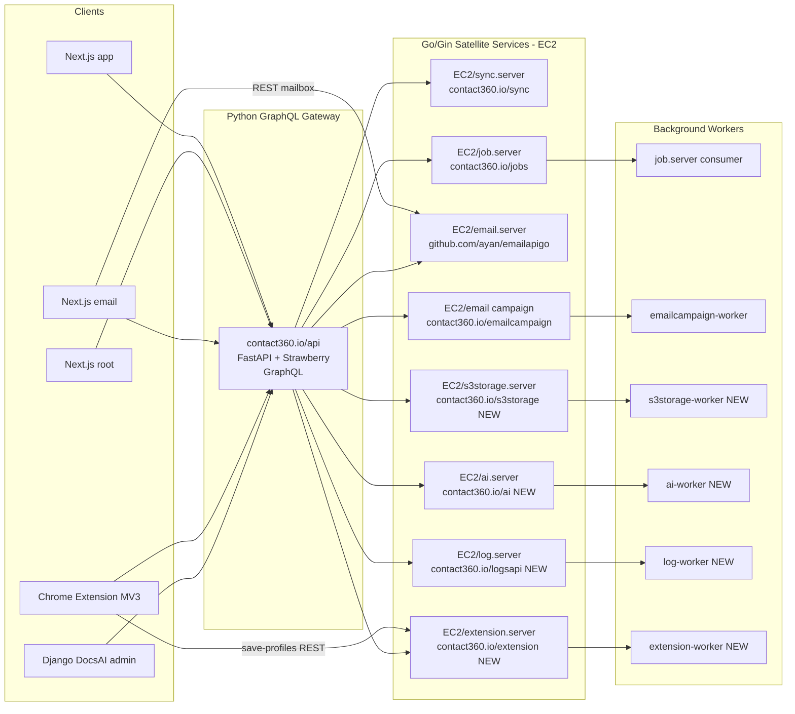

# Contact360 Full System Plan

## System Architecture (target state)




---

## Part 1 — Go/Gin Backend Services (`EC2/`)

### 1-A: Rename `job.server` module

**Problem:** `EC2/job.server/go.mod` uses module `vivek-ray` instead of `contact360.io/jobs`.

**Files:**

- `[EC2/job.server/go.mod](EC2/job.server/go.mod)` — change `module vivek-ray` → `module contact360.io/jobs`
- All `*.go` files under `EC2/job.server/` — update import paths
- Add missing `Dockerfile` (copy pattern from `[EC2/email campaign/Dockerfile](EC2/email campaign/Dockerfile)`)

### 1-B: `job.server` feature completion

**Source reference:** `backend(dev)/jobs/`

Missing vs Python source:

- `GET /health/live`, `GET /health/ready` (only `GET /health` exists)
- `GET /api/v1/jobs/{uuid}` (only `GET /jobs/` and bulk-insert exist)
- `POST /api/v1/jobs/email-export`, `contact360-import`, `contact360-export` convenience DAG builders
- Worker pool inside consumer (currently inline `switch job.JobType` with TODO)
- Stale `processing` recovery loop (`PROCESSING_TIMEOUT`)
- Per-job execution timeout
- `job_events` table writes on state transitions
- `Processor` interface + registry keyed by `job_type`
- Prometheus metrics endpoint

**Key files to create/extend:**

- `EC2/job.server/server/routes.go` — add missing routes
- `EC2/job.server/jobs/consumers/base.go` — add worker pool (`chan` + N goroutines)
- `EC2/job.server/models/` — add `job_event.go` + repo
- `EC2/job.server/Dockerfile` — new, multi-stage

### 1-C: NEW `EC2/s3storage.server/`

**Source reference:** `backend(dev)/s3storage/`

Structure mirrors `[EC2/email campaign/](EC2/email campaign/)`:

```
EC2/s3storage.server/
├── cmd/api/main.go         -- Gin server
├── cmd/worker/main.go      -- Asynq worker
├── internal/config/        -- S3STORAGE_* env vars
├── internal/s3store/       -- AWS SDK v2: PutObject, GetObject, ListObjects, HeadBucket
├── internal/csv/           -- CSV read/write, field ordering, hourly-key helpers
├── internal/metadata/      -- Port metadata_job.py: HEAD, range-read, sniff, row-count
├── internal/api/router.go  -- /api/v1: health, buckets, files, uploads, analysis, avatars
├── go.mod                  -- module contact360.io/s3storage
└── Dockerfile
```

**Key contracts to match:**

- `POST /api/v1/uploads/initiate-csv` — multipart, with `X-Idempotency-Key`
- `GET /api/v1/uploads/{id}/parts/{n}` — presigned URL
- `POST /api/v1/uploads/{id}/complete`, `DELETE .../abort`
- `GET /api/v1/analysis/…` — schema, stats (port csv_analysis.py)
- `GET /api/v1/avatars/…`
- Worker task type: `storage:metadata` — enqueue after upload complete

### 1-D: NEW `EC2/ai.server/`

**Source references:** `backend(dev)/contact.ai/` + `backend(dev)/resumeai/`

Structure:

```
EC2/ai.server/
├── cmd/api/main.go         -- Gin server
├── cmd/worker/main.go      -- Asynq worker (heavy resume/ATS tasks)
├── internal/config/        -- HF_API_KEY, HF_CHAT_MODEL, HF_FALLBACK_MODELS, etc.
├── internal/hf/            -- HF router client: /v1/chat/completions, /v1/embeddings
│   ├── client.go           -- non-stream + stream, retry 503/429, model fallback
│   └── rag.go              -- chunk text, embed batch, cosine similarity
├── internal/api/router.go  -- routes below
├── internal/db/            -- ai_chats Postgres repo (sqlc or bun)
└── Dockerfile
```

**HF endpoint (from both codebases):**
`https://router.huggingface.co/v1/chat/completions`
`https://router.huggingface.co/v1/embeddings`

**Routes to implement (priority order):**

1. `GET /health`, `GET /health/ready`
2. `POST /ai/email/analyze` — email risk JSON
3. `POST /ai/company/summary` — company summary
4. `POST /ai/filters/parse` — NL → filter JSON
5. `POST /ai-chats/` CRUD + `/message` + `/message/stream` (SSE)
6. Worker: `ai:resume_parse`, `ai:ats_score` for heavy resume flows

### 1-E: NEW `EC2/log.server/`

**Source reference:** `backend(dev)/logs.api/`

Structure:

```
EC2/log.server/
├── cmd/api/main.go
├── cmd/worker/main.go      -- TTL sweeper + write-behind flush
├── internal/config/        -- API_KEY, S3_BUCKET_NAME, AWS_REGION
├── internal/s3store/       -- PutObject, GetObject, ListObjectsV2, DeleteObject, HeadBucket
├── internal/csvlog/        -- CSV write/read, field order, hourly key, append (with mutex)
├── internal/api/router.go  -- routes below
└── Dockerfile
```

**Critical design decision:** `append_logs_to_csv` is read-modify-write — Go port must use per-bucket mutex OR single-writer channel per hourly key to avoid lost rows.

**Routes:**

- `POST /logs` — single log
- `POST /logs/batch` — max 100
- `GET /logs` — filter + paginate
- `GET /logs/search` — full-text over CSV
- `GET /logs/{id}`, `PUT /logs/{id}`, `DELETE /logs/{id}`
- `POST /logs/delete` — bulk delete by body

**Worker tasks:** `logs:flush` (write-behind batch), `logs:sweep` (TTL purge)

### 1-F: NEW `EC2/extension.server/`

**Source reference:** `backend(dev)/salesnavigator/`

Structure:

```
EC2/extension.server/
├── cmd/api/main.go
├── cmd/worker/main.go      -- bounded parallel Connectra chunks
├── internal/config/        -- API_KEY, CONNECTRA_API_URL, CONNECTRA_API_KEY
├── internal/connectra/     -- HTTP client with tenacity-equivalent retry
├── internal/mapper/        -- port mappers.py, normalization.py, utils.py
├── internal/api/router.go  -- /v1/save-profiles, /v1/scrape (optional)
└── Dockerfile
```

**Priority:** `POST /v1/save-profiles` — profile dedup, map, chunk (500), parallel contacts + companies via Connectra.
**Optional/defer:** `POST /v1/scrape` (BeautifulSoup → goquery, fragile; document as "parse in extension, not server").

---

## Part 2 — Documentation Updates

### 2-A: Canonical Hub Files (edit first, derive others from these)

**Files to update:**

1. `[docs/docs/architecture.md](docs/docs/architecture.md)`
  - Add **"Request paths"** subsection with the mermaid diagram above
  - Update **Service register** table: add EC2 targets (`s3storage.server`, `ai.server`, `log.server`, `extension.server`) with current lang = Python → target = Go
  - Update **Canonical service ownership** table language column
2. `[docs/docs/backend-language-strategy.md](docs/docs/backend-language-strategy.md)`
  - Add **"Satellite migration inventory"** table: service, current lang, target Go, blocker, evidence link
  - Remove `logs.api`, `s3storage`, `salesnavigator` from "still Python" once Go services ship
3. `[docs/docs/frontend.md](docs/docs/frontend.md)`
  - Add **"Frontend stack policy"** subsection: Next.js-only for web apps; Django DocsAI + Chrome MV3 are explicit exceptions
  - Clarify email REST vs GraphQL split explicitly
4. `[docs/docs/codebase.md](docs/docs/codebase.md)`
  - Add `Primary API entry` column to repo table: GraphQL / REST / mixed
5. `[docs/docs/backend.md](docs/docs/backend.md)`
  - Add **"Orchestration pattern"** paragraph: Python gateway as facade to Go satellites
6. `[docs/docs/flowchart.md](docs/docs/flowchart.md)`
  - Update **"Core request flow"** mermaid to include new EC2 services and Next.js explicit label
7. `[docs/docs/governance.md](docs/docs/governance.md)`
  - Add rule: new browser-facing data APIs → GraphQL only; exceptions require doc approval
  - Add rule: new HTTP services → Go/Gin by default
8. `[docs/docs/audit-compliance.md](docs/docs/audit-compliance.md)`
  - Add compliance notes for new EC2 services (s3storage, logs, extension, ai)
9. `[docs/docs/docsai-sync.md](docs/docs/docsai-sync.md)`
  - Add sync step when Go service list changes (architecture constants mirror)
10. `[docs/docs/version-policy.md](docs/docs/version-policy.md)` and `[docs/docs/versions.md](docs/docs/versions.md)`
  - No changes unless a migration milestone is scheduled; add only if Go services are version-tagged

### 2-B: Backend Doc Tree

1. `[docs/backend/README.md](docs/backend/README.md)`
  - Registry table: add rows for `s3storage.server`, `ai.server`, `log.server`, `extension.server` pointing to their codebase analyses
    - Note "Target runtime: Go" column
2. `[docs/backend/services.apis/](docs/backend/services.apis/)`
  - Add or update `s3storage.api.md`, `logsapi.api.md`, `contact.ai.api.md`, `salesnavigator.api.md` with Go target notes
3. `[docs/backend/endpoints/](docs/backend/endpoints/)`
  - Update `*_endpoint_era_matrix` files for new Go services when routes finalize

### 2-C: Frontend Doc Tree

1. `[docs/frontend/README.md](docs/frontend/README.md)`
  - Already has 3 Next.js rows; add explicit "Django admin = exception, extension = MV3" row

### 2-D: Main Hub

1. `[docs/README.md](docs/README.md)`
  - Service consolidation table: align Stack column with target Go for 5 services
    - Add connection column: GraphQL / mixed / internal

---

## Part 3 — Era Task Normalization (Python CLI)

### 3-A: Baseline scan (read-only, run first)

```bash
cd docs
python cli.py scan
python cli.py audit-tasks          # full tree gaps
python cli.py task-report          # all eras
python cli.py name-audit           # filename hygiene
```

### 3-B: Per-era CLI pass (eras 0–10, sequential)

For each era N:

```bash
python cli.py era-guide --era N                    # read master docs
python cli.py task-report --era N                  # see which files need tracks
python cli.py audit-tasks --era N                  # find empty/missing/dup
python cli.py fill-tasks --era N                   # DRY-RUN, review output
python cli.py fill-tasks --era N --apply           # only after dry-run approval
python cli.py dedup-tasks --era N                  # DRY-RUN
python cli.py dedup-tasks --era N --apply
python cli.py name-audit --era N                   # filename check
python cli.py rename-docs --era N                  # DRY-RUN, then --apply if needed
```

### 3-C: Evidence-backed task completion (per era, human-driven)

**Template per completed bullet** (to add in the task file):

```markdown
- [x] <task description>
  - Evidence: <code path OR test command + result>
  - API: <GraphQL operation OR REST route + status + key response fields>
  - Tests: <pytest/go test scope; green on commit XYZ or CI job name>
  - Done because: <one sentence reason>
```

**Era-to-evidence mapping:**


| Era | Contract evidence                              | Test evidence                            |
| --- | ---------------------------------------------- | ---------------------------------------- |
| 0   | Compose health, CI yml                         | `docker compose config`, smoke health    |
| 1   | `14_BILLING_MODULE.md`, `09_USAGE_MODULE.md`   | Billing + credit integration tests       |
| 2   | `15_EMAIL_MODULE.md`, bulk endpoints           | Email pipeline + bulk job tests          |
| 3   | `03_CONTACTS_MODULE.md`, VQL contract          | Search, import/export tests              |
| 4   | `23_SALES_NAVIGATOR_MODULE.md`, extension save | Extension contract + save-profiles tests |
| 5   | `17_AI_CHATS_MODULE.md`, HF chat/embed         | AI service tests, rate-limit behavior    |
| 6   | SLO baselines, idempotency spec                | Load/retry/chaos tests                   |
| 7   | Deploy runbooks, RBAC matrix                   | Staged deploy checklist, authz tests     |
| 8   | Public API matrices, compat suite              | Contract tests, partner compat           |
| 9   | Webhook + entitlement contracts                | Integration + security tests             |
| 10  | Campaign send/track contracts                  | Campaign worker tests                    |


### 3-D: Status promotion

After evidence is attached per era:

```bash
python cli.py update --status completed --era N --dry-run
python cli.py update --status completed --era N   # after review
```

Sync hubs per `docs/docs/governance.md` rule: when any era file changes status, update `docs/docs/versions.md` + `docs/docs/roadmap.md` in the same change set.

---

## Execution Order

1. **Part 1-A** — Fix `job.server` module name (unblocks correct imports for 1-B)
2. **Part 1-B** — Complete `job.server` feature gaps
3. **Part 1-C through 1-F** — Create 4 new EC2 services (can be done in parallel)
4. **Part 2-A** — Update canonical hub docs (architecture, frontend, strategy, governance)
5. **Part 2-B through 2-D** — Backend/frontend/hub sub-docs
6. **Part 3-A** — CLI baseline scan
7. **Part 3-B** — Per-era CLI structural normalization (eras 0–10)
8. **Part 3-C through 3-D** — Evidence attachment and status promotion per era

