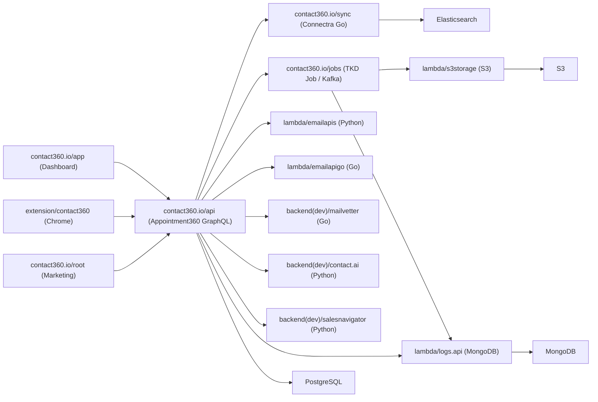
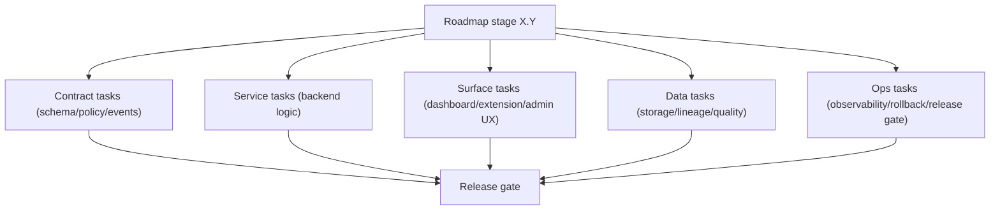

# Contact360 Master Plan — All Eras (0.x.x to 10.x.x)

## Important alignment note

Your thematic ordering differs from the official `docs/VERSION Contact360.md` numbering in several eras. The plan below uses **your themes as the intent** and maps them to the correct official stages, services, and code paths.

| Your theme                        | Official label                 | Official stages          |
| --------------------------------- | ------------------------------ | ------------------------ |
| 0.x.x Foundation                  | 0.x.x Foundation               | pre-`1.0.0` work         |
| 1.x.x User + Billing + Credits    | 1.x.x MVP core                 | 1.1, 1.2, 1.8, 1.10–1.14 |
| 2.x.x Email system                | overlaps 1.x + 2.x (Connectra) | 1.4, 1.5, 1.6, 1.8       |
| 3.x.x Contact + Company data      | 2.x.x Connectra intelligence   | 2.1–2.4                  |
| 4.x.x Extension + Sales Navigator | 3.x.x Extension maturity       | 3.1–3.4                  |
| 5.x.x AI workflows                | 4.x.x AI workflow era          | 4.1–4.4                  |
| 6.x.x Reliability and Scaling     | 5.x.x Reliability and scale    | 5.1–5.9                  |
| 7.x.x Deployment                  | 6.x.x Enterprise readiness     | 6.1–6.9                  |
| 8.x.x Public + private APIs       | 8.x.x Integration ecosystem    | 8.1–8.9                  |
| 9.x.x Ecosystem + Productization  | 7.x.x–9.x.x bridge             | 7.x, 8.x, 9.x            |
| 10.x.x Email campaign             | 10.x.x Unified platform        | 10.1–10.9                |

## System architecture (reference for all eras)

## Five-track decomposition (used in every era)

Every stage task follows: **Contract → Service → Surface → Data → Ops**

---

## ERA 0 — Foundation and pre-product stabilization

**Official label:** `0.x.x` · **Released:** `0.1.0` (historical)  
**Primary paths:** all monorepo scaffolding

### Smaller tasks

- **Contract:** Define canonical repo layout, naming conventions, service skeleton contracts.
- **Service:** Scaffold `contact360.io/{app,api,sync,jobs,admin}`, `lambda/emailapis`, `lambda/logs.api`, `lambda/s3storage`.
- **Surface:** Marketing site shell (`contact360.io/root/`), dashboard skeleton (`contact360.io/app/`).
- **Data:** PostgreSQL schema bootstrap, Elasticsearch index templates, Kafka topic definitions.
- **Ops:** CI pipeline bootstrap, environment config patterns, `docs/` governance structure.
- **DocsAI sync:** Mirror initial architecture into `contact360.io/admin/apps/architecture/constants.py`.

---

## ERA 1 — User, billing, and credit system

**Official label:** `1.x.x MVP core` · **Status:** `1.0.0` released, `1.1.0` in_progress, `1.2.0` planned  
**Key files:**

- `[contact360.io/api/app/graphql/modules/auth/](contact360.io/api/app/graphql/modules/auth/)`
- `[contact360.io/api/app/graphql/modules/billing/](contact360.io/api/app/graphql/modules/billing/)`
- `[contact360.io/api/app/services/billing_service.py](contact360.io/api/app/services/billing_service.py)`
- `[contact360.io/api/app/services/usage_service.py](contact360.io/api/app/services/usage_service.py)`
- `[contact360.io/app/src/lib/featureAccess.ts](contact360.io/app/src/lib/featureAccess.ts)`
- `[contact360.io/app/src/services/graphql/billingService.ts](contact360.io/app/src/services/graphql/billingService.ts)`
- `[contact360.io/api/sql/apis/14_BILLING_MODULE.md](contact360.io/api/sql/apis/14_BILLING_MODULE.md)`
- `[contact360.io/api/sql/apis/09_USAGE_MODULE.md](contact360.io/api/sql/apis/09_USAGE_MODULE.md)`

### Stage 1.1 — Auth system (done in 1.0.0)

- **Contract:** JWT session contract, role claims, RoleContext.
- **Service:** Login/signup handlers in `modules/auth/`, auto-credit assignment (50 credits).
- **Surface:** `app/(auth)/` flows, `RoleContext.tsx`, `AuthContext`.
- **Data:** User rows in PostgreSQL; session tokens.
- **Ops:** Auth failure rate alert.

### Stage 1.2 — Credit management (done in 1.0.0)

- **Contract:** Credit deduction semantics (finder=1 credit, verifier=0), block-at-zero, lapse rules.
- **Service:** `usage_service.py`, `UNLIMITED_CREDITS_ROLES`, monthly reset.
- **Surface:** `featureAccess.ts` gates.
- **Data:** Credit ledger in PostgreSQL.
- **Ops:** Ledger consistency checks.

### Stage 1.8 — Bulk processing (in_progress → 1.1.0)

- **Contract:** `createEmailFinderExport` / `createEmailVerifyExport` GraphQL mutations.
- **Service:** `email_finder_export_stream.py`, `email_verify_export_stream.py` in `contact360.io/jobs/`.
- **Surface:** `useNewExport.ts`, bulk results views.
- **Data:** S3 multipart upload (`lambda/s3storage/`), job state in PostgreSQL.
- **Ops:** Checkpoint/resume recovery; concurrency controls (finder=3, verifier=5).

### Stage 1.10 — Billing and payments (in_progress → 1.1.0)

- **Contract:** `subscribe`, `purchaseAddon`, `submitPaymentProof`, `approvePayment` mutations.
- **Service:** `billing_service.py`, manual payment proof workflow.
- **Surface:** `UpiPaymentModal.tsx`, billing dashboard.
- **Data:** Plan/subscription rows, invoice records in PostgreSQL.
- **Ops:** Payment-to-crediting SLA; failure flow rate.

### Stages 1.11–1.14 — Analytics, notifications, admin, security (planned → 1.2.0)

- **1.11 User analytics:** Usage ledger view, credits summary (`09_USAGE_MODULE.md`).
- **1.12 Notifications:** Low-credit warning, payment-success cues (UI only).
- **1.13 Admin panel:** `contact360.io/admin/` credit/package views, `logs.api` audit trail.
- **1.14 Security baseline:** Rate limiting middleware in `contact360.io/api/app/main.py`.

---

## ERA 2 — Email system (finder, verifier, results, bulk)

**Official overlap:** Stages 1.4, 1.5, 1.6, 1.8  
**Key files:**

- `[lambda/emailapis/](lambda/emailapis/)` — Python orchestration
- `[lambda/emailapigo/](lambda/emailapigo/)` — Go high-throughput finder
- `[backend(dev)/mailvetter/app/mailvetter-bak/](backend(dev)`/mailvetter/app/mailvetter-bak/) — SMTP/DNS verifier
- `[contact360.io/api/app/graphql/modules/email/](contact360.io/api/app/graphql/modules/email/)`
- `[contact360.io/api/sql/apis/15_EMAIL_MODULE.md](contact360.io/api/sql/apis/15_EMAIL_MODULE.md)`

### Smaller tasks

- **Contract:** Normalize finder/verifier response schema: `status`, `confidence`, `provider`, `source`.
- **Service (finder):** 10-pattern generation → parallel Connectra + pattern + generator fetch → race verify → web fallback (Go path in `emailapigo`).
- **Service (verifier):** Mailvetter robust scoring (SMTP, VRFY, domain age, SPF/DMARC, breach count).
- **Service (bulk):** Streaming batch with checkpoint resume; DLQ for partial failures.
- **Surface:** Single-email finder/verifier hooks (`useEmailFinderSingle.ts`, `useEmailVerifierSingle.ts`), bulk result tables.
- **Data:** Activity logs to `logs.api`; finder/verifier cache patterns.
- **Ops:** Finder success rate KPI; verifier classification precision; bulk job success rate.

---

## ERA 3 — Contact and company data system (Connectra)

**Official label:** `2.x.x Connectra intelligence` · **Stages:** 2.1–2.4  
**Key files:**

- `[contact360.io/sync/](contact360.io/sync/)` — Go, Elasticsearch, VQL
- `[contact360.io/api/app/graphql/modules/contacts/](contact360.io/api/app/graphql/modules/contacts/)`
- `[contact360.io/api/app/graphql/modules/companies/](contact360.io/api/app/graphql/modules/companies/)`
- `[contact360.io/api/app/clients/connectra_client.py](contact360.io/api/app/clients/connectra_client.py)`
- `[contact360.io/api/app/utils/vql_converter.py](contact360.io/api/app/utils/vql_converter.py)`

### Smaller tasks

- **Contract (VQL):** Freeze VQL filter taxonomy; define `ListByFilters`, `CountByFilters`, `BulkUpsert` contracts.
- **Service (Connectra):** Dual-write (PostgreSQL + Elasticsearch); filter service; company fallback population.
- **Service (enrichment):** Deduplication rules, merge-on-conflict logic, UUID determinism.
- **Surface (2.4):** Advanced filter UI in dashboard; saved searches; company drill-down views.
- **Data:** Elasticsearch index templates; pg ↔ ES reconciliation jobs; `filter_data` metadata.
- **Ops:** Search precision proxy; P95 query latency; enrichment completeness rate.

---

## ERA 4 — Extension and Sales Navigator maturity

**Official label:** `3.x.x Extension maturity` · **Stages:** 3.1–3.4  
**Key files:**

- `[extension/contact360/](extension/contact360/)` — Chrome extension
- `[backend(dev)/salesnavigator/](backend(dev)`/salesnavigator/) — Python scrape/save
- `[backend(dev)/salesnavigator/app/services/save_service.py](backend(dev)`/salesnavigator/app/services/save_service.py)
- `[backend(dev)/salesnavigator/app/clients/connectra_client.py](backend(dev)`/salesnavigator/app/clients/connectra_client.py)

### Smaller tasks

- **Contract (3.1 auth):** Freeze extension session contract; token refresh protocol in browser context.
- **Service (3.2 ingestion):** `deduplicate_profiles`, `merge_profile_data`, `prepare_profiles_for_save`; adaptive retry to Connectra.
- **Service (3.3 sync integrity):** Deterministic conflict resolution; idempotent `bulk_upsert_contacts/companies`; field-level lineage events.
- **Surface (3.4 telemetry):** Extension error telemetry to `logs.api`; ingestion status UX.
- **Data:** Field precedence rules per source; UUID determinism validation; reconciliation worker.
- **Ops:** Auth failure rate; ingestion records-per-run KPI; sync conflict auto-resolution rate; error triage time.

---

## ERA 5 — AI workflows

**Official label:** `4.x.x AI workflow era` · **Stages:** 4.1–4.4  
**Key files:**

- `[backend(dev)/contact.ai/app/services/ai_chat_service.py](backend(dev)`/contact.ai/app/services/ai_chat_service.py)
- `[backend(dev)/contact.ai/app/services/hf_service.py](backend(dev)`/contact.ai/app/services/hf_service.py)
- `[contact360.io/api/app/graphql/modules/ai_chats/mutations.py](contact360.io/api/app/graphql/modules/ai_chats/mutations.py)`
- `[contact360.io/api/app/clients/lambda_ai_client.py](contact360.io/api/app/clients/lambda_ai_client.py)`

### Smaller tasks

- **Contract (4.1):** AI response envelope (`status`, `error_code`, `model_used`, `latency_ms`); add `confidence`, `explanation` to message contract.
- **Service (chat):** `sendMessage` → `hf_service.generate_chat_response` (HF Inference API); streaming SSE path; model fallback chain.
- **Service (utilities):** `analyzeEmailRisk`, `generateCompanySummary`, `parseContactFilters` via Gemini.
- **Service (4.3 cost):** Per-user AI quota; cost guardrails; `_rejected_models` set.
- **Surface (4.2):** Confidence/explanation panel; AI state indicators (`streaming`, `degraded`, `failed`); retry with idempotency key.
- **Data (4.4):** Per-turn metadata (model, tokens, latency, fallback_used); prompt versioning; immutable turn events.
- **Ops:** HF model unavailability alerts; fallback rate KPI; prompt rollback governance.

---

## ERA 6 — Reliability and scaling

**Official label:** `5.x.x Reliability and scale` · **Stages:** 5.1–5.9  
**Primary services:** all — especially `contact360.io/jobs/`, `contact360.io/api/`, `contact360.io/sync/`, `lambda/emailapis/`

### Smaller tasks by stage

- **5.1 SLO baseline:** Define RED metrics on golden paths; error budget policy; dashboards.
- **5.2 Idempotency:** Idempotency keys on billing writes, bulk job messages, Connectra upserts; reconciliation jobs.
- **5.3 Queue resilience:** DLQ + replay in `contact360.io/jobs/`; max-retry + backoff; poison-message taxonomy.
- **5.4 Observability:** Correlated trace IDs across gateway → workers → datastores; structured logs.
- **5.5 Performance:** Profile GraphQL resolvers, Connectra queries, Go bulk paths; connection pools; caching.
- **5.6 Storage lifecycle:** S3 orphan cleanup, multipart integrity, retention policies in `lambda/s3storage/`.
- **5.7 Cost guardrails:** Per-tenant throttles; AI provider cost caps; budget alerts.
- **5.8 Abuse controls:** IP/account rate limits; anomaly detection hooks at gateway.
- **5.9 RC hardening:** Reliability RC tests and runbooks signed off; gate for `6.x`.

---

## ERA 7 — Deployment and enterprise readiness

**Official label:** `6.x.x Enterprise readiness` · **Stages:** 6.1–6.9  
**Primary surfaces:** `contact360.io/api/`, `contact360.io/admin/`, `lambda/logs.api/`

### Smaller tasks by stage

- **6.1 RBAC foundation:** Role hierarchy and permission matrix enforced at gateway and UI; `featureAccess.ts` aligned with backend `UNLIMITED_CREDITS_ROLES`.
- **6.2 Service-level authz:** Service-to-service policy checks standardized; no bypass routes.
- **6.3 Admin governance:** Approvals + reason codes + audit trails for high-impact admin mutations.
- **6.4 Audit event model:** Immutable audit events in `logs.api`; query/report flows.
- **6.5 Data lifecycle:** Data classification + retention/deletion policy across PostgreSQL, MongoDB, S3.
- **6.6 Tenant isolation:** Cross-tenant leakage tests; policy scoping validated end-to-end.
- **6.7 Security posture:** Secret rotation; privileged access hardening.
- **6.8 Enterprise observability:** Tenant-aware operational reports in DocsAI admin.
- **6.9 RC for 7.0.0:** Enterprise readiness RC validation; gate for analytics era.

---

## ERA 8 — Public and private APIs and endpoints

**Official label:** `8.x.x Integration ecosystem` · **Stages:** 8.1–8.9  
**Primary paths:** `contact360.io/api/`, `contact360.io/jobs/`, `lambda/logs.api/`

### Endpoint classification (from analysis)

- **Private internal:** All current GraphQL mutations/queries (auth, billing, finder, contacts, AI).
- **Public partner:** New stable versioned REST `/v1/` endpoints for partners.
- **Admin-only:** Control-plane mutations (credit adjustments, plan management, audit queries).
- **Webhooks (outbound):** Signed event delivery for partner integrations.

### Smaller tasks by stage

- **8.1 Contract governance:** Version policy + deprecation window; API diff gate in CI.
- **8.2 Partner identity:** Scoped partner credentials; tenant-safe access; credential rotation audit.
- **8.3 Public API baseline:** Stable read/write set; idempotency keys on writes; OpenAPI docs; rate limits.
- **8.4 Webhook platform:** Signed envelope (`event_id`, `signature`, `occurred_at`); retry schedule; dead-letter; delivery logs.
- **8.5 Replay/reconciliation:** Replay endpoint by time/cursor; reconciliation report; idempotent replay semantics.
- **8.6 Connector framework:** Connector lifecycle states (register → activate → pause → retire); SDK baseline.
- **8.7 Integration observability:** Integration health views; partner issue triage runbooks; support actions.
- **8.8 Commercial controls:** Plan quotas on integration endpoints; usage meter; over-limit error codes.
- **8.9 RC hardening:** Compatibility regression suite; partner-impact signoff; contract freeze.

---

## ERA 9 — Ecosystem integrations and platform productization

**Official label:** `7.x Analytics` + `9.x Platform productization` · **Stages:** 7.1–7.9, 9.1–9.9  
**Primary paths:** `contact360.io/api/`, `contact360.io/admin/`, `contact360.io/jobs/`

### Analytics layer tasks (7.x)

- **7.1 Taxonomy:** Canonical event/metric dictionary; naming freeze.
- **7.2 Instrumentation:** Instrument auth, search, finder/verifier, billing across dashboard + extension.
- **7.3 Ingestion:** Dedupe + DLQ + replay in analytics pipelines; schema-change protocol.
- **7.4 Quality/lineage:** Freshness SLAs; lineage checks; anomaly alerts.
- **7.5–7.6 UX:** User analytics views + DocsAI admin analytics center.
- **7.7 Reporting:** Scheduled report orchestration + retry + delivery tracking.
- **7.8 Optimization:** Cache hot paths; cost guardrails for analytics jobs.

### Productization tasks (9.x)

- **9.1 Tenant model:** Canonical `tenant_id` propagation; cross-service conformance tests.
- **9.2 Self-serve admin:** Workspace admin controls; audit logging for control-plane mutations.
- **9.3 Entitlements engine:** Centralized capability flags + quota enforcement at API + jobs + webhook paths.
- **9.4 SLA/SLO ops:** SLA indicators; tenant-scoped telemetry; breach-risk alerting.
- **9.5 Support ops:** Tenant diagnostics bundle; incident playbooks; support MTTR tracking.
- **9.6 Residency/policy:** Region-aware data placement; policy overlays; compliance evidence.
- **9.7 Cost/capacity:** Per-tenant cost attribution; capacity forecasting; budget thresholds.
- **9.8 Lifecycle automation:** Tenant provisioning/migration/suspension/deletion workflows.
- **9.9 RC hardening:** RC tests across tenant, entitlement, and SLA flows; contract freeze.

---

## ERA 10 — Email campaign

**Official label:** `10.x.x Unified Contact360 platform` · **Stages:** 10.1–10.9  
**This is a new product vertical built on top of the platform** — not currently in the official docs but maps cleanly onto `10.x` unification patterns.

### Where campaigns live in the architecture

- **Campaign CRUD + state:** `contact360.io/api/` new GraphQL module (`campaign/`).
- **Send engine:** `contact360.io/jobs/` new processors (scheduler, batch sender, bounce handler).
- **Delivery infrastructure:** `lambda/emailapis/` + `lambda/emailapigo/` extended for outbound send.
- **Deliverability posture:** `backend(dev)/mailvetter/` scoring for send decisions.
- **Audit:** `lambda/logs.api/` per-campaign send events.
- **Exports:** `lambda/s3storage/` for recipient lists and campaign archives.

### Smaller tasks by pack

**Pack A — Foundation (maps to 10.1–10.2)**

- Define `Campaign`, `CampaignRun`, `Recipient`, `MessageAttempt` entity model; freeze cross-surface names.
- Unified policy/entitlement gate: who can create/send, per-plan send quotas.
- Suppression list + "do not contact" enforcement at send time.
- Template system with merge fields and preview.

**Pack B — Execution engine (maps to 10.3)**

- Standardized campaign state machine: `draft → scheduled → running → paused → completed → failed`.
- Idempotent send attempts with dedupe keys; uniform retry semantics across async workers.
- Pause/resume/cancel with deterministic transitions.
- Rate throttling per tenant/domain in `contact360.io/jobs/`.

**Pack C — Deliverability and safety (maps to 10.4)**

- Pre-send verification tiering (integrate Mailvetter risk scores before batch send).
- Bounce/complaint handling hooks (v1 manual, then automated).
- Domain warmup policies per tenant; send volume caps.

**Pack D — Observability and support (maps to 10.5–10.6)**

- Per-campaign dashboards: queued / sent / failed / bounced counts.
- Support bundle: `campaign_id → job traces → send attempts`.
- Release/rollback automation for template deploys; kill switch per campaign run.

**Pack E — Commercial and compliance (maps to 10.7–10.9)**

- Send metering (credits or quota per plan); overage behavior.
- PII boundaries: retention, access logging, export controls for recipient lists.
- Compliance evidence: opt-out records, immutable send audit trail.
- Final contract freeze for campaign API; long-term deprecation process.

---

## DocsAI sync requirement (applies to all eras)

Per `[docs/docsai-sync.md](docs/docsai-sync.md)`, every era that changes roadmap stages or service architecture **must** mirror into:

- `[contact360.io/admin/apps/roadmap/constants.py](contact360.io/admin/apps/roadmap/constants.py)` — roadmap stage updates
- `[contact360.io/admin/apps/architecture/constants.py](contact360.io/admin/apps/architecture/constants.py)` — service register updates

---

## Sequencing summary

```mermaid
flowchart LR
    era0["ERA 0: Foundation"]
    era1["ERA 1: User + Billing + Credits"]
    era2["ERA 2: Email System"]
    era3["ERA 3: Contact + Company Data"]
    era4["ERA 4: Extension + Sales Nav"]
    era5["ERA 5: AI Workflows"]
    era6["ERA 6: Reliability + Scale"]
    era7["ERA 7: Deployment + Enterprise"]
    era8["ERA 8: Public + Private APIs"]
    era9["ERA 9: Ecosystem + Productization"]
    era10["ERA 10: Email Campaign"]

    era0 --> era1 --> era2 --> era3 --> era4 --> era5 --> era6 --> era7 --> era8 --> era9 --> era10
```

Each era gates the next. Near-term execution focus: `**1.x`–`6.x**` (active delivery). Strategic runway: `**7.x`–`10.x**` (architecture preparation, does not block current releases).