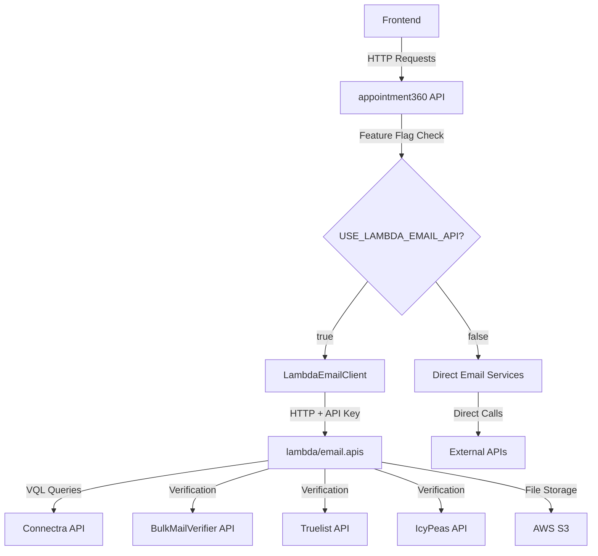

# Email Lambda Migration - Complete Implementation Plan

## Overview

Create `lambda/email.apis` Lambda function following the exact pattern of `lambda/logs.api`, migrate all email services from `appointment360` to Lambda, integrate with appointment360 using feature flags (similar to Sales Navigator integration), and remove unused code after validation.

## Architecture Flow

## Phase 1: Lambda Foundation Setup

### 1.1 Create Lambda Directory Structure

**Location:** `lambda/email.apis/`

Create complete directory structure matching `lambda/logs.api/`:

- `app/` with subdirectories: `api/v1/endpoints/`, `core/`, `clients/`, `services/`, `schemas/`, `middleware/`, `utils/`
- `tests/` directory
- `scripts/` directory with deployment scripts
- Root files: `template.yaml`, `samconfig.toml`, `requirements.txt`, `Makefile`, `README.md`, `.env.example`

**Reference:** [lambda/logs.api](lambda/logs.api) structure

### 1.2 Core Configuration

**File:** `lambda/email.apis/app/core/config.py`

Copy pattern from [lambda/logs.api/app/core/config.py](lambda/logs.api/app/core/config.py) and add:

- `API_KEY` for Lambda authentication
- `BULKMAILVERIFIER_EMAIL`, `BULKMAILVERIFIER_PASSWORD`, `BULKMAILVERIFIER_BASE_URL`
- `TRUELIST_API_KEY`, `TRUELIST_BASE_URL`
- `ICYPEAS_API_KEY`, `ICYPEAS_BASE_URL`
- `CONNECTRA_BASE_URL`, `CONNECTRA_API_KEY`, `CONNECTRA_TIMEOUT`
- `S3_BUCKET_NAME`, `AWS_REGION`, `S3_PRESIGNED_URL_EXPIRATION`
- Performance settings: `ENABLE_QUERY_CACHING`, `QUERY_CACHE_TTL`

### 1.3 Main Application

**File:** `lambda/email.apis/app/main.py`

Copy from [lambda/logs.api/app/main.py](lambda/logs.api/app/main.py):

- FastAPI app with `lifespan` context manager
- CORS, compression, monitoring middleware
- Lambda handler using Mangum with `lifespan="auto"`
- Health check endpoint (`/health`)
- Root endpoint (`/`)
- Exception handlers for custom exceptions

### 1.4 Exception Handling

**File:** `lambda/email.apis/app/core/exceptions.py`

Create custom exceptions:

- `EmailAPIException` (base)
- `EmailNotFoundError`
- `EmailValidationError`
- `ProviderError`
- `ExportError`
- `DomainExtractionError`

**Pattern:** Copy from [lambda/logs.api/app/core/exceptions.py](lambda/logs.api/app/core/exceptions.py)

### 1.5 API Dependencies

**File:** `lambda/email.apis/app/api/dependencies.py`

Copy `verify_api_key` function from [lambda/logs.api/app/api/dependencies.py](lambda/logs.api/app/api/dependencies.py) - validates `X-API-Key` header

## Phase 2: External API Clients

### 2.1 Connectra Client

**File:** `lambda/email.apis/app/clients/connectra_client.py`

Migrate from [appointment360/app/clients/connectra_client.py](appointment360/app/clients/connectra_client.py):

- Async HTTP client with connection pooling
- `search_contacts(vql_query)` method for VQL queries
- Retry logic and error handling

### 2.2 BulkMailVerifier Client

**File:** `lambda/email.apis/app/clients/bulkmailverifier_client.py`

Migrate from [appointment360/app/services/bulkmailverifier_service.py](appointment360/app/services/bulkmailverifier_service.py):

- `login()` - Authentication with token refresh
- `verify_single_email(email)` - Single verification
- `verify_emails_bulk(emails)` - Bulk verification
- `check_credits()` - Credit balance
- `get_lists()` - Verification lists
- `download_file(file_type, slug)` - Download results

### 2.3 Truelist Client

**File:** `lambda/email.apis/app/clients/truelist_client.py`

Migrate from [appointment360/app/services/truelist_service.py](appointment360/app/services/truelist_service.py):

- API key authentication
- `verify_single_email(email)` - Single verification
- `verify_emails(emails)` - Bulk verification (chunked, max 51 per call)
- In-memory LRU cache (10k entries, 1 hour TTL)
- Status mapping: `ok/invalid/risky` → `valid/invalid/catchall/unknown`
- Shared HTTP client for connection pooling

### 2.4 IcyPeas Client

**File:** `lambda/email.apis/app/clients/icypeas_client.py`

Migrate from [appointment360/app/services/icypeas_service.py](appointment360/app/services/icypeas_service.py):

- API key authentication
- `find_email(first_name, last_name, domain)` - Find email
- `verify_email(email)` - Verify email
- Certainty levels: `ultra_sure`, `sure`, `probable`

### 2.5 S3 Client

**File:** `lambda/email.apis/app/clients/s3_client.py`

Create new S3 client:

- `upload_file(key, content)` - Upload file
- `download_file(key)` - Download file
- `generate_presigned_url(key, expiration)` - Generate presigned URL
- `delete_file(key)` - Delete file
- Use `boto3`/`aioboto3` for async operations

## Phase 3: Service Layer

### 3.1 Email Finder Service

**File:** `lambda/email.apis/app/services/email_finder_service.py`

Migrate from [appointment360/app/services/email_finder_service.py](appointment360/app/services/email_finder_service.py):

- `find_emails(first_name, last_name, domain)` - Find emails via Connectra VQL
- Domain extraction and validation
- Error handling with fallbacks
- Transform Connectra response to `SimpleEmailFinderResponse`

### 3.2 Email Verification Service

**File:** `lambda/email.apis/app/services/email_verification_service.py`

Unified service for all providers:

- `verify_single_email(email, provider)` - Single verification
- `verify_emails_bulk(emails, provider)` - Bulk verification
- `generate_and_verify(first_name, last_name, domain, provider)` - Generate patterns and verify
- `verify_and_find(first_name, last_name, domain, provider)` - Find single valid email
- Provider selection logic (BulkMailVerifier, Truelist, IcyPeas)
- Status normalization across providers
- Catchall handling

### 3.3 Email Generation Service

**File:** `lambda/email.apis/app/services/email_generation_service.py`

Migrate from [appointment360/app/utils/email_generator.py](appointment360/app/utils/email_generator.py):

- `generate_email_combinations(first_name, last_name, domain, count)` - Generate email patterns
- Pattern prioritization: Tier-1 (first.last, firstlast), Tier-2 (first_last, flast), Tier-3 (others)

### 3.4 Export Service

**File:** `lambda/email.apis/app/services/export_service.py`

Migrate email-specific parts from [appointment360/app/services/export_service.py](appointment360/app/services/export_service.py):

- `create_email_export(emails_data)` - Create export record
- `generate_csv(emails_data)` - Generate CSV content
- `upload_to_s3(key, content)` - Upload to S3
- `get_download_url(export_id)` - Get presigned URL

## Phase 4: Schemas

### 4.1 Request Schemas

**File:** `lambda/email.apis/app/schemas/requests.py`

Migrate from [appointment360/app/schemas/email.py](appointment360/app/schemas/email.py):

- `EmailFinderRequest`
- `EmailVerifierRequest`
- `BulkEmailVerifierRequest`
- `SingleEmailVerifierRequest`
- `SingleEmailRequest`
- `EmailExportRequest`
- Enums: `EmailProvider`, `EmailVerificationStatus`

### 4.2 Response Schemas

**File:** `lambda/email.apis/app/schemas/responses.py`

Migrate response models:

- `SimpleEmailFinderResponse`
- `EmailVerifierResponse`
- `BulkEmailVerifierResponse`
- `SingleEmailVerifierResponse`
- `SingleEmailResponse`
- `EmailExportResponse`
- `VerifiedEmailR