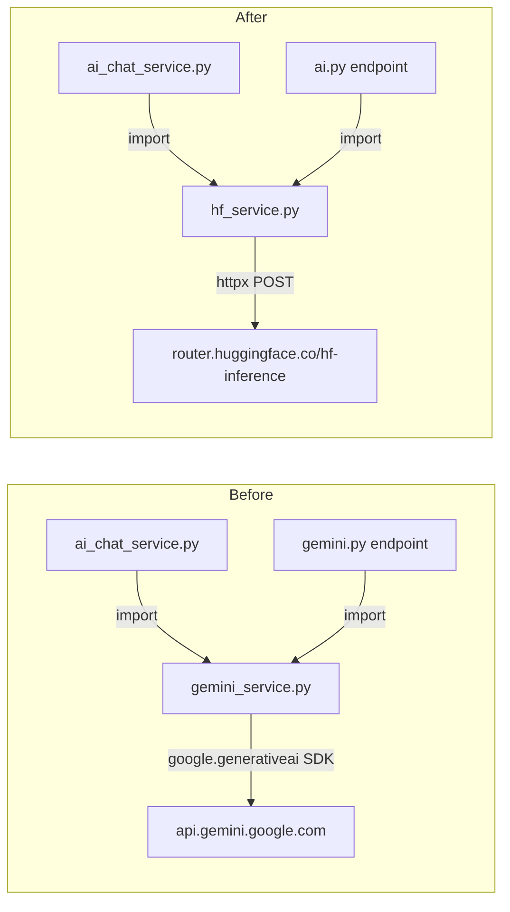

# Gemini → Hugging Face Migration Plan

## Architecture: Before vs After




## HF API Patterns used

### Chat (multi-turn + streaming)

```
POST https://router.huggingface.co/hf-inference/models/{org}/{model}/v1/chat/completions
Authorization: Bearer {HF_API_KEY}
{"messages": [...], "max_tokens": 2048, "stream": false, "temperature": 0.7}
```

Streaming: same with `"stream": true` → SSE, parse `choices[0].delta.content` per chunk.

### JSON tasks (email risk, filters)

Same endpoint with a "return only JSON" system message + `json.loads` + retry on malformed output — matching `resumeai`'s existing pattern.

## `contact.ai` — 12 targeted changes

### Task 1: New `app/core/hf_endpoints.py`

Mirror `[resumeai/app/core/hf_endpoints.py](backend(dev)`/resumeai/app/core/hf_endpoints.py).
Add a `hf_chat_completions_url(model_id)` helper alongside the existing `hf_inference_model_url`.

### Task 2: Rewrite `app/core/config.py`

- Remove all 8 `GEMINI_*` fields from `[app/core/config.py](backend(dev)`/contact.ai/app/core/config.py) (lines 40–98).
- Add:
  - `HF_API_KEY: Optional[str]` — required for inference
  - `HF_CHAT_MODEL: str` — default `"HuggingFaceH4/zephyr-7b-beta"`
  - `HF_TEMPERATURE: float` — default `0.7`
  - `HF_MAX_TOKENS: int` — default `2048`
  - `HF_MAX_RETRIES: int` — default `3`
  - `HF_RETRY_DELAY: float` — default `1.0`
  - `HF_SYSTEM_INSTRUCTION: str` — copy NexusAI persona text from current `GEMINI_SYSTEM_INSTRUCTION`

### Task 3: Create `app/services/hf_service.py`

New file replacing `[app/services/gemini_service.py](backend(dev)`/contact.ai/app/services/gemini_service.py). Uses `httpx` (already in requirements). Implements the same public interface:

- `generate_chat_response(user_message, chat_history, model_name) -> str`
Builds `messages` list from history (sender `"ai"` → role `"assistant"`), does a stateless POST to chat completions. No in-memory session state needed.
- `generate_chat_response_stream(...)` → `AsyncGenerator[str, None]`
Same POST with `"stream": true`, parses SSE lines for `choices[0].delta.content`.
- `analyze_email_risk(email) -> dict` — same prompt, JSON response via chat endpoint.
- `generate_company_summary(company_name, industry) -> str`
- `parse_contact_filters(query) -> dict` — same prompt + existing `_fallback_parse_filters` logic preserved.
- Retry loop (up to 3 attempts, backoff on 503/429) matching resumeai's `_hf_generate` pattern.

### Task 4: Delete `app/services/gemini_service.py`

Remove `[app/services/gemini_service.py](backend(dev)`/contact.ai/app/services/gemini_service.py) entirely after Task 3 is in place.

### Task 5: Update `app/services/ai_chat_service.py`

In `[app/services/ai_chat_service.py](backend(dev)`/contact.ai/app/services/ai_chat_service.py):

- Line 18: `from app.services.gemini_service import GeminiService` → `from app.services.hf_service import HFService`
- Lines 31/35: rename `gemini_service` parameter and attribute → `hf_service`, type `HFService`
- Lines 320, 395: call `self.hf_service.generate_chat_response(...)` and `self.hf_service.generate_chat_response_stream(...)`

### Task 6: Rename endpoint file — `gemini.py` → `ai.py`

- Rename `[app/api/v1/endpoints/gemini.py](backend(dev)`/contact.ai/app/api/v1/endpoints/gemini.py) to `app/api/v1/endpoints/ai.py`.
- Inside: replace `from app.services.gemini_service import GeminiService` with `HFService`; change `router = APIRouter(prefix="/ai", tags=["AI"])` (path change from `/gemini` to `/ai`); update docstrings.

### Task 7: Update `app/api/v1/router.py`

In `[app/api/v1/router.py](backend(dev)`/contact.ai/app/api/v1/router.py):

- Line 5: import `ai` instead of `gemini`
- Lines 21–22: include `ai.router` instead of `gemini.router`

### Task 8: Update `app/schemas/ai_chat.py`

In `[app/schemas/ai_chat.py](backend(dev)`/contact.ai/app/schemas/ai_chat.py):

- Replace `ModelSelection` enum (lines 62–68) with HF model IDs:
  - `ZEPHYR = "HuggingFaceH4/zephyr-7b-beta"`
  - `MISTRAL = "mistralai/Mistral-7B-Instruct-v0.2"`
  - `LLAMA = "meta-llama/Llama-3.1-8B-Instruct"`

### Task 9: Update `app/core/exceptions.py`

In `[app/core/exceptions.py](backend(dev)`/contact.ai/app/core/exceptions.py):

- Rename class `GeminiAPIError` → `InferenceAPIError`; update docstring.

### Task 10: Update `requirements.txt`

In `[requirements.txt](backend(dev)`/contact.ai/requirements.txt):

- Remove lines 10–11 (`# Google Gemini AI` + `google-generativeai>=0.3.0`)
- `httpx` is already present — no new dependency needed.

### Task 11: Update `template.yaml`

In `[template.yaml](backend(dev)`/contact.ai/template.yaml):

- Remove `GEMINI_MODEL/TEMPERATURE/MAX_OUTPUT_TOKENS/TOP_P/TOP_K/MAX_RETRIES/RETRY_DELAY` from Globals (lines 21–27).
- Add `HF_CHAT_MODEL`, `HF_TEMPERATURE`, `HF_MAX_TOKENS`, `HF_MAX_RETRIES`, `HF_RETRY_DELAY`.
- Rename SAM Parameter `GeminiApiKey` → `HfApiKey` (line 44–48) with description "Hugging Face API key".
- Line 65: `GEMINI_API_KEY: !Ref GeminiApiKey` → `HF_API_KEY: !Ref HfApiKey`
- Update `Description` on line 3.

### Task 12: Update `samconfig.toml`

In `[samconfig.toml](backend(dev)`/contact.ai/samconfig.toml):

- Line 25: `"GeminiApiKey=your-gemini-api-key"` → `"HfApiKey=your-hf-api-key"`

---

## `resumeai` — 1 targeted change

### Task 13: Clean up Gemini comments in `ai_service.py`

In `[resumeai/app/services/ai_service.py](backend(dev)`/resumeai/app/services/ai_service.py):

- Line ~240: update comment about image-only uploads (remove "without Gemini").
- Line ~427: update docstring ("Gemini grounding removed" → "no live web search").
- No SDK, no config, no endpoint changes needed.

---

## File map

- **NEW**: `contact.ai/app/core/hf_endpoints.py`
- **NEW**: `contact.ai/app/services/hf_service.py`
- **DELETE**: `contact.ai/app/services/gemini_service.py`
- **RENAME**: `contact.ai/app/api/v1/endpoints/gemini.py` → `ai.py`
- **MODIFY**: `config.py`, `ai_chat_service.py`, `router.py`, `ai_chat.py` (schemas), `exceptions.py`, `requirements.txt`, `template.yaml`, `samconfig.toml`
- **MODIFY** (comments only): `resumeai/app/services/ai_service.py`

Note: `.aws-sam/build/` is a generated folder — do not hand-edit it; `sam build` regenerates it from source.