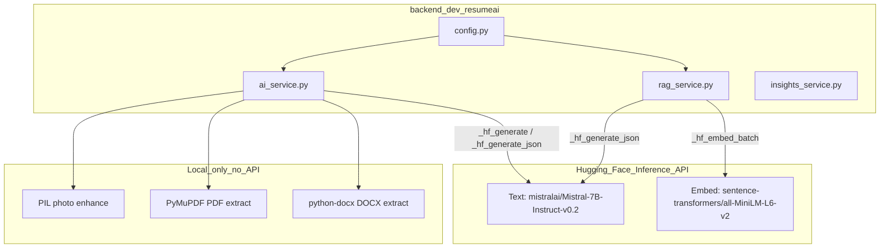

# Gemini → Hugging Face Migration

**Security note:** The HF token you shared in chat should be rotated immediately in your Hugging Face account settings. Only ever store real tokens in `.env` or deployment secrets — never in chat or git.

---

## Architecture after migration




---

## Task 1 — Config and dependencies

`**[app/core/config.py](backend(dev)`/resumeai/app/core/config.py)**

- Remove fields: `GEMINI_API_KEY`, `AI_PROVIDER`, `GEMINI_PARSE_MODEL`, `GEMINI_PRO_MODEL`, `GEMINI_IMAGE_MODEL`, `GEMINI_EMBEDDING_MODEL`
- Add fields: `HF_TEXT_MODEL: str = "mistralai/Mistral-7B-Instruct-v0.2"` and `HF_EMBED_MODEL: str = "sentence-transformers/all-MiniLM-L6-v2"`
- Keep `HF_API_KEY`

`**[requirements.txt](backend(dev)`/resumeai/requirements.txt)**

- Remove `google-generativeai>=0.8.0`
- Add `pymupdf>=1.24.0` (for PDF text extraction)

`**[.env](backend(dev)`/resumeai/.env) and `[.env.example](backend(dev)`/resumeai/.env.example)**

- Remove `GEMINI_API_KEY`, `GEMINI_EMBEDDING_MODEL`, `AI_PROVIDER`
- Add `HF_TEXT_MODEL=mistralai/Mistral-7B-Instruct-v0.2` and `HF_EMBED_MODEL=sentence-transformers/all-MiniLM-L6-v2`

`**[template.yaml](backend(dev)`/resumeai/template.yaml)**

- Remove `GeminiApiKey` parameter and its env mapping
- Remove `GEMINI_EMBEDDING_MODEL`, `AI_PROVIDER` env vars
- Add `HF_TEXT_MODEL` and `HF_EMBED_MODEL` env vars pointing to new SSM/inline values

`**[samconfig.toml](backend(dev)`/resumeai/samconfig.toml)**

- Remove `GeminiApiKey=CHANGE_ME_GEMINI` from parameter overrides

---

## Task 2 — Central HF client in `ai_service.py`

`**[app/services/ai_service.py](backend(dev)`/resumeai/app/services/ai_service.py)**

Delete helpers: `_require_gemini_key()` and `_import_genai()`.

Add three new private helpers at the top of the file:

```python
def _require_hf_key() -> None:
    if not get_settings().HF_API_KEY:
        raise AIServiceError("HF_API_KEY is not configured")

async def _hf_generate(prompt: str, max_tokens: int = 1024, temperature: float = 0.4) -> str:
    """POST to HF Inference API text-generation and return generated text."""
    s = get_settings()
    _require_hf_key()
    url = f"https://api-inference.huggingface.co/models/{s.HF_TEXT_MODEL}"
    payload = {
        "inputs": prompt,
        "parameters": {"max_new_tokens": max_tokens, "temperature": temperature, "return_full_text": False},
    }
    async with httpx.AsyncClient(timeout=s.AI_TIMEOUT_SECONDS) as client:
        r = await client.post(url, json=payload, headers={"Authorization": f"Bearer {s.HF_API_KEY}"})
        r.raise_for_status()
    data = r.json()
    # Handle loading (503) retry and response shapes
    if isinstance(data, list) and data and "generated_text" in data[0]:
        return data[0]["generated_text"].strip()
    raise AIServiceError(f"Unexpected HF response: {data}")

async def _hf_generate_json(prompt: str, max_tokens: int = 2048, temperature: float = 0.3) -> Any:
    text = await _hf_generate(prompt, max_tokens=max_tokens, temperature=temperature)
    return _extract_json(text)
```

---

## Task 3 — PDF extraction helper

`**[app/services/ai_service.py](backend(dev)`/resumeai/app/services/ai_service.py)**

Add alongside the existing `_extract_docx_text`:

```python
def _extract_pdf_text(data: bytes) -> str:
    try:
        import fitz  # PyMuPDF
    except ImportError as e:
        raise AIServiceError("pymupdf is required for PDF parsing") from e
    doc = fitz.open(stream=data, filetype="pdf")
    return "\n".join(page.get_text() for page in doc).strip()
```

The `parse_resume_file` function becomes a unified text-extraction → HF text-model path:

```python
async def parse_resume_file(file_bytes, mime_type, filename=None) -> Resume:
    fn = (filename or "").lower()
    mt = mime_type or ""
    if fn.endswith(".docx") or _is_docx_bytes(file_bytes, mt):
        text = _extract_docx_text(file_bytes)
    elif fn.endswith(".pdf") or "pdf" in mt:
        text = _extract_pdf_text(file_bytes)
    elif mt.startswith("text/"):
        text = file_bytes.decode("utf-8", errors="replace")
    else:
        raise AIServiceError("Unsupported file type. Upload PDF, DOCX, or plain text.")
    if len(text.strip()) < 20:
        raise AIServiceError("Could not extract enough text from file.")
    prompt = f"{PARSE_RESUME_PROMPT}\n\nResume text:\n{text[:12000]}"
    data = await _hf_generate_json(prompt, max_tokens=2048, temperature=0.2)
    data.get("personalDetails", {})["photo"] = ""   # never return photo
    return Resume.model_validate(data)
```

Remove stub `_hf_parse_resume`.

---

## Task 4 — Rewrite text-output functions

`**[app/services/ai_service.py](backend(dev)`/resumeai/app/services/ai_service.py)**

For each function below, remove the Gemini branch and the `if s.AI_PROVIDER == "huggingface"` guard entirely; call the HF helpers directly.

- `enhance_section`: replace with `_hf_generate(prompt, max_tokens=512, temperature=0.7)` — existing prompts unchanged.
- `suggest_skills`: replace with `_hf_generate_json(prompt, max_tokens=512, temperature=0.3)`.
- Delete `_hf_enhance_section` and `_hf_suggest_skills` (no longer needed as stubs).

---

## Task 5 — Rewrite JSON-output AI functions

`**[app/services/ai_service.py](backend(dev)`/resumeai/app/services/ai_service.py)**

Each of these calls `_hf_generate_json`. The prompt strings are **unchanged** (they are good already); only the execution layer changes:

- `check_ats_score` → `_hf_generate_json(prompt, max_tokens=512, temperature=0.3)`
- `improve_resume_for_ats` → `_hf_generate_json(prompt, max_tokens=2048, temperature=0.4)` — note: large JSON input, truncate resume JSON to 8000 chars if needed
- `generate_ats_text` → `_hf_generate(prompt, max_tokens=1024, temperature=0.3)` (plain text, no JSON)
- `generate_critique` → `_hf_generate_json(prompt, max_tokens=512, temperature=temp)` where `temp = 0.7 if roast else 0.4`
- `generate_latex` → `_hf_generate(prompt, max_tokens=2048, temperature=0.2)` — note: expect partial output on large resumes; add a comment about token limits

---

## Task 6 — Photo enhancement and LinkedIn

`**enhance_photo`** — remove the Gemini block entirely (lines 457–473 of current file). Keep the PIL fallback path (lines 476–488) as the sole implementation. The PIL path already works without any API.

`**scrape_linkedin**` — remove all `_import_genai()`, `genai.GenerativeModel`, `tools=`, and retry-with-`google_search` logic. Replace with a single `_hf_generate_json` call using the same prompt string. The endpoint will still attempt best-effort extraction from a URL; it just no longer has live search grounding. Add a note in the docstring.

---

## Task 7 — Rewrite `rag_service.py`

`**[app/services/rag_service.py](backend(dev)`/resumeai/app/services/rag_service.py)**

Remove import of `_import_genai` from `ai_service`. Add imports for `_hf_generate_json` and `_require_hf_key`.

Replace `_embed_batch(genai_module, model_name, texts)` with:

```python
async def _hf_embed_batch(texts: List[str]) -> List[List[float]]:
    s = get_settings()
    _require_hf_key()
    url = f"https://api-inference.huggingface.co/models/{s.HF_EMBED_MODEL}"
    headers = {"Authorization": f"Bearer {s.HF_API_KEY}"}
    out = []
    async with httpx.AsyncClient(timeout=s.AI_TIMEOUT_SECONDS) as client:
        for t in texts:
            r = await client.post(url, json={"inputs": t[:2000]}, headers=headers)
            r.raise_for_status()
            emb = r.json()
            if isinstance(emb, list) and isinstance(emb[0], float):
                out.append(emb)
            elif isinstance(emb, list) and isinstance(emb[0], list):
                out.append(emb[0])  # pooled output shape
            else:
                raise AIServiceError(f"Unexpected embedding response: {type(emb)}")
    return out
```

In `rag_ats_score`, change:

- `embeddings = _embed_batch(genai, model_emb, all_texts)` → `embeddings = await _hf_embed_batch(all_texts)` (make the outer function `async` properly, which it already is)
- Replace final `genai.GenerativeModel` + `model.generate_content` block with `await _hf_generate_json(rag_prompt, ...)`

---

## Task 8 — Frontend cleanup

`**[frontend(dev)/resume/src/components/layout/Sidebar.tsx](frontend(dev)`/resume/src/components/layout/Sidebar.tsx)**

- Remove `aiProvider` and `onAiProviderChange` from `SidebarProps` interface
- Remove the entire "AI Provider" `<Section>` block (roughly lines 298–320)
- Remove `acceptedFileTypes` conditional; hardcode `.pdf,.docx,.txt,.jpg,.jpeg,.png`
- Remove `uploadHintText` conditional; use single static string

`**[frontend(dev)/resume/src/components/editor/ResumePreview.tsx](frontend(dev)`/resume/src/components/editor/ResumePreview.tsx)**

- Change line 546: `isAiEnabledForEnhance={isAiEnabled && aiProvider === 'gemini'}` → `isAiEnabledForEnhance={isAiEnabled}`
- Remove `aiProvider` from props if it was only used for that guard

`**[frontend(dev)/resume/src/ResumeEditor.tsx](frontend(dev)`/resume/src/ResumeEditor.tsx)**

- Remove `const [aiProvider, setAiProvider] = useState<"gemini" | "huggingface">("gemini")`
- Remove `onAiProviderChange={setAiProvider}` and `aiProvider={aiProvider}` prop passes to Sidebar and ResumePreview
- Keep `isAiEnabled` as is (based on `RESUME_AI_API_KEY`)

---

## Task 9 — Tests, docs, and final cleanup

`**[tests/test_api.py](backend(dev)`/resumeai/tests/test_api.py)** — existing tests do not mock Gemini; they test CRUD routes which are not AI-dependent. No changes needed, but verify `pytest` passes after the migration.

`**[docs/backend/apis/29_RESUME_AI_REST_SERVICE.md](docs/backend/apis/29_RESUME_AI_REST_SERVICE.md)`**

- Update environment table: remove `GEMINI_*`, add `HF_TEXT_MODEL`, `HF_EMBED_MODEL`
- Add a note on LinkedIn: no live search grounding; paste profile text for best results
- Add a note on image upload: images not supported after Gemini removal; upload PDF, DOCX, or text

`**[postman/Resume_AI_Service.postman_collection.json](backend(dev)`/resumeai/postman/Resume_AI_Service.postman_collection.json)**

- Remove any `GEMINI_API_KEY` from collection variables; add `HF_API_KEY`

**Grep sweep** before done: `rg -l "GEMINI|google.generativeai|GenerativeModel|AI_PROVIDER" backend\(dev\)/resumeai` should return zero matches.