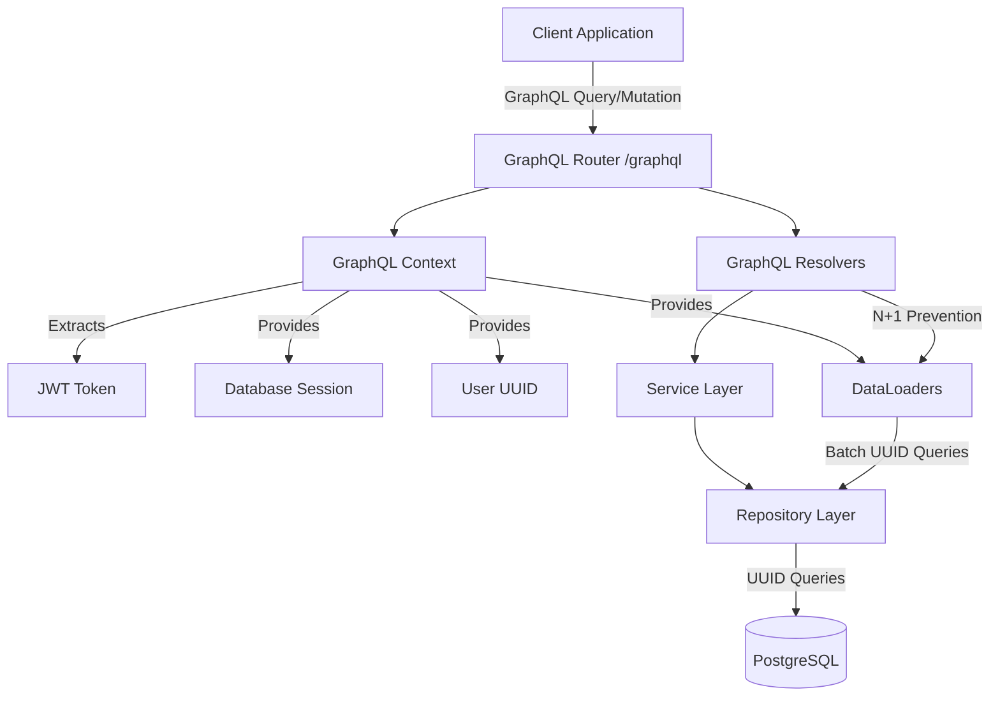

# Complete GraphQL Migration Plan - UUID-Based Architecture

## Overview

This plan migrates the entire Appointment360 API from REST to GraphQL, using UUIDs as primary identifiers throughout. The migration leverages existing UUID-based services and repositories, requiring minimal changes to business logic.

## Architecture Overview

## Phase 1: Foundation Setup (Days 1-2)

### Task 1.1: Install Dependencies

- **File**: `requirements.txt`
- **Action**: Add `strawberry-graphql[fastapi]>=0.215.0`
- **Dependencies**: None

### Task 1.2: Create GraphQL Directory Structure

- **Files to Create**:
  - `app/graphql/__init__.py`
  - `app/graphql/schema.py` - Main schema composition
  - `app/graphql/context.py` - Context with UUID support
  - `app/graphql/dataloaders.py` - UUID-based DataLoaders
  - `app/graphql/errors.py` - Custom GraphQL errors
  - `app/graphql/scalars.py` - UUID scalar type
  - `app/graphql/modules/__init__.py`
- **Dependencies**: None

### Task 1.3: Create UUID Scalar Type

- **File**: `app/graphql/scalars.py`
- **Content**: Custom UUID scalar for validation and type safety
- **Dependencies**: Task 1.2

### Task 1.4: Create GraphQL Context

- **File**: `app/graphql/context.py`
- **Key Features**:
  - Extract JWT from Authorization header
  - Get user by UUID from token (using existing `get_current_user` logic)
  - Provide database session (using existing `get_db` dependency)
  - Initialize DataLoaders per request
  - Include FastAPI Request object
- **Dependencies**: Task 1.2, Task 1.5

### Task 1.5: Create UUID-Based DataLoaders

- **File**: `app/graphql/dataloaders.py`
- **DataLoaders to Implement**:
  - `user_by_uuid` - Batch load users by UUID
  - `contact_by_uuid` - Batch load contacts by UUID
  - `company_by_uuid` - Batch load companies by UUID
  - `contacts_by_company_uuid` - Batch load contacts grouped by company UUID
  - `contact_metadata_by_uuid` - Batch load contact metadata
  - `company_metadata_by_uuid` - Batch load company metadata
  - `user_profile_by_user_uuid` - Batch load user profiles
- **Implementation**: Use existing repository `get_by_uuid` methods
- **Dependencies**: Task 1.2

### Task 1.6: Update Configuration

- **File**: `app/core/config.py`
- **Changes**: Add GraphQL settings:
  - `GRAPHQL_INTROSPECTION_ENABLED: bool = False` (production)
  - `GRAPHQL_COMPLEXITY_LIMIT: int = 100`
  - `GRAPHQL_QUERY_DEPTH_LIMIT: int = 10`
- **Dependencies**: None

## Phase 2: Core Authentication & User Management (Days 2-3)

### Task 2.1: Auth Module - Types

- **File**: `app/graphql/modules/auth/types.py`
- **Types**:
  - `AuthPayload` - Token response with user UUID
  - `UserInfo` - User info in auth context (UUID-based)
- **Dependencies**: Phase 1

### Task 2.2: Auth Module - Inputs

- **File**: `app/graphql/modules/auth/inputs.py`
- **Inputs**:
  - `LoginInput` - email, password
  - `RegisterInput` - email, password, name, geolocation
  - `RefreshTokenInput` - refresh_token
- **Dependencies**: Phase 1

### Task 2.3: Auth Module - Queries

- **File**: `app/graphql/modules/auth/queries.py`
- **Queries**:
  - `me` - Get current user by UUID from context
  - `session` - Get session info with user UUID
- **Implementation**: Use existing `UserService` methods
- **Dependencies**: Task 2.1, Task 2.2

### Task 2.4: Auth Module - Mutations

- **File**: `app/graphql/modules/auth/mutations.py`
- **Mutations**:
  - `login(input: LoginInput!)` - Authenticate, return tokens with user UUID
  - `register(input: RegisterInput!)` - Register, return tokens with user UUID
  - `logout` - Logout current user (UUID from context)
  - `refreshToken(input: RefreshTokenInput!)` - Refresh access token
- **Implementation**: Use existing `UserService.login`, `UserService.register_user`
- **Dependencies**: Task 2.1, Task 2.2

### Task 2.5: Users Module - Types

- **File**: `app/graphql/modules/users/types.py`
- **Types**:
  - `User` - Full user type with UUID as primary identifier
  - `UserProfile` - User profile type (linked by user UUID)
  - `UserStats` - User statistics
- **Field Resolvers**: Use DataLoaders for nested data (profile, history)
- **Dependencies**: Phase 1, Task 1.5

### Task 2.6: Users Module - Inputs

- **File**: `app/graphql/modules/users/inputs.py`
- **Inputs**:
  - `UpdateUserInput` - Update user fields
  - `UpdateProfileInput` - Update profile fields
  - `UploadAvatarInput` - Avatar upload
- **Dependencies**: Phase 1

### Task 2.7: Users Module - Queries

- **File**: `app/graphql/modules/users/queries.py`
- **Queries**:
  - `user(uuid: ID!)` - Get user by UUID
  - `users(limit: Int, offset: Int)` - List users (admin only)
  - `userStats` - Get user statistics
- **Implementation**: Use existing `UserRepository.get_by_uuid`
- **Dependencies**: Task 2.5, Task 2.6

### Task 2.8: Users Module - Mutations

- **File**: `app/graphql/modules/users/mutations.py`
- **Mutations**:
  - `updateProfile(uuid: ID!, input: UpdateProfileInput!)` - Update profile by user UUID
  - `uploadAvatar(uuid: ID!, file: Upload!)` - Upload avatar by user UUID
  - `promoteToAdmin(userUuid: ID!)` - Promote user by UUID (admin only)
- **Implementation**: Use existing `UserService.update_profile`
- **Dependencies**: Task 2.5, Task 2.6

## Phase 3: Core Data Domains - Contacts (Days 3-4)

### Task 3.1: Contacts Module - Types

- **File**: `app/graphql/modules/contacts/types.py`
- **Types**:
  - `Contact` - Contact type with UUID as primary identifier
  - `ContactMetadata` - Contact metadata (linked by contact UUID)
  - `ContactListItem` - Contact list item
  - `ContactDetail` - Full contact detail
- **Field Resolvers**:
  - `company` - Load company using `company_uuid` via DataLoader
  - `metadata` - Load metadata using contact UUID via DataLoader
- **Dependencies**: Phase 1, Task 1.5

### Task 3.2: Contacts Module - Inputs

- **File**: `app/graphql/modules/contacts/inputs.py`
- **Inputs**:
  - `ContactFilterInput` - Filter contacts (includes `uuid`, `company_uuid` filters)
  - `CreateContactInput` - Create contact (includes `company_uuid` reference)
  - `UpdateContactInput` - Update contact (includes `company_uuid` reference)
  - `VQLQueryInput` - VQL query input (for advanced queries)
- **Dependencies**: Phase 1

### Task 3.3: Contacts Module - Queries

- **File**: `app/graphql/modules/contacts/queries.py`
- **Queries**:
  - `contact(uuid: ID!)` - Get contact by UUID
  - `contacts(filter: ContactFilterInput, limit: Int, offset: Int)` - List contacts
  - `contactCount(filter: ContactFilterInput)` - Count contacts
  - `contactQuery(vqlQuery: VQLQueryInput!)` - VQL query contacts
  - `contactAttributes(filter: ContactFilterInput)` - Get contact attributes
- **Implementation**: Use existing `ContactsService.query_with_vql`, `ContactsService.count_with_vql`
- **Dependencies**: Task 3.1, Task 3.2

### Task 3.4: Contacts Module - Mutations

- **File**: `app/graphql/modules/contacts/mutations.py`
- **Mutations**:
  - `createContact(input: CreateContactInput!)` - Create contact (UUID auto-generated)
  - `updateContact(uuid: ID!, input: UpdateContactInput!)` - Update contact by UUID
  - `deleteContact(uuid: ID!)` - Delete contact by UUID
  - `batchCreateContacts(inputs: [CreateContactInput!]!)` - Batch create contacts
- **Implementation**: Use existing `ContactsService.create_contact`
- **Dependencies**: Task 3.1, Task 3.2

## Phase 4: Core Data Domains - Companies (Days 4-5)

### Task 4.1: Companies Module - Types

- **File**: `app/graphql/modules/companies/types.py`
- **Types**:
  - `Company` - Company type with UUID as primary identifier
  - `CompanyMetadata` - Company metadata (linked by company UUID)
  - `CompanyListItem` - Company list item
  - `CompanyDetail` - Full company detail
- **Field Resolvers**:
  - `contacts` - Load contacts using company UUID via DataLoader
  - `metadata` - Load metadata using company UUID via DataLoader
- **Dependencies**: Phase 1, Task 1.5, Phase 3

### Task 4.2: Companies Module - Inputs

- **File**: `app/graphql/modules/companies/inputs.py`
- **Inputs**:
  - `CompanyFilterInput` - Filter companies (includes `uuid` filter)
  - `CreateCompanyInput` - Create company
  - `UpdateCompanyInput` - Update company
  - `VQLQueryInput` - VQL query input
- **Dependencies**: Phase 1

### Task 4.3: Companies Module - Queries

- **File**: `app/graphql/modules/companies/queries.py`
- **Queries**:
  - `company(uuid: ID!)` - Get company by UUID
  - `companies(filter: CompanyFilterInput, limit: Int, offset: Int)` - List companies
  - `companyCount(filter: CompanyFilterInput)` - Count companies
  - `companyQuery(vqlQuery: VQLQueryInput!)` - VQL query companies
  - `companyContacts(companyUuid: ID!, limit: Int, offset: Int)` - Get contacts for company by UUID
- **Implementation**: Use existing `CompaniesService.query_with_vql`, `Compani