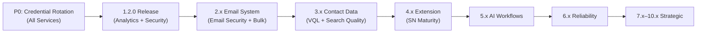

# Contact360 Deep Analysis & Granular Task Breakdown

## Project Understanding

**Contact360** is a B2B SaaS platform for email discovery, verification, and contact/company intelligence. The documentation tree under `docs/` is a **governance-compliant source-of-truth** that tracks the entire product lifecycle across **11 development eras** (0.x.x through 10.x.x).

---

## Documentation Architecture

### Scale
| Metric | Count |
|---|---|
| **Era directories** | 11 (`0.x` – `10.x`) |
| **Files per era** | 122 (1 README + 11 minors × 1 minor doc + 10 patches each) |
| **Total era files** | **1,342** |
| **Support directories** | 12 (analysis, backend, codebases, commands, docs, frontend, ops, plans, prompts, scripts, plus root files) |
| **Codebase analyses** | 17 service deep-dives in `codebases/` |
| **Analysis task packs** | 204 files in `analysis/` |
| **Plan artifacts** | 31 execution plans in `plans/` |
| **Core docs** | 11 source-of-truth files in `docs/docs/` |
| **CLI scripts** | 19 Python modules in `scripts/` |

### Structural Pattern

Each era follows a rigid hierarchy:

```
Era N/
├── README.md                    (era hub: theme, ladder, links)
├── N.0 — Minor Theme.md         (minor release doc with ## Tasks)
├── N.0.0 — Codename.md          (patch: Focus, Flowchart, Micro-gate, Tasks, Evidence)
├── N.0.1 — Codename.md
├── ...
├── N.0.9 — Codename.md
├── N.1 — Minor Theme.md
├── N.1.0 — Codename.md
├── ...
└── N.10.9 — Codename.md
```

### Five-Track Task System

Every `## Tasks` or `## Task tracks` block uses:

1. **Contract** — APIs, schemas, external guarantees
2. **Service** — backend logic, jobs, integrations
3. **Surface** — UI, CLI, extension, emails users see
4. **Data** — DB, migrations, lineage, retention
5. **Ops** — deploy, observability, runbooks, security

---

## Service Topology (15 Backend Services + 4 Frontend Surfaces)

### Backend Services

| # | Service | Path | Language | Primary Era |
|---|---------|------|----------|-------------|
| 1 | **Appointment360** (GraphQL Gateway) | `contact360.io/api/` | Python FastAPI + Strawberry | 0.x–10.x |
| 2 | **Connectra** (Search/VQL) | `contact360.io/sync/` | Go Gin | 3.x |
| 3 | **TKD Job** (Scheduler) | `contact360.io/jobs/` | Python FastAPI + Kafka | 0.6.x |
| 4 | **Email APIs** | `lambda/emailapis/` | Python FastAPI | 2.x |
| 5 | **Email API Go** | `lambda/emailapigo/` | Go Gin | 2.x |
| 6 | **Mailvetter** | `backend(dev)/mailvetter/` | Go | 2.x |
| 7 | **Logs API** | `lambda/logs.api/` | Python FastAPI | 0.x |
| 8 | **S3 Storage** | `lambda/s3storage/` | Python FastAPI | 0.5.x |
| 9 | **Sales Navigator** | `backend(dev)/salesnavigator/` | Python FastAPI | 4.x |
| 10 | **Contact AI** | `backend(dev)/contact.ai/` | Python FastAPI | 5.x |
| 11 | **Resume AI** | `backend(dev)/resumeai/` | Python | 5.x |
| 12 | **Email Campaign** | `backend(dev)/email campaign/` | Go Gin + Asynq | 10.x |
| 13 | **Django Admin** (DocsAI) | `contact360.io/admin/` | Django 4.x | 0.8.x |
| 14 | **Marketing Site** | `contact360.io/root/` | Next.js 16 | 0.8.x |
| 15 | **Email Frontend** (Mailhub) | `contact360.io/email/` | Next.js 16 | 2.x |

### Frontend Surfaces

| Surface | Path | Technology |
|---------|------|------------|
| **Dashboard SPA** | `contact360.io/app/` | Next.js 16 + React 19 + TypeScript + GraphQL |
| **Marketing Site** | `contact360.io/root/` | Next.js 16 + React 19 + GraphQL |
| **Admin Panel** (DocsAI) | `contact360.io/admin/` | Django 4.x + Tailwind |
| **Email Client** (Mailhub) | `contact360.io/email/` | Next.js 16 + React 19 |
| **Chrome Extension** | `extension/contact360/` | Chrome MV3 + Python Lambda |

---

## Current Project Status

### Execution Position

| Status | Items |
|--------|-------|
| ✅ **Released** | `0.x` (Foundation complete), `1.0.0` (MVP), `1.1.0` (Billing Maturity) |
| 🔄 **In-flight** | `1.2.0` (Analytics & Security baseline), `2.4` (Bulk processing hardening) |
| 📋 **Planned** | `2.0.0` through `10.0.0` (all remaining eras) |

### Immediate Blockers
- Storage durability/auth controls for `s3storage`
- Mapping `1.2` roadmap stages to micro-gates
- Close `1.2` + `2.4` hard gates before `3.x` + `4.x` scale-up

---

## P0 Security Issues Across Codebases

> [!CAUTION]
> Multiple services have **committed credentials** in source control. These require immediate rotation.

| Service | Issue | Severity |
|---------|-------|----------|
| `contact360.io/api` | `.env` with real `SECRET_KEY`, AWS keys, PG password | **P0** |
| `contact360.io/admin` | `.env` with real AWS keys; `db.sqlite3` committed | **P0** |
| `backend(dev)/contact.ai` | `samconfig.toml` with API keys, DB URL, HF token | **P0** |
| `backend(dev)/email campaign` | `.env` with Gmail app password, DB creds, AWS keys, JWT secret | **P0** |
| `backend(dev)/salesnavigator` | `.example.env` with real production credentials | **P0** |
| `contact360.io/sync` (Connectra) | `.env` committed; module name is `vivek-ray` | **P0** |
| `lambda/emailapis` | `samconfig.toml` with real secrets | **P0** |
| `contact360.io/email` | IMAP password in `localStorage` plaintext | **P0** |
| `contact360.io/app` | JWT tokens in `localStorage` (XSS risk) | **P1** |

---

## Era-by-Era Granular Task Breakdown

### Era 0.x.x — Foundation and Pre-product Stabilization

**Status:** ✅ Completed (all 11 minors: `0.0` through `0.10`)

**Documentation health:** 122 files, all `0.x` patch gates closed per `versions.md`.

#### Remaining gap remediation tasks:
- [ ] **0.T1** — Verify all 122 patch files have complete micro-gate evidence sections
- [ ] **0.T2** — Sync DocsAI admin sidebar with React frontend routes (Surface track)
- [ ] **0.T3** — Apply `@require_super_admin` to all unprotected Django admin views (Security)
- [ ] **0.T4** — Implement PostgreSQL→Elasticsearch reconciliation playbooks (Data)
- [ ] **0.T5** — Propagate AWS request IDs across all Lambda functions (Ops)
- [ ] **0.T6** — Address `s3storage` multipart session state risk (in-memory → Redis/DynamoDB)

---

### Era 1.x.x — User, Billing, and Credit System

**Status:** 🔄 `1.0.0` released, `1.1.0` released, `1.2.0` planned

**Theme:** Auth, sessions, credit lifecycle, billing flows, analytics, admin controls.

**Files:** 122 (11 minors × 11 files: `1.0` User Genesis → `1.10` Billing/User Ops Exit Gate)

#### Contract Track
- [ ] **1.T1** — Finalize user/credit/billing GraphQL schema for `1.2.0` release
- [ ] **1.T2** — Define analytics query contract (Stage 1.4)
- [ ] **1.T3** — Define notification event contract (Stage 1.5)
- [ ] **1.T4** — Specify admin control panel API contract (Stage 1.6)
- [ ] **1.T5** — Specify rate-limiting contract for abuse prevention (Stage 1.7)

#### Service Track
- [ ] **1.T6** — Implement user analytics view (usage logs, credits used, package/expiry display)
- [ ] **1.T7** — Build low-credit warning and payment success notification UI
- [ ] **1.T8** — Admin panel: view users, credits, packages; manual credit adjustment
- [ ] **1.T9** — Implement basic rate limiting on core APIs
- [ ] **1.T10** — Fix `graphqlClient.ts` non-idempotent billing mutation retries (double-charge risk)

#### Surface Track
- [ ] **1.T11** — Dashboard `/settings` page (currently redirects to `/profile`)
- [ ] **1.T12** — Credit display and billing UX improvements
- [ ] **1.T13** — Notification wiring in dashboard
- [ ] **1.T14** — Admin user/billing management UI in DocsAI panel

#### Data Track
- [ ] **1.T15** — Credit ledger consistency verification
- [ ] **1.T16** — Billing state observability (tracking credit events end-to-end)

#### Ops Track
- [ ] **1.T17** — Token TTL configuration tuning
- [ ] **1.T18** — Idempotency for billing mutations enforcement
- [ ] **1.T19** — Fraud/abuse detection controls

---

### Era 2.x.x — Email System

**Status:** 📋 `2.0.0` planned (finder/verifier engines completed as part of `1.0.0`)

**Theme:** Email finder engine, verification engine, results, bulk processing, mailbox, provider harmonization.

**Files:** 122 (11 minors: `2.0` Email Foundation → `2.10` Email System Exit Gate)

#### Contract Track
- [ ] **2.T1** — Finder/verifier API contract freeze
- [ ] **2.T2** — Bulk processing contract (CSV upload, checkpoint, multipart)
- [ ] **2.T3** — Provider harmonization contract (Mailvetter/external)
- [ ] **2.T4** — Mailbox security contract (tokenized sessions replacing plaintext IMAP)

#### Service Track
- [ ] **2.T5** — Multi-pattern email generation with Go worker path
- [ ] **2.T6** — Mailvetter DNS/SMTP/SPF/DMARC scoring integration
- [ ] **2.T7** — Bulk CSV streaming with checkpointing and multipart upload
- [ ] **2.T8** — Replace plaintext IMAP password storage in `contact360.io/email`
- [ ] **2.T9** — Remove `X-Email` + `X-Password` raw headers from email API calls
- [ ] **2.T10** — Truelist→Mailvetter migration completion in `emailapis`

#### Surface Track
- [ ] **2.T11** — Email UI component improvements (confidence display)
- [ ] **2.T12** — Bulk export UX with progress indicators
- [ ] **2.T13** — Compose email UI (missing from `contact360.io/email`)
- [ ] **2.T14** — Fix layout title (`Create Next App` → proper title)

#### Data Track
- [ ] **2.T15** — Credit deduction accuracy for finder operations
- [ ] **2.T16** — Bulk job checkpoint reliability validation

#### Ops Track
- [ ] **2.T17** — Provider fallback telemetry
- [ ] **2.T18** — `emailapis` and `emailapigo` `.env.example` creation and secret cleanup
- [ ] **2.T19** — Test suites for email services

---

### Era 3.x.x — Contact and Company Data System

**Status:** 📋 Planned

**Theme:** VQL query engine, search quality, enrichment/dedup, dashboard search UX, import/export, Sales Navigator ingestion, dual-store integrity.

**Files:** 122 (11 minors: `3.0` Twin Ledger → `3.10` Data Completeness)

#### Key Tasks
- [ ] **3.T1** — VQL parser maturity and filter taxonomy freeze
- [ ] **3.T2** — Dual-write (PostgreSQL + Elasticsearch) consistency enforcement
- [ ] **3.T3** — Enrichment pipeline and dedupe algorithm implementation
- [ ] **3.T4** — Advanced filter UX, company drill-down, saved-search features
- [ ] **3.T5** — Import/export pipeline (CSV intake, validation, persistence)
- [ ] **3.T6** — Sales Navigator ingestion provenance fields (`source`, `lead_id`, `search_id`)
- [ ] **3.T7** — Index refresh reliability and relevance tuning
- [ ] **3.T8** — Fix Connectra module name (`vivek-ray` → canonical)
- [ ] **3.T9** — Remove committed `.env` from Connectra repo
- [ ] **3.T10** — Fix Connectra missing `X-Request-ID` propagation

---

### Era 4.x.x — Extension and Sales Navigator Maturity

**Status:** 📋 Planned

**Theme:** Extension auth/sessions, SN ingestion optimization, sync integrity, telemetry, popup UX, dashboard integration, campaign audience sourcing.

**Files:** 122 (11 minors: `4.0` Harbor → `4.10` Exit Gate)

#### Key Tasks
- [ ] **4.T1** — Extension `content.js` implementation (currently 9-line stub)
- [ ] **4.T2** — Extension `background.js` message handler (currently no orchestration)
- [ ] **4.T3** — Fix `manifest.json` overly broad host_permissions
- [ ] **4.T4** — Fix `graphqlSession.js` ES module in non-module context
- [ ] **4.T5** — Create `samconfig.toml` for Sales Navigator Lambda
- [ ] **4.T6** — Replace hardcoded `CONNECTRA_API_URL` EC2 IPs
- [ ] **4.T7** — Implement `X-Idempotency-Key` on save-profiles
- [ ] **4.T8** — Token refresh and session lifecycle hardening
- [ ] **4.T9** — Sync integrity and conflict resolution
- [ ] **4.T10** — Extension telemetry to `logs.api`

---

### Era 5.x.x — AI Workflows

**Status:** 📋 Planned

**Theme:** NexusAI CRM assistant, HF streaming, Gemini fallback, confidence/explainability, cost governance, prompt versioning, signal enrichment.

**Files:** 122 (11 minors: `5.0` Neural Spine → `5.10` Connectra Intelligence)

#### Key Tasks
- [ ] **5.T1** — Connect AI Chat page (currently fully mocked with `mockSend()`)
- [ ] **5.T2** — Connect Live Voice page (currently mocked with fake transcriptions)
- [ ] **5.T3** — Fix `contact.ai` Lambda timeout mismatch (30s Lambda vs 120s HF timeout)
- [ ] **5.T4** — Wire `AI_RATE_LIMIT_*` middleware (configured but never enforced)
- [ ] **5.T5** — Implement HF embedding endpoint (configured but doesn't exist)
- [ ] **5.T6** — Create `.env.example` for contact.ai (15+ undocumented vars)
- [ ] **5.T7** — Confidence and explainability metadata exposure
- [ ] **5.T8** — AI usage quotas and cost guardrails implementation
- [ ] **5.T9** — Prompt versioning and governance system
- [ ] **5.T10** — Signal enrichment pipeline for AI context

---

### Era 6.x.x — Reliability and Scaling

**Status:** 📋 Planned

**Theme:** SLO/error-budgets, idempotent writes, queue DLQ/worker resilience, observability, performance, storage lifecycle, cost guardrails, security/abuse resilience.

**Files:** 122 (11 minors: `6.0` umbrella → `6.10` Buffer)

#### Key Tasks
- [ ] **6.T1** — Define SLOs and error budgets per service
- [ ] **6.T2** — Implement idempotency keys on all critical write paths
- [ ] **6.T3** — DLQ, replay, and retry controls on async workloads
- [ ] **6.T4** — End-to-end correlated telemetry (logs/traces/alerts)
- [ ] **6.T5** — Fix `s3storage` multipart session memory leak
- [ ] **6.T6** — Fix Jobs healthcheck (always passes with `sys.exit(0)`)
- [ ] **6.T7** — Fix OpenSearch scroll context leaks on failed exports
- [ ] **6.T8** — Replace global rate limiters with per-API-key limiters
- [ ] **6.T9** — Add `X-RateLimit-*` headers to 429 responses
- [ ] **6.T10** — Performance optimization for top latency hotspots

---

### Era 7.x.x — Deployment

**Status:** 📋 Planned

**Theme:** RBAC foundation, service authorization mesh, governance controls, audit event model, lifecycle policies, tenant isolation, security hardening, observability command stage.

**Files:** 122 (11 minors: `7.0` Deployment baseline lock → `7.10` Overflow patch buffer)

#### Key Tasks
- [ ] **7.T1** — RBAC role hierarchy and permission matrix
- [ ] **7.T2** — Service-to-service authorization standardization
- [ ] **7.T3** — Admin governance controls (approval flows, reason codes, audit trails)
- [ ] **7.T4** — Immutable audit event model and query/report flows
- [ ] **7.T5** — Data classification and lifecycle controls
- [ ] **7.T6** — Tenant isolation and policy scoping validation
- [ ] **7.T7** — Secret rotation and privileged access hardening
- [ ] **7.T8** — Rotate all committed credentials across all services
- [ ] **7.T9** — Content-Security-Policy headers across all frontends
- [ ] **7.T10** — CI/CD pipelines for all services (several missing)

---

### Era 8.x.x — Public and Private APIs and Endpoints

**Status:** 📋 Planned

**Theme:** Analytics instrumentation, ingestion quality, private contracts, public API surface, versioning/compatibility, webhook fabric, partner identity, reporting.

**Files:** 122 (11 minors: `8.0` API Era Foundation → `8.10` API Era Buffer)

#### Key Tasks
- [ ] **8.T1** — Canonical event/metric dictionary
- [ ] **8.T2** — Private API baseline documentation and versioning
- [ ] **8.T3** — Public GraphQL/REST API surface definition
- [ ] **8.T4** — API versioning policy and deprecation gates
- [ ] **8.T5** — Signed webhook delivery with retry, DLQ, and tracking
- [ ] **8.T6** — Partner scoped authentication and tenant-safe access
- [ ] **8.T7** — OpenAPI specs for all services (several missing)
- [ ] **8.T8** — Analytics dashboard and scheduled reporting APIs
- [ ] **8.T9** — Fill `contact360.io/api` empty `campaigns`, `endpoints`, `postman` directories

---

### Era 9.x.x — Ecosystem Integrations and Platform Productization

**Status:** 📋 Planned

**Theme:** Partner identity, connector contracts, entitlement fabric, tenant boundary, self-serve control plane, webhook reliability, operational transparency, commercial guardrails.

**Files:** 122 (11 minors: `9.0` Ecosystem Foundation → `9.10` Productization Buffer)

#### Key Tasks
- [ ] **9.T1** — Integration contract governance framework
- [ ] **9.T2** — Connector framework and SDK baseline
- [ ] **9.T3** — Multi-tenant model standardization
- [ ] **9.T4** — Self-serve workspace administration
- [ ] **9.T5** — Plan entitlements and feature gating engine
- [ ] **9.T6** — SLA/SLO operational reporting and alerting
- [ ] **9.T7** — Cost attribution and capacity forecasting
- [ ] **9.T8** — Webhook reliability (replay, DLQ, delivery tracking)

---

### Era 10.x.x — Email Campaign

**Status:** 📋 Planned (most scaffolding incomplete)

**Theme:** Campaign entity model, audience graph, template forge, sequence engine, deliverability, reliability, compliance, performance, governance.

**Files:** 122 (11 minors: `10.0` Campaign Bedrock → `10.10` Placeholder Policy)
> Note: Era 10 patch files are notably smaller (~2KB each vs 4-8KB for other eras), indicating **minimal content — mostly stubs**.

#### Key Tasks
- [ ] **10.T1** — Campaign entity model and policy gates
- [ ] **10.T2** — Fix email campaign Go module name (`github.com/RajRoy75/email-campaign`)
- [ ] **10.T3** — Fix Redis hardcoded to `localhost:6379` (non-deployable)
- [ ] **10.T4** — Create Dockerfile and docker-compose for campaign service
- [ ] **10.T5** — Implement open/click tracking (currently only delivery counts)
- [ ] **10.T6** — Add campaign scheduling (`scheduled_at` field missing)
- [ ] **10.T7** — Wire `GET /campaigns` list endpoint
- [ ] **10.T8** — Audience graph from Connectra (currently CSV-only)
- [ ] **10.T9** — Template system with S3-backed templates
- [ ] **10.T10** — Sequence engine with A/B testing
- [ ] **10.T11** — Deliverability: pre-send verification, bounce handling, domain warmup
- [ ] **10.T12** — Campaign compliance: send metering, PII retention, opt-out auditing

---

## Cross-Cutting Concerns

### Documentation Toolchain Tasks
- [ ] **CLI.T1** — Run `python cli.py audit-tasks` across all eras to identify gap snapshot
- [ ] **CLI.T2** — Run `python cli.py task-report` for each era to verify five-track coverage
- [ ] **CLI.T3** — Run `python cli.py name-audit` to verify canonical naming across all eras
- [ ] **CLI.T4** — Fill Era 10 stub files with concrete task content (they're nearly empty)
- [ ] **CLI.T5** — Verify codebase analysis parity with 17 service deep-dives in `codebases/`
- [ ] **CLI.T6** — Sync architecture.md and roadmap.md changes to DocsAI constants

### Frontend Page Documentation Tasks
- [ ] **FE.T1** — Complete frontend page specs augmentation (61 pages in `frontend/pages/`)
- [ ] **FE.T2** — Map each page to era ownership and navigation flows
- [ ] **FE.T3** — Link UI components, hooks, and services to roadmap stages

### Storage Unification Tasks
- [ ] **STG.T1** — Migrate `contact360.io/jobs` direct S3 calls → `s3storage` client
- [ ] **STG.T2** — Audit/migrate `contact.ai` direct S3 usage
- [ ] **STG.T3** — Migrate `email campaign` direct S3 paths
- [ ] **STG.T4** — Audit/migrate `mailvetter` and `resumeai` S3 usage
- [ ] **STG.T5** — Confirm/migrate `contact360.io/admin` S3 usage

---

## Recommended Execution Priority



**Immediate (this sprint):**
1. P0 credential rotation across all 7 affected services
2. `1.2.0` micro-gate mapping and task decomposition
3. Era 10 stub file content filling (currently near-empty)

**Near-term (next 2-3 releases):**
4. Close `1.2.0` (analytics, notifications, admin, security)
5. Close `2.4` bulk processing hardening
6. Email app credential security gap (`contact360.io/email`)

**Mid-term:**
7. `3.x` VQL/search/enrichment
8. `4.x` Extension shell delivery
9. `5.x` AI integration (replace mocks)

---

## Open Questions

> [!IMPORTANT]
> 1. **Which era/release do you want to focus on first?** I can drill deeper into any specific era's task breakdown.
> 2. **Should I run the CLI audit tools** (`audit-tasks`, `task-report`, `name-audit`) to get live coverage data?
> 3. **Priority on P0 credential rotation** — should this be tracked as a separate urgent workstream?
> 4. **Era 10 (Email Campaign) stubs** are near-empty (~2KB each). Should I generate concrete task content for these?
> 5. **Frontend page documentation** (61 pages) — should this be included in the current scope or handled separately?

## Verification Plan

### Automated Tests
- `python cli.py scan` — Global dashboard health check
- `python cli.py audit-tasks` — Five-track coverage across all eras
- `python cli.py task-report --era N` — Per-era track verification
- `python cli.py name-audit` — Filename canonical compliance

### Manual Verification
- Cross-reference `docs/versions.md` release index with era README statuses
- Validate service ownership in `docs/architecture.md` against actual code paths
- Verify codebase analysis files in `codebases/` match current service state
