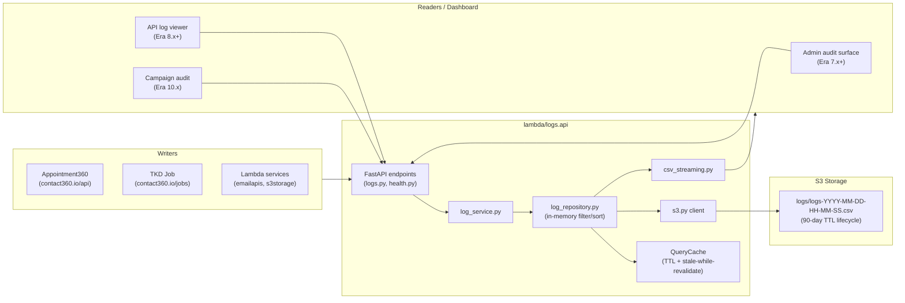

# logs.api Documentation Integration Plan

## What logs.api actually is (critical findings from codebase)

- **Real backend:** S3 CSV files (NOT MongoDB — all existing docs, README, INTEGRATION.md are stale/wrong)
- **Storage path:** `logs/logs-YYYY-MM-DD-HH-MM-SS.csv` in S3, with 90-day lifecycle TTL on `logs/` prefix
- **Auth:** Static `X-API-Key` header via `app/api/dependencies.py`; health endpoints are unauthenticated
- **Caching:** In-memory TTL + stale-while-revalidate (`app/utils/query_cache.py`, `cache_warmer.py`, `cache_metrics.py`)
- **Streaming:** `app/utils/csv_streaming.py` for large query results
- **Middleware:** Compression (`app/middleware/compression.py`) + request monitoring (`app/middleware/monitoring.py`)
- **Deployment:** AWS SAM (`template.yaml`), Lambda Function URLs via `mangum`, supports API GW / ALB / ECS fallback

## API surface (endpoints)

```
POST   /logs              — single log insert
POST   /logs/batch        — batch insert (optimized)
GET    /logs              — filtered query (timestamp, level, service, search text)
GET    /logs/search       — full-text search
GET    /logs/{log_id}     — single log fetch
PUT    /logs/{log_id}     — update (backward compat; GraphQL mutations are primary)
DELETE /logs/{log_id}     — delete single
POST   /logs/delete       — bulk delete by filter
DELETE /logs              — bulk delete
GET    /health            — liveness (unauthenticated, returns cached S3 status)
GET    /health/info       — extended health + config info
```

## Architecture flow




## Files to create (new)

- `[docs/codebases/logsapi-codebase-analysis.md](docs/codebases/logsapi-codebase-analysis.md)` — main deep analysis with era-wise task breakdowns
- `[docs/backend/apis/LOGSAPI_ERA_TASK_PACKS.md](docs/backend/apis/LOGSAPI_ERA_TASK_PACKS.md)` — API module maintenance by era
- `[docs/backend/database/logsapi_data_lineage.md](docs/backend/database/logsapi_data_lineage.md)` — S3 CSV data lineage and retention policy by era
- `[docs/backend/endpoints/logsapi_endpoint_era_matrix.json](docs/backend/endpoints/logsapi_endpoint_era_matrix.json)` — endpoint × era matrix
- `[docs/frontend/logsapi-ui-bindings.md](docs/frontend/logsapi-ui-bindings.md)` — UI/UX surface bindings (pages, tabs, components, hooks, contexts, progress bars, checkboxes, inputs)
- Era task packs (11 files, one per era folder `docs/0`–`docs/10`): `logsapi-*-task-pack.md`

## Files to modify (additions to existing docs)

- `[docs/architecture.md](docs/architecture.md)` — fix `logs.api` service entry (MongoDB → S3 CSV); add logs.api execution spine table
- `[docs/codebase.md](docs/codebase.md)` — fix tech stack label (MongoDB → S3 CSV); add logs.api focused implementation map
- `[docs/backend.md](docs/backend.md)` — add `logs.api backend track by era` table
- `[docs/flowchart.md](docs/flowchart.md)` — add write-path and query-path flow diagrams for logs.api
- `[docs/frontent.md](docs/frontent.md)` — add logs.api UI integration coverage (activity feed, admin log viewer, audit trail components)
- `[docs/governance.md](docs/governance.md)` — add logs.api governance controls (cross-era); require concrete log evidence in version docs
- `[docs/roadmap.md](docs/roadmap.md)` — add logs.api cross-era execution stream
- `[docs/VERSION Contact360.md](docs/VERSION\ Contact360.md)` — add era-to-logging maturity matrix
- `[docs/versions.md](docs/versions.md)` — add logs.api execution spine checklist and era pack index
- `[docs/audit-compliance.md](docs/audit-compliance.md)` — add logs.api compliance controls by era (RBAC events, retention, campaign audit)
- `[docs/docsai-sync.md](docs/docsai-sync.md)` — add logs.api sync additions; require logs evidence check in version files
- `[docs/backend/apis/README.md](docs/backend/apis/README.md)` — add logs.api module maintenance requirements
- `[docs/backend/database/README.md](docs/backend/database/README.md)` — add logs.api S3 CSV lineage notes
- `[docs/backend/postman/README.md](docs/backend/postman/README.md)` — add logs.api Postman validation checklist
- `[docs/codebases/README.md](docs/codebases/README.md)` — add index entry for `logsapi-codebase-analysis.md`
- All 121 `docs/versions/version_*.md` files — add/extend backend API, database, and frontend UX scope sections with era-specific logs.api evidence

## Era task breakdown summary (Contract / Service / Surface / Data / Ops)


| Era    | Contract focus                          | Service tasks                          | Surface (UI/UX)                               | Data/Ops                              |
| ------ | --------------------------------------- | -------------------------------------- | --------------------------------------------- | ------------------------------------- |
| `0.x`  | Health + write contract skeleton        | S3 CSV backend, basic insert           | No UI; health check wiring                    | Smoke logs, baseline retention        |
| `1.x`  | User activity event schema              | Auth/billing event log writes          | Activity badge in sidebar                     | User log TTL policy                   |
| `2.x`  | Email job log event contract            | Finder/verifier log writes             | Job status indicators, progress bars          | Log volume and batch performance      |
| `3.x`  | Contact/company operation logs          | Enrichment/dedup log events            | Filter/search log UI (admin)                  | Log lineage for data audit            |
| `4.x`  | Extension sync event schema             | SN ingestion event logging             | Extension telemetry surfaces                  | Source provenance in logs             |
| `5.x`  | AI workflow telemetry contract          | AI cost/prompt log writes              | AI debug panel log feed                       | AI log retention and cost audit       |
| `6.x`  | SLO and observability log contract      | Log-based RED metrics, cache SLO       | Reliability dashboard log widget              | Error budgets from log evidence       |
| `7.x`  | Audit and compliance log schema         | RBAC event logs, retention enforcement | Admin audit log viewer (tabs, search, filter) | 90-day retention, compliance runbook  |
| `8.x`  | API access log + webhook event schema   | Partner access logs, public API audit  | API log viewer, webhook event feed            | Compatibility and partner reliability |
| `9.x`  | Tenant audit log contract               | Ecosystem connector event logs         | Tenant activity feed, entitlement audit       | Tenant isolation in log queries       |
| `10.x` | Campaign send + compliance log contract | Campaign event log writes              | Campaign audit trail UI, compliance checklist | Immutable campaign log retention      |


## UI/UX component surface (logs.api drives these)

Key dashboard components that bind to logs.api across eras:

- **Activity feed / sidebar badge** (`0.x`–`1.x`): reads recent log entries per user
- **Job status indicators and progress bars** (`2.x`): `JobsCard`, `ExecutionFlow` components pull log events
- **Admin log viewer** (`7.x`): tabbed search/filter UI — text input, date range pickers, level checkboxes, service radio buttons, paginated results table
- **API access log panel** (`8.x`): API key-scoped log query surface
- **Tenant audit feed** (`9.x`): workspace-scoped log viewer with export
- **Campaign audit trail** (`10.x`): immutable log read-only view with compliance checkbox panel

## Execution approach

The task executes in 5 sequential phases to avoid context collisions:

1. Create `logsapi-codebase-analysis.md` and `codebases/README.md` update
2. Update 11 core canonical docs (architecture through docsai-sync)
3. Create 11 era task pack files + 4 backend/frontend inventory files
4. Update `docs/backend/apis/`, `docs/backend/database/`, `docs/backend/postman/`, `docs/frontend/` READMEs
5. Batch-update all 121 `docs/versions/version_*.md` files with per-era logs.api evidence sections

