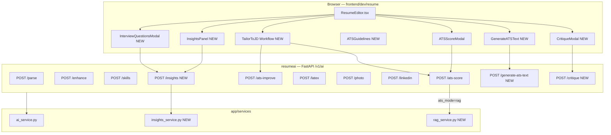

# Resume AI — Full Build Plan

## Architecture Overview




---

## Part 1 — Schema Expansion (coordinated change, do first)

Source: `ai-resume-editor/types.ts` is the canonical target shape.

### 1.1 Pydantic models — `[app/models/resume.py](backend(dev)`/resumeai/app/models/resume.py)

Expand `Education` from slim `(id, institution, degree, duration, score, description[])` to full:

```python
class Education(BaseModel):
    id: str
    institution: str = ""
    degree: str = ""
    fieldOfStudy: str = ""
    startDate: str = ""
    endDate: str = ""
    isCurrent: bool = False
    score: str = ""
    description: List[str] = Field(default_factory=list)
    activities: List[str] = Field(default_factory=list)
    skills: List[str] = Field(default_factory=list)
    media: List[str] = Field(default_factory=list)
```

Expand `Certificate` from slim `(id, name)` to:

```python
class Certificate(BaseModel):
    id: str
    name: str = ""
    issuingOrganization: str = ""
    issueDate: str = ""
    hasExpiry: bool = False
    expirationDate: str = ""
    credentialId: str = ""
    credentialUrl: str = ""
    skills: List[str] = Field(default_factory=list)
    media: List[str] = Field(default_factory=list)
```

### 1.2 DB migration — `[docs/backend/database/migrations/](docs/backend/database/migrations/)`

New SQL file: `expand_resume_schema_education_certificates.sql` — `ALTER TABLE` / column adds on the JSON column or document store.

### 1.3 Frontend types — `[frontend(dev)/resume/src/types.ts](frontend(dev)`/resume/src/types.ts)

Mirror the Pydantic changes exactly in the TypeScript `Education` and `Certificate` interfaces.

---

## Part 2 — Prompt Alignment

Source: `ai-resume-editor/services/geminiService.ts`

### 2.1 `[app/services/ai_service.py](backend(dev)`/resumeai/app/services/ai_service.py)

- **LaTeX:** use `GEMINI_PRO_MODEL` explicitly (already present), align style descriptions and empty-section-omit instruction from the editor's `generateLatexWithGemini` prompt.
- **ATS improve:** add STAR method guidance + "use strong action verbs + quantify" instruction from `enhanceResumeForATSWithGemini`.
- **LinkedIn:** add `tools=[{"googleSearch": {}}]` and `temperature=0.1` to `scrape_linkedin` call (the editor uses `gemini-2.5-pro` with search grounding for LinkedIn).
- **Prompts as constants:** extract each prompt string into a named constant at module top.

---

## Part 3 — ATS Style Presets

Source: `ATS-Resume-Generator/app.py` — `build_prompt` styles dict.

### 3.1 `[app/schemas/requests.py](backend(dev)`/resumeai/app/schemas/requests.py)

```python
ATSStyle = Literal["standard", "tech", "executive", "creative", "entry"]

class ATSImproveRequest(BaseModel):
    resume: Resume
    ats_result: Optional[ATSScoreResult] = ...
    job_description: Optional[str] = ...
    ats_style: ATSStyle = "standard"   # NEW
```

### 3.2 `[app/services/ai_service.py](backend(dev)`/resumeai/app/services/ai_service.py)

Add `_ATS_STYLE_INSTRUCTIONS` dict matching the generator's 5 style descriptions; prepend to `improve_resume_for_ats` prompt.

### 3.3 `[frontend(dev)/resume/src/components/modals/ATSScoreModal.tsx](frontend(dev)`/resume/src/components/modals/ATSScoreModal.tsx)

Add a `<select>` for style before the "Improve with AI" button; pass to `improveResumeForATS` call.

### 3.4 `[frontend(dev)/resume/src/lib/resumeApiClient.ts](frontend(dev)`/resume/src/lib/resumeApiClient.ts)

Add `atsStyle?` parameter to `improveResumeForATS`.

---

## Part 4 — ATS Guidelines Panel (static, no API)

Source: `ATS-Resume-Generator/app.py` — `ATS_GUIDELINES` dict.

### 4.1 New file: `[frontend(dev)/resume/src/components/modals/ATSGuidelinesModal.tsx](frontend(dev)`/resume/src/components/modals/ATSGuidelinesModal.tsx)

Pure React, no fetch: four sections (DO / DON'T / Keywords / Scoring), collapsible. Trigger from Sidebar "ATS Tips" button.

### 4.2 `[frontend(dev)/resume/src/components/layout/Sidebar.tsx](frontend(dev)`/resume/src/components/layout/Sidebar.tsx)

Add `onShowATSGuidelines` prop + `SidebarButton`.

---

## Part 5 — Deterministic Resume Insights + Interview Questions

Source: `smart-resume-analyzer/ml/analyzer.py` — pure-Python heuristics (no sklearn dependency).

### 5.1 New file: `[app/services/insights_service.py](backend(dev)`/resumeai/app/services/insights_service.py)

Port these four functions (stdlib + regex only):

- `quantification_score(text)` → float
- `detect_seniority(text)` → str
- `detect_red_flags(text, matched_skills, missing_skills)` → List[str]
- `generate_interview_questions(text, matched_skills, jd_text)` → List[str] (capped 5)
- `extract_skills(text)` → Set[str] — port `SKILL_DATABASE` + word-boundary regex

### 5.2 `[app/schemas/requests.py](backend(dev)`/resumeai/app/schemas/requests.py)

```python
class ResumeInsightsRequest(BaseModel):
    resume: Resume
    job_description: Optional[str] = Field(None, alias="jobDescription")
```

### 5.3 `[app/schemas/responses.py](backend(dev)`/resumeai/app/schemas/responses.py)

```python
class ResumeInsightsResponse(BaseModel):
    quantification_score: float
    seniority_level: str
    red_flags: List[str]
    interview_questions: List[str]
    matched_skills: List[str]
    missing_skills: List[str]
    skill_match_percentage: float
```

### 5.4 `[app/api/v1/endpoints/ai.py](backend(dev)`/resumeai/app/api/v1/endpoints/ai.py)

```python
@router.post("/insights", response_model=ResumeInsightsResponse)
async def insights(body: ResumeInsightsRequest, _: str = Depends(verify_api_key)):
```

### 5.5 `[frontend(dev)/resume/src/lib/resumeApiClient.ts](frontend(dev)`/resume/src/lib/resumeApiClient.ts)

Add `getResumeInsights(resume, jobDescription?)`.

### 5.6 New file: `[frontend(dev)/resume/src/components/modals/InsightsPanel.tsx](frontend(dev)`/resume/src/components/modals/InsightsPanel.tsx)

Show quantification bar, seniority badge, red-flag chips, interview questions list. Trigger from Sidebar "Insights" button.

---

## Part 6 — Plain-text ATS Generator from Raw Notes

Source: `ATS-Resume-Generator/app.py` — `generate_resume`, `build_prompt`, `SYSTEM_PROMPT`.

### 6.1 `[app/schemas/requests.py](backend(dev)`/resumeai/app/schemas/requests.py)

```python
class GenerateATSTextRequest(BaseModel):
    raw_notes: str
    style: ATSStyle = "standard"
    job_description: Optional[str] = None
```

### 6.2 `[app/schemas/responses.py](backend(dev)`/resumeai/app/schemas/responses.py)

```python
class ATSTextResponse(BaseModel):
    plain_text: str
```

### 6.3 `[app/services/ai_service.py](backend(dev)`/resumeai/app/services/ai_service.py)

New `generate_ats_text(raw_notes, style, job_description)` — Gemini with `SYSTEM_PROMPT` and `build_prompt` logic from the generator (ported, not copied verbatim).

### 6.4 `[app/api/v1/endpoints/ai.py](backend(dev)`/resumeai/app/api/v1/endpoints/ai.py)

`POST /ai/generate-ats-text`.

### 6.5 New file: `[frontend(dev)/resume/src/components/modals/GenerateATSTextModal.tsx](frontend(dev)`/resume/src/components/modals/GenerateATSTextModal.tsx)

Textarea for raw notes, style selector, optional JD, Generate button → show plain text + copy + "Import into editor" (triggers `parseResumeFile` from a generated `.txt` blob).

---

## Part 7 — RAG-Augmented ATS Scoring (optional mode)

Source: `rag-resume-analyzer/app.py`.

### 7.1 New file: `[app/services/rag_service.py](backend(dev)`/resumeai/app/services/rag_service.py)

Pure-numpy cosine (no ChromaDB) for Lambda safety:

```python
async def rag_ats_score(resume: Resume, job_description: str) -> ATSScoreResult:
    # 1. serialize resume to text → chunk (300 chars, 50 overlap)
    # 2. embed chunks + JD via Gemini embedding API (models/text-embedding-004)
    # 3. cosine top-k=7 chunks
    # 4. build_prompt(context, jd) → gemini call
```

Add `requirements.txt`: `numpy` (already likely present), no ChromaDB needed.

### 7.2 `[app/schemas/requests.py](backend(dev)`/resumeai/app/schemas/requests.py)

Add `ats_mode: Literal["full", "rag"] = "full"` to `ATSScoreRequest`.

### 7.3 `[app/api/v1/endpoints/ai.py](backend(dev)`/resumeai/app/api/v1/endpoints/ai.py)

Route to `rag_service.rag_ats_score` when `ats_mode == "rag"`.

### 7.4 `[frontend(dev)/resume/src/components/modals/ATSScoreModal.tsx](frontend(dev)`/resume/src/components/modals/ATSScoreModal.tsx)

Optional toggle "Focus on JD match (RAG mode)" — only shown if `jobDescription` is set.

---

## Part 8 — Fun Critique / Roast Mode

Source: `Resume-Roaster/app.py` (prompt shape); use Gemini not local Llama.

### 8.1 `[app/schemas/requests.py](backend(dev)`/resumeai/app/schemas/requests.py)

```python
class CritiqueRequest(BaseModel):
    resume: Resume
    tone: Literal["professional", "roast"] = "professional"
```

### 8.2 `[app/schemas/responses.py](backend(dev)`/resumeai/app/schemas/responses.py)

```python
class CritiqueResponse(BaseModel):
    critique: str
    suggestions: List[str]
    rating: int  # 1-10
```

### 8.3 `[app/services/ai_service.py](backend(dev)`/resumeai/app/services/ai_service.py)

`generate_critique(resume, tone)` — Gemini with JSON schema, temperature 0.7 for roast / 0.4 for professional.

### 8.4 `[app/api/v1/endpoints/ai.py](backend(dev)`/resumeai/app/api/v1/endpoints/ai.py)

`POST /ai/critique`.

### 8.5 New file: `[frontend(dev)/resume/src/components/modals/CritiqueModal.tsx](frontend(dev)`/resume/src/components/modals/CritiqueModal.tsx)

Tone toggle, trigger, animated rating ring (like Resume-Roaster UI), typewriter critique text, suggestions list. Gate behind opt-in ("Are you sure?").

---

## Part 9 — DOCX Upload Support

Source: `smart-resume-analyzer/ml/extractor.py`.

### 9.1 `[app/api/v1/endpoints/ai.py](backend(dev)`/resumeai/app/api/v1/endpoints/ai.py)

`/parse` accepts `.docx` mime types; call new `_extract_docx_text(bytes)` before handing to Gemini.

### 9.2 `[app/services/ai_service.py](backend(dev)`/resumeai/app/services/ai_service.py)

Add `_extract_docx_text` using `python-docx` (paragraphs + table cells); fall back to raw bytes if extraction fails.

### 9.3 `requirements.txt`

Add `python-docx>=1.1.0`.

### 9.4 Frontend

Update `parseResumeFile` accept string: `accept=".pdf,.docx"` in file inputs.

---

## Part 10 — Guided Tailor-to-JD Workflow UI

Source: `ai-resume-architect` concept — no React Flow needed; use a step-stepper component.

### 10.1 New file: `[frontend(dev)/resume/src/components/modals/TailorToJDModal.tsx](frontend(dev)`/resume/src/components/modals/TailorToJDModal.tsx)

Four steps (current resume → JD input → ATS Score → Apply Improvement):

- Step 1: confirm using current editor resume or upload new file
- Step 2: paste JD text + choose ATS style
- Step 3: calls `checkATSScore` → shows score, strengths, gaps
- Step 4: calls `improveResumeForATS` → merges result into editor via `onApplyResume` callback

### 10.2 `[frontend(dev)/resume/src/ResumeEditor.tsx](frontend(dev)`/resume/src/ResumeEditor.tsx)

Wire `onShowTailorWorkflow` handler to Sidebar button; `onApplyResume` merges updated Resume via Immer.

### 10.3 `[frontend(dev)/resume/src/components/layout/Sidebar.tsx](frontend(dev)`/resume/src/components/layout/Sidebar.tsx)

Add "Tailor to Job" primary button.

---

## Part 11 — Postman + Docs Update

- Add new routes to `[backend(dev)/resumeai/postman/Resume_AI_Service.postman_collection.json](backend(dev)`/resumeai/postman/Resume_AI_Service.postman_collection.json): `/insights`, `/generate-ats-text`, `/critique`, updated `/ats-score` and `/ats-improve` with new fields.
- Add entries to `[docs/backend/apis/29_RESUME_AI_REST_SERVICE.md](docs/backend/apis/29_RESUME_AI_REST_SERVICE.md)`.
- Add `GEMINI_EMBEDDING_MODEL` env to `[template.yaml](backend(dev)`/resumeai/template.yaml) and `[backend(dev)/resumeai/.env](backend(dev)`/resumeai/.env) for RAG.

---

## Execution Order

1. Schema expansion (Part 1) — unblocks all other parts
2. Prompt alignment (Part 2) — safe, no breaking changes
3. DOCX support (Part 9) — small, high value
4. Insights service (Part 5) — pure Python, no new deps
5. ATS style presets (Part 3) + Guidelines panel (Part 4)
6. Generate ATS text (Part 6)
7. RAG scoring (Part 7) — requires Gemini embedding API call
8. Critique / Roast (Part 8)
9. Tailor-to-JD workflow UI (Part 10)
10. Postman + docs (Part 11)

