# Add Flowchart Sections to All Version Files

## What exists today

121 files under `[docs/versions/](docs/versions/)`. Two structural types:

- **Placeholder** (~60 files, e.g. `[0.0 — Pre-repo baseline.md](docs/versions/0.0 — Pre-repo baseline.md)`, `[1.3 — Payment Gateway.md](docs/versions/1.3 — Payment Gateway.md)`): short status block + References. No five-track.
- **Rich** (~60 files, e.g. `[1.0 — User Genesis.md](docs/versions/1.0 — User Genesis.md)`, `[5.1 — Orchestration Live.md](docs/versions/5.1 — Orchestration Live.md)`): status block + `## Five-track task breakdown` + References.

`[docs/flowchart.md](docs/flowchart.md)` already holds three diagrams: core request flow, stage execution decomposition (per minor), and era transition flow. These become the canonical sources the per-file sections reference.

---

## Diagram design (two types per file)

### Type 1 — Delivery flowchart (every file, identical template)

Shows the five-track decomposition for this specific minor. Uses version-specific node labels.

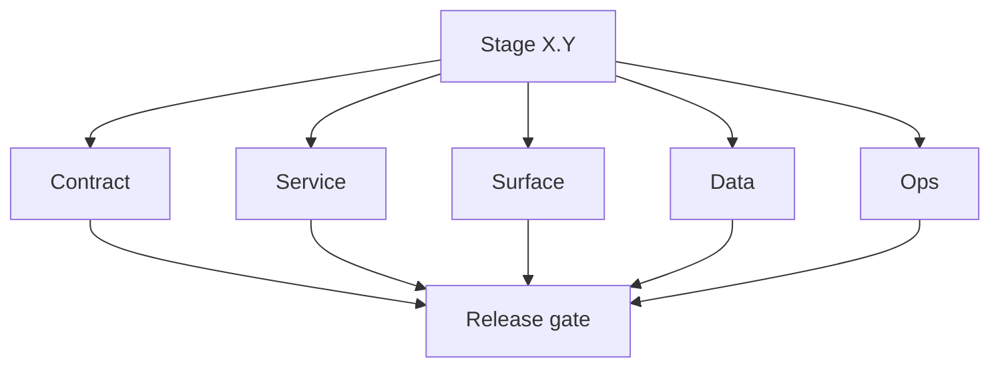

### Type 2 — Runtime flowchart (era-specific, shows services active in this minor)

Different mermaid content per major era. Representative content:

**0.x — Foundation bootstrap**

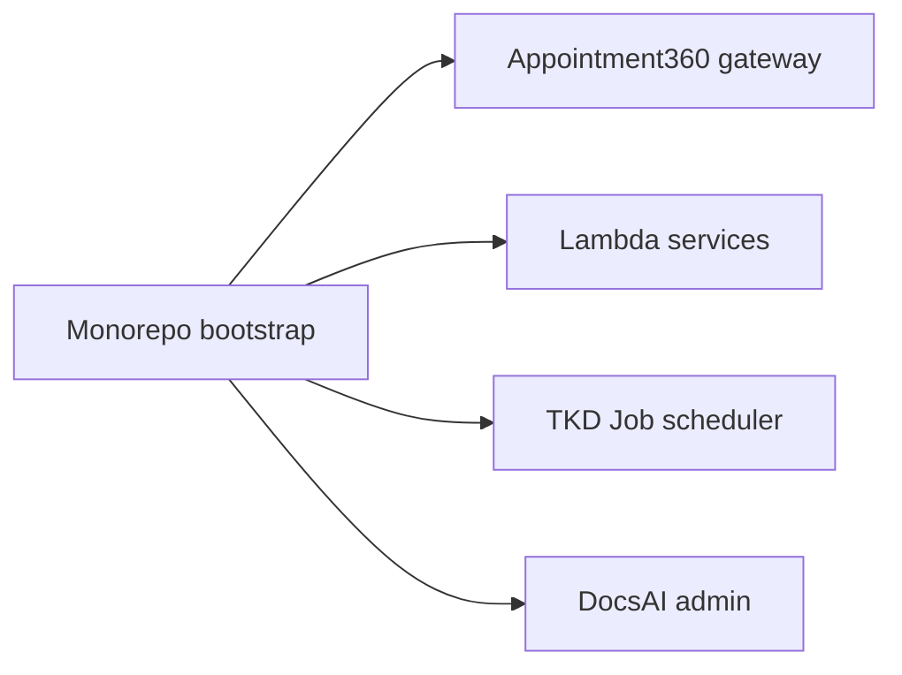

**1.x — MVP core (auth → credits → finder → verifier → results)**

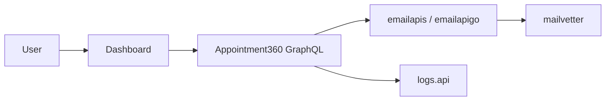

**1.1 — Bulk / billing (extended 1.x)**

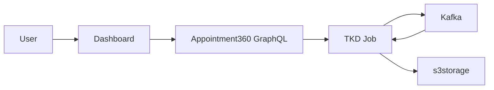

**2.x — Connectra intelligence**

**3.x — Extension / Sales Navigator**

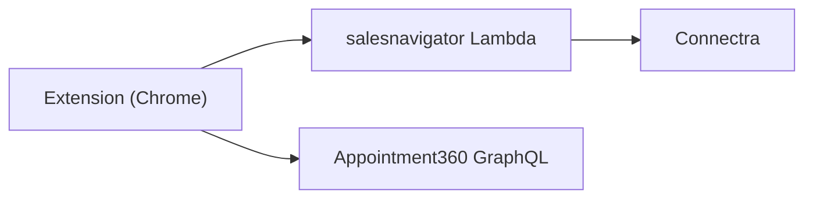

**4.x — AI workflows**

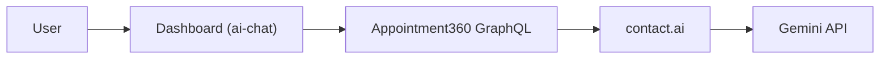

**5.x — Reliability / scale**

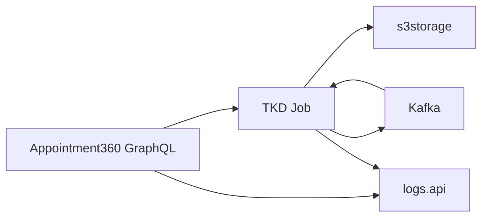

**6.x — Enterprise / RBAC / audit**

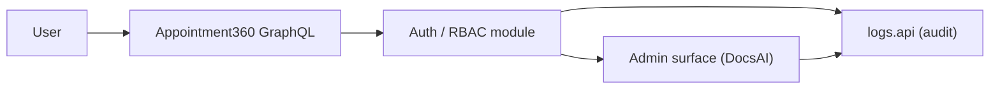

**7.x — Analytics platform**

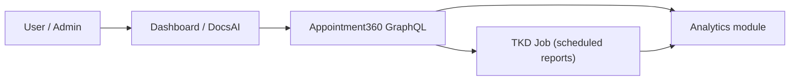

**8.x — Integration ecosystem**

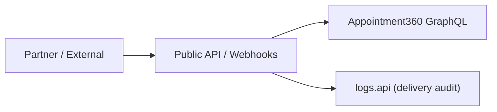

**9.x — Productization / multi-tenant**

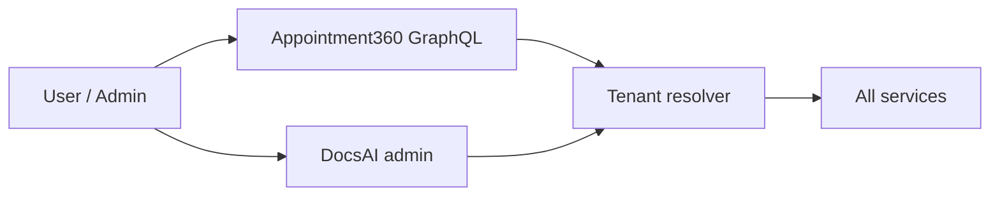

**10.x — Unified platform**

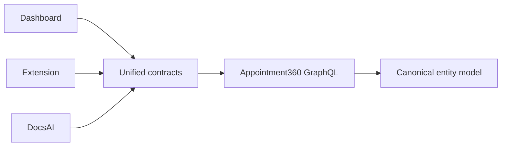

---

## Placement rules

- **Placeholder files**: insert `## Flowchart` between the status/summary bullet block and `## References`.
- **Rich files**: insert `## Flowchart` between the status/summary bullet block and `## Five-track task breakdown`.
- Every section ends with: `See also:` [docs/flowchart.md](../flowchart.md) `for system-wide and master views.`

---

## Task 1 — Update `docs/flowchart.md`

Add a new `## Contact360 master view` section containing:

- Era progression strip (0.x → 10.x with era labels, extends the existing "Era transition flow").
- Combined runtime diagram (the existing core request flow, already in file).
- Note that per-minor drill-downs live in `docs/versions/version_*.md`.

---

## Task 2 — Placeholder files (~60 files)

Files such as `0.0 — Pre-repo baseline.md`, `0.2 — Schema & migration bedrock.md` … `0.10 — Ship & ops hardening.md`, `1.3 — Payment Gateway.md`, `1.4 — Usage Ledger.md`, `1.5 — Notification Rail.md`, `2.1 — Finder Engine.md` … `2.10 — Email System Exit Gate.md`, and all `.x.10` stubs through `10.10 — Placeholder Policy.md`.

Each gets:

- Type 1 delivery diagram (generic "Stage X.Y" label).
- Type 2 era runtime diagram (era-specific template from above).
- Link back to `docs/flowchart.md`.

---

## Task 3 — Rich files (~60 files), by era batch

Each gets:

- Type 1 delivery diagram (with correct stage/version label, e.g. "Stage 1.1 — Bulk + Billing").
- Type 2 era runtime diagram (more specific than placeholder; for minor-specific files like `1.1 — Billing Maturity.md`, the diagram highlights the bulk/billing pipeline path).
- Link back to `docs/flowchart.md`.

Sub-batches:

- **Batch 3a:** `0.1 — Monorepo bootstrap.md`, `1.0 — User Genesis.md`, `1.1 — Billing Maturity.md`, `1.2 — Analytics Bedrock.md` (0.x and 1.x rich files).
- **Batch 3b:** `2.0 — Email Foundation.md`, `3.0 — Twin Ledger.md`, `4.0 — Harbor.md` (intelligence / extension / AI eras).
- **Batch 3c:** `5.0 — Neural Spine.md` + `5.1 — Orchestration Live.md` through `5.9 — Explainability Export.md` (reliability era).
- **Batch 3d:** `6.0 — Reliability and Scaling era umbrella.md` + `6.1 — SLO and error-budget baseline.md` through `6.9 — Release candidate hardening for 700.md` (enterprise era).
- **Batch 3e:** `7.0 — Deployment era baseline lock.md` through `7.9 — 80 RC Fortress.md` (analytics era).
- **Batch 3f:** `8.0 — API Era Foundation.md` through `8.9 — API Release Candidate.md` (integration era).
- **Batch 3g:** `9.0 — Ecosystem Foundation.md` through `9.9 — Productization RC.md` (productization era).
- **Batch 3h:** `10.0 — Campaign Bedrock.md` through `10.9 — Governance Lock.md` (unified platform era).

