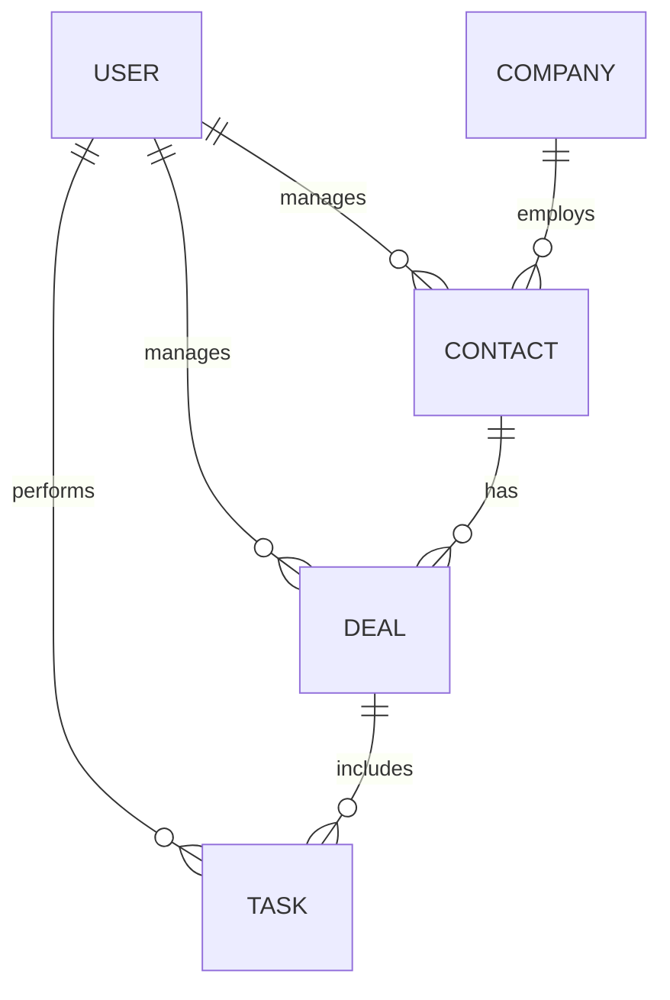

# Contact360: End-to-End System Design and Implementation Plan

## Executive Summary

**Contact360** is envisaged as a modular, cloud-ready customer relationship management (CRM) platform with a web UI, multiple backend microservices, and a database. This report outlines a proposed system architecture and development plan, covering technology selections, architecture diagrams (including mermaid flowcharts and ER diagrams), component interactions, deployment topology, and development practices. We assume a modern cloud environment (e.g. AWS or equivalent), moderate user load, and a team of ~6–10 developers. Core user flows (e.g. user login, managing contacts/deals, tasks) will traverse the frontend and backend services as shown in the architecture below. We recommend a microservices-based design: each service has its own repository and CI/CD pipeline【3†L117-L121】. The frontend (e.g. a React/Vue application) calls an API gateway or directly the services via REST/GraphQL/gRPC (to be decided) while authenticated via OAuth2/JWT. Data is stored in either an SQL database (e.g. PostgreSQL) or NoSQL (e.g. MongoDB) depending on need, with a well-defined schema (ER diagram below). We will employ containers (Docker) and Kubernetes for deployment, with CI/CD (GitOps or Azure DevOps/GitHub Actions) automating builds and deployments. Observability (logging, Prometheus/Grafana metrics, tracing via OpenTelemetry/Jaeger) and security (OWASP Top 10 mitigation, secrets management, RBAC) are integrated from the start. Testing includes unit tests per service, integration tests (service+DB), and end-to-end UI tests (e.g. Cypress). A phased development timeline with milestones is provided at the end. The following sections detail each aspect rigorously, with comparisons of technology choices and sample code/configs.  

## System Architecture and Component Interaction

The **overall architecture** is based on loosely-coupled microservices. A user’s browser interacts with the Web UI (a single-page app) which calls backend services (e.g. Auth, Contacts, Deals, Tasks) through an API Gateway or directly via REST/gRPC/GraphQL. Each service has its own database or schema to enforce data encapsulation【3†L117-L121】. For example, an **Authentication Service** validates users and issues JWTs; a **Contact Service** manages contact entities; a **Deal Service** handles sales opportunities; etc. Services communicate via synchronous APIs (REST/GraphQL) or asynchronous events (e.g. a messaging queue like RabbitMQ/Kafka). Databases (SQL or NoSQL) store entities; for scalability, stateful stores like MongoDB could shard documents, or PostgreSQL can use read replicas. Below is a high-level architecture flowchart (mermaid) illustrating components and data flows:

```mermaid
flowchart LR
    subgraph User
      Browser[User Browser]
    end
    subgraph Frontend
      UI[Web UI (React/Vue)]
    end
    subgraph Backend
      APIGW[API Gateway]
      AuthSVC[Auth Service]
      ContactSVC[Contact Service]
      DealSVC[Deal Service]
      TaskSVC[Task Service]
    end
    subgraph Databases
      AuthDB[(Auth DB)]
      ContactDB[(Contact DB)]
      DealDB[(Deal DB)]
      TaskDB[(Task DB)]
    end

    Browser --> UI
    UI --> APIGW
    APIGW --> AuthSVC
    APIGW --> ContactSVC
    APIGW --> DealSVC
    APIGW --> TaskSVC
    AuthSVC --> AuthDB
    ContactSVC --> ContactDB
    DealSVC --> DealDB
    TaskSVC --> TaskDB
```

In a typical **request flow**, a user logs in via the Web UI, which calls `POST /login` on the Auth Service. The Auth Service checks credentials in its database and returns a JWT. The UI then calls, for example, `GET /contacts` on the Contact Service (via the API Gateway) including the JWT. The Contact Service verifies the token (or consults the Auth service) and queries the ContactDB. Similar flows handle creating/updating contacts, deals, etc. For asynchronous tasks (e.g. sending email notifications), services can emit events to a message broker, allowing decoupling.

The **deployment topology** (cloud-agnostic) would place each service in a container (Docker) within a Kubernetes cluster. A Load Balancer or Ingress routes traffic to the API Gateway (which could be an NGINX/Envoy proxy or a managed gateway). Backend services run in pods behind the gateway. Databases run either as managed cloud services (e.g. AWS RDS/CosmosDB) or containerized stateful sets. A CDN or edge caching layer can serve the static assets of the Web UI. Kubernetes manifests (example below) declare Deployments and Services for each component. This setup ensures horizontal scaling (Pods can auto-scale on load) and fault tolerance (if one Pod fails, others handle the load; multiple database replicas ensure resilience).  

The **high-level component interactions** can be summarized by the following sequence (user perspective):

1. **Login flow:** Browser → Web UI (`POST /login`) → Auth Service (DB) → Web UI (JWT) → Contact Service (`GET /contacts` with token) → Contact Service (DB) → Web UI.
2. **Data entry:** Browser → Web UI (`POST /contact`) → Contact Service → ContactDB → Web UI.
3. **Service collaboration:** Contact Service might emit an event (e.g. “New Contact Added”) to a message queue. Other services (e.g. a Notification Service) consume these events asynchronously to perform follow-ups.
4. **Deployment:** Container registry stores built images; Kubernetes pulls images and orchestrates Pods. CI/CD automates building images on Git push, running tests, and applying K8s manifests (see CI/CD section).

The following mermaid **ER diagram** shows key database entities and relationships (e.g. each contact may belong to a company; deals are associated with contacts; tasks are assigned to users and related to deals):



This indicates, for instance, that **USER** `1-to-many` **CONTACT** (each user manages many contacts), **CONTACT** `1-to-many` **DEAL**, and **DEAL** `1-to-many` **TASK**. (Fields like primary keys, email, etc., would be defined in each table/collection schema.)

## Technology Stack Options (Front-end, Back-end, Databases, etc.)

Choosing the right technologies is crucial. Below we compare major options in key categories:

- **Front-end Frameworks:** Popular choices include React, Angular, Vue, and Svelte. As of 2023, React is most widely used (~40% usage) with a vast ecosystem, while Angular (~17%) and Vue have strong support【15†L1660-L1666】. **Pros/Cons:** React (JSX, virtual DOM, strong community) vs. Angular (TypeScript-based, batteries-included, steeper learning) vs. Vue (lightweight, easy to learn) vs. Svelte (compiled, very fast, but smaller ecosystem). AscendientLearning (2023) noted React’s massive community and simplicity, Angular’s structure for enterprise apps, and Vue/Svelte’s ease of use【11†L194-L199】.

- **Back-end Languages/Platforms:** Popular server-side options include Node.js (JavaScript/TypeScript), Python, Java (Spring Boot), Go, and .NET Core. 2023 surveys show JavaScript (Node.js) is used by ~42% of developers (the top “web framework” on StackOverflow)【15†L1660-L1666】; in general JavaScript tops the list of languages (~64%), followed by Python (~49%)【32†L19-L23】. **Pros/Cons:** Node.js (event-driven, full-stack JS) is excellent for real-time I/O but single-threaded; Python (Django/Flask) is easy and has rich libraries but may be slower; Java/Spring (robust, many enterprise features) has high performance but more ceremony; Go (lightweight concurrency, fast) is good for microservices but has fewer libraries; .NET (C#) is mature and cross-platform (with .NET 6+) but heavier on Windows origins. We recommend Node.js or Python for speed of development, though Java/Go could be chosen for high-throughput scenarios.

- **API Styles:** Common choices are **REST (HTTP/JSON)**, **GraphQL**, and **gRPC**.
  - *REST* is ubiquitous and easy (HTTP verbs + JSON) but can lead to over/under-fetching and many endpoints.  
  - *GraphQL* (query language) lets the client request exactly needed data in one query【38†L501-L505】, which is great for flexible UIs. Apollo GraphQL notes it unifies data from multiple services into one API layer【38†L386-L394】. However, GraphQL adds complexity (setup, caching, etc.).
  - *gRPC* (HTTP/2 + Protobuf) offers high performance and strong typing across languages【40†L29-L36】【40†L43-L48】. It’s ideal for inter-service communication (low overhead, built-in streaming), but not natively usable by browsers (would need gRPC-Web or translation).
  - *WebSockets* or server-sent events may be used for real-time updates (e.g. live notifications).
  A hybrid approach is common: e.g. external clients use REST or GraphQL, while microservices communicate via gRPC or message queues.
  We will weigh these trade-offs in our table below.

- **Databases (SQL vs NoSQL):** Options include relational (PostgreSQL, MySQL) vs. document stores (MongoDB), key-value (Redis), etc.
  - *Relational (SQL)* databases (Postgres/MySQL) provide ACID transactions and powerful joins; they excel at structured data. They can be scaled vertically or with read-replicas, but complex distributed transactions are harder【35†L537-L545】【35†L568-L576】.
  - *NoSQL* (MongoDB, DynamoDB, Cassandra) offers horizontal scalability and flexible schemas for unstructured data【35†L601-L610】. Schemas can evolve (dynamic JSON documents) and sharding is built-in【35†L601-L610】. However, NoSQL typically sacrifices strong consistency and joins: developers may need to handle eventual consistency【35†L631-L639】.
  In many modern apps, a combination is used (e.g. user/auth in SQL for consistency, logs/events in NoSQL). The table below compares these:

| Category            | Options/Examples       | Pros                                    | Cons                                      |
|---------------------|------------------------|-----------------------------------------|-------------------------------------------|
| **Frontend**        | React, Angular, Vue, Svelte | React: huge ecosystem, flexibility; Angular: rich framework, TypeScript; Vue/Svelte: simplicity, performance【15†L1660-L1666】【11†L194-L199】 | React/Angular: larger bundle size; Angular: steep learning; Vue/Svelte: smaller community |
| **Backend**         | Node.js, Python, Java, Go, .NET | Node.js: full-stack JS, non-blocking; Python: rapid dev, many libs; Java/Spring: performance, enterprise-ready; Go: lightweight concurrency【32†L19-L23】 | Node.js: single-threaded; Python: slower; Java: verbose; Go: younger ecosystem |
| **API Style**       | REST/JSON, GraphQL, gRPC, WebSockets | REST: simple, cacheable; GraphQL: exact-fetch, single endpoint【38†L501-L505】; gRPC: high-throughput, streaming【40†L29-L36】; WebSocket: real-time | REST: overfetching, many endpoints; GraphQL: more complex backend; gRPC: not native to browsers; WebSocket: connection overhead |
| **Databases**      | SQL (Postgres, MySQL) vs. NoSQL (Mongo, DynamoDB) | SQL: ACID transactions, rich queries; NoSQL: horizontal scale, flexible schema【35†L537-L545】【35†L601-L610】 | SQL: scaling joins/distributed can be tough; NoSQL: eventual consistency, no standard query language【35†L631-L639】 |
| **Messaging**       | RabbitMQ, Apache Kafka | RabbitMQ: mature, supports complex routing (exchanges); Kafka: extremely high throughput, persistence, log-based partitioning【42†L53-L61】 | RabbitMQ: limited horizontal throughput; Kafka: heavier operational overhead (ZooKeeper/KRaft), no message priority【42†L53-L61】 |
| **Auth**            | OAuth2/JWT, Session Cookies | OAuth2/JWT: stateless, scalable; widely supported; Session: simpler, built-in with web frameworks | JWT requires secure handling of tokens (expiration, storage) and key rotation; sessions need sticky routing or shared store |

Each choice should be justified by project needs. For **Auth**, a standard approach is OAuth2 password grant + JWT tokens for stateless APIs, perhaps using an Identity Provider. **Messaging** could use RabbitMQ for tasks/notifications (easy AMQP) and Kafka if real-time streaming of high-volume events is needed.

## Repository/Folder Structure

We recommend one code repository per microservice (polyrepo) for independent deployment pipelines【3†L117-L121】, or a single monorepo with subfolders if preferred. For example, a monorepo might look like:

```plaintext
contact360/
├── frontend/                    # Web UI codebase (e.g. React app)
│   ├── src/
│   ├── public/
│   └── package.json
├── services/                    # Backend microservices
│   ├── auth-service/
│   │   ├── src/
│   │   ├── package.json
│   │   ├── Dockerfile
│   │   └── ... 
│   ├── contact-service/
│   │   ├── src/
│   │   ├── package.json
│   │   ├── Dockerfile
│   │   └── ...
│   ├── deal-service/
│   └── task-service/
├── infra/                       # Infrastructure-as-Code
│   ├── k8s/                     # Kubernetes manifests
│   └── terraform/               # (or cloudformation) for infra
├── docs/                        # Architecture diagrams, design docs
└── .gitignore / README.md 
```

Each service directory has its own code, Dockerfile, and CI pipeline (e.g. GitHub Actions or Azure Pipelines). Azure’s reference example uses either a monorepo with per-service folders or separate repos【46†L74-L82】【3†L117-L121】. This structure keeps concerns separated and allows teams to work on services in parallel. Common libraries (e.g. shared auth utilities) can be managed via private packages or git submodules if needed.

## Detailed API Design

We now outline example REST API endpoints and schemas for core services (assuming REST/JSON for illustration). Each service typically has endpoints for CRUD operations. For instance:

- **Auth Service**  
  - `POST /login` – {username, password} → returns {token, expires}.  
  - `POST /signup` – {user details} → {userId}.  

- **Contact Service**  
  - `GET /contacts` – returns list of contacts (with pagination).  
  - `POST /contacts` – {firstName, lastName, email, phone, companyId} → {contactId}.  
  - `GET /contacts/{id}` – returns a contact.  
  - `PUT /contacts/{id}` – update fields.  
  - `DELETE /contacts/{id}`.

- **Deal Service**  
  - `GET /deals` – list deals.  
  - `POST /deals` – {title, value, stage, contactId} → {dealId}.  

- **Task Service**  
  - `GET /tasks` – list tasks.  
  - `POST /tasks` – {title, dueDate, assignedUserId, dealId} → {taskId}.  

Request/response schemas (JSON) can be documented with OpenAPI/Swagger. For example, a **Contact** JSON schema:
```json
{
  "id": "uuid",
  "firstName": "string",
  "lastName": "string",
  "email": "string",
  "phone": "string",
  "companyId": "uuid",
  "createdAt": "datetime"
}
```
And a **Deal** schema:
```json
{
  "id": "uuid",
  "title": "string",
  "value": "number",
  "stage": "string",  // e.g. 'prospect','closed'
  "contactId": "uuid",
  "createdBy": "uuid",
  "createdAt": "datetime"
}
```

We also incorporate authentication: endpoints are protected (e.g. via an API Gateway that checks JWTs). Errors follow a common structure (HTTP status + JSON `{error, message}`).

## Database Schema (ER Diagram)

We propose a relational schema like this (shown here in mermaid ER format). Key entities include **User**, **Contact**, **Company**, **Deal**, **Task**. Arrows denote foreign keys (|| one, o{ many):


This corresponds to tables such as:

- **user** (id [PK], name, email, password_hash, role, created_at)  
- **company** (id [PK], name, industry, created_at)  
- **contact** (id [PK], first_name, last_name, email, phone, company_id [FK→company.id], created_by [FK→user.id], created_at)  
- **deal** (id [PK], title, value, stage, contact_id [FK→contact.id], created_by [FK→user.id], created_at)  
- **task** (id [PK], title, due_date, assigned_to [FK→user.id], deal_id [FK→deal.id], status, created_at).

Implementing this in a NoSQL database (like MongoDB) would entail collections with analogous fields, embedding or linking via IDs.

## CI/CD Pipeline Steps

An automated CI/CD pipeline ensures rapid, reliable delivery【46†L62-L70】. A recommended pipeline (using GitHub Actions, Jenkins, or Azure DevOps) could be:

1. **Source Control:** Developers push to feature branches.  
2. **CI Build:** On each push/PR, run a CI pipeline:
   - Check out code, install dependencies, lint.  
   - **Run unit tests** for the service (Jest/Mocha for JS, PyTest for Python, JUnit for Java). Quick feedback is key【46†L139-L147】.  
3. **Build Artifacts:** If unit tests pass, build the Docker image (and run vulnerability scans). Tag the image (e.g. `service:v1.2.3`)【46†L173-L181】.  
4. **Push to Registry:** Push the Docker image to a registry (Docker Hub or cloud registry).  
5. **Deploy:** On merge to `main` or on creating a release branch, trigger CD:
   - Use `kubectl apply` (or Helm charts) to deploy updated Deployment/Service manifests to a staging namespace.  
   - Run integration tests (smoke tests, contract tests).  
   - If stable, promote to production (e.g. `kubectl apply` in prod, or GitOps pull).
Quality gates (code review, test coverage thresholds) are enforced at each stage. Azure’s example uses separate pipelines per service with release branches triggering full builds【46†L173-L181】. This modular pipeline (one pipeline per service) allows teams to deploy independently without affecting others【46†L74-L82】【3†L117-L121】.

## Testing Strategy

Testing follows a **pyramid approach**: many unit tests, fewer integration tests, and a handful of end-to-end (E2E) tests.

- **Unit Tests:** Every function/method (business logic, utility) is covered by unit tests using frameworks like **Jest**, **Mocha/Chai** (for JS), **JUnit** (Java), or **pytest** (Python). For the frontend, use **Jest + React Testing Library**. The CI build runs these tests on every commit.
- **Integration Tests:** These verify service components together: e.g. the Contact Service endpoint works with the database. Use test containers or mocks to spin up a test database (Postgres/MySQL) or a test instance of MongoDB. Tools like **Postman/Newman** or **Supertest** (for Node) can hit real endpoints in a staging environment.
- **Contract Tests:** In a microservices context, consider consumer-driven contract tests (e.g. Pact) to ensure API agreements are met between services.
- **End-to-End (E2E) Tests:** A small suite (5–10) of full-stack tests using **Cypress** or **Selenium**. These simulate user flows: login, create/view contacts, create deals, etc. They run against a deployment (staging) in the CI/CD pipeline.
- **Performance/Load Testing:** Basic load tests (e.g. with **JMeter** or **k6**) on the API under expected traffic.

Automated tests are integrated into the CI/CD pipelines to prevent regressions.

## Observability (Logging, Metrics, Tracing)

We implement the three pillars of observability【44†L35-L43】:

- **Logging:** All services emit structured logs (JSON) including timestamps, levels, service name, request IDs, user IDs. Logs are forwarded to a centralized system (e.g. ELK/EFK stack or cloud logging like AWS CloudWatch). Logging important context (errors, slow queries) is critical. OWASP also highlights logging as an area to protect (avoid leaking secrets)【51†L82-L90】.
- **Metrics:** Each service exposes Prometheus metrics (e.g. via `/metrics` endpoint). We track API latency, error rates, throughput, CPU/memory usage. Grafana dashboards visualize these metrics. Metrics help answer “what” is happening (e.g. CPU high, response time spiking).
- **Tracing:** Use **OpenTelemetry** (or similar) to instrument services for distributed tracing. Each incoming HTTP request gets a trace ID passed to downstream calls, so we can see end-to-end call chains (e.g. UI→API Gateway→Auth→DB). Traces reveal “where” time is spent. Jaeger or Zipkin can be used to store/display traces. IBM notes that these pillars allow diagnosing root causes without custom logging【44†L35-L43】【44†L52-L57】. We would include health checks and expose metrics like /health.

## Security Considerations

Security is enforced at multiple layers:

- **Authentication & Authorization:** We recommend OAuth2 with JWTs or a similar token-based scheme. JWT tokens (signed with a secret/key) are passed by the client on each request (via Authorization header). Services verify tokens (signature, expiry). Store passwords hashed (e.g. bcrypt). Use RBAC to restrict endpoints (e.g. only owners can delete their contacts). OWASP Top 10 (2025) reminds us to guard against Broken Access Control and Injection【51†L82-L90】.
- **OWASP Protections:** Ensure inputs are validated/sanitized to prevent SQL Injection, NoSQL injection, XSS, etc. Use prepared statements/ORMs. Set secure HTTP headers (CSP, XSS protection). Run static code analysis and SAST tools.
- **Secrets Management:** Store secrets (DB passwords, API keys) outside code, e.g. in Kubernetes Secrets or a vault. Ensure TLS everywhere (HTTPS and for gRPC channels). Regularly rotate keys.
- **Dependency Scanning:** Our CI pipeline runs dependency vulnerability scans (e.g. Snyk, npm audit) and flags issues.
- **Penetration Testing:** Prior to launch, conduct a security audit (maybe external or using tools like OWASP ZAP).

By following security **best practices**, we mitigate common risks and secure both data-at-rest (encrypted DB volumes) and data-in-transit (TLS).

## Data Migration and Backup Strategy

- **Database Migrations:** We will use migration tools (e.g. **Flyway**, **Liquibase**, or **TypeORM migrations**) for SQL schemas, and versioned migration scripts for NoSQL. Migrations are in code (version-controlled) and applied automatically during deployment (CI build may run migrations before starting the new service).
- **Backups:** For production DBs, schedule regular backups. For SQL, use nightly dumps/snapshots or managed service automated backups (e.g. AWS RDS automated snapshots). For MongoDB, use **mongodump** or cloud-provider backups. Maintain at least daily backups, with retention (e.g. 30 days).
- **Replication:** Use database replication (master-slave or cluster) for high availability. E.g. PostgreSQL streaming replicas; MongoDB replica sets.
- **Data Consistency:** For migrating existing data (if any), plan a strategy (big-bang vs incremental【53†L138-L147】). A “trickle” migration (small batches with parallel operation) can minimise downtime. The Striim guide notes that trickle/zero-downtime migrations reduce risk【53†L138-L147】.
- **Offsite Storage:** Store backups offsite or in a different availability zone. Test restore procedures regularly.

## Scalability and Fault Tolerance

The architecture supports horizontal scaling and redundancy. Key patterns:

- **Stateless Services:** All backend services are stateless (no in-memory session). State lives in DB or cache. This allows Kubernetes to spawn many replicas behind a load balancer.  
- **Load Balancing:** A Kubernetes Service or Ingress load-balances requests across pods. Auto-scaling rules can increase replicas based on CPU or custom metrics.  
- **Caching:** Introduce a caching layer (e.g. **Redis** or CDN) for frequently accessed data (e.g. static assets, session cache, query cache) to reduce DB load and latency.  
- **Circuit Breaker/Retry:** Use libraries (e.g. Netflix Hystrix, Resilience4j, or built-in Spring retry) to automatically retry transient failures and open circuits on persistent failures to prevent cascading issues.  
- **Bulkheads:** Isolate critical services so one failing service cannot exhaust resources for others.  
- **Redundancy:** Run multiple instances of each service. Use database replicas (multiple masters/read-replicas) so if one node fails, the other takes over (true spare capacity)【56†L15-L24】. AWS notes fault tolerance requires redundant subsystems【56†L15-L24】. We ensure “fault isolation” via microservices boundaries: a failure in the Contact Service, for example, won’t crash the Deal Service【56†L22-L25】.  
- **Circuit Definition:** “Static stability” is achieved by decoupling data plane from control plane: e.g. the UI should still run from cached content if DB is temporarily down【56†L45-L54】.  

For example, if a Deal Service instance crashes, Kubernetes restarts it and the LoadBalancer routes traffic to other pods. Using multiple AZs or regions (if cloud) further protects against datacenter failure. Monitoring (health probes) trigger Pod restarts as needed.

## Development Timeline with Milestones

A **phased approach** is recommended. Assume an agile team of ~6–8 developers over ~20 weeks:

- **Phase 1 (Weeks 1–3): Requirements & Design.** Finalize scope and user stories. Architect the system (high-level diagrams, data model). Decide tech stack (perhaps in prototyping mode). Set up development environments. *(Milestone: Architectural design approved.)*

- **Phase 2 (Weeks 4–6): Infrastructure & CI/CD Setup.** Configure repositories, CI pipelines, and basic infra (Kubernetes cluster or cloud test environment). Establish coding standards, develop base Dockerfiles and Helm charts (or k8s manifests). *(Milestone: CI pipeline builds Docker images and deploys to dev namespace.)*

- **Phase 3 (Weeks 7–12): Core Backend Services.** Implement Auth, Contact, Deal, and Task microservices (with their APIs and database schemas). Include unit tests for each. Early integration of Auth/JWT. Develop migrations. *(Milestone: All backend services can CRUD data and pass CI tests.)*

- **Phase 4 (Weeks 13–16): Frontend Development.** Develop the web UI (React/Vue) with components for login, contact list, deal list, task list. Integrate with the backend APIs (including auth). Write component and integration tests (Jest/Cypress). *(Milestone: UI can authenticate and show data from backend.)*

- **Phase 5 (Weeks 17–18): Integration & QA.** Conduct end-to-end tests (Cypress/Selenium) on staging. Perform performance testing, optimize database indexes, add caching. Finalize observability (set up Grafana dashboards, tracing). *(Milestone: System passes acceptance tests and meets performance targets.)*

- **Phase 6 (Weeks 19–20): Security & Production Prep.** Conduct security audit (OWASP Top 10 checklist). Implement HTTPS, Helm secrets, remove debug code. Prepare production deployment (e.g. multi-AZ, backups configured). *(Milestone: Security review passed; ready for launch.)*

- **Phase 7 (Week 21): Launch and Monitoring.** Deploy to production environment. Smoke test live system. Monitor metrics/logs closely for 1–2 weeks. Iterate on any hotfixes. *(Milestone: Contact360 live in production.)*

Throughout, hold sprint demos and reviews. This timeline is flexible; actual dates depend on team velocity and complexity.

---

In summary, **Contact360** combines a modern web frontend with a scalable microservices backend and robust DevOps practices. The design choices (detailed above) prioritize maintainability, performance, and security. Official architecture guides and documentation (cited throughout) were followed to ensure best practices. With this plan, development can proceed efficiently, yielding a production-ready, resilient, and extensible CRM system.

Here's a comprehensive end-to-end architecture for the contact360 project, covering all layers from frontend to backend to database.
  ::view-transition-group(*),
  ::view-transition-old(*),
  ::view-transition-new(*) {
    animation-duration: 0.25s;
    animation-timing-function: cubic-bezier(0.19, 1, 0.22, 1);
  }
VvisualizeVvisualize show_widgetHere's a breakdown of all the codebases and how data flows through the system end-to-end.

Project structure
The contact360 monorepo would be organized like this:
contact360/
├── apps/
│   ├── web/               ← React + Vite (Web UI)
│   ├── mobile/            ← React Native
│   ├── admin/             ← Next.js Admin dashboard
│   └── slack-bot/         ← Slack agent interface
├── services/
│   ├── auth-service/      ← Node.js + Express
│   ├── crm-service/       ← Node.js + Express
│   ├── ai-agent-service/  ← Python + FastAPI
│   ├── marketing-service/ ← Node.js
│   ├── analytics-service/ ← Python
│   ├── billing-service/   ← Node.js
│   ├── notification-service/
│   └── integration-service/
├── gateway/               ← Kong / Express Gateway
├── infra/
│   ├── k8s/               ← Kubernetes manifests
│   ├── terraform/         ← Cloud infra as code
│   └── docker/            ← Dockerfiles
└── packages/
    ├── shared-types/      ← TypeScript interfaces
    ├── ui-components/     ← Shared React component library
    └── api-client/        ← Auto-generated SDK

End-to-end flow (example: user creates a deal)

Web UI (React) — user fills out a "New Deal" form and clicks Save. The api-client package sends a POST /api/v1/deals request with a JWT token in the header.
API Gateway — validates the JWT via the auth service, applies rate limiting, and routes the request to crm-service.
CRM Service — validates the payload, writes the deal record to PostgreSQL, publishes a deal.created event to Kafka.
Kafka consumers — three services react asynchronously: the analytics service updates pipeline metrics, the AI agent service scores the deal and assigns it, and the notification service sends an email to the assigned rep.
AI Agent service — calls the LLM with deal context retrieved from Pinecone (vector search over similar past deals), generates a recommended next action, and writes it back to PostgreSQL via the CRM service.
Redis — the updated deal and agent recommendations are cached so subsequent dashboard loads are instant.
Slack bot — the assigned rep gets a Slack message via the notification service with the deal summary and suggested next step, powered by the Agentforce agent.

Tech stack summary
LayerTechnologyWeb UIReact 18, Vite, TailwindCSS, React QueryMobileReact Native, ExpoAPI GatewayKong or custom Express gatewayBackend servicesNode.js (Express/Fastify) + Python (FastAPI)Message brokerApache KafkaPrimary DBPostgreSQL (via Prisma ORM)Document storeMongoDB (activity feeds, logs)CacheRedisSearchElasticsearchAI / VectorPinecone + OpenAI / Anthropic APIData warehouseSnowflake or BigQueryFile storageAWS S3InfraDocker, Kubernetes, TerraformCI/CDGitHub ActionsMonitoringDatadog + Sentry

Would you like me to dive deeper into any specific layer — for example, the database schema design, the React frontend structure, a specific microservice's API design, or the Kubernetes deployment setup?contact360 Home IN
Agentforce logo
Close more deals, faster—start your 30-day free Sales Cloud trial today.

contact360. The #1 AI CRM.

Welcome to the Agentic Enterprise.
Where humans and agents drive customer success together.
contact360 brings together Slack, Agentforce, Customer 360, anpastedI want to create a project called contact360 where we create multiple codebases, some web ui codebase and, some backend codebases, and a database, and give me an end-to-end flow of this project11:45 AMHere's a complete visual breakdown of the contact360 project — starting with the high-level architecture, then drilling into the request flow, and finally the repository structure.
Diagram 1: System architecture — all the codebases and how they relate to each other, grouped by layer.
  ::view-transition-group(*),
  ::view-transition-old(*),
  ::view-transition-new(*) {
    animation-duration: 0.25s;
    animation-timing-function: cubic-bezier(0.19, 1, 0.22, 1);
  }
VvisualizeVvisualize show_widgetNow let's look at how a single user action — creating a new deal — travels through every layer of this system from click to database.
Diagram 2: End-to-end request flow — what actually happens when a user saves a deal.
  ::view-transition-group(*),
  ::view-transition-old(*),
  ::view-transition-new(*) {
    animation-duration: 0.25s;
    animation-timing-function: cubic-bezier(0.19, 1, 0.22, 1);
  }
VvisualizeVvisualize show_widget
Monorepo structure
Here's how all the codebases sit together in one repository:
contact360/
├── apps/
│   ├── web/                ← React + Vite (main CRM UI)
│   ├── admin/              ← Next.js (internal admin dashboard)
│   ├── mobile/             ← React Native + Expo
│   └── slack-bot/          ← Node.js Slack agent
│
├── services/
│   ├── auth-service/       ← Node.js + Express  (JWT, OAuth2, RBAC)
│   ├── crm-service/        ← Node.js + Fastify  (contacts, deals, tasks)
│   ├── ai-agent-service/   ← Python + FastAPI   (Agentforce, LLM, Pinecone)
│   ├── analytics-service/  ← Python + FastAPI   (reports, dashboards)
│   ├── marketing-service/  ← Node.js            (campaigns, pipeline)
│   ├── billing-service/    ← Node.js            (subscriptions, invoices)
│   ├── notification-service/ ← Node.js          (email, SMS, push)
│   └── integration-service/ ← Node.js           (webhooks, 3rd-party APIs)
│
├── gateway/                ← Kong config or custom Express gateway
│
├── packages/
│   ├── shared-types/       ← TypeScript interfaces shared across apps/services
│   ├── ui-components/      ← Shared React component library (design system)
│   ├── api-client/         ← Auto-generated SDK from OpenAPI spec
│   └── kafka-schemas/      ← Shared Avro/JSON event schemas
│
├── infra/
│   ├── k8s/                ← Kubernetes manifests per service
│   ├── terraform/          ← Cloud infra as code (VPC, RDS, S3, etc.)
│   └── docker/             ← Dockerfiles and docker-compose for local dev
│
└── .github/
    └── workflows/          ← CI/CD pipelines per service

Tech stack at a glance
LayerTechWeb UIReact 18, Vite, TailwindCSS, React QueryAdminNext.js 14, App RouterMobileReact Native, ExpoAPI GatewayKong or Express gatewayBackend servicesNode.js (Fastify) + Python (FastAPI)ORMPrisma (Node) · SQLAlchemy (Python)Message brokerApache KafkaPrimary DBPostgreSQLDocument storeMongoDBCacheRedisSearchElasticsearchAI / VectorPinecone + Anthropic / OpenAI APIData warehouseSnowflake or BigQueryFile storageAWS S3InfraDocker, Kubernetes, TerraformCI/CDGitHub ActionsMonitoringDatadog + Sentry

Would you like me to go deeper on any specific piece? For example, the PostgreSQL database schema, the React frontend folder structure, a specific service's API design, or the Kubernetes deployment setup?How is Elasticsearch used in contact360?4:09 PMElasticsearch serves as the search and discovery backbone for contact360. Here's exactly how it fits in:
What Elasticsearch handles
Full-text search across CRM entities — when a rep types in the search bar ("find all deals with Mahindra"), the query hits Elasticsearch, not PostgreSQL. It searches across contacts, companies, deals, notes, emails, and activity logs simultaneously and returns ranked results in milliseconds.
Autocomplete and type-ahead — as a user starts typing a contact name or company, Elasticsearch powers the instant suggestions using edge n-gram tokenization.
Filtered pipeline views — complex queries like "show me all open deals in manufacturing, assigned to Ravi, created in the last 30 days, above ₹50L" are expensive on PostgreSQL but fast on Elasticsearch because of its inverted index structure.
Activity feed search — since activity logs live in MongoDB (high write volume), they get synced to Elasticsearch so reps can search through thousands of past interactions quickly.
AI-assisted search — the AI agent service uses Elasticsearch for keyword-based retrieval before Pinecone handles semantic/vector search. Together they form a hybrid retrieval pipeline.

How data gets into Elasticsearch
Contact360 uses a dual-write + event-driven sync pattern:
PostgreSQL / MongoDB
       ↓
   Kafka event (record.created / record.updated)
       ↓
  Search sync worker (Node.js consumer)
       ↓
   Elasticsearch index
The crm-service writes to PostgreSQL first, publishes a Kafka event, and a dedicated search-sync-service consumes those events and upserts documents into Elasticsearch. This keeps Elasticsearch eventually consistent without coupling it to the write path.

Index structure
Contact360 would maintain separate indices per entity type:
contacts_v1       — name, email, phone, company, tags, owner
deals_v1          — title, stage, value, company, contacts, owner, dates
companies_v1      — name, industry, size, location, health score
activities_v1     — type, body text, deal_id, contact_id, created_at
notes_v1          — body, author, linked entities, created_at
Versioned index names (_v1) allow zero-downtime re-indexing — you build _v2 in the background, then flip the alias.

Where it sits in the request path
When a user searches, the request goes:
Web UI
  → API Gateway
    → crm-service  (orchestrates search)
      → Elasticsearch  (full-text + filters → ranked results)
      → Redis cache    (caches hot search results for ~60s)
  ← ranked results returned to UI
The crm-service owns the search endpoint (GET /api/v1/search?q=...) and constructs the Elasticsearch query, so the UI never talks to Elasticsearch directly.

What Elasticsearch does NOT handle in contact360
It's not the source of truth — PostgreSQL owns that. It's not used for AI embeddings — that's Pinecone. And it's not used for analytics aggregations — that's the data warehouse (Snowflake/BigQuery). Elasticsearch is purely the fast retrieval layer for human-facing search.

contact360: Exhaustive Architectural Blueprint and End-to-End Flow for the Agentic Enterprise
Introduction to the Agentic Enterprise Paradigm
The enterprise software landscape is undergoing a foundational metamorphosis, transitioning from static, database-driven applications into dynamic, autonomous ecosystems. The contact360 project represents the vanguard of this architectural evolution, engineered to serve as the definitive platform for the "Agentic Enterprise". By seamlessly unifying Slack, Agentforce, Customer 360, and Data 360 into a single, cohesive architecture, contact360 facilitates a paradigm where human operators and artificial intelligence agents drive customer success in continuous collaboration.

Historically, Customer Relationship Management (CRM) systems have functioned as passive repositories of structured data. Human operators were burdened with the manual labor of data entry, cross-system navigation, and deterministic workflow execution. The contact360 architecture entirely dismantles this legacy model. By replacing rigid, rule-based automation with probabilistic, goal-oriented AI agents, the platform transforms the CRM from a system of record into an active system of intelligence. These autonomous entities possess the capability to interpret ambiguous natural language, formulate multi-step execution plans, securely manipulate external enterprise systems, and adapt to changing contexts without requiring explicit programmatic instructions for every conceivable scenario.

The empirical results of implementing this agentic architecture reveal transformative performance metrics across sales, service, and marketing operations. By automating complex cognitive tasks rather than merely accelerating repetitive clicks, organizations experience a fundamental acceleration in operational velocity and decision-making accuracy.

contact360 Performance Metric Operational Impact Mechanism of Improvement
66% Autonomous Case Resolution
Drastic reduction in human-agent workload for tier-1 and tier-2 support requests.

Agents utilize semantic search against unstructured knowledge bases to diagnose and resolve issues autonomously.

15% Marketing Pipeline Expansion
Increased volume of qualified opportunities entering the sales funnel.

Autonomous lead scoring and personalized, multi-step agentic nurturing campaigns that adapt to buyer signals.

1.8x Higher Lead Conversion
Acceleration of the sales cycle and improved close rates.

Real-time context delivery via the unified data layer, ensuring human operators possess immediate, holistic customer intelligence.

16x Faster Work Delivery
Elimination of swivel-chair integration and manual data transcription.

Agents act directly within the systems that run the business, executing actions via standardized protocols.

75% Higher Accuracy
Reduction in data entry errors, compliance violations, and misrouted workflows.

Implementation of System 2 cognitive processing, incorporating reflection, self-correction, and human-in-the-loop approvals.

The following report provides an exhaustive, highly technical blueprint for the contact360 project. It delineates the end-to-end execution flow, detailing the microservices codebase topology, the unified database schema leveraging advanced vector embeddings, the cognitive orchestration engines, the integration protocols, and the stringent regulatory compliance frameworks governing global data residency.

Architectural Topology and Microservices Codebase Organization
To support the massive scalability, resilience, and modularity required by an AI-first enterprise, the contact360 platform is engineered utilizing a containerized, decoupled microservices architecture. Monolithic architectures inherently stifle the agility required to iterate rapidly on distinct cognitive models, user interfaces, and data ingestion pipelines. By decomposing the enterprise CRM into highly specialized, bounded contexts, engineering teams can independently deploy, scale, and maintain individual components.

The contact360 project is organized into multiple discrete codebases, each containerized via Docker and orchestrated through Kubernetes, facilitating elastic scalability based on real-time computational demands. The core codebase topology encompasses four primary strata: the Presentation Layer, the Orchestration Layer, the Integration Layer, and the Data Layer.

The Codebase Strata
1. The Web UI Codebase (React & Tailwind CSS):
This codebase dictates the visual and interactive experience for human operators utilizing traditional desktop environments. It eschews rigid, monolithic templates in favor of a highly modular component architecture built on React. The styling is managed exclusively through Tailwind CSS, a utility-first framework that enables developers to construct complex, responsive CRM dashboards, analytics panels, and agent-monitoring consoles without the overhead of external, bloated CSS stylesheets. This codebase focuses heavily on real-time data visualization, utilizing WebSockets to reflect the autonomous actions taken by backend agents instantly on the operator's screen.

2. The Conversational Gateway Codebase (Slack Bolt Framework):
Because contact360 establishes Slack as the primary conversational interface where humans and agents collaborate, a dedicated codebase manages this critical infrastructure. Built predominantly in Node.js or TypeScript utilizing the Slack Bolt framework, this microservice acts as the bidirectional gateway between the user's natural language input and the backend orchestration engines. It manages OAuth authentication, event subscriptions (e.g., listening for specific @mentions or channel messages), and the rendering of complex, interactive UI elements using Slack's Block Kit.

3. The Agent Orchestration Codebase (LangGraph & Python):
This backend codebase represents the cognitive routing center of the platform. Written in Python to leverage the richest ecosystem of artificial intelligence libraries, it utilizes frameworks like LangGraph to manage the complex, stateful execution of multi-agent workflows. It tracks the conversation history, manages agent memory, executes cyclical reasoning loops, and determines when a workflow requires human intervention.

4. The Core CRM and Integration Codebase (Model Context Protocol Servers):
This collection of microservices houses the deterministic business logic and serves as the bridge to external systems. Instead of building brittle, custom REST APIs for every feature, this codebase relies heavily on the Model Context Protocol (MCP). These MCP servers wrap existing enterprise tools, exposing standardized resources, tools, and prompts to the upstream orchestration layer.

The Unified Data Layer: PostgreSQL and Semantic Vector Integration
The operational intelligence of any agentic system is strictly bounded by the comprehensiveness and quality of its underlying context. Traditional enterprise architectures suffer from severe semantic fragmentation, wherein transactional data resides in relational databases (e.g., SQL Server), behavioral logs stream into data warehouses (e.g., Snowflake), and unstructured documents languish in isolated content management systems. When an AI agent attempts to reason across these silos, it encounters integration sprawl, high latency, and conflicting definitions of truth, ultimately resulting in hallucinations and erratic behavior.

To construct a true "Data 360" equivalent for contact360, the architecture mandates a unified data layer that seamlessly fuses deterministic, structured business records with probabilistic, high-dimensional semantic data.

The Evolution from Polyglot Persistence to Unified PostgreSQL
In the early phases of AI adoption, engineering teams adopted polyglot persistence, deploying a complex mesh of document databases, relational databases, and dedicated, standalone vector databases (e.g., Pinecone, Weaviate). This approach introduces catastrophic architectural sprawl. Maintaining synchronization between a primary CRM database and a secondary vector index results in distributed transaction failures, massive operational overhead, and unacceptable latency during agentic retrieval.

The contact360 platform eliminates this complexity by consolidating the entire data layer onto PostgreSQL, augmented by the pgvector extension. This unified architecture allows structured application data and high-dimensional vector embeddings to reside within the exact same transactional boundary, ensuring absolute ACID (Atomicity, Consistency, Isolation, Durability) compliance.

Data Architecture Paradigm Structured Data Storage Unstructured Semantic Storage Architectural Complexity Transactional Consistency
Fragmented / Polyglot Relational Database (SQL) Standalone Vector DB (Pinecone) High (Requires complex sync pipelines) Eventual / High Risk of Drift
contact360 Unified Layer PostgreSQL PostgreSQL via pgvector Low (Single deployment infrastructure) Absolute ACID Compliance
Schema Design for the Agentic Enterprise
Within the PostgreSQL instance, the schema is meticulously designed to support three distinct operational modalities: traditional CRM functionality, Retrieval-Augmented Generation (RAG), and persistent agentic memory.

1. The CRM Transactional Schema:
This section of the database handles the structured, deterministic entities required to run the business. The schema enforces strict referential integrity between customer profiles, sales pipelines, and service interactions.

The accounts table tracks firmographic data, revenue metrics, and industry classifications.

The contacts table, linked via foreign keys, manages individual stakeholder information.

The opportunities table tracks the sales funnel, deal stages, and expected closure dates.

1. The Semantic Knowledge Schema:
To empower AI agents with deep contextual understanding, all unstructured enterprise knowledge—ranging from product manuals and legal contracts to historical sales call transcripts—must be digitized, chunked, and embedded.

The document_metadata table acts as the registry, storing the origin source, access control lists (ACLs), and timestamps for every ingested document.

The document_chunks table stores the actual text payloads alongside their mathematical representations. This table features an embedding column defined as a VECTOR(1536) data type, assuming the utilization of advanced embedding models like OpenAI's text-embedding-3-small. By retaining the metadata relationship, agents can perform deterministic filtering (e.g., "only search documents from the finance department") before executing probabilistic similarity searches.

1. The Persistent Memory Schema:
Unlike simple stateless chatbots, true enterprise agents must remember interactions across days, weeks, and multiple workflow steps.

The conversation_threads table tracks the lifecycle of an ongoing interaction, noting the participating human operators and invoked agents.

The conversation_turns table logs every individual message, tool invocation, and intermediate reasoning step. This creates an auditable ledger of the agent's cognitive path, which is crucial for enterprise governance and debugging.

Vector Indexing and Retrieval Optimization
As the contact360 user base scales, scanning millions of vector embeddings sequentially becomes computationally impossible, destroying the sub-second latency required for real-time conversational interfaces. To maintain velocity, the platform leverages sophisticated indexing algorithms provided by pgvector.

HNSW (Hierarchical Navigable Small World): For highly dynamic datasets where precision and extremely low latency are paramount, contact360 implements HNSW indexes on the vector columns. HNSW constructs a multi-layered graph structure where nodes represent vectors and edges connect semantically similar concepts. This allows the database to navigate to the nearest neighbors without requiring periodic retraining of the index, making it ideal for real-time customer data.

IVFFlat (Inverted File Flat): For massive, immutable archival datasets (such as years of historical support tickets), the architecture utilizes IVFFlat indexing. This algorithm clusters vectors into predefined lists based on similarity. When a query is executed, the database only scans the most relevant lists, drastically reducing computational overhead, though it requires periodic rebuilding as the overall data distribution shifts over time.

Logical Data Models: DLOs and DMOs
Operating at enterprise scale requires a rigid distinction between raw ingested data and the curated models exposed to the AI agents. The contact360 architecture adopts the logical data modeling strategy utilized by advanced customer data platforms, specifically dividing the architecture into Data Lake Objects (DLOs) and Data Model Objects (DMOs).

Logical Data Construct Architectural Role Characteristics and Behavior Analogy
Data Lake Object (DLO)
The staging ground for raw, unrefined data as it arrives from external systems via batch or streaming ingestion.

Materialized views stored physically on disk. Schema-driven but highly tied to the formatting of the original source system.

The pantry stocked with raw, unwashed ingredients.

Data Model Object (DMO)
The standardized, business-friendly semantic layer consumed by AI agents and analytics engines.

Virtual, non-materialized views. They apply transformations, standardize nomenclature, and perform identity resolution across multiple underlying DLOs.

The fully prepared, plated meal ready for consumption.

When an autonomous agent within contact360 needs to retrieve a customer's purchase history, it does not query the raw, fragmented DLOs. Instead, it queries the unified DMO. The DMO automatically resolves disparate identities—matching a phone number from a marketing system with an email address from a support ticket—presenting the agent with a single, infallible, 360-degree view of the customer. This semantic abstraction prevents agents from hallucinating incorrect relationships and ensures that the cognitive engine operates exclusively on governed, verified truth.

The Cognitive Core: Atlas Reasoning Engine and System 2 Processing
The defining feature of the contact360 platform is its cognitive core, modeled after sophisticated frameworks like the Salesforce Atlas Reasoning Engine. Traditional automation relies on deterministic procedural logic ("if X happens, execute Y"). While reliable for simple tasks, this approach shatters when confronted with the ambiguity and variability of real-world business operations.

The contact360 cognitive engine elevates the platform by implementing "System 2" reasoning. Instead of generating immediate, reactive responses based on shallow pattern matching, the engine pauses to analyze the request, formulate a multi-step execution plan, retrieve necessary context, and evaluate its own proposed actions against enterprise guardrails before finalizing a decision.

The Five Pillars of Agentic Configuration
To prevent AI systems from acting unpredictably, every agent deployed within the contact360 ecosystem is rigidly defined by five essential architectural pillars :

Role: A strict definition of the agent's persona and organizational mandate (e.g., "You are an autonomous Tier-2 Technical Support Engineer").

Channel: The specific medium through which the agent operates, dictating its communication style and formatting constraints (e.g., Slack, Web UI, Email).

Data: The explicit boundaries of the semantic knowledge and CRM records the agent is authorized to query via the PostgreSQL unified layer.

Actions: The definitive list of executable tools and APIs the agent is permitted to invoke to manipulate the external environment.

Guardrails: Immutable, programmatic constraints that prevent the agent from violating corporate policy, executing unauthorized financial transactions, or generating toxic content.

The Cognitive Execution Loop
When a user interacts with the contact360 platform—for example, by asking the Slackbot, "Can you update the shipping address for Acme Corp's latest order and notify the account manager?"—the cognitive engine initiates a highly structured execution loop.

The first phase is Topic Classification and Intent Recognition. The engine analyzes the natural language input against all available agent definitions, determining that this request falls under the "Order Management" domain.

The second phase is Context Assembly. The engine constructs a comprehensive prompt that combines the user's message, the conversational history retrieved from the PostgreSQL memory tables, the strict instructions defining the Order Management topic, and the schemas of the available actions.

The third phase is Plan Formulation and Action Selection. The agent utilizes its LLM core to reason through the problem. It determines that a sequential workflow is required: first, it must execute a Find_Order_By_Account action; second, it must execute an Update_Shipping_Address action; third, it must execute a Send_Slack_Notification action.

The final phase is Execution and Response. The agent autonomously triggers these actions through the integration layer. If the Find_Order_By_Account tool returns an error indicating multiple recent orders, the agent's System 2 reasoning allows it to pause the execution plan, pivot back to the human operator, and ask a clarifying question: "Acme Corp has two open orders. Which order ID should I update?". This capability to fail gracefully, adapt to unexpected errors, and handle ambiguity without breaking the workflow is the hallmark of true agentic intelligence.

Multi-Agent Orchestration Patterns
As enterprise workflows grow in complexity, relying on a single, monolithic AI agent becomes computationally inefficient and highly error-prone. A single agent loaded with instructions for marketing, sales, legal compliance, and technical support will suffer from context window degradation, cross-domain contamination, and massive latency accumulation.

To achieve the scale promised by contact360, the architecture mandates multi-agent orchestration, where highly specialized, narrow-scope agents collaborate to achieve a unified goal. This mirrors human organizational structures, dividing labor among domain experts to increase throughput and accuracy.

The contact360 backend orchestration engine (utilizing frameworks like LangGraph) supports several distinct architectural patterns to manage this collaboration :

Orchestration Pattern Architectural Description Ideal Enterprise CRM Use Case
Supervisor / Orchestrator
A centralized hierarchy where a primary routing agent receives the user request, breaks it into sub-tasks, delegates those tasks to specialized worker agents, and synthesizes the final output.

A customer requests a comprehensive account review. The Supervisor delegates financial checks to a Billing Agent and usage metrics to a Product Agent, combining the results into a single executive summary.

Sequential / Pipeline
Tasks flow linearly from one agent to the next. The output payload of Agent A becomes the exact input payload for Agent B.

Content generation workflows. A Research Agent gathers data, passes it to a Drafting Agent, which passes it to an SEO Optimization Agent, culminating in final publication.

Blackboard / Shared State
Multiple autonomous agents operate in parallel, reading from and writing to a centralized, shared knowledge base (the PostgreSQL memory tables).

Complex risk assessment. Legal, Financial, and Compliance agents simultaneously review a new contract, posting their distinct findings to the shared state until a consensus is reached.

Reflection / Self-Critique
An explicit feedback loop where a secondary "Critic" agent evaluates the output of a "Generator" agent against predefined guardrails, forcing a rewrite if the output fails validation.

Drafting sensitive external communications. A Sales Agent drafts an email, but a Compliance Agent reviews it to ensure no unauthorized discounts were promised before allowing the transmission.

To prevent these autonomous networks from triggering infinite execution loops or consuming catastrophic amounts of API compute budgets, the orchestration layer enforces strict resource allocation. Every agent is bound by predefined limits regarding the maximum number of tool invocations, token consumption, and temporal deadlines. If an agent exceeds its budget without achieving its goal, the orchestrator initiates a circuit breaker, halting the autonomous process and escalating the workflow to a human operator.

Enterprise Integration: The Model Context Protocol (MCP)
The traditional approach to software integration requires developers to write bespoke API connectors, custom authentication flows, and unique data parsing logic for every single tool added to a platform. In an agentic enterprise, where AI models must dynamically discover and utilize hundreds of disparate enterprise systems, this traditional methodology creates an insurmountable bottleneck known as the N x M integration problem (N tools multiplied by M different AI models).

The contact360 architecture resolves this entirely by adopting the Model Context Protocol (MCP). Developed as an open-source standard, MCP acts as the universal "USB-C adapter" for artificial intelligence, providing a standardized JSON-RPC communication layer between the cognitive engine (the MCP Client) and the external enterprise tools (the MCP Servers).

The Three Primitives of MCP
By wrapping existing enterprise microservices in MCP servers, the contact360 platform exposes capabilities to the AI agents through three highly structured primitives :

Resources: These are discrete, read-only data endpoints that an agent can request to gain immediate context. Instead of dumping an entire database into the LLM prompt, the agent can dynamically request a specific resource, such as customer_profile://acme_corp or log_file://server_error_099. The MCP server returns this data in a standardized format, allowing the agent to consume it efficiently.

Tools: These are executable functions that allow the agent to mutate state or take action in the real world. The MCP server provides a strict JSON schema defining the required and optional parameters for the tool. For example, an MCP tool designed to update a CRM record will explicitly demand a record_id and an update_payload. The orchestration engine validates the agent's request against this schema before execution, ensuring high reliability.

Prompts: MCP servers can also host dynamic, pre-written prompt templates. If an agent needs to perform a complex financial calculation, it can request a specific prompt template from the MCP server that contains the exact instructions, edge-case handling rules, and mathematical formatting required to succeed at that specific task.

Dynamic Discovery and Secure Code Execution
The adoption of MCP fundamentally alters how agents interact with their environment. Rather than hard-coding a static list of tools into the agent's initial configuration, the agent utilizes dynamic discovery. At runtime, the agent queries the MCP ecosystem to discover which tools and resources are currently available, allowing the enterprise to deploy new capabilities or deprecate old systems without ever needing to rewrite the core agent logic.

Furthermore, MCP facilitates a profound leap in computational efficiency through secure code execution. When an agent needs to analyze a massive dataset—for example, scanning 50,000 rows of inventory data to find anomalies—passing that data through the LLM's context window is computationally expensive, slow, and prone to token-limit failures. Through MCP, the agent can dynamically generate a Python script designed to perform the anomaly detection, send that script to a secure MCP execution sandbox, run the analysis locally against the data, and return only the final, synthesized answer back to the cognitive engine. This drastically reduces token consumption, minimizes latency, and keeps sensitive raw data contained within secure boundaries.

The Conversational Interface: Slack Integration and React UI
The architectural sophistication of the backend is meaningless if the human interface is cumbersome. The contact360 platform abandons the traditional, form-heavy CRM dashboard as the primary point of interaction, shifting toward an ambient, conversational user experience.

The Slackbot Gateway Architecture
In the modern enterprise, collaboration occurs within messaging platforms. contact360 elevates Slack from a simple communication tool into the central operating system of the business. The platform deploys a highly advanced Slackbot, engineered using the Slack Bolt framework, to serve as the ubiquitous interface for the agentic workforce.

The interaction flow between the human operator and the backend architecture is highly orchestrated:

Intent Capture: A user tags the contact360 Slackbot in a channel or sends a direct message requesting an action (e.g., "Draft a renewal proposal for the upcoming Q3 accounts").

Contextual Routing: The Bolt application captures the event payload, including critical metadata such as the user's identity, the channel history, and any attached files. It establishes a secure WebSocket connection and transmits this payload to the backend LangGraph orchestration layer.

Asynchronous Execution: Because complex agentic workflows can take several seconds or minutes to complete, the Slackbot immediately utilizes the chat.update API to display a dynamic "thinking" or "processing" state within the chat thread, maintaining transparent user experience.

Rich Interactive Rendering: Once the multi-agent network completes the task, it returns the generated proposal. Instead of dumping a massive wall of raw text into the channel, the Slackbot utilizes Slack's Block Kit to render a structured, interactive message. This interface includes the summarized proposal, citations linking back to the PostgreSQL database, and interactive buttons allowing the human operator to click "Approve and Send," "Revise Tone," or "Cancel".

This seamless integration ensures that AI agents operate continuously in the background, surfacing insights and requesting approvals directly within the natural flow of human work, drastically reducing the friction of context switching.

Modular React and Tailwind UI
While conversation is the primary interface, complex administrative tasks, overarching data visualization, and deep system configuration still require a graphical user interface (GUI). The contact360 Web UI codebase is constructed using React, heavily leveraging functional components and hooks for state management.

To ensure rapid iteration and a highly consistent design language, the styling is handled exclusively by Tailwind CSS. By utilizing utility classes directly within the JSX files, frontend engineers can construct dense CRM data tables, interactive Kanban pipelines, and complex analytics dashboards without managing brittle, cascading stylesheets. This modular approach, akin to the Catalyst UI kit philosophy, allows the contact360 platform to maintain a timeless, highly responsive aesthetic that easily adapts to varying screen sizes and complex data densities.

Source Code Repository Strategy: The Tool-Augmented Monorepo
The architectural decision of how to physically store and manage the various codebases—the React frontend, the Slackbot gateway, the Python orchestration engine, and the myriad of MCP microservices—profoundly impacts developer velocity, continuous integration, and system stability. The contact360 project faced the critical choice between a Polyrepo and a Monorepo structure.

The Polyrepo vs. Monorepo Debate
In a Polyrepo architecture, every single microservice is isolated into its own dedicated Git repository. While this provides strict access control and allows teams to operate autonomously, it introduces massive friction in a highly integrated AI platform. If an engineer needs to update a fundamental data schema that impacts the PostgreSQL database, the Python orchestrator, and the React frontend, they must coordinate pull requests across three entirely separate repositories, managing complex versioning dependencies and risking integration failures.

A Monorepo centralizes the entire enterprise codebase into a single repository. Historically, monorepos were criticized for slow build times and massive clone sizes. However, for the contact360 architecture, a tooling-augmented monorepo is the definitively superior choice.

Repository Strategy Cross-Service Refactoring CI/CD Complexity Dependency Management AI Coding Assistant Efficacy
Polyrepo
Highly complex, requiring manual coordination across multiple PRs.

Complex to orchestrate integration tests across repos.

Difficult, prone to version mismatches between services.

Poor. Context window is fragmented across isolated repositories.

contact360 Monorepo
Atomic. A single commit can safely update the DB, API, and UI simultaneously.

Streamlined, utilizing advanced build tools (e.g., Turborepo, Bazel) for selective execution.

Unified, ensuring all services utilize the same core library versions.

Excellent. AI assistants can traverse the entire codebase graph to understand deep dependencies.

AI-Assisted Development and Advanced Tooling
The deciding factor favoring the monorepo for contact360 is the advent of AI coding assistants (e.g., GitHub Copilot, Cursor). These tools require vast, interconnected context to function effectively. In a monorepo, an AI assistant can seamlessly trace the flow of data from a React UI component, through the Node.js gateway, down to the Python MCP server, and into the PostgreSQL schema. This holistic visibility allows the AI to generate accurate, cross-stack code implementations, drastically accelerating developer productivity.

To mitigate the traditional drawbacks of a monorepo, contact360 employs advanced build systems like Turborepo or Bazel. These tools utilize intelligent dependency graph analysis to ensure that when a developer commits code, the CI/CD pipeline only rebuilds, lints, and tests the specific microservices affected by the change, rather than compiling the entire platform. This tooling investment enables atomic deployments while maintaining incredibly fast feedback loops.

Enterprise Trust, Governance, and Data Security
The deployment of autonomous AI agents possessing the capability to read enterprise databases, draft external communications, and execute workflows introduces unprecedented vectors for security breaches, data exfiltration, and compliance violations. To operate at an enterprise scale, contact360 embeds security and governance directly into the foundational architecture, rather than applying it as an afterthought.

The AI Trust Layer Architecture
At the core of the platform's security apparatus is the AI Trust Layer. This subsystem acts as a mandatory, centralized gateway that intercepts all communication between the internal enterprise environment and the external Large Language Models (LLMs).

Before any assembled prompt is transmitted to a model for inference, the Trust Layer executes a series of rigorous deterministic checks :

Dynamic Data Masking: The system utilizes natural language processing and regex patterns to identify and obfuscate Personally Identifiable Information (PII), such as social security numbers, credit card details, or protected health information, replacing them with anonymized tokens before the data leaves the secure boundary.

Zero Data Retention Enforcement: The platform routes traffic exclusively through enterprise-grade LLM endpoints that legally guarantee zero data retention, ensuring that contact360's proprietary data is never utilized to train third-party foundational models.

Toxicity and Hallucination Scoring: Upon receiving a generated response from the LLM, the Trust Layer evaluates the output for toxicity, bias, and factual grounding. If an output fails the confidence threshold, the Trust Layer blocks the execution and routes the workflow to a human operator for manual review.

Immutable Audit Logging: Every agentic thought process, MCP tool invocation, and data retrieval action is logged cryptographically. This ensures absolute traceability, allowing administrators to forensically examine exactly why an agent made a specific decision, which is critical for regulatory compliance.

India DPDP Act 2023 Compliance and Localization
As contact360 continues to experience massive growth within the Indian market (the "contact360 India Transformation"), strict adherence to regional data sovereignty laws is non-negotiable. The Digital Personal Data Protection (DPDP) Act of 2023 establishes a rigorous framework governing the collection, processing, and storage of digital personal data for Indian citizens, carrying catastrophic financial penalties (up to INR 250 crore) for non-compliance.

The contact360 architecture addresses these statutory obligations comprehensively:

DPDP Act 2023 Mandate contact360 Architectural and Operational Implementation
Notice and Valid Consent

The platform features a centralized Consent Management Platform (CMP) within the PostgreSQL database. It tracks granular, purpose-specific consent with immutable timestamps. It supports multi-lingual, itemized privacy notices and integrates with external Consent Managers.

Data Minimization and Purpose Limitation

AI agents are programmatically restricted from accessing raw database tables. They interact exclusively through MCP servers that expose highly scoped, materialized views, ensuring agents only retrieve the exact data fields required for the specific, consented purpose.

Data Residency and Localization

To mitigate the regulatory uncertainty surrounding cross-border data transfers, contact360 anchors its primary Indian infrastructure—including PostgreSQL instances, vector stores, and orchestration nodes—within the AWS Asia Pacific (Mumbai) Region, ensuring absolute territorial data residency.

Data Principal Rights (Access, Correction, Erasure)

The platform provides automated workflows accessible via the Web UI or Slackbot. When a user invokes their "Right to Erasure," the orchestration engine cascades deletion commands across all relational tables, persistent memory logs, and high-dimensional vector embeddings within pgvector.

Rapid Breach Notification

The AI Trust Layer features real-time anomaly detection. Any unauthorized data exfiltration attempt triggers immediate circuit breakers and generates automated incident reports, ensuring the platform meets the stringent reporting timelines required by the Data Protection Board of India.

By embedding these compliance mechanisms at the architectural level rather than treating them as procedural afterthoughts, contact360 ensures that enterprises can deploy autonomous agents without exposing themselves to insurmountable regulatory risk.

End-to-End Workflow Execution: The Agentic Lead Conversion Flow
To fully synthesize the capabilities of the contact360 architecture, it is necessary to trace the end-to-end execution of a complex business process. Consider the lifecycle of a high-value lead conversion workflow, demonstrating how the various codebases, databases, and cognitive models interact seamlessly.

Ingestion and Event Generation: A prospective enterprise customer submits a detailed inquiry via a public-facing web form. The Core CRM API microservice receives the payload, validates it, and writes the structured data into the PostgreSQL leads table. Simultaneously, the API publishes a NewLeadCreated event to the central message broker (e.g., Apache Kafka).

Orchestrator Activation: The LangGraph-based Supervisor Agent, continually listening to the event stream, intercepts the NewLeadCreated event. Recognizing the intent, it instantiates a new stateful workflow and delegates the initial reconnaissance to the Research Agent.

Context Retrieval (Unified Data Layer): The Research Agent utilizes the Model Context Protocol to query an internal MCP server connected to the PostgreSQL database. Using pgvector, it performs a semantic similarity search against the prospect's inquiry to locate historical deals with similar technical requirements. Concurrently, it queries an external enrichment MCP server to gather live firmographic data (e.g., company size, recent funding rounds) from the public web.

Cognitive Analysis (Atlas Engine): The Supervisor Agent compiles the raw lead data, the historical vector matches, and the external firmographics, passing this enriched context to the Scoring Agent. Utilizing System 2 processing, the Scoring Agent analyzes the behavioral patterns and calculates a high-probability conversion score, determining that this prospect requires immediate, personalized outreach.

Autonomous Drafting: The Supervisor delegates the task to the Outreach Agent. Bound by strict Guardrails dictating corporate tone and legal compliance, the Outreach Agent drafts a highly personalized email proposing a specific solution architecture based on the retrieved vector data.

Human-in-the-Loop Collaboration (Slack Interface): Before executing the external action, the orchestrator invokes a mandatory approval gate. The Node.js conversational gateway formats the proposed action using Block Kit and pushes a rich notification to the assigned human sales representative in Slack. The Slack message displays the lead's profile, the calculated AI score, the proposed email draft, and the supporting historical context.

Execution and State Finalization: The human representative reviews the context within Slack and clicks the "Approve and Send" button. This action sends a webhook back to the LangGraph orchestrator, which commands the Outreach Agent to dispatch the email via the outbound communications MCP server. Finally, the orchestrator logs the entire interaction—including the AI's reasoning path, the human approval, and the final output—into the PostgreSQL persistent memory tables, ensuring complete auditability and updating the CRM state.

This seamless orchestration collapses a process that traditionally required hours of manual research, system toggling, and data entry into a fluid, near-instantaneous workflow, perfectly exemplifying the power of the Agentic Enterprise.

Ecosystem, Industry Solutions, and Corporate Responsibility
The contact360 platform extends beyond its core architecture to provide highly specialized, out-of-the-box configurations tailored to specific market verticals. By providing 16+ pre-configured Agentforce solutions, organizations can bypass months of custom development and achieve immediate time-to-value.

Industry Vertical Specialized Agentic Implementation
Financial Services Agents proactively monitor portfolios, executing AI-powered wealth management analytics while adhering to strict financial compliance guardrails.
Retail & Consumer Goods Agents utilize real-time identity resolution across the unified data layer to instantly acquire, score, and personalize outreach to profitable consumer segments.
Healthcare & Life Sciences HIPAA-compliant agents assist in workforce elevation, securely navigating patient records and unifying disjointed clinical data to accelerate care delivery.
Manufacturing & Automotive Agents integrate across the unified value chain, optimizing logistics and powering new revenue models for software-defined vehicles through predictive maintenance alerts.
To ensure the workforce is prepared to operate within this new paradigm, contact360 has established the "Agentblazer" educational ecosystem. This free training program democratizes artificial intelligence skills, offering progressive certification levels:

Champion (Level 1): Focuses on foundational literacy, empowering users to confidently explain agentic concepts and assess business impact.

Innovator (Level 2): Equips developers with the practical skills required to implement Agentforce solutions and orchestrate MCP connections.

Legend (Level 3): Reserved for senior architects, focusing on advanced multi-agent system design, complex cognitive strategies, and enterprise-grade governance.

Finally, the contact360 ecosystem operates on the fundamental belief that business serves as the greatest platform for global change. Grounded in core values of trust, customer success, innovation, equality, and sustainability, the project champions the Pledge 1% movement. By committing 1% of equity, technology, and employee time, the organization ensures that the massive productivity gains generated by the Agentic Enterprise are leveraged to create lasting, positive impact across global communities.

Conclusion
The contact360 project represents a definitive departure from the limitations of traditional, deterministic software design. By architecting a platform where a unified PostgreSQL data layer feeds real-time, vector-driven context into an advanced cognitive reasoning engine, the system transcends basic automation to achieve genuine autonomy.

Through the implementation of the Model Context Protocol, the platform solves the perennial integration bottleneck, allowing specialized agents to dynamically discover and securely execute actions across the entire enterprise ecosystem. The adoption of a tool-augmented monorepo ensures that engineering velocity scales alongside architectural complexity, while the conversational Slackbot interface guarantees that these powerful AI capabilities remain ambient, accessible, and deeply integrated into the human workflow. Supported by an unyielding AI Trust Layer and architected for rigorous compliance frameworks like the India DPDP Act 2023, contact360 provides the ultimate, exhaustive blueprint for realizing the full potential of the Agentic Enterprise.

medium.com
Gen AI-Powered Microservice Architecture with Agentic AI | by Jerry Shao | Medium
Opens in a new window

architect.salesforce.com
The Agentic Enterprise - The IT Architecture for the AI-Powered Future | Agentforce | Fundamentals - Salesforce Architects
Opens in a new window

robtyrie.medium.com
The Great Reset: From Database-First to AI-First CRM | by Rob Tyrie | Medium
Opens in a new window

medium.com
What is MCP (Model Context Protocol)? | Data Science Collective
Opens in a new window

neo4j.com
What Are Agentic Workflows? Design Patterns & When to Use Them - Neo4j
Opens in a new window

mehmetozkaya.medium.com
Are AI Agents just “Smart” Microservices?
Opens in a new window

docs.slack.dev
Welcome to building agents for Slack | Slack Developer Docs
Opens in a new window

salesforce.com
How the Atlas Reasoning Engine Powers Agentforce - Salesforce
Opens in a new window

salesforce.com
Let's Talk: How Conversation Design Enables the Agentic Enterprise - Salesforce
Opens in a new window

creatio.com
AI Workflow Automation: Best Practices, Use Cases and Benefits | Creatio
Opens in a new window

dev.to
How We Built a Vector Database for SEC Filings Using PostgreSQL + pgvector
Opens in a new window

ceptes.com
Under the Hood: How the Atlas Reasoning Engine Works Within Salesforce Agentforce
Opens in a new window

warmly.ai
AI Agentic Workflows: Definitions, Use Cases & Software - Warmly
Opens in a new window

monday.com
AI lead scoring made simple: a practical guide for 2026 - Monday.com
Opens in a new window

mindstudio.ai
What Is the Salesforce Agentforce Architecture? How Slack, Data, and AI Agents Work Together | MindStudio
Opens in a new window

salesforce.com
What Is Unified Data? - Salesforce
Opens in a new window

cloudwerx.co
How Agentforce Works Under the Hood - Cloudwerx
Opens in a new window

modelcontextprotocol.io
Architecture overview - Model Context Protocol
Opens in a new window

tungstenautomation.de
Enterprise AI Agents: Agentic Design Patterns Explained - Tungsten Automation
Opens in a new window

medium.com
A Containerized Microservice Architecture for Enterprise AI Solutions: Design, Implementation, and Evaluation of an Integrated Machine Learning Operations Platform - Medium
Opens in a new window

digiqt.com
CRM Microservices: Why Smart Businesses Are Switching | Digiqt Blog
Opens in a new window

digitalcommons.lindenwood.edu
The Evolution and Future of Microservices Architecture with AI-Driven Enhancements - Digital Commons@Lindenwood University
Opens in a new window

jatit.org
DESIGN AND DEVELOPMENT OF MICROSERVICES- BASED CRM SYSTEM
Opens in a new window

ibm.com
Design Patterns for Microservices - IBM
Opens in a new window

reddit.com
I Made a Real-Time Chat App in React and Tailwind CSS - Reddit
Opens in a new window

youtube.com
Starting CRM Website with TailwindCSS UI - YouTube
Opens in a new window

medium.com
Modern UI Development with Tailwind CSS and React: A Beginner-Friendly Guide - Medium
Opens in a new window

tailwindcss.com
Introducing Catalyst: A modern UI kit for React - Tailwind CSS
Opens in a new window

mindstudio.ai
Multi-Channel AI Agent Deployment: Slack, Teams & Beyond | MindStudio
Opens in a new window

slack.com
Slackbot Just Became Your Ultimate Teammate in the New Interface for Work
Opens in a new window

slack.com
What Are Conversational Agents? A Simple Guide - Slack
Opens in a new window

slack.com
Conversation Is the Key to Unlocking Agentic Productivity - Slack
Opens in a new window

github.com
langchain-ai/langgraph-messaging-integrations: Event server integrations with Slack and other messaging platforms. - GitHub
Opens in a new window

docs.slack.dev
Developing an agent | Slack Developer Docs
Opens in a new window

scalekit.com
Automating Slack workflows: LangGraph and Scalekit for bug triage, support
Opens in a new window

medium.com
AI Agents That Edit Your Blogs and Ping Your Team: LangGraph + Slack in Action - Medium
Opens in a new window

reddit.com
Everyone's trying vectors and graphs for AI memory. We went back to SQL. : r/AI_Agents
Opens in a new window

medium.com
How AI Agents Work in Steps
Opens in a new window

tech-talk.the-experts.nl
A Simple Pattern for AI-Powered Multi-Repository Development - the/experts Tech Talk
Opens in a new window

anthropic.com
Introducing the Model Context Protocol - Anthropic
Opens in a new window

medium.com
Model Context Protocol: The Universal Adapter for AI Agents | by Franco - Medium
Opens in a new window

developers.redhat.com
How to build a simple agentic AI server with MCP | Red Hat Developer
Opens in a new window

mckinsey.com
Scaling agentic AI with data transformations - McKinsey
Opens in a new window

erstudio.com
Building a Unified Data Architecture Across Cloud and Enterprise Databases - ER/Studio
Opens in a new window

techmahindra.com
AI Ready Modernization with Data Fabric and MCP - Tech Mahindra
Opens in a new window

snowflake.com
The Agent Context Layer for Trustworthy Data Agents - Snowflake
Opens in a new window

architect.salesforce.com
Data 360 Architecture | Data 360 and Integration | Fundamentals | Salesforce Developers
Opens in a new window

encore.dev
pgvector Guide: Vector Search and RAG in PostgreSQL – Encore Blog
Opens in a new window

render.com
Ditch the Extra Database: Simplify Your AI Stack with Managed PostgreSQL and pgvector
Opens in a new window

red-gate.com
Build an AI-Powered Semantic Search in PostgreSQL with pgvector - Redgate Software
Opens in a new window

yugabyte.com
Using PostgreSQL as a Vector Database: a Guide - YugabyteDB
Opens in a new window

github.com
pgvector/pgvector: Open-source vector similarity search for Postgres - GitHub
Opens in a new window

aiven.io
Building agentic RAG with PostgreSQL and n8n - Aiven
Opens in a new window

developer.salesforce.com
Data 360 Architecture - Salesforce Developers
Opens in a new window

medium.com
Vector Search in PostgreSQL: How pgvector Lets You Skip the Dedicated Vector Database | by Antonio Di Pinto | Feb, 2026 | Medium
Opens in a new window

adlibsoftware.com
Understanding AI Trust Layers: Core Principles and Implementation | Adlib News
Opens in a new window

medium.com
Designing the Data Layer for AI Agents | by Hash Block - Medium
Opens in a new window

medium.com
Building AI-Powered Search and RAG with PostgreSQL and Vector Embeddings - Medium
Opens in a new window

aiven.io
PostgreSQL® Vector Search with pgvector - Aiven
Opens in a new window

theinformationlab.co.uk
Why Use DMOs Instead of DLOs in Salesforce Data Cloud - The Information Lab
Opens in a new window

jthathapudi.com
From Raw to Ready: Understanding DSOs, DLOs, and DMOs in Salesforce Data Cloud
Opens in a new window

ateko.com
Salesforce Data Cloud Model Explained | Ateko
Opens in a new window

amperity.com
How to Unify Customer Data from Multiple Sources - Amperity
Opens in a new window

developer.salesforce.com
Salesforce Data Cloud Objects | Object Reference for the Salesforce Platform
Opens in a new window

databricks.com
Semantic Layer Architecture: Components, Design Patterns, and AI Integration - Databricks
Opens in a new window

engineering.salesforce.com
Inside the Brain of Agentforce: Revealing the Atlas Reasoning Engine
Opens in a new window

help.salesforce.com
Understanding the Atlas Reasoning Engine Workflow - Salesforce Help
Opens in a new window

gurusup.com
Multi-Agent Orchestration: How to Coordinate AI Agents at Scale - GuruSup
Opens in a new window

reddit.com
I Built 10+ Multi-Agent Systems at Enterprise Scale (20k docs). Here's What Everyone Gets Wrong. - Reddit
Opens in a new window

talkdesk.com
What is Multi-Agent Orchestration? An Overview - Talkdesk
Opens in a new window

learn.microsoft.com
AI Agent Orchestration Patterns - Azure Architecture Center | Microsoft Learn
Opens in a new window

developer.microsoft.com
Designing Multi-Agent Intelligence - Microsoft for Developers
Opens in a new window

confluent.io
Four Design Patterns for Event-Driven, Multi-Agent Systems - Confluent
Opens in a new window

architect.salesforce.com
Enterprise Agentic Architecture and Design Patterns | Agentforce | Fundamentals - Salesforce Architects
Opens in a new window

kore.ai
Choosing the right orchestration pattern for multi-agent systems - Kore.ai
Opens in a new window

boomi.com
Breaking Down the Agentic Layers of AI - Boomi
Opens in a new window

arxiv.org
From Prompt–Response to Goal-Directed Systems: The Evolution of Agentic AI Software Architecture - arXiv
Opens in a new window

databricks.com
What is the Model Context Protocol (MCP)? - Databricks
Opens in a new window

openai.github.io
Model context protocol (MCP) - OpenAI Agents SDK
Opens in a new window

modelcontextprotocol.io
What is the Model Context Protocol (MCP)?
Opens in a new window

anthropic.com
Code execution with MCP: building more efficient AI agents - Anthropic
Opens in a new window

ai-sdk.dev
Slackbot Agent Guide - AI SDK
Opens in a new window

docs.slack.dev
Agent design | Slack Developer Docs
Opens in a new window

architect.salesforce.com
Data 360 Integration Patterns - Salesforce Architects
Opens in a new window

youtube.com
React JS Admin Dashboard UI with Tailwind CSS – Step by Step | ReactJS Tutorial
Opens in a new window

youtube.com
How to Build a Custom CRM with AI (No-code Tutorial + Free Template) - YouTube
Opens in a new window

circleci.com
Benefits and challenges of monorepo development practices - CircleCI
Opens in a new window

github.com
Multi project doubt · community · Discussion #171223 - GitHub
Opens in a new window

aviator.co
Monorepo vs Polyrepo: Which Repository is Best? - Aviator
Opens in a new window

radiansys.com
Mono Repos: Structure, Benefits & Best Practices | Radiansys
Opens in a new window

anupamhaldkar.medium.com
Monorepo vs Polyrepo: A Detailed Architecture Decision Guide - Anupam Haldkar - Medium
Opens in a new window

kinsta.com
Monorepo vs Multi-Repo: Pros and Cons of Code Repository Strategies - Kinsta
Opens in a new window

byteiota.com
Monorepo vs Polyrepo: 2026 Benchmarks Reveal Truth | byteiota
Opens in a new window

augmentcode.com
Monorepo vs Polyrepo: AI's New Rules for Repo Architecture | Augment Code
Opens in a new window

kodus.io
Monorepo vs. multiple repositories: what's the best strategy for a growing codebase?
Opens in a new window

medium.com
Monorepo vs. Polyrepo for Multi-Stack Vibe Coding: A Developer's Decision Framework
Opens in a new window

thoughtworks.com
Monorepo vs. multi-repo: Different strategies for organizing repositories - Thoughtworks
Opens in a new window

medium.com
Multi-Agent Madness: Demystifying the Architecture of Salesforce Agentforce + A2A + MCP | by Gaurav Kheterpal | Google Cloud - Medium
Opens in a new window

workato.com
The Trust Gap: Establishing Security & Governance Infrastructure for Enterprise AI - Workato
Opens in a new window

bain.com
The Three Layers of an Agentic AI Platform | Bain & Company
Opens in a new window

docs.uipath.com
About AI Trust Layer - Automation Cloud - UiPath Documentation
Opens in a new window

salesforce.com
The Enterprise AI Agent Era: Why Trust, Security, and Governance are Non-Negotiable
Opens in a new window

meity.gov.in
THE DIGITAL PERSONAL DATA PROTECTION ACT, 2023 (NO. 22 OF 2023) An Act to provide for the processing of digital personal data in
Opens in a new window

cybersecify.com
DPDP Act Compliance Checklist for SaaS Startups (2026) - Cyber Secify
Opens in a new window

fisherphillips.com
India's New Data Privacy Rules Are Here: 8 Steps for Businesses as Key Compliance Deadlines Approach
Opens in a new window

hoganlovells.com
India's Digital Personal Data Protection Act 2023 brought into force - Hogan Lovells
Opens in a new window

dpo-india.com
Digital Personal Data Protection Compliance Checklist - DPO India
Opens in a new window

archondatastore.com
DPDPA Compliance Checklist for Enterprise Data Retention and Storage
Opens in a new window

ey.com
India DPDP Act 2023 - EY
Opens in a new window

drnlegal.com
India's Privacy Trajectory Post-DPDP Act: What SaaS Companies Must Prepare for in 2026
Opens in a new window

reddit.com
The 5 layer architecture to safely connect agents to your datasources : r/AI_Agents - Reddit
Opens in a new window

ksandk.com
DPDP Compliance for IT and SaaS Companies in India - King Stubb & Kasiva
Opens in a new window

d1.awsstatic.com
Addressing Data Residency Requirements with AWS - awsstatic.com
Opens in a new window

aws.amazon.com
India Data Protection - Amazon Web Services (AWS)
Opens in a new window

aws.amazon.com
India - AWS
Opens in a new window

levo.ai
DPDP Act Compliance Checklist 2026 for Indian Enterprises - Levo.ai
Opens in a new window

zscaler.com
India's Data Protection Laws | Zscaler Privacy
Opens in a new window

learn.microsoft.com
Data architecture for AI agents across your organization - Cloud Adoption Framework
Opens in a new window

a5corp.com
How Conversational CRM Reduces Sales Admin Work by 60-80% | AI Solutions

Building an AI-powered CRM like contact360 using a multi-codebase (multi-repository) architecture involves separating your application into distinct layers that can scale and be developed independently.

Here is the end-to-end flow and architectural breakdown for creating this project:

1. The Multi-Codebase Architecture
To separate concerns, your project should be split into distinct codebases that communicate over standard protocols:

Web UI (Frontend) Codebase: This is the visual and conversational interface where users interact with customer data and AI agents. It handles user inputs, renders dashboards (e.g., Kanban boards for deal pipelines), and manages user authentication.

Backend (Microservices/APIs) Codebase: The backend acts as the transaction processor and API gateway. By utilizing a microservices architecture, different backend services can manage their own data and communicate with the frontend and AI layers via APIs or message brokers.

AI Agent Orchestration Codebase: This repository houses the AI logic, including foundation models, prompt management, and tool-calling execution codes.

Database & Memory Layer: A CRM requires a highly structured relational database schema containing entities like Users, Leads, Contacts, and Companies. For an agentic CRM, you will also need a vector database to handle Retrieval-Augmented Generation (RAG) and persistent state memory so agents remember context across interactions.

1. The End-to-End Execution Flow
When a user interacts with the contact360 Web UI or a background automation is triggered, the system follows a specific flow to orchestrate the AI agents:

Step 1: Perception and Input (Frontend to Backend)
The flow begins when a user submits a query (e.g., "Draft a follow-up email for the Acme Corp deal") or a system event occurs. The frontend application sends this request to the backend APIs. The AI's "perception" layer processes this raw input to understand the context and goal.

Step 2: Orchestration and Reasoning (AI Layer)
The backend routes the request to the main AI orchestrator, which acts as the command center. The orchestrator utilizes a "Reason+Act" (ReAct) loop to break the larger goal into a sequence of manageable, multi-step tasks.

Step 3: Context Retrieval via Agentic RAG (Database Layer)
Before taking action, the AI must understand the customer. The system uses Retrieval-Augmented Generation (RAG) to dynamically pull structured data (like deal stages and purchase history) and unstructured data (like previous chat transcripts or emails) from the database. This ensures the AI's response is hyper-personalized and grounded in real-time data rather than generic assumptions.

Step 4: Tool Calling and Execution (Backend Integration)
To perform actual work, the AI uses "tool calling" to interact with your backend APIs. Because Large Language Models (LLMs) are probabilistic, it is critical to move deterministic business logic out of the LLM and into your backend code. The agent fetches the necessary context, transforms the data to match the CRM's strict database schema, and securely calls the API to execute the write command (e.g., creating a new contact record or sending an email).

Step 5: Database Update and UI Reflection
The backend securely authenticates the tool call, updates the database, and returns a success response to the AI. The updated data is then pushed back to the Web UI, allowing the human user to see the newly drafted email, the updated pipeline metrics, or the newly categorized lead.

Managing the Multi-Codebase Project
When splitting a CRM into multiple repositories (Frontend, Backend, AI), a major challenge is ensuring that a change in one repository does not silently break another. To maintain stability, your contact360 project must rely on strict API contracts and shared database schemas. Utilizing linked repository analysis and standardizing your pagination, filtering, and error-handling patterns will prevent your AI agents from hallucinating parameters when calling your backend services.

The Structural Evolution of the Agentic Enterprise: An Exhaustive Analysis of the contact360 Ecosystem
The Paradigm Shift Toward Autonomous Systems of Action
The enterprise software landscape is currently undergoing a structural realignment of historic proportions. For decades, organizations have relied upon passive systems of record—databases and customer relationship management (CRM) platforms that required constant human input to maintain accuracy and generate value. These legacy systems inherently suffered from data fragmentation, creating organizational silos that hindered the scalable delivery of optimal customer experiences. The contemporary technological response to this friction is the emergence of the "Agentic Enterprise," a model wherein artificial intelligence ceases to be merely a conversational overlay and becomes a highly functional, autonomous participant in end-to-end business operations.

At the vanguard of this transition is contact360, positioning itself as the preeminent AI CRM platform that seamlessly amalgamates human labor and autonomous digital agents within a singular, unified architectural framework [User Query]. The platform operates by unifying four foundational pillars: Customer 360, Data 360, Agentforce, and Slack [User Query]. This deeply integrated topology transcends the capabilities of traditional generative AI—which is predominantly constrained to synthesizing information and producing text—by introducing "agentic AI." Agentic AI systems are defined by their capacity to autonomously reason, formulate multi-step execution plans, interact with third-party application programming interfaces (APIs), and take decisive action across enterprise systems without constant human supervision.

The integration of these components dictates that customer success is no longer a purely human endeavor, but a collaborative orchestration between employees and their digital counterparts. Initial market deployments of the contact360 ecosystem indicate profound operational efficiency gains. Aggregate metrics reveal a 66% autonomous case resolution rate across service organizations, a 15% expansion in marketing pipelines, and a 1.8x acceleration in lead conversion velocities [User Query]. These figures suggest that the transition from assistive AI to agentic AI is not merely a theoretical upgrade, but a quantifiable driver of nonstop enterprise growth and structural competitive advantage.

Architectural Foundations of the Agentic Enterprise
The efficacy of an Agentic Enterprise relies entirely upon its underlying technological infrastructure. An AI agent is only as capable as the data it can access and the reasoning engine that dictates its logic. The contact360 ecosystem utilizes a proprietary architecture that carefully balances the deterministic operational logic required by enterprises with the probabilistic, flexible reasoning capabilities of Large Language Models (LLMs).

Agentforce and the Atlas Reasoning Engine
Agentforce represents the operational core of the contact360 platform, functioning as an always-on digital labor force designed to augment every organizational department, from customer service and sales to human resources and supply chain logistics. Unlike legacy chatbots that depend upon rigid, pre-programmed decision trees and static knowledge bases, Agentforce employs autonomous reasoning. When presented with a trigger—such as a complex customer inquiry, a supply chain disruption, or an automated system alert—the AI agent autonomously analyzes the context, searches for relevant enterprise data, formulates a specialized execution plan, and executes the necessary tasks.

A critical architectural component enabling this autonomy is the system's hybrid reasoning capability. Through features such as Agentforce Script, enterprises can pair deterministic business workflows with flexible LLM reasoning. This mechanism ensures that while the AI can interpret the nuanced, unstructured nature of human language, its execution of critical business processes strictly adheres to regulatory, compliance, and organizational parameters. Furthermore, the platform utilizes a robust Data Grounding mechanism. By drawing upon trusted business data from the CRM and external systems, the agents generate responses that are consistent with the company's brand voice and strict factual guidelines, mitigating the hallucination risks that plague consumer-grade LLMs.

The architecture is also highly fault-tolerant. When an issue exceeds an agent's predefined operational scope or requires nuanced human empathy, the system is engineered to seamlessly escalate the matter to human operators. This routing preserves the full context of the interaction, ensuring continuous service delivery without forcing the customer to repeat information.

Platform Customization and Deployment Infrastructure
The underlying infrastructure, known as the Agentforce 360 Platform, provides an extensive suite of developer and administrative tools. The Agentforce Builder provides a low-code/pro-code conversational workspace where business users and developers can draft, test, and deploy agents rapidly. This is augmented by Agentforce Dev Tools, which govern the complete software development lifecycle, and the Agentforce DevOps Center, empowering teams to deploy AI-powered applications securely at scale.

To ensure observability and governance, the platform includes specialized oversight modules that allow human managers to audit agent reasoning and intervention histories, providing the transparency required to deploy AI with absolute confidence. Furthermore, connectivity is dramatically expanded through Model Content Protocol (MCP) Servers and MuleSoft integration, allowing businesses to securely connect AI agents to external tools, legacy on-premise systems, and third-party platforms. For organizations seeking rapid deployment, AgentExchange functions as a trusted marketplace featuring ready-to-use agent actions, templates, and specialized partner solutions from global systems integrators.

Data 360: The Unified Contextual Layer
Artificial intelligence is fundamentally constrained by the quality, accuracy, and accessibility of the data upon which it operates. Data 360 serves as the foundational data and metadata layer for contact360, providing shared, real-time context to both human employees and AI agents.

Historically, enterprise systems evolved as a patchwork of point solutions, leading to highly fragmented data landscapes. A customer might interact with a marketing campaign, purchase a product via an ecommerce portal, and subsequently open a support ticket, with each action recorded in a separate, isolated database. Data 360 resolves this by harmonizing structured transactional data with unstructured multimodal inputs (such as PDFs, call transcripts, and emails) using trusted metadata and semantics. This unified zero-copy architecture ensures that an AI agent operating in a customer service capacity possesses real-time, instantaneous visibility into the customer's entire relationship history across all departments. This holistic perspective is the requisite foundation for accurate, hyper-personalized autonomous action.

Slack: The Conversational Execution Interface
While Agentforce provides the cognitive processing engine and Data 360 supplies the necessary context, Slack functions as the primary conversational interface and execution environment for the internal workforce. Within the contact360 framework, Slack is not merely a communication and messaging tool; it is structurally transformed into a collaborative workspace where human employees and digital agents operate side-by-side.

Agentforce agents deployed within Slack tap into the platform's vast reservoir of unstructured conversational data—spanning channels, direct messages, threads, and canvases. This conversational data acts as the enterprise's long-term operational memory bank. Utilizing advanced Retrieval-Augmented Generation (RAG) techniques, these agents bypass the need to fine-tune foundational LLMs on sensitive corporate data. Instead, they retrieve contextual intelligence dynamically at the exact point of inquiry, merging formal CRM data with the informal knowledge shared among employees.

The workflow integration is highly fluid. Employees interact with their digital teammates via simple mentions (e.g., @Agentforce), prompting the agent to assist with immediate operational bottlenecks. The agent execution process within Slack follows a rigorous three-step protocol: searching across applications and systems, analyzing the retrieved data to formulate a plan, and actioning the plan. Through automated Slack Actions, Agentforce can assess impacted IT systems, generate comprehensive incident reports, update CRM records, or create new operational canvases directly within the flow of work. This natural language interface drastically reduces the cognitive load on human workers, eliminating the need to constantly switch between discrete software applications to execute routine tasks.

Comparative Analysis: Agentic AI Topologies
The enterprise AI market is highly contested, with competing architectural philosophies dictating product development and deployment strategies. A structural comparison between contact360 (Agentforce), Microsoft Copilot Studio, and HubSpot Breeze highlights distinct strategic trajectories and intended use cases.

Feature/Architectural Metric contact360 Agentforce Microsoft Copilot Studio / Agentic OS HubSpot Breeze
Core Design Philosophy
Autonomous execution. Built to independently control, orchestrate, and complete complex business workflows.

Assistive companion. Keeps the human-in-the-loop within productivity apps; focuses on task assistance.

Mid-market agility. Focuses on marketing automation, creator-led outreach, and streamlined workflows.

Data Integration & Ecosystem
Deep CRM integration via Data Cloud. Real-time unification of structured enterprise data and unstructured inputs.

Powered by Azure AI services and Microsoft Graph. Excels in document management and internal IT/HR operations.

Tightly integrated with HubSpot marketing tools. Utilizes existing CRM permissions for localized access control.

Target Organizational Audience
Enterprise revenue leaders, Chief Revenue Officers (CROs), sales, service, and operations executives.

Enterprise knowledge workers, developer ecosystems, and internal IT operations personnel.

Small-to-medium businesses (SMBs), marketing-centric teams, and decentralized creators.

Platform Strengths
Industry-specific AI models; exceptional contextual depth for end-to-end customer lifecycle automation.

Broad applicability across diverse internal productivity suites (Office 365, Teams); strong compliance.

Highly intuitive interface; extremely rapid deployment for content generation and localized marketing tasks.

Platform Weaknesses
Dependent on high-quality, unified customer data architectures for maximum effectiveness.

Limited contextual depth when interfacing with non-Microsoft external systems; less domain specialization.

Lacks the deep architectural complexity required for massive enterprise-scale orchestration and heavy logic.

The architectural divergence among these platforms is stark. contact360 focuses predominantly on automating external, customer-facing operations and managing complex revenue lifecycles. It establishes a framework where agents can entirely replace discrete, high-volume human tasks, operating autonomously in the background. Conversely, Microsoft approaches AI from an infrastructure and internal productivity perspective, embedding assistive copilots to enhance internal worker efficiency within document creation and communication. The strategic decision for enterprise adoption thus hinges on whether the primary organizational bottleneck lies in customer operational throughput, which favors contact360, or internal knowledge generation, which aligns with Microsoft's paradigm. HubSpot Breeze remains the logical choice for smaller entities where the primary requirement is rapid marketing automation without the necessity for deep, multi-departmental orchestration.

The Economics of Agentic AI: Return on Investment and Total Cost of Ownership
The deployment of agentic AI introduces a novel paradigm for calculating enterprise value. Traditional enterprise software implementations historically suffer from protracted development cycles, massive systems integration costs, and delayed Return on Investment (ROI). However, extensive empirical market research indicates that contact360’s unified platform significantly alters these economic timelines, providing unprecedented acceleration.

Accelerating Time-to-Value versus DIY Approaches
An independent, comprehensive analysis conducted by Valoir compared the deployment of Agentforce against "Do-It-Yourself" (DIY) AI implementations. A DIY approach involves organizations designing, developing, and fine-tuning their own AI systems from scratch, relying on open-source resources, engineering custom prompts, and manually coding data security guardrails. The Valoir findings conclusively demonstrate that contact360 accelerates the delivery of autonomous agents by an average factor of 16.

Agentic AI Development Phase DIY Approach Average Time (Months) contact360 Agentforce Average Time (Months)
Comparative Advantage and Mechanism

Model Setup 12.0 1.0 7.5x faster. Organizations leverage pre-tuned LLM capabilities rather than building proprietary LLMs or RAG databases from scratch.
Data Integration 3.5 0.3 3.5x faster. Integration is exponentially accelerated by Data Cloud, native connectors, and Service Cloud Knowledge architecture.
Prompt Engineering 12.0 1.0 90% time reduction. Facilitated by the platform's intuitive Prompt Builder and conversational UI layer.
AI Guardrails & Security 18.0 0.0 Instantaneous. Guardrails embedded within the Einstein Trust Layer are available immediately, whereas internal development requires rigorous, multi-year auditing.
UI & Workflow Development 6.0 1.0 6x faster. Agentforce automates the development of conversational interfaces and the intricate workflows connecting agents to underlying LLMs.
Tuning & Testing 24.0 1.6 12x to 24x faster. Utilizes the Atlas Reasoning Engine and dedicated Testing Center. DIY projects frequently fail to achieve production-level accuracy.
Total Time to Value (TTV) 75.5 4.8 Agentforce enables delivery an average of 16 times faster than fragmented DIY approaches.
  
The dramatic reduction in development time is largely attributed to the platform's pre-configured trust layers. While DIY approaches require up to 18 months to engineer adequate data security, bias detection, and compliance guardrails, contact360 provides these frameworks intrinsically out-of-the-box. Furthermore, the platform yields a 75% increase in operational accuracy compared to bespoke models, minimizing critical hallucination risks and enhancing enterprise reliability.

Maturation into Complex Deployments
As organizations transition from basic productivity experiments to highly complex, production-ready deployments, the contact360 platform maintains its Time-to-Value advantages. The Valoir report notes that clients are now building sophisticated agents—such as IT procurement platforms and order-status orchestration agents—that require deep integration with third-party systems like Oracle and Tableau. For these complex integrations, organizations reported that attempting to code validations, governance, and data mapping manually would have required 5 to 10 times the effort compared to utilizing Agentforce and MuleSoft.

The business impacts of these complex agents are substantial. Documented use cases reveal a 63% reduction in call volumes due to autonomous deflection, and an astonishing reduction in human agent onboarding times—from three business days to merely three to four hours. This allows organizations to fundamentally shift their labor allocation; in one instance, a 200-person service team shifted from dedicating 100% of their time to reactive support to allocating 60% of their time to proactive customer success initiatives.

Total Cost of Ownership (TCO) Validations
A complementary report published by the Futurum Group corroborates these efficiency metrics, establishing that Agentforce represents the absolute fastest path to enterprise value in the current market. The research concludes that organizations leveraging this unified platform achieve ROI up to five times faster than those pursuing custom builds, simultaneously lowering their Total Cost of Ownership (TCO) by a minimum of 20%. A cited example highlights a telehealth provider that utilized Agentforce to deploy a pilot implementation automating 10% of their complex order validation processes. This deployment freed critical human resources for strategic priorities and yielded a positive ROI in under three weeks. The financial rationale is unequivocally clear: by mitigating the requirement for highly specialized, scarce AI engineering talent and utilizing low-code deployment modules, enterprises bypass prolonged, capital-intensive development cycles. Delaying investment in this agent-based infrastructure guarantees a quantifiable loss in market share, driven by comparative operational inefficiencies and elevated service costs.

Vertical Expansion: Deep Dive into Industry-Specific AI Solutions
The true utility of contact360 lies in its contextual adaptability. Recognizing that generic, horizontal AI models perform poorly when confronted with esoteric industry requirements and sector-specific jargon, the platform offers 16+ pre-configured, out-of-the-box industry solutions. Designed with deep domain expertise, these environments harmonize specific metadata structures, regulatory compliance frameworks, and operational workflows to deliver targeted value from the initial day of deployment [User Query].

Financial Services and Wealth Management
In the highly regulated financial sector, trust and accuracy are paramount. contact360 deploys specialized agents through Financial Services Cloud, heavily contextualized for commercial banking, insurance, and wealth management. These agents operate autonomously 24/7 to manage routine inquiries—such as assisting customers with reversing overdraft fees or guiding policyholders through claims processes—thereby massively decreasing call center volumes. For wealth advisors, the AI functions as a tireless analytical partner. It synthesizes economic trends, regulatory changes, market volatility data, and individual client portfolios to automate meeting preparation and post-meeting compliance documentation. By eliminating administrative burdens, human personnel can prioritize relationship-building and high-value strategic financial advisement. Furthermore, the system includes built-in fraud detection capabilities, analyzing transaction patterns in real-time to swiftly identify suspicious activities.

Healthcare and Life Sciences
The healthcare ecosystem demands stringent data security, patient privacy, and rapid clinical interoperability. Agentforce 360 for Health acts as a proactive digital liaison, unifying data across the cloud, social, and mobile touchpoints to provide a panoramic view of patients and members. It complements existing Electronic Health Records (EHRs) to orchestrate complex patient experiences, automating use cases such as benefits verification, prior authorizations, disease surveillance, and home health logistics. Implementations have yielded profound clinical and commercial results, including a reported 30% increase in patient volume via AI-powered outreach, a 34% rise in member satisfaction, and a 95% positive ROI among providers and payers.

Concurrently, within the Life Sciences sector, pharmaceutical and MedTech entities utilize the platform to manage the complexities of developing life-saving therapies. AI agents accelerate clinical trials by streamlining candidate recruitment and site selection, optimize supply chains for advanced cell and gene therapies by proactively identifying bottlenecks, and scale highly personalized engagement with healthcare providers (HCPs). Industry adoption is high, with over 70 leaders, including AstraZeneca, leveraging the platform to transform commercial engagement.

Retail and Consumer Goods
To capture the modern omnichannel consumer, contact360 unifies retail operations from the digital storefront to the physical point-of-sale via Commerce Cloud and Retail Media networks. The platform features pre-configured agents acting as digital merchandisers, assisting with site setup, product descriptions, and highly targeted promotions driven by predictive analytics. In physical locations, Point of Sale (POS) tools empower store associates with rich data to serve shoppers effectively.

For Fast-Moving Consumer Goods (FMCG), beauty, and apparel brands, Agentforce for Consumer Goods modernizes route-to-market systems. The Trade Promotion Management (TPM) module automates promotion planning, generating account insights and calculating liability accruals for active trade programs. Meanwhile, the AI-driven Visit Assistant acts as a guide for field representatives, automating visit scheduling and providing real-time product recommendations. The empirical impacts include a 12% reduction in time spent on in-store visits, a 45% increase in marketing conversion rates, and a 500 basis points increase in overall profit margins.

Manufacturing and Automotive
Industrial supply chains and commercial operations are inherently complex and historically siloed. Agentforce Manufacturing serves as a fully agentic commercial operating platform that connects sales, channel partners, and the entire installed asset base to eliminate operational friction. This provides 360-degree visibility, seamlessly integrating with legacy Enterprise Resource Planning (ERP) systems. Documented outcomes include a 60% automation rate for warranty claims, a 21% decrease in service case wrap-up times, and a 30% aggregate ROI.

In the automotive vertical, the software accommodates the tectonic shift toward Software-Defined Vehicles (SDVs). Automotive Cloud manages in-vehicle subscriptions, predictive maintenance alerts, and granular driver profiles to unify original equipment manufacturers (OEMs), dealers, and captive finance units under a single source of truth. This enables hyper-personalized experiences, allowing brands to monetize post-purchase software features while driving a 33% faster automation of business processes and a 21% decrease in IT costs.

Communications, Media, and Technology
Telecommunications providers face continuous pressure to reduce churn, optimize infrastructure builds, and maximize Average Revenue Per User (ARPU). contact360 streamlines the critical "middle office" by unifying billing, Telecom Business Support Systems (BSS), Operations Support Systems (OSS), and CRM data. AI agents autonomously resolve complex billing disputes and guide service representatives through technical troubleshooting, ensuring the fulfillment of the "perfect order".

In the digital media sector, the platform cultivates loyal audiences by accelerating advertising sales and automating production operations. Agentforce autonomously generates advertising proposals in response to campaign briefs or RFPs, and utilizes unified subscriber profiles to predict and mitigate churn propensities. Organizations leveraging these media solutions report a 41% acceleration in case resolution times and a 42% boost in overall workforce productivity, with 97% of media entities achieving a positive ROI.

Public Sector and Nonprofits
Government institutions are aggressively pursuing digital modernization to meet rising citizen expectations. Public sector solutions are designed with rigorous compliance frameworks (such as FedRAMP High-authorization) to enhance constituent engagement across federal, state, and local agencies. The technology unlocks staff productivity through AI-powered automation—such as streamlining complex passport renewal processes—and digital-first collaboration.

Similarly, the Nonprofit Cloud aggregates donor data and program metrics to drive social change. Agentforce for Nonprofits leverages Program Management AI and Grantmaking AI to automatically track funding outcomes, summarize client meetings, and distill grant applications for board review. This ensures that philanthropic resources and human capital are directed toward mission impact rather than administrative overhead, generating a reported 82% faster decision-making capability and a 62% return on investment for adopting charities.

Travel, Transportation, and Logistics
The travel and hospitality iterations of the platform optimize the entire passenger journey, delivering seamless, frictionless experiences from initial booking to final check-out. For transportation, logistics, and supply chain entities, the system focuses on margin protection and scalable customer service. Utilizing Agentforce provides highly responsive support for shippers and logistics partners, leading to an average 31% improvement in customer satisfaction, a 35% increase in sales revenue, and a 32% increase in employee productivity.

Energy and Utilities
contact360 leads the transition to clean energy by providing specialized solutions for the power, utility, and oil and gas sectors. The platform manages complex stakeholder education, asset tracking, and mobile field team mobilization. Features such as Clean Energy Program Management connect customers with electrification resources, while Field Service for Utilities empowers mobile workforces with real-time data for meter installations and vegetation management. The architectural agility of the platform allows energy companies to deploy applications 27% faster and reduce technical debt by 24%.

The India Transformation: Macroeconomics and AI Readiness
The geographical expansion of the Agentic Enterprise is particularly pronounced in rapidly scaling digital economies. India serves as a critical growth vector, an immense market, and a massive talent incubator for contact360. The localized "contact360 India Transformation" initiative underscores a strategic pivot toward adapting agentic enterprise solutions for the subcontinent's distinct, high-volume market dynamics.

Enterprise Adoption and Constituent Trust
The platform's operational efficacy is validated by its widespread, deep-rooted adoption among prominent Indian conglomerates, financial technology disruptors, and premier educational institutions. Organizations such as Mahindra, Genpact, Godrej, Razorpay, Pepe Jeans, Secutech, and Flame University actively leverage the unified platform to scale operations securely and reliably. This market penetration is facilitated by the software's proven ability to navigate the complex, hyper-competitive, and high-volume transactional environments typical of the Indian commercial landscape.

The public sector readiness is equally striking. Extensive behavioral research indicates that 100% of surveyed Indian constituents express a clear willingness to interact with government entities and public services via AI agents. Constituents demand more proactive, 24/7 support, and stronger data security, all of which are core competencies of the Agentforce architecture. For a nation at the absolute forefront of digital transformation, agentic AI presents a historic opportunity to dramatically strengthen citizen engagement, simplify everyday bureaucratic processes, and build highly responsive public institutions that benefit communities nationwide.

Economic Impact and Adoption Drivers
Macroeconomic data provided by IDC forecasts massive revenue and job creation impacts supported by the use of cloud computing and AI technologies in India through 2028. Within the Indian commercial sector, the primary drivers for adopting AI-powered cloud solutions are definitive: 35% of organizations cite improved employee productivity, 34% prioritize enhanced customer experiences, and 29% seek increased quality across supply chains and services. Currently, among Indian enterprises utilizing AI, a massive 79% rely on AI-powered CRM solutions, underscoring the dominance of platforms like contact360.

However, implementation barriers remain. Indian businesses cite challenges including the trustworthiness of data (34%), the lack of skilled data scientists and AI modelers (33%), and complex AI governance (30%). Consequently, 64% of Indian respondents indicate a requirement for IT project consulting or systems integration to achieve fully functional AI deployments, highlighting a massive demand for skilled local talent.

Democratizing AI Talent: The Agentblazer Ecosystem and Yuva AI Bharat
To address the global and regional shortages of specialized AI talent, contact360 has architected a comprehensive, gamified credentialing matrix known as the "Agentblazer" curriculum. This progressive learning pathway ensures that the global workforce evolves synchronously with the platform's rapid technological advancements, democratizing access to complex AI development skills.

The Agentblazer Credentialing Matrix
The curriculum is structurally divided into three distinct, highly rigorous strata :

Certification Level Target Audience & Competency Focus Curriculum Details & Strategic Outcomes
Level 1: Champion
Beginners, students, and non-technical business leaders.

Covers foundational generative and agentic AI concepts, AI ethics, and Data Cloud governance. Requires the hands-on building of a basic autonomous agent. Yields the ability to confidently explain AI business impacts.

Level 2: Innovator
System administrators, marketing managers, and functional strategists.

Focuses heavily on enterprise prompt engineering, identifying high-ROI business use cases, and configuring agents for specific departments using the low-code Agent Builder.

Level 3: Legend
Advanced enterprise architects, technical leads, and developers.

An extensive curriculum spanning approximately 19.5 hours and 16,900 points. Demands mastery over the complete agent lifecycle, including complex multi-system integrations, Slack deployments, rigorous testing, and advanced data grounding methodologies. Culminates in the prestigious AI Specialist Certification.

This structured credentialing systematically resolves a critical bottleneck in enterprise software adoption: user capability. By fostering an engaged community of certified professionals, contact360 drastically reduces the implementation risk for client organizations, ensuring that internal teams possess the requisite knowledge to orchestrate, supervise, and optimize their digital labor forces without perpetual reliance on external consultants.

The Yuva AI Bharat Initiative
Recognizing the acute need for AI talent in the Indian market, contact360, in a flagship partnership with talent accelerator SmartBridge and strategically supported by the MeitY IndiaAI Mission, launched the "Yuva AI Bharat: GenAI Skill Catalyst" program. This massive socio-economic initiative aims to fundamentally upskill 100,000 young learners—specifically targeting students in Tier 2 and Tier 3 geographic regions—by June 2026.

The program is meticulously structured as a three-level funnel designed to transition India's youth from passive technology consumers to active, career-ready AI builders :

Level 1 (Learn): National Workshop. A free, intensive 3-day virtual event equipping participants with foundational skills and resulting in the Agentblazer Champion Rank.

Level 2 (Skill): Deep Skilling. A comprehensive 30-hour program focusing on enterprise prompt engineering, deployment, and applied innovation, yielding the Agentblazer Innovator Rank.

Level 3 (Build): Career Ready. Advanced instruction on data integration and automation, culminating in the Agentblazer Legend Rank and a free AI Specialist Certification exam.

The initiative involves training 1,000 faculty mentors and mandates the completion of over 10,000 applied AI capstone projects. By deeply localizing its educational infrastructure, contact360 not only fulfills a profound corporate social responsibility objective but strategically engineers a vast, highly trained labor pool precisely calibrated to support, implement, and expand its proprietary enterprise ecosystem across the entire South Asian market.

The SMB Pipeline: Democratizing Agentic CRM
While massive enterprise deployments across Fortune 500 companies drive the bulk of top-line revenue, long-term market dominance necessitates capturing organizations during their nascent growth phases. To this end, contact360 employs a highly aggressive, pipeline-driven customer acquisition strategy targeting Small and Medium-sized Businesses (SMBs) through a complimentary, foundational CRM offering.

The entry-level platform provides small businesses with a deeply unified, all-in-one CRM suite completely free of charge for up to two users, with no credit card or contract required. This strategy is deliberately designed to eliminate the reliance on disconnected spreadsheets and disjointed applications, consolidating customer activity, service cases, and marketing pipelines into a single, professional interface [User Query]. The free tier includes integrated email support, basic case management, and foundational AI tasks, allowing startups to recognize immediate technological value without enduring financial risk.

However, the free tier is intentionally bounded. It inherently lacks the advanced automation, AppExchange integration, and custom object configurations necessary for complex, scaling enterprises. Once a business matures beyond the two-user limit or requires sophisticated workflow routing, it transitions seamlessly into the paid ecosystem.

Product Tier Target Market & Cost Structure Core Capabilities & Architectural Limitations
Free Suite
Early-stage startups and micro-businesses; $0/month.

Maximum 2 users. Includes basic account management, integrated email, basic case management, and fundamental AI tasks. Lacks complex workflow automation.

Starter Suite
Growing SMBs requiring operational synchronization.

Removes user limits. Adds automated email/calendar syncing, basic AI assistants, multi-email marketing nurtures, and direct payment links.

Pro Suite
Rapidly scaling enterprises requiring custom business logic.

Unlocks advanced customization, complex workflow automation, omni-channel routing, custom objects, and full API/ecosystem integration via the AppExchange.

This freemium-to-enterprise pipeline ensures continuous market capture. By instilling a deep operational reliance on the platform's unified data architecture early in an organization's lifecycle, contact360 essentially guarantees a highly predictable, recurring revenue stream as those businesses inevitably scale and require advanced agentic capabilities.

Corporate Social Responsibility and the Ethics of AI
The rapid proliferation of autonomous artificial intelligence introduces profound ethical, environmental, and societal implications. Recognizing that enduring corporate longevity requires the rigorous maintenance of public and regulatory trust, contact360 embeds stringent environmental, social, and governance (ESG) parameters directly into its operational ethos and software architecture.

Central to this philosophy is the foundational belief that business acts as the greatest platform for change. Since its inception, the organization has pioneered the groundbreaking 1-1-1 philanthropic model—legally committing 1% of its equity, 1% of its product, and 1% of total employee time to global community development. This model has catalyzed the broader "Pledge 1%" global movement, which has subsequently been adopted by over 19,000 corporate entities across 100 countries, profoundly altering the landscape of corporate philanthropy.

The tangible impact of this methodology is vast and highly documented. The company has distributed an astonishing $898 million in all-time giving through strategic grants, generated over 10.5 million hours of global employee volunteerism, and provided discounted or complimentary software access to over 64,200 educational and nonprofit institutions. Focus areas heavily prioritize STEM and AI literacy for marginalized youth, rigorous educator empowerment programs, and comprehensive college readiness initiatives.

Furthermore, the platform's environmental commitments are deeply woven into its software architecture. Operating globally on 100% renewable energy and maintaining strict net-zero residual emissions across its entire value chain, contact360 actively facilitates sustainable transitions for its clients. Enterprise offerings such as Net Zero Cloud allow organizations to mathematically track, analyze, and minimize their carbon footprints using AI-driven insights and automated data ingestion, seamlessly merging corporate profitability with planetary sustainability.

Crucially, the technology itself is subjected to rigorous ethical frameworks. The development of Agentforce and the broader AI CRM incorporates strict Intentional Innovation protocols. These frameworks establish unyielding guardrails that detect algorithmic bias, prevent generative harm, and ensure that AI models operate transparently, ethically, and safely for all stakeholders. In an era where algorithmic opacity presents significant legal and reputational risks to global enterprises, this structural commitment to ethical AI serves as a definitive, quantifiable competitive advantage.

Synthesis and Conclusion
The evolution of contact360 from a traditional, static CRM repository into a dynamic, fully autonomous Agentic Enterprise represents a fundamental reconstruction of how global business operations are executed. By synthesizing the conversational fluidity and ubiquity of Slack with the autonomous, cognitive reasoning of Agentforce, and grounding both within the unified, real-time metadata structure of Data 360, the platform successfully bridges the historical divide between human strategic intent and automated systemic execution.

The empirical evidence derived from independent market analyses is definitive: transitioning from disjointed software stacks and custom-built DIY AI models to a cohesive, out-of-the-box agentic platform accelerates deployment velocities exponentially. This unified approach drastically reduces total time-to-value by a factor of 16, while simultaneously elevating operational accuracy by 75% and ensuring immediate compliance with strict security guardrails. The vast depth of its 16+ industry-specific configurations ensures that the technology provides immediate, highly localized utility—whether it is autonomously automating complex warranty claims on a manufacturing floor, streamlining compliance documentation for a wealth management advisor, or orchestrating personalized patient care journeys within a massive healthcare network.

Furthermore, the organization’s holistic strategic imperatives demonstrate an unparalleled approach to global market dominance. From its highly aggressive, pipeline-driven SMB acquisition model to its deeply localized "India Transformation" and the Yuva AI Bharat upskilling initiatives, contact360 is systematically ensuring both market penetration and the cultivation of the human capital required to sustain it. When combined with its uncompromising commitment to the Pledge 1% philanthropic framework and Net Zero sustainability, contact360 proves it is not merely distributing software. It is actively engineering the educational, ethical, and operational infrastructure required to sustain the next decade of digital commerce. The result is a highly resilient, globally dominant ecosystem where faster decision-making, fortified customer relationships, and nonstop enterprise growth are not just anticipated outcomes, but systemic guarantees.

salesforce.com
What is Customer 360? | Salesforce
Opens in a new window

slack.com
Agentforce in Slack: The Next Leap in Employee Productivity
Opens in a new window

slack.com
Agentforce AI agent, now powered by Slack Actions and Data
Opens in a new window

visualsp.com
What is the Difference Between Microsoft Copilot Agent and Salesforce's Agentforce?
Opens in a new window

smartbridge.com
Salesforce Agentforce vs Microsoft Copilot Studio 2026 Comparison - Smartbridge
Opens in a new window

sailwayz.com
Salesforce AI Agents vs Microsoft AI Agents - Sailwayz
Opens in a new window

stormy.ai
Salesforce Agentforce vs. HubSpot Breeze: Which AI Agent Platform Wins in 2026?
Opens in a new window

xorrox.io
AI Platform Comparison: HubSpot Breeze, Salesforce Agentforce, AWS, Google Vertex AI, Microsoft AI - XORROX
Opens in a new window

aptitude8.com
HubSpot vs Salesforce AI Agents: Enterprise Deployment Compared - Aptitude 8
Opens in a new window

youtube.com
Salesforce vs. ServiceNow vs. HubSpot vs. Dynamics 365: How to Choose the Right Platform? - YouTube
Opens in a new window

codingcops.com
Salesforce Agentforce vs Microsoft's Agentic OS: What It Means for Your Stack
Opens in a new window

differenzforce.com
AgentForce vs Competitors of it: Detailed Comparison - Differenz Force
Opens in a new window

salesforce.com
Maximizing ROI with Agentic AI: Why Agentforce Is the Fast Path to Enterprise Value - Salesforce
Opens in a new window

salesforce.com
UPDATE: ACCELERATING AGENTIC AI TIME TO VALUE - Salesforce
Opens in a new window

salesforce.com
Salesforce: The #1 AI CRM | Salesforce IN
Opens in a new window

salesforce.com
Accelerate Agentic AI Development - Salesforce
Opens in a new window

salesforce.com
Maximizing ROI with Agentforce: The Fast Path to Enterprise Value ...
Opens in a new window

futurumgroup.com
Maximizing ROI with Agentic AI: Why Agentforce Is the Fast Path to Enterprise Value
Opens in a new window

salesforce.com
Company Management Software by Industry | Salesforce AP
Opens in a new window

salesforce.com
World's #1 CRM | Salesforce IN
Opens in a new window

salesforce.com
Salesforce Research: Indians Are Ready for AI-powered Public Services
Opens in a new window

salesforce.com
The Salesforce Economy: India Powered by AI Cloud Solutions
Opens in a new window

salesforce.com
Salesforce Economy in India Expected to Create 1.8M Jobs and ...
Opens in a new window

trailhead.salesforce.com
Be an Agentblazer: Gain AI Agentforce Skills on Trailhead - Salesforce
Opens in a new window

salesforceben.com
Everything You Need to Know About Salesforce 'Agentblazer Status'
Opens in a new window

salesforce.com
Go From Beginner To AI Expert With New Agentblazer Status - Salesforce
Opens in a new window

trailhead.salesforce.com
Become an Agentblazer Legend 2026 | Salesforce Trailhead
Opens in a new window

myskillwallet.ai
Ready to build AI that actually works? - Skill Wallet
Opens in a new window

myskillwallet.ai
100K Agentblazer Champions - Yuva AI Bharat: GenAI Skill Catalyst
Opens in a new window

salesforce.com
Salesforce Commits to Training 100000 Learners in 2026, under the 'Yuva AI Bharat: GenAI Skill Catalyst' Program
Opens in a new window

salesforce.com
Democratising AI Skills for All: The Story of Yuva AI Bharat, the Gen AI Skill Catalyst in India
Opens in a new window

salesforce.com
Salesforce Small Business Pricing: All-in-One CRM Solutions
Opens in a new window

salesforce.com
Comparison Chart - Free, Starter & Pro Suite Features - Salesforce
Opens in a new window

fastslowmotion.com
Is Salesforce Free CRM Worth It? Honest 2026 Breakdown - Fast Slow Motion
Opens in a new window

salesforce.com
Best Free CRMs For Startups and SMBs in 2026 | Salesforce
Opens in a new window

investor.salesforce.com
Environmental, Social, and Governance (ESG) - Salesforce Investor Relations
Opens in a new window

salesforce.com
FY25 Stakeholder Impact Report - Salesforce
Opens in a new window

salesforce.com
Philanthropy - Salesforce
Opens in a new window

salesforce.com
Philanthropy | Salesforce
Opens in a new window

pledge1percent.org
Small But Mighty: A Case for CSR at Small Businesses - Pledge 1%
Opens in a new window

contact360 Home IN
Agentforce logo
Close more deals, faster—start your 30-day free Sales Cloud trial today.

contact360. The #1 AI CRM.

Welcome to the Agentic Enterprise.
Where humans and agents drive customer success together.
contact360 brings together Slack, Agentforce, Customer 360, and Data 360 on one trusted platform, so teams move faster and act with confidence — with humans and agents working inside the systems that run your business.

Slack
The conversational interface where humans and agents work together.

Agentforce
Delivers always-on agents for customers and employees.

Customer 360
Helps teams sell, serve, and operate at scale.

Data 360
Gives humans and agents shared, real-time context.

The result: faster decisions, stronger customer relationships, and nonstop growth, all delivered via Slackbot, your personal AI agent.

See Agentforce in action.
Meet Slackbot
See why companies trust us to help them grow.
Go to previous slide
Pause carousel
Go to the next slide
Slide 4 of 7

Grow fast with our
free CRM.
See value from day one with our free, all-in-one CRM built for small businesses. Stop juggling spreadsheets and disconnected apps. Bring customer activity, pipeline, marketing campaigns, and service cases into one place. Start getting more done day-to-day and get full visibility into your business. Free.

Get it for free. See full pricing

3M+ conversations handled by Agentforce and counting.
Everyone talks the AI talk. We’re walking the walk. With 66% autonomous case resolution, 15% more marketing pipeline, and 1.8x higher lead conversion, Agentforce delivers real conversational Al across service, sales, and marketing workflows. See how we did it – and how you can, too.

contact360 Agentforce 360 AI CRM platform diagram showing connected services for customers, employees, agents & operations with trust & ecosystem layers.
contact360 is the platform
for the Agentic Enterprise.
Our deeply unified platform brings together apps, data, agents, and metadata to drive customer and employee success. With trust and governance built in, contact360 ensures your AI and business scale securely, reliably, and with confidence.

Launch faster with 16+ Agentforce solutions, built for your industry.
Designed with industry expertise, these out-of-the-box solutions align with your workflows, data, and customer needs, so you can modernise faster, go to market sooner, and deliver value from day one.

Financial Services
Connect with customers proactively to deliver AI-powered, high-value experiences.

Card icon
Retail
Acquire profitable customers faster with unified, real-time data.

Card icon
Consumer Goods
Transform your business with consumer goods technology made for your industry.

Card icon
Manufacturing
Integrate all your data across a unified value chain to better serve customers and channel partners.

Card icon
Automotive
Drive personalised experiences, explore new revenue models and power software-defined vehicles.

Card icon
Healthcare & Life Sciences
Elevate your workforce with AI agents for healthier businesses, outcomes, and communities.

Card icon
Education
Elevate the education experience with the #1 AI CRM for learner and institution success.

Card icon
Media
Enhance your digital media solution that has advanced sales intelligence and automation, driving higher seller productivity.

Card icon
Trusted CRM Software by 150,000+ Businesses Worldwide
Balaji logo
Flame University logo
Genpact Logo
Godrej logo
Mahindra logo
Pepe Jeans Logo
Razorpay logo
Secutech logo
AI in business with contact360
Valoir study infographic showing AI-assisted agents delivering work 16× faster with 75% higher accuracy.
Report
Agentforce delivers ROI faster and at a lower cost than a DIY approach.
Report
contact360 is voted the #1 Global Software Company on G2.
Report
Futurum report explains why Agentforce is the fastest path to enterprise value.
Become an Agentblazer.
Learn essential AI and Agentforce skills required to shape the future of work for free.

Start learning Agentblazer Champion
Level 1
Champion
Confidently explain Agentforce concepts and business impact.

Start learning Agentblazer Innovator
Level 2
Innovator
Implement Agentforce solutions to drive measurable business outcomes.

Start learning Agentblazer Legend
Level 3
Legend
Understand advanced concepts and design complex strategies.

A woman in an Agentblazer hoodie and the Astro mascot next to a plaque listing contact360 core values.
We believe that business is the greatest platform for change.
Grounded in trust, customer success, innovation, equality, and sustainability, we’re committed to doing well in business and doing good in the world — investing 1% of our equity, technology, and time to create lasting change. We’re also a founder and champion of Pledge 1%, a global movement to ensure giving back is part of companies of all sizes.

Get the latest from contact360.
Dreamforce attendees in front of the Dreamforce campground sign
Catch all the Dreamforce 2025 highlights.
The contact360 India Transformation
contact360 India Continues to Record Strong Growth, Bets Big on Agentic Enterprise Transformation
Three icons from AgentExchange partners
Get the most out of contact360 with partners, apps, and agents.
Get Started with contact360 CRM Software
There's nothing to install. No credit card required. Free for 30 days.
contact360 CRM FAQs

What is contact360?
Contact360 is the #1 AI CRM (customer relationship management) platform. We bring companies and customers together by providing a unified set of applications — powered by agentic AI and data — that help every department, including sales, service, marketing, commerce, and IT, work as one. You can learn more about what contact360 is and what contact360 does by visiting our official resources. Our cloud-based agentic solutions help you find more leads, close more deals, and provide better service to your customers, all on a single, integrated agentic platform.

What is CRM software, and why do businesses in India need it?

What is agentic AI, and how is it used in contact360?

How does contact360 CRM help businesses grow in India?Legal Termss of Service Privacy Responsible Disclosure Trust Contact Cookie Preferences Your Privacy Choices
© Copyright 2026 contact360, Inc. All rights reserved. Various trademarks held by their respective owners.
